<div align="center">
  <br><br>
  
  <h2>Universidad Peruana de Ciencias Aplicadas</h2>
  <h3>Carrera de Ingeniería de Software</h3>
  
  <br>
  
  <p><strong>1ASI0572</strong></p>
  <p><strong>Desarrollo de Soluciones IoT</strong></p>
  
  <br>
  
  <p><strong>NRC</strong></p>
  <p>6776</p>
  
  <br>
  
  <h2><strong>Informe del Trabajo Final</strong></h2>
  
  <br>
  
  <p><strong>Docente</strong></p>
  <p>León Baca, Marco Antonio</p>
  
  <br>
  
  <p><strong>Equipo</strong></p>
  <p>IA: Inteligencia Artesanal</p>
  
  <br>
  
  <p><strong>Proyecto</strong></p>
  <p>OsitoPolar</p>
  
  <br>
  
  <p><strong>Integrantes</strong></p>
  
  <table align="center">
    <tr>
      <th style="text-align:center;">Código</th>
      <th style="text-align:center;">Apellidos y Nombres</th>
    </tr>
    <tr>
      <td style="text-align:center;">U20231c069</td>
      <td style="text-align:center;">Mora Blas, Diego Alonzo</td>
    </tr>
    <tr>
      <td style="text-align:center;">U202223990</td>
      <td style="text-align:center;">Cacho Seminario, Diego Alonso</td>
    </tr>
    <tr>
      <td style="text-align:center;">U20231C996</td>
      <td style="text-align:center;">Hernandez Poma, Sebastian Eduardo</td>
    </tr>
    <tr>
      <td style="text-align:center;">U202210938</td>
      <td style="text-align:center;">Medina Cruzado, Raúl Adrian</td>
    </tr>
    <tr>
      <td style="text-align:center;">U20231C111</td>
      <td style="text-align:center;">Inga Orihuela, Christian Fabrizio</td>
    </tr>
  </table>
  
  <br><br><br>
  
  <p><strong>Período 202610</strong></p>
</div>


## Registro de Versiones del Informe


| Versión | Fecha      | Autor                | Descripción de modificación                                     |
|---------|------------|----------------------|-----------------------------------------------------------------|
| 1.0     | 23/04/2026 | Diego Cacho          | Implementación de datos del trabajo                             |
| 1.1     | 25/04/2026 | Sebastian Hernandez  | Adaptación de arquitectura IoT: integración de capa Edge API, ESP32 Firmware e IoT Monitoring Bounded Context al workspace Structurizr DSL. Generación de diagramas C4 (Context, Container, Components) y diagramas de base de datos para los 9 bounded contexts del sistema. |
| 1.2     | 25/04/2026 | Raúl Medina          |Actualizacion capitulo 4                                         |
| 1.3     | 25/04/2026 | Christian Inga          | Correcciones del informe                                     |
| 1.4     | 13/05/2026 | Christian Inga, Diego Cacho | Correcciones adicionales del informe                     |
| 1.5     | 13/05/2026 | Sebastian Hernandez         | Despliegue del Landing Page                              |
| 1.6     | 14/05/2026 | Sebastian Hernandez, Raúl Medina| Despliegue del Frontend App                          |
| 1.7     | 13/06/2026 | Diego Cacho             | Avance de documentacion                                      |
| 1.8     | 18/06/2026 | Diego Cacho             | Finalización del Mobile App                                  |
| 1.9     | 19/06/2026 | Diego Mora             | Finalización del IoT Component                                |

## Project Report Collaboration Insights *
- **URL de la organización del proyecto:**  
  [https://github.com/iot-proyectos](https://github.com/iot-proyectos)

- **URL del repositorio del informe del proyecto:**  
  [https://github.com/iot-proyectos/Report](https://github.com/iot-proyectos/Report)

  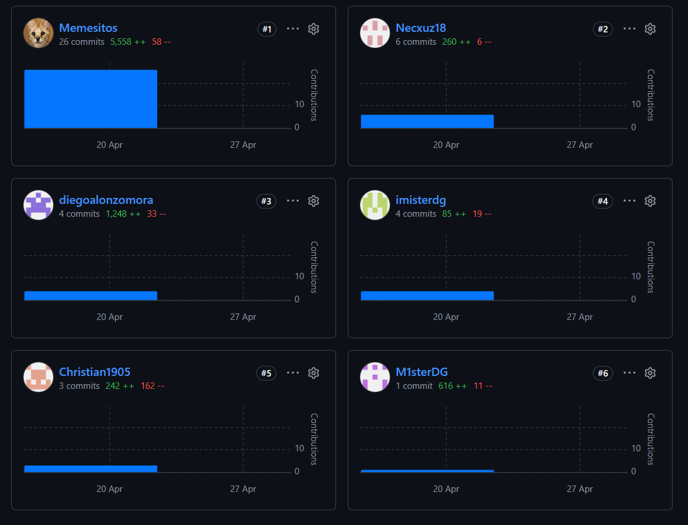

- **URL del repositorio del landing page del proyecto:**  
  [https://github.com/iot-proyectos/LandingPage](https://github.com/iot-proyectos/LandingPage)

  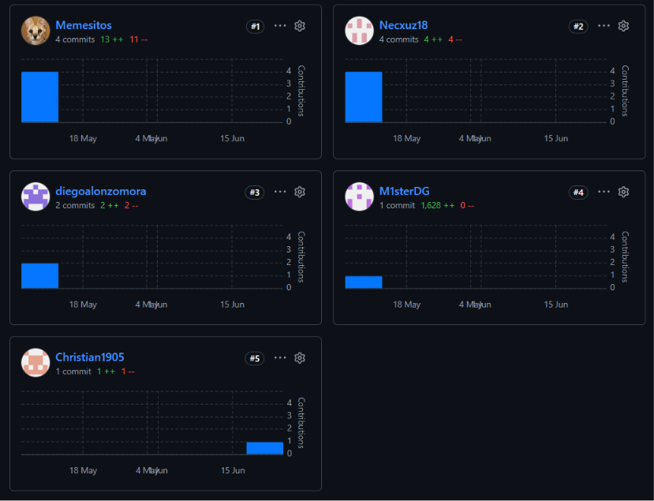

- **URL del repositorio del frontend del proyecto:**  
  [https://github.com/iot-proyectos/OsitoPolar-Frontend](https://github.com/iot-proyectos/OsitoPolar-Frontend)

  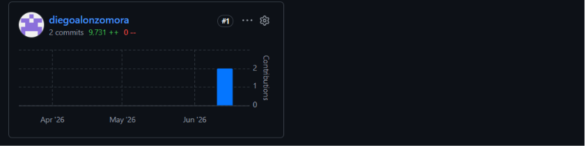
  
<div style="page-break-after: always"></div>

## Contenido

- [Student Outcome](#student-outcome)

- [Capítulo I: Introducción](#capitulo-1-introducción)
    - [1.1. Startup Profile](#11-startup-profile)
        - [1.1.1. Descripción de la Startup](#111-descripción-de-la-startup)
        - [1.1.2. Perfiles de integrantes del equipo](#112-perfiles-de-integrantes-del-equipo)
    - [1.2. Solution Profile](#12-solution-profile)
        - [1.2.1 Antecedentes y problemática](#121-antecedentes-y-problemática)
        - [1.2.2 Lean UX Process](#122-lean-ux-process)
            - [1.2.2.1. Lean UX Problem Statements](#1221-lean-ux-problem-statements)
            - [1.2.2.2. Lean UX Assumptions](#1222-lean-ux-assumptions)
            - [1.2.2.3. Lean UX Hypothesis Statements](#1223-lean-ux-hypothesis-statements)
            - [1.2.2.4. Lean UX Canvas](#1224-lean-ux-canvas)
    - [1.3. Segmentos objetivo](#13-segmentos-objetivo)

- [Capítulo II: Requirements Elicitation & Analysis](#capítulo-ii-requirements-elicitation--analysis)
    - [2.1. Competidores](#21-competidores)
        - [2.1.1. Análisis competitivo](#211-análisis-competitivo)
        - [2.1.2. Estrategias y tácticas frente a competidores](#212-estrategias-y-tácticas-frente-a-competidores)
    - [2.2. Entrevistas](#22-entrevistas)
        - [2.2.1. Diseño de entrevistas](#221-diseño-de-entrevistas)
        - [2.2.2. Registro de entrevistas](#222-registro-de-entrevistas)
        - [2.2.3. Análisis de entrevistas](#223-análisis-de-entrevistas)
    - [2.3. Needfinding](#23-needfinding)
        - [2.3.1. User Personas](#231-user-personas)
        - [2.3.2. User Task Matrix](#232-user-task-matrix)
        - [2.3.3. User Journey Mapping](#233-user-journey-mapping)
        - [2.3.4. Empathy Mapping](#234-empathy-mapping)
        - [2.3.5. As-is Scenario Mapping](#235-as-is-scenario-mapping)
    - [2.4. Big Picture EventStorming](#24-big-picture-eventstorming)
    - [2.5. Ubiquitous Language](#25-ubiquitous-language)


- [Capítulo III: Requirements Specification](#capítulo-iii-requirements-specification)
    - [3.1. User Stories](#31-user-stories)
    - [3.2. Impact Mapping](#32-impact-mapping)
    - [3.3. Product Backlog](#33-product-backlog)
    - [3.4. To-Be Scenario Mapping](#34-to-be-scenario-mapping)


- [Capítulo IV: Solution Software Design](#capítulo-iv-solution-software-design)
    - [4.1. Strategic-Level Domain-Driven Design](#41-strategic-level-domain-driven-design)
        - [4.1.1. Design-Level EventStorming](#411-design-level-eventstorming)
            - [4.1.1.1. Candidate Context Discovery](#4111-candidate-context-discovery)
            - [4.1.1.2. Domain Message Flows Modeling](#4112-domain-message-flows-modeling)
            - [4.1.1.3. Bounded Context Canvases](#4113-bounded-context-canvases)
        - [4.1.2. Context Mapping](#412-context-mapping)
        - [4.1.3. Software Architecture](#413-software-architecture)
            - [4.1.3.1. Software Architecture System Landscape Diagram](#4131-software-architecture-system-landscape-diagram)
            - [4.1.3.2. Software Architecture Context Level Diagrams](#4132-software-architecture-context-level-diagrams)
            - [4.1.3.3. Software Architecture Container Level Diagrams](#4133-software-architecture-container-level-diagrams)
            - [4.1.3.4. Software Architecture Deployment Diagrams](#4134-software-architecture-deployment-diagrams)
    - [4.2. Tactical-Level Domain-Driven Design](#42-tactical-level-domain-driven-design)
        - [4.2.1. Bounded Context: IAM (Identity and Access Management)](#421-bounded-context-iam-identity-and-access-management)
            - [4.2.1.1. Domain Layer](#4211-domain-layer)
            - [4.2.1.2. Interface Layer](#4212-interface-layer)
            - [4.2.1.3. Application Layer](#4213-application-layer)
            - [4.2.1.4. Infrastructure Layer](#4214-infrastructure-layer)
            - [4.2.1.5. Bounded Context Software Architecture Component Level Diagrams](#4215-bounded-context-software-architecture-component-level-diagrams)
            - [4.2.1.6. Bounded Context Software Architecture Code Level Diagrams](#4216-bounded-context-software-architecture-code-level-diagrams)
                - [4.2.1.6.1. Bounded Context Domain Layer Class Diagrams](#42161-bounded-context-domain-layer-class-diagrams)
                - [4.2.1.6.2. Bounded Context Database Design Diagram](#42162-bounded-context-database-design-diagram)
        - [4.2.2. Bounded Context: Profiles](#422-bounded-context-profiles)
            - [4.2.2.1. Domain Layer](#4221-domain-layer)
            - [4.2.2.2. Interface Layer](#4222-interface-layer)
            - [4.2.2.3. Application Layer](#4223-application-layer)
            - [4.2.2.4. Infrastructure Layer](#4224-infrastructure-layer)
            - [4.2.2.5. Bounded Context Software Architecture Component Level Diagrams](#4225-bounded-context-software-architecture-component-level-diagrams)
            - [4.2.2.6. Bounded Context Software Architecture Code Level Diagrams](#4226-bounded-context-software-architecture-code-level-diagrams)
                - [4.2.2.6.1. Bounded Context Domain Layer Class Diagrams](#42261-bounded-context-domain-layer-class-diagrams)
                - [4.2.2.6.2. Bounded Context Database Design Diagram](#42262-bounded-context-database-design-diagram)
        - [4.2.3. Bounded Context: Analytics](#423-bounded-context-analytics)
            - [4.2.3.1. Domain Layer](#4231-domain-layer)
            - [4.2.3.2. Interface Layer](#4232-interface-layer)
            - [4.2.3.3. Application Layer](#4233-application-layer)
            - [4.2.3.4. Infrastructure Layer](#4234-infrastructure-layer)
            - [4.2.3.5. Bounded Context Software Architecture Component Level Diagrams](#4235-bounded-context-software-architecture-component-level-diagrams)
            - [4.2.3.6. Bounded Context Software Architecture Code Level Diagrams](#4236-bounded-context-software-architecture-code-level-diagrams)
                - [4.2.3.6.1. Bounded Context Domain Layer Class Diagrams](#42361-bounded-context-domain-layer-class-diagrams)
                - [4.2.3.6.2. Bounded Context Database Design Diagram](#42362-bounded-context-database-design-diagram)
        - [4.2.4. Bounded Context: Subscriptions and Payments](#424-bounded-context-subscriptions-and-payments)
            - [4.2.4.1. Domain Layer](#4241-domain-layer)
            - [4.2.4.2. Interface Layer](#4242-interface-layer)
            - [4.2.4.3. Application Layer](#4243-application-layer)
            - [4.2.4.4. Infrastructure Layer](#4244-infrastructure-layer)
            - [4.2.4.5. Bounded Context Software Architecture Component Level Diagrams](#4245-bounded-context-software-architecture-component-level-diagrams)
            - [4.2.4.6. Bounded Context Software Architecture Code Level Diagrams](#4246-bounded-context-software-architecture-code-level-diagrams)
                - [4.2.4.6.1. Bounded Context Domain Layer Class Diagrams](#42461-bounded-context-domain-layer-class-diagrams)
                - [4.2.4.6.2. Bounded Context Database Design Diagram](#42462-bounded-context-database-design-diagram)
        - [4.2.5. Bounded Context: Notifications](#425-bounded-context-notifications)
            - [4.2.5.1. Domain Layer](#4251-domain-layer)
            - [4.2.5.2. Interface Layer](#4252-interface-layer)
            - [4.2.5.3. Application Layer](#4253-application-layer)
            - [4.2.5.4. Infrastructure Layer](#4254-infrastructure-layer)
            - [4.2.5.5. Bounded Context Software Architecture Component Level Diagrams](#4255-bounded-context-software-architecture-component-level-diagrams)
            - [4.2.5.6. Bounded Context Software Architecture Code Level Diagrams](#4256-bounded-context-software-architecture-code-level-diagrams)
                - [4.2.5.6.1. Bounded Context Domain Layer Class Diagrams](#42561-bounded-context-domain-layer-class-diagrams)
                - [4.2.5.6.2. Bounded Context Database Design Diagram](#42562-bounded-context-database-design-diagram)


- [Capítulo V: Solution UI/UX Design](#capítulo-v-solution-uiux-design)
    - [5.1. Style Guidelines](#51-style-guidelines)
        - [5.1.1. General Style Guidelines](#511-general-style-guidelines)
        - [5.1.2. Web, Mobile and IoT Style Guidelines](#512-web-mobile-and-iot-style-guidelines)
    - [5.2. Information Architecture](#52-information-architecture)
        - [5.2.1. Organization Systems](#521-organization-systems)
        - [5.2.2. Labeling Systems](#522-labeling-systems)
        - [5.2.3. SEO Tags and Meta Tags](#523-seo-tags-and-meta-tags)
        - [5.2.4. Searching Systems](#524-searching-systems)
        - [5.2.5. Navigation Systems](#525-navigation-systems)
    - [5.3. Landing Page UI Design](#53-landing-page-ui-design)
        - [5.3.1. Landing Page Wireframe](#531-landing-page-wireframe)
        - [5.3.2. Landing Page Mock-up](#532-landing-page-mock-up)
    - [5.4. Applications UX/UI Design](#54-applications-uxui-design)
        - [5.4.1. Applications Wireframes](#541-applications-wireframes)
        - [5.4.2. Applications Wireflow Diagrams](#542-applications-wireflow-diagrams)
        - [5.4.3. Applications Mock-ups](#543-applications-mock-ups)
        - [5.4.4. Applications User Flow Diagrams](#544-applications-user-flow-diagrams)
    - [5.5. Applications Prototyping](#55-applications-prototyping)
    - [5.6. IoT Device Design](#56-iot-device-design)


- [Capítulo VI: Product Implementation, Validation & Deployment](#capítulo-vi-product-implementation-validation--deployment)
    - [6.1. Software Configuration Management](#61-software-configuration-management)
        - [6.1.1. Software Development Environment Configuration](#611-software-development-environment-configuration)
        - [6.1.2. Source Code Management](#612-source-code-management)
        - [6.1.3. Source Code Style Guide & Conventions](#613-source-code-style-guide--conventions)
        - [6.1.4. Software Deployment Configuration](#614-software-deployment-configuration)
    - [6.2. Landing Page, Services & Applications Implementation](#62-landing-page-services--applications-implementation)
        - [6.2.1. Sprint 1](#621-sprint-1)
            - [6.2.1.1. Sprint Planning 1](#6211-sprint-planning-1)
            - [6.2.1.2. Aspect Leaders and Collaborators](#6212-aspect-leaders-and-collaborators)
            - [6.2.1.3. Sprint Backlog 1](#6213-sprint-backlog-1)
            - [6.2.1.4. Development Evidence for Sprint Review](#6214-development-evidence-for-sprint-review)
            - [6.2.1.5. Testing Suite Evidence for Sprint Review](#6215-testing-suite-evidence-for-sprint-review)
            - [6.2.1.6. Execution Evidence for Sprint Review](#6216-execution-evidence-for-sprint-review)
            - [6.2.1.7. Services Documentation Evidence for Sprint Review](#6217-services-documentation-evidence-for-sprint-review)
            - [6.2.1.8. Software Deployment Evidence for Sprint Review](#6218-software-deployment-evidence-for-sprint-review)
            - [6.2.1.9. Team Collaboration Insights during Sprint](#6219-team-collaboration-insights-during-sprint)
        - [6.2.2. Sprint 2](#622-sprint-2)
            - [6.2.2.1. Sprint Planning 2](#6221-sprint-planning-2)
            - [6.2.2.2. Aspect Leaders and Collaborators](#6222-aspect-leaders-and-collaborators)
            - [6.2.2.3. Sprint Backlog 2](#6223-sprint-backlog-2)
            - [6.2.2.4. Development Evidence for Sprint Review](#6224-development-evidence-for-sprint-review)
            - [6.2.2.5. Testing Suite Evidence for Sprint Review](#6225-testing-suite-evidence-for-sprint-review)
            - [6.2.2.6. Execution Evidence for Sprint Review](#6226-execution-evidence-for-sprint-review)
            - [6.2.2.7. Services Documentation Evidence for Sprint Review](#6227-services-documentation-evidence-for-sprint-review)
            - [6.2.2.8. Software Deployment Evidence for Sprint Review](#6228-software-deployment-evidence-for-sprint-review)
            - [6.2.2.9. Team Collaboration Insights during Sprint](#6229-team-collaboration-insights-during-sprint)
        - [6.2.3. Sprint 3](#623-sprint-3)
            - [6.2.3.1. Sprint Planning 3](#6231-sprint-planning-3)
            - [6.2.3.2. Aspect Leaders and Collaborators](#6232-aspect-leaders-and-collaborators)
            - [6.2.3.3. Sprint Backlog 3](#6233-sprint-backlog-3)
            - [6.2.3.4. Development Evidence for Sprint Review](#6234-development-evidence-for-sprint-review)
            - [6.2.3.5. Testing Suite Evidence for Sprint Review](#6235-testing-suite-evidence-for-sprint-review)
            - [6.2.3.6. Execution Evidence for Sprint Review](#6236-execution-evidence-for-sprint-review)
            - [6.2.3.7. Services Documentation Evidence for Sprint Review](#6237-services-documentation-evidence-for-sprint-review)
            - [6.2.3.8. Software Deployment Evidence for Sprint Review](#6238-software-deployment-evidence-for-sprint-review)
            - [6.2.3.9. Team Collaboration Insights during Sprint](#6239-team-collaboration-insights-during-sprint)
    - [6.3. Validation Interviews](#63-validation-interviews)
        - [6.3.1. Diseño de Entrevistas](#631-diseño-de-entrevistas)
        - [6.3.2. Registro de Entrevistas](#632-registro-de-entrevistas)
        - [6.3.3. Evaluaciones según heurísticas](#633-evaluaciones-según-heurísticas)
    - [6.4. Video About-the-Product](#64-video-about-the-product)
- [Conclusiones y recomendaciones](#conclusiones-y-recomendaciones)
- [Video About-the-Team](#video-about-the-team)
- [Bibliografía](#bibliografía)
- [Anexos](#anexos)
    - [Videos de Exposiciones](#videos-de-exposiciones)


<div style="page-break-after: always"></div>

## Student Outcome
El curso contribuye al cumplimiento del Student Outcome ABET:

**ABET – EAC - Student Outcome 5**

**Criterio**: *La capacidad de funcionar efectivamente en un equipo cuyos miembros
juntos proporcionan liderazgo, crean un entorno de colaboración e inclusivo,
establecen objetivos, planifican tareas y cumplen objetivos.*

En el siguiente cuadro se describe las acciones realizadas y enunciados de
conclusiones por parte del grupo, que permiten sustentar el haber alcanzado el logro
del ABET – EAC - Student Outcome 5.

| Criterio específico | Acciones realizadas | Conclusiones |
| :--- | :--- | :--- |
| Trabaja en equipo para proporcionar liderazgo en forma conjunta. | **Cacho Seminario, Diego Alonso**<br>**AV1:** Para el desarrollo de la AV1, aporte creando los documentos de exposicion, reporte de participación y además prepare el reporte principal con los items anteriores para la entrega. <br><br>**TP:** Como desarrollo del TP verifique y solucione diversos errores de la entrega anterior, se verificaron los formatos y estructura del informe además de corregir problemas al exportar el archivo principal.<br><br>**AV2:** Para la AV2, redacté los nuevos apartados en la documentación técnica y lideré el desarrollo íntegro de la aplicación móvil. Implementé la interfaz y la lógica de la app, logrando la conexión bidireccional en tiempo real con el backend y la base de datos, además de validar la correcta recepción de telemetría directamente desde el dispositivo físico IoT.<br><br>**TB2:** Para la entrega final (TB2), desarrollé la redacción del Sprint 3 en el documento de trabajo, detallando la implementación y el despliegue final. A nivel técnico, culminé el desarrollo de la aplicación móvil en Android implementando la generación dinámica de API Keys (UUID) para asegurar la autenticación de los dispositivos IoT. Además, configuré el cliente de red (Retrofit) para apuntar a nuestro entorno de producción en la nube (Railway) y desarrollé la lógica para consumir y mostrar el historial de lecturas reales en la interfaz.<br><br>**Mora Blas, Diego Alonzo**<br>**AV1:** En esta AV1 aporte analizando las diferentes capas de abstraccion de nuestro codigo para analizar y tener registrado nuestros distintos bounded context. <br><br>**TB1**: Aporte revisando y apoyando con la landing page ademas de realizar he investigar el como se podrian hacer el testing para nuestro backend.<br><br>**AV2:** Para la AV2, me enfoqué en el desarrollo de la lógica del backend en la nube, creando los endpoints RESTful necesarios para la comunicación bidireccional entre la base de datos PostgreSQL, la aplicación móvil y los dispositivos IoT. Además, realicé pruebas de integración para asegurar el correcto flujo de telemetría y el registro de nuevos usuarios.<br><br>**Hernandez Poma, Sebastian Eduardo**<br>**AV1:** Lideró la adaptación de la arquitectura del sistema al paradigma IoT, incorporando los bounded contexts de Edge API e IoT Monitoring al modelo Domain-Driven Design. Definió la estructura de los diagramas C4 en Structurizr DSL (System Context, Container y Component Level) para los 9 microservicios del sistema, incluyendo los nuevos componentes de la capa Edge (ESP32 Firmware, Edge API con buffer SQLite). Diseñó los esquemas de base de datos para todos los bounded contexts usando DBML, con especial énfasis en las tablas sensor_readings, alerts y business_rules del IoT Monitoring context. Colaboró en la integración de Firebase FCM para push notifications y la definición del flujo de datos ESP32 → Edge API → Cloud API. <br><br>**TB1:** Lideró el despliegue del Landing Page y el Frontend App, asegurando la disponibilidad de la solución en entornos de producción y coordinando las pruebas de funcionamiento de la interfaz de usuario.<br><br>**AV2:** Lideré el despliegue de la infraestructura en la nube, configurando el servidor backend en plataformas PaaS y la base de datos relacional. Actualicé la arquitectura del sistema y los esquemas de base de datos para soportar la creación dinámica de mapas ("Sections") multi-usuario y garantizar la persistencia segura de los datos transmitidos por los sensores.<br><br>**Inga Orihuela, Christian Fabrizio**<br>**AV1:** Apoyé en la revisión general del informe, verificando la coherencia entre los apartados desarrollados por el equipo y realizando correcciones de redacción, estructura y formato. Asimismo, contribuí a que el documento mantuviera una presentación uniforme y alineada con los criterios solicitados para la entrega.<br><br>**TB1:** Realicé correcciones detalladas en el informe para asegurar la calidad de la entrega y apoyé en el desarrollo de secciones específicas de la landing page y el frontend, facilitando la integración de la información del proyecto.<br><br>**AV2:** Coordiné las pruebas de validación End-to-End (E2E) del sistema, asegurando que los datos capturados por el hardware físico se reflejaran correctamente en las interfaces de usuario. Asimismo, actualicé las secciones correspondientes de la documentación, agregando los nuevos diagramas de flujos y asegurando la coherencia técnica del informe final.<br><br>**Medina Cruzado, Raúl Adrian**<br>**AV1:** Aporté significativamente en la estructuración, redacción y revisión técnica del capítulo 4 del informe. Además, colaboré en la definición de la arquitectura base del proyecto, apoyando en la delimitación de los *bounded contexts* (como Edge API e IoT Monitoring) y asegurando que la documentación técnica refleje correctamente el enfoque de Domain-Driven Design (DDD) propuesto por el equipo.<br><br>**TB1:** Colaboré activamente en el despliegue de la aplicación frontend y lideré la corrección de observaciones arquitectónicas en la documentación técnica tras el feedback de la AV1. Brindé soporte en la integración inicial de los componentes web, asegurando que la interfaz tuviera una estructura preparada para la futura conexión con los microservicios.<br><br>**AV2:** Para la AV2, lideré el desarrollo de la documentación técnica y la elaboración de la presentación (PPTX) para la exposición del avance. Además, realicé un aporte crítico en el desarrollo e implementación del sensor físico, optimizando la lógica de captura de datos y asegurando su correcta integración y comunicación con la capa de Edge Computing para el monitoreo en tiempo real. | **AV1:** Durante la AV1, el equipo logró realizar las primeras partes del trabajo, verificamos el funcionamiento del proyecto junto al su escalabilidad con soluciones basadas en IoT. <br><br>La separación en bounded contexts con responsabilidades claras, especialmente la distinción entre Edge API (procesamiento local) y IoT Monitoring (cloud), permitió diseñar una arquitectura escalable y resiliente que funciona offline. El uso de Structurizr DSL facilitó la colaboración del equipo al mantener la arquitectura como código versionable. <br><br>**TB1:** El equipo realizo avances respecto a las correcciones detalladas en la entrega de la AV1, además de realiza el despliegue del Landing Page y el despliegue de la primera versión de la parte Web de nuestro Frontend.<br><br>**AV2:** Durante la AV2, el equipo logró materializar la arquitectura planificada al conectar exitosamente la capa física (dispositivos IoT) con la capa de software a través de una aplicación móvil completamente funcional y un backend en la nube, demostrando la viabilidad técnica del sistema Osito Polar.<br><br>**TB2:** Para la entrega final, el equipo logró consolidar exitosamente la arquitectura completa del proyecto. Se conectó la aplicación móvil nativa con el backend desplegado en producción (Railway) y la base de datos en la nube (Neon.tech), implementando la generación segura de llaves IoT. Esto demostró la viabilidad técnica del ecosistema de OsitoPolar, cerrando el ciclo de desarrollo con el Sprint 3 correctamente documentado y validado. |
| Participación y colaboración en plataformas y herramientas de trabajo. | **Cacho Seminario, Diego Alonso**<br>**AV1:** Como primera entrega utilice las herramientas de Github y Canva para poder redactar y crear la información necesaria para el trabajo de Osito Polar. <br><br>**TB1:** En la entrega del TB1, se utilizaron principalmente las herramientas de GitHub, Canva y Structurizr para la correción de puntos anteriores del trabajo además para poder realizar la presentación del proyecto.<br><br>**AV2:** En esta etapa utilicé entornos de desarrollo nativo para construir la app móvil, integrando librerías de red para el consumo de APIs hacia nuestro servidor en la nube, y manteniendo el control de versiones del proyecto móvil de manera organizada mediante GitHub.<br><br>**TB2:** En esta etapa final, utilicé Android Studio para la culminación de la aplicación nativa y me apoyé en la terminal de Node.js y herramientas de control de entorno (.env) para auditar y asegurar las variables locales antes del despliegue. Utilicé GitHub para versionar el código móvil y herramientas colaborativas para integrar y formatear las secciones finales del informe (Sprint 3 y actualización de estructura).<br><br>**Mora Blas, Diego Alonzo**<br>**AV1:** Como equipo logramos coordinar de manera precisa nuestros distintos objetivos apoyandonos de herramientas como Github y Canva. <br><br>**TB1:** En la entrega del TB utilizamos diferentes herramientas para el testing de nuestro backend web y evaluar que todo funcionara correctamente.<br><br>**AV2:** Utilicé herramientas como Postman para el testeo exhaustivo de los endpoints de la API RESTful e integré estas pruebas con el flujo de trabajo colaborativo en GitHub para gestionar el versionado del código backend junto con el equipo.<br><br>**Hernandez Poma, Sebastian Eduardo**<br>**AV1:** Lideró la adaptación de la arquitectura del sistema al paradigma IoT, incorporando los bounded contexts de Edge API e IoT Monitoring al modelo Domain-Driven Design. Definió la estructura de los diagramas C4 en Structurizr DSL (System Context, Container y Component Level) para los 9 microservicios del sistema, incluyendo los nuevos componentes de la capa Edge (ESP32 Firmware, Edge API con buffer SQLite). Diseñó los esquemas de base de datos para todos los bounded contexts usando DBML, con especial énfasis en las tablas sensor_readings, alerts y business_rules del IoT Monitoring context. Colaboró en la integración de Firebase FCM para push notifications y la definición del flujo de datos ESP32 → Edge API → Cloud API.<br><br>**TB1:** Utilizó GitHub Pages y otras herramientas de despliegue para publicar el Landing Page y el Frontend, gestionando la integración continua de los avances realizados por el equipo.<br><br>**AV2:** Empleé plataformas de despliegue en la nube (PaaS/DBaaS) para alojar nuestros servicios de producción. Utilicé herramientas ORM como Prisma para migrar y gestionar los esquemas de bases de datos, manteniendo toda la configuración y el código versionados a través de repositorios en GitHub.<br><br>**Inga Orihuela, Christian Fabrizio**<br>**AV1:** Participé en la gestión colaborativa del proyecto mediante el uso de Git y GitHub, revisando los avances del repositorio y apoyando en el control de versiones del trabajo. Además, utilicé GitHub como herramienta de colaboración para mantener organizado el desarrollo del proyecto.<br><br>**TB1:** Utilicé herramientas como Git y GitHub para la gestión del código de la landing page y el frontend, coordinando con el equipo para la integración de las correcciones realizadas al informe.<br><br>**AV2:** Hice uso continuo de Google Docs para la edición síncrona del informe y me apoyé en herramientas de diagramación para modelar los flujos de datos finales. Utilicé GitHub para revisar las integraciones del código y colaborar de forma efectiva en el control de calidad de la entrega técnica.<br><br>**Medina Cruzado, Raúl Adrian**<br>**AV1:** Utilicé Google Docs de forma colaborativa para la redacción y revisión del capítulo 4. Además, me apoyé en herramientas de modelado y diseño arquitectónico (como Structurizr) para analizar los diagramas C4 del sistema, utilizando GitHub para revisar los avances documentales y asegurar la alineación técnica con el resto del equipo.<br><br>**TB1:** Gestioné el repositorio principal de la aplicación utilizando Git y GitHub, encargándome de la resolución de conflictos durante la integración del código del equipo. Asimismo, lideré el despliegue del frontend utilizando GitHub Pages para los entornos de prueba, y empleé herramientas de comunicación ágil para coordinar rápidamente los ajustes en la documentación final.<br><br>**AV2:** Durante la AV2, utilicé herramientas colaborativas como Google Docs y PowerPoint/Canva para la estructuración conjunta del documento final y el diseño de la PPTX. En cuanto al desarrollo del sensor, empleé entornos de desarrollo de hardware para programar la lógica de captura de datos, gestionando el control de versiones del código fuente a través de GitHub para coordinar los avances de manera ágil con el resto del equipo. | **AV1:** Durante la AV1, el equipo logró utilizar las herramientas apropiadas para la entrega, se uso GitHub como repositorio principal para el proyecto, Google Docs para el reporte de participación y Canva como herramienta para crear el video de exposición. <br><br>La separación en bounded contexts con responsabilidades claras, especialmente la distinción entre Edge API (procesamiento local) y IoT Monitoring (cloud), permitió diseñar una arquitectura escalable y resiliente que funciona offline. El uso de Structurizr DSL facilitó la colaboración del equipo al mantener la arquitectura como código versionable. <br><br>**TB1:** Se utilizaron una seria de herramientas para el presente avance del Trabajo Parcial, entre ellas se utilizo GitHub, Canva, Structurizr, GitHub Pages, Trello, entre otras que nos permitieron avanzar de manera ordenada.<br><br>**AV2:** Para la AV2, el equipo amplió su ecosistema de herramientas, gestionando la integración continua y control de versiones en GitHub para los nuevos repositorios móviles y en la nube, garantizando una correcta interoperabilidad entre el hardware IoT y la interfaz de usuario móvil.<br><br>**TB2:** Durante la fase final, el equipo demostró un dominio sólido de las herramientas Cloud y de desarrollo, gestionando despliegues en plataformas como Railway y bases de datos Serverless (Neon.tech). Se mantuvo un estricto control de versiones y políticas de seguridad (manejo de variables .env) en GitHub, logrando integrar con éxito las distintas capas del software. |

<div style="page-break-after: always"></div>


# Capitulo 1: Introducción

## 1.1 Startup Profile

### 1.1.1 Descripción de la Startup

OsitoPolar es una aplicación web orientada a mejorar la gestión y el mantenimiento de equipos de congelación en negocios que dependen críticamente del frío, como supermercados, minimarkets, laboratorios, restaurantes y empresas del sector alimentario o farmacéutico. La solución conecta a estos negocios con técnicos y proveedores especializados en refrigeración, permitiendo una gestión integral, preventiva y automatizada de sus sistemas de congelación.

La plataforma ofrece funcionalidades clave como monitoreo en tiempo real de temperatura, consumo energético y tiempo de uso, generación de reportes técnicos, alertas automatizadas por fallas, historial de rendimiento y programación inteligente de mantenimientos. Estas herramientas están diseñadas para ayudar a negocios que dependen del uso de sistemas de refrigeración, técnicos especializados en refrigeración y proveedores de equipos a optimizar sus operaciones, evitar pérdidas económicas por fallas inesperadas y mantener un registro completo del estado y uso de sus equipos.

Misión: Nuestra misión en OsitoPolar es proporcionar una solución tecnológica inteligente que permita a los negocios proteger su inventario y optimizar la gestión de sus equipos de refrigeración, ofreciendo al mismo tiempo herramientas especializadas para mejorar la eficiencia operativa de los técnicos y proveedores del sector.

Visión: Queremos ser la empresa lider en gestión y mantenimiento de equipos de refrigeración, empezando por Lima y prontamente expandirnos a más lugares del Perú.

### 1.1.2 Perfiles de integrantes del equipo

| **Integrante**            | **Diego Alonzo Mora Blas**                                                                                                                                                                                                                                                                                                                                                                                                     |
| ------------------------- | ------------------------------------------------------------------------------------------------------------------------------------------------------------------------------------------------------------------------------------------------------------------------------------------------------------------------------------------------------------------------------------------------------------------------------ |
| **Código del Estudiante** | U20231c069                                                                                                                                                                                                                                                                                                                                                                                                                     |
| **Carrera**               | Ingeniería de Software                                                                                                                                                                                                                                                                                                                                                                                                         |
| **Descripción**           | Estudiante de Ingenieria de Software cursando el 7mo ciclo de mi carrera en la UPC. Soy una persona la cual aprende rapido y se adapta con gran facilidad al contexto del proyecto. Como miembro de equipo he realizado cursos de Ciberseguridad llegando a poder realizar pruebas de penetraciones de nivel intermedio ademas de conocimientos en multiples vulnerabilidad y manejos de diferentes lenguajes de programacion. |
| **Foto**                  |                                                                                                                                                                                                                                                                                                                                       |

---

| **Integrante**            | **Diego Alonso Cacho Seminario**                                                                                                                                                                                                                                                                                                                                                                                                                                                                                           |
| ------------------------- | -------------------------------------------------------------------------------------------------------------------------------------------------------------------------------------------------------------------------------------------------------------------------------------------------------------------------------------------------------------------------------------------------------------------------------------------------------------------------------------------------------------------------- |
| **Código del Estudiante** | U202223990                                                                                                                                                                                                                                                                                                                                                                                                                                                                                                                 |
| **Carrera**               | Ingeniería de Software                                                                                                                                                                                                                                                                                                                                                                                                                                                                                                     |
| **Descripción**           | Soy estudiante de Ingeniería de Software cursando el 7mo ciclo de mi carrera en la UPC y tengo 21 años. Me considero una persona tranquila y diligente, intentó realizar mis tareas y trabajos lo antes posible para evitar contratiempos en un futuro, especialmente si son actividades que consumen mucho tiempo. Como miembro de equipo buscaré ayudar a mis compañeros cuando lo necesiten, realizando además mis entregas lo más temprano posible. Habilidades en C++, C#, Python, Flutter, Unity 2D/3D, html/css/js. |
| **Foto**                  |                                                                                                                                                                                                                                                                                                                                                                                                                                   |

---

| **Integrante** | **Hernandez Poma, SebastIan Eduardo** |
|----------------|----------------------------------|
| **Código del Estudiante** | U20231C996 |
| **Carrera** | Ingeniería de Software |
| **Descripción** | Estudiante de Ingeniería de Software con interés en el desarrollo de soluciones tecnológicas innovadoras y enfocadas en la experiencia del usuario. Destaca por su orientación al aprendizaje continuo, la resolución de problemas y la aplicación de metodologías modernas en proyectos de software. Posee habilidades en análisis, diseño y desarrollo de aplicaciones, así como una visión estratégica para integrar tecnología y creatividad en entornos profesionales. |
| **Foto** |  |

---

| **Integrante** | **Christian Fabrizio Inga Orihuela** |
|----------------|----------------------------------|
| **Código del Estudiante** | U20231C111 |
| **Carrera** | Ingeniería de Software |
| **Descripción** | Tengo 20 años y actualmente me encuentro cursando el séptimo ciclo de la carrera de ingeniería de software. Cuento con una gran disposición para el trabajo colaborativo y la capacidad de adaptarme rápidamente a diferentes metodologías de aprendizaje y dinámicas de grupo, asegurando siempre un desempeño confiable y organizado. |
| **Foto** |  |

---

| **Integrante** | **Medina Cruzado, Raúl Adrian* |
|----------------|----------------------------------|
| **Código del Estudiante** | U202210938 |
| **Carrera** | Ingeniería de Software |
| **Descripción** | Tengo 21 años y estudio Ingeniería de Software. Profesionalmente, me especializo como desarrollador enfocado en automatización (RPA), infraestructura en la nube y liderazgo de equipos ágiles con Scrum; de hecho, actualmente estoy desarrollando mi tesis sobre una plataforma de inteligencia predictiva para el sector minero y diseñando un sistema automatizado de monitoreo de combustible. Esta misma disciplina que aplico en mis proyectos la llevo a mi estilo de vida: jugué fútbol a nivel competitivo en divisiones menores y hoy mantengo un riguroso régimen de fitness y nutrición enfocado en ganar masa muscular y mejorar mi movilidad. En el plano personal, soy alguien muy apegado a mis dos hermanas y a mi familia materna. |
| **Foto** |  |


<div style="page-break-after: always"></div>

## 1.2 Solution Profile

### 1.2.1 Antecedentes y Problematica

| Las 5Ws y 2Hs | Pregunta                                           | Descripción                                                                                                                                                                                                                                                                                                                                                                                    |
|---------------|----------------------------------------------------|------------------------------------------------------------------------------------------------------------------------------------------------------------------------------------------------------------------------------------------------------------------------------------------------------------------------------------------------------------------------------------------------|
| What?         | ¿Cuál es el problema?                              | Actualmente, los negocios que dependen de refrigeradores, congeladores, cámaras frías o almacenes refrigerados no siempre cuentan con visibilidad continua sobre su cadena de frío. La falta de monitoreo en tiempo real de temperatura, humedad y estado de conexión impide detectar desviaciones críticas antes de que afecten la calidad de los productos. |
| When?         | ¿Cuándo sucede este problema?                      | El problema ocurre durante la operación diaria y continua de los equipos de frío, especialmente fuera del horario de supervisión manual, durante la noche, en cambios de turno o cuando un dispositivo deja de enviar lecturas sin que el responsable lo note a tiempo. |
| Where?        | ¿Dónde se produce este suceso?                     | Se produce en negocios e instalaciones donde la cadena de frío es crítica, como restaurantes, minimarkets, supermercados, laboratorios, cámaras frías y almacenes refrigerados. En estos espacios, una variación de temperatura o humedad puede comprometer inventario sensible. |
| Who?          | ¿Quiénes están involucrados?                       | Están involucrados los dueños, administradores y responsables operativos de negocios que almacenan productos sensibles al frío, así como el personal encargado de revisar las condiciones de los equipos y tomar decisiones ante alertas o incidentes. |
| Why?          | ¿Cuál es la causa del problema?                    | La causa principal es la dependencia de revisiones manuales, registros dispersos o equipos sin conectividad que no permiten saber en tiempo real si la temperatura y humedad están dentro del rango seguro. Además, cuando un dispositivo se desconecta, muchas veces no existe una alerta inmediata. |
| How?          | ¿Qué llevó a la persona a llegar a esta situación? | La falta de una plataforma centralizada de monitoreo IoT obliga a los negocios a reaccionar cuando el problema ya ocurrió: productos dañados, condiciones fuera de rango o ausencia de datos históricos para identificar patrones. Esta baja visibilidad dificulta prevenir incidentes y mantener trazabilidad de la cadena de frío. |
| How much?     | ¿Cuánto es el impacto financiero?                  | El impacto económico puede ir desde pérdidas parciales de inventario hasta la pérdida total de productos perecibles, medicamentos o insumos sensibles. A esto se suman costos por reposición, interrupción operativa, reclamos de clientes y pérdida de confianza por no poder demostrar que las condiciones de conservación fueron seguras. |

### 1.2.2 Lean UX Process

#### 1.2.2.1 Lean UX Problem Statements

El estado actual de la industria de la refrigeración comercial y técnica enfrenta importantes desafíos relacionados con la gestión, el mantenimiento y la trazabilidad de los equipos de congelación. Negocios que dependen críticamente del frío —como supermercados, minimarkets, laboratorios, restaurantes y empresas del sector alimentario o farmacéutico— aún lidian con la falta de monitoreo en tiempo real y con procesos de mantenimiento reactivos. Esto genera pérdidas económicas, ineficiencia energética y riesgos para el inventario.

Lo que las soluciones actuales no logran abordar es la necesidad de una plataforma confiable y automatizada que permita una gestión centralizada, predictiva y transparente tanto para los negocios como para los técnicos y proveedores de refrigeración. La falta de historial técnico accesible, reportes detallados y alertas preventivas limita la capacidad de respuesta ante fallas y deteriora la calidad del servicio técnico ofrecido.

**OsitoPolar** cierra esta brecha al ofrecer una solución tecnológica integral que conecta negocios con técnicos especializados, brindando funcionalidades como monitoreo en tiempo real de temperatura y consumo, programación inteligente de mantenimientos, alertas por fallas, reportes automáticos y trazabilidad completa de cada equipo. Además, proporciona a los proveedores de servicios un módulo para visualizar y gestionar eficientemente los equipos que atienden, organizar visitas y acceder al historial técnico de manera ágil.

Nuestro enfoque inicial está en los negocios de Lima que necesitan asegurar el funcionamiento óptimo de sus sistemas de congelación, así como en los proveedores que buscan profesionalizar y escalar su servicio con herramientas digitales modernas.

Sabremos que hemos tenido éxito cuando observemos una reducción en fallas imprevistas, una optimización del consumo energético, mayor eficiencia operativa por parte de los técnicos especializados y un incremento en la satisfacción de los clientes finales. Esto se evidenciará en la continuidad del servicio y en la fidelización de los negocios que dependen de sistemas de refrigeración, técnicos especializados y proveedores de equipos que utilizan la plataforma.


#### 1.2.2.2 Lean UX Assumption

# Business Outcomes

- Aumentar en al menos un 15% la cantidad de negocios que dependen del uso de sistemas de refrigeración, técnicos especializados en refrigeración y proveedores de equipos activos dentro de la aplicación.

- Lograr una mayor visibilidad de la plataforma OsitoPolar a través de redes sociales, especialmente entre negocios de alimentos y técnicos de refrigeración.

- Generar confianza y seguridad en estos actores respecto al monitoreo y mantenimiento automatizado de sus sistemas de refrigeración.

- Mantener informados a los usuarios finales —negocios, técnicos y proveedores— sobre incidentes recientes como fallas térmicas, cortes de energía o uso irregular de los equipos.

- Alcanzar una base sólida de clientes dispuestos a pagar por una membresía premium que incluya mantenimiento predictivo, reportes personalizados y soporte técnico prioritario.

- Establecer alianzas estratégicas con plataformas como Google Maps o servicios de geolocalización para ampliar el alcance de cobertura y optimizar la programación de visitas técnicas.

- Fomentar la participación activa de negocios, técnicos y proveedores mediante encuestas, valoraciones de técnicos y comentarios sobre el desempeño de los equipos.

- Diseñar una interfaz limpia, simple e intuitiva que garantice una experiencia fluida y atractiva para nuevos usuarios del sector, evitando la sobrecarga visual o de funcionalidades.

- Implementar inteligencia artificial que permita trazar estrategias de mantenimiento inteligente, rutas eficientes para los técnicos y recomendaciones proactivas ante posibles fallos.

# User Outcomes

## ¿Quién será nuestro usuario?

- **Negocios que dependen críticamente del uso de sistemas de refrigeración** como supermercados, minimarkets, restaurantes, laboratorios y empresas del rubro alimentario y farmacéutico.
- **Técnicos especializados en refrigeración** que brindan mantenimiento a dichos sistemas.
- **Proveedores de equipos de refrigeración** que desean ofrecer un servicio posventa más eficiente.

## ¿Dónde encaja nuestro producto en su vida?

- En situaciones donde los negocios necesitan garantizar la continuidad operativa de sus equipos de frío, evitando pérdidas económicas por fallas imprevistas.
- En el día a día de técnicos de refrigeración que deben gestionar múltiples clientes, visitas y mantenimientos.
- En la operación diaria de los negocios que necesitan registros y reportes precisos del desempeño de sus sistemas de refrigeración.

## ¿Qué problemas tiene nuestro producto y cómo se pueden resolver?

- El principal desafío es asegurar que los datos de monitoreo (temperatura, consumo energético, fallas, etc.) sean precisos, actualizados y confiables.
    -   Solución: Se debe integrar sensores calibrados y sistemas de verificación automática que validen las lecturas antes de almacenarlas.


- Otro problema puede ser la adopción inicial de la plataforma por parte de negocios que dependen del uso de sistemas de refrigeración, técnicos especializados en refrigeración y proveedores de equipos que no están familiarizados con la tecnología.
    - Solución: Esto se abordará con una interfaz sencilla, explicaciones paso a paso y soporte técnico accesible.

## ¿Cómo y Cuándo es usado nuestro producto?

- Se accede desde la aplicación web, tanto desde computadoras como dispositivos móviles.
- Se utiliza diariamente para monitorear el estado de los equipos de frío, recibir alertas, programar mantenimientos o revisar el historial técnico.
- También se activa automáticamente en segundo plano cuando se integran sensores de monitoreo con la plataforma.

## ¿Qué problemas tiene nuestro producto?

- En sus etapas iniciales, puede carecer de ciertas integraciones con hardware de terceros.
- Algunos negocios que dependen del uso de sistemas de refrigeración, técnicos especializados o proveedores de equipos pueden requerir capacitación para comprender todas las funcionalidades avanzadas.
- También podría haber desafíos para que los técnicos adopten el uso digital en lugar del método tradicional.

## ¿Qué características son importantes para la app?

- Monitoreo en tiempo real de temperatura, consumo energético y tiempo de uso.
- Alertas automáticas por fallas detectadas en los equipos.
- Historial técnico completo con reportes exportables en PDF.
- Calendario de mantenimiento preventivo con notificaciones programadas.
- Módulo exclusivo para técnicos con gestión de visitas y clientes.
- Soporte técnico inteligente y recomendaciones predictivas mediante IA.
- Registro de múltiples ubicaciones y usuarios con distintos roles.
- Interfaz intuitiva y minimalista para garantizar fácil adopción.

## ¿Cómo debe verse nuestro producto y cómo comportarse?

- **Interfaz amigable y confiable**: Negocios que dependen del uso de sistemas de refrigeración, así como, técnicos especializados y proveedores de equipos deben sentirse seguros al usar la aplicación. La interfaz debe ser clara, ordenada y fácil de navegar, sin sobrecargar de información, con gráficos e indicadores intuitivos.
- **Diseño centrado en tareas críticas**: Desde el primer acceso, negocios que dependen del uso de sistemas de refrigeración, técnicos especializados y proveedores de equipos deben poder ver si hay fallas, cuándo es la próxima visita técnica, y acceder rápidamente a los reportes y al historial de sus equipos.
- **Accesibilidad multiplataforma**: Disponible en web y móvil, adaptable para quienes trabajan tanto en oficina como en campo. Notificaciones inmediatas ante cualquier problema detectado.
- **Simplicidad**: La app debe permitirles gestionar sus negocios, equipos en riesgo y visitas programadas, todo desde un panel centralizado. También pueden agendar visitas y generar reportes técnicos en segundos.

## ¿Qué valor busca el cliente?

- **Gestión técnica simplificada**: Los proveedores y técnicos buscan dejar de ser reactivos. OsitoPolar los vuelve proactivos con mantenimiento predictivo, historiales claros y clientes organizados.
- **Seguridad operativa y cero sorpresas**: Los negocios quieren evitar pérdidas por fallas en frío. OsitoPolar les da monitoreo constante, alertas automáticas y control total sobre sus equipos.
- **Eficiencia energética y trazabilidad**: Los dueños quieren saber si sus equipos consumen de más, si están rindiendo mal, o si un componente ya debería ser reemplazado. El sistema lo identifica antes que ocurra el fallo.

## ¿Qué beneficios adicionales obtendrá el cliente?

- Visibilidad total del estado de sus equipos, desde cualquier lugar, en cualquier momento.
- Soporte técnico más ágil gracias al historial previo y alertas automáticas.
- Menores costos operativos gracias a mantenimientos a tiempo y mayor eficiencia energética.
- Reportes personalizados y exportables.
- Automatización de visitas técnicas cuando se detectan patrones de falla.

## ¿Cómo atraeremos usuarios?

- **Marketing dirigido a nichos clave**: Supermercados, restaurantes y empresas de frío serán contactados directamente mediante LinkedIn, correos y llamadas estratégicas.
- **Alianzas con proveedores de equipos**: Trabajaremos con empresas que venden congeladoras o cámaras frigoríficas para que incluyan OsitoPolar en sus paquetes posventa.
- **Prueba gratuita de versiones de pago**: Un modelo de 14 días gratis con monitoreo limitado para mostrar el valor de la plataforma en tiempo real.

## ¿Cómo generaremos ingresos?

- **Suscripción mensual de negocios**: Por el uso de la plataforma, según número de equipos, tipo de reportes y funcionalidades.
- **Modelo freemium**: Habrá una versión gratuita que brindará algunas funciones limitadas, pero con anuncios, lo que generará ingresos adicionales.
- **Publicidad dirigida (opcional)**: Marcas de refrigeración podrían pagar por visibilidad dentro de la plataforma si se llega a una masa crítica de técnicos y negocios.

## ¿Cuál es nuestra competencia y cómo la superamos?

- **Competencia**: Las principales competidoras son aplicaciones relacionadas con la gestión de datos y orientada al servicio técnico de mantenimiento de equipos de refrigeración.
- **Nuestra ventaja**: OsitoPolar fue diseñado exclusivamente para negocios que dependen de equipos de frío. No somos una herramienta genérica, somos expertos en el nicho. No solo registramos visitas o mantenimientos, también detectamos anomalías en tiempo real, generamos alertas y automatizamos acciones.

## ¿Cuál es nuestro mayor riesgo?

- **Adopción lenta por parte del personal tradicional**: Algunos proveedores aún dependen de agendas físicas o Excel y podrían resistirse al cambio.
- **Falta de adopción inicial**: La dificultad para convencer a los negocios que dependen del uso de sistemas de refrigeración, técnicos especializados y proveedores de equipos de que la app es útil y confiable puede retrasar su adopción.
- **Desconfianza en la precisión de los sensores**: Si los datos no son confiables, la plataforma pierde valor

## ¿Cómo lo resolveremos?

- **Algoritmos de validación**: Implementaremos algoritmos de IA que verifiquen la información y filtren los reportes ambiguos o antiguos, garantizando solo datos confiables y actuales.
- **Capacitación y soporte**: Para resolver la falta de adopción, ofreceremos tutoriales interactivos, videos explicativos y soporte técnico accesible para que negocios que dependen del uso de sistemas de refrigeración, técnicos especializados y proveedores de equipos se familiaricen con las funciones.
- **Estrategia progresiva de integraciones**: Comenzaremos con los equipos más usados y luego ampliaremos compatibilidad mediante APIs y alianzas con fabricantes.
- **Sensores certificados**: Solo se integrarán sensores probados.

#### 1.2.2.2 Lean UX Hypothesis Statements

**Hipótesis 1: Eficiencia operativa y reducción de fallas inesperadas**

Creemos que al ofrecer una plataforma integral que unifique todas las funciones de monitoreo, mantenimiento y gestión técnica de equipos de refrigeración, aumentaremos la eficiencia operativa de los negocios y proveedores del sector, reduciendo la complejidad y el riesgo de fallas inesperadas.  
Sabremos que estamos en lo correcto cuando veamos un aumento en la cantidad de negocios que reportan menos incidencias por fallas térmicas, así como una mejora en la planificación de sus mantenimientos preventivos.

---

**Hipótesis 2: Control de pérdidas operativas y consumo energético**

Creemos que el control de pérdidas operativas y el consumo energético es una prioridad para los negocios que dependen del uso de sistemas de refrigeración, técnicos especializados y proveedores de equipos; por lo tanto, al proporcionar herramientas de análisis de rendimiento y alertas automatizadas, mejoraremos su capacidad para actuar de manera preventiva y reducir costos innecesarios.  
Sabremos que estamos en lo correcto cuando observemos una adopción creciente de nuestras funcionalidades de monitoreo en tiempo real y reportes técnicos, así como una disminución en las pérdidas económicas por interrupciones del sistema de refrigeración.

---

**Hipótesis 3: Mejora en el servicio técnico personalizado y predictivo**

Creemos que al proporcionar reportes técnicos automáticos, históricos de uso y rendimiento por equipo, permitiremos a los técnicos y empresas proveedoras ofrecer un servicio personalizado y predictivo, mejorando la calidad del soporte brindado a sus clientes.  
Sabremos que estamos en lo correcto cuando recibamos retroalimentación positiva de técnicos sobre la utilidad de los reportes y el historial, y cuando sus clientes reporten mayor satisfacción con la rapidez y eficacia del servicio técnico.

---

**Hipótesis 4: Trazabilidad y protección de la información técnica**

Creemos que al garantizar la trazabilidad de todas las acciones realizadas sobre cada unidad de refrigeración, así como la protección de la información técnica en la plataforma, construiremos confianza entre negocios y proveedores de servicios.  


---

**Hipótesis 5: Transición a una gestión moderna de refrigeración**

Creemos que al ofrecer una solución digital intuitiva y especializada tanto para negocios como para técnicos, facilitaremos la transición hacia una gestión moderna de refrigeración, minimizando la curva de aprendizaje.  
Sabremos que estamos en lo correcto cuando observemos una rápida adopción de nuestra plataforma, baja tasa de abandono y una mayor frecuencia de uso de las funcionalidades clave por parte de usuarios nuevos y recurrentes.


#### 1.2.2.4 Lean UX Canvas

El presente Lean UX Canvas se ha desarrollado para ofrecer una visión estratégica y concisa de la solución OsitoPolar. Este marco nos permite alinear rápidamente los objetivos de negocio con las necesidades de nuestros usuarios y las hipótesis clave que guían nuestro desarrollo.
A través de este lienzo, hemos desglosado el problema central que enfrentan los negocios que dependen de equipos de refrigeración, definido las soluciones propuestas y anticipado los resultados que esperamos alcanzar.
Asimismo, hemos identificado a nuestros usuarios clave y sus beneficios, y hemos establecido una serie de hipótesis que nos permitirán validar nuestro enfoque con la mínima inversión de tiempo y recursos posible, asegurando que cada paso que demos esté centrado en generar valor real.


<figure style="page-break-inside: avoid; text-align: center;">
  
  <figcaption style="font-size: 0.9em; color: #555;">
    <strong>Figura 1:</strong> Lean UX Canvas.
  </figcaption>
</figure>

<div style="page-break-after: always"></div>

## 1.3 Segmentos objetivos

**Segmento Objetivo #1: Negocios que utilizan equipos de refrigeración**

**Aspectos demográficos:**
- **Tipo de negocio**: Pequeñas, medianas y grandes empresas
- **Rubro**: Alimentario, farmacéutico, restauración y comercio minorista
- **Nivel de necesidad**: Alta dependencia de sistemas de refrigeración

**Aspectos geográficos:**
- **Nacionalidad**: Peruana
- **Zona geográfica**: Urbana
- **Departamento**: Lima (con proyección de expansión nacional)

**Aspectos psicográficos:**
- Empresas que buscan evitar pérdidas económicas por fallas en refrigeración.
- Negocios que requieren control eficiente del consumo energético.
- Administradores interesados en implementar tecnología para optimizar sus operaciones y mantener la calidad del inventario.

---

**Segmento Objetivo #2: Empresas proveedoras de servicios y equipos de refrigeración**

**Aspectos demográficos:**
- **Tipo de empresa**: Técnicos independientes, PYMES y proveedores especializados en refrigeración.
- **Rol**: Técnicos de mantenimiento, instaladores, empresas de soporte técnico.

**Aspectos geográficos:**
- **Nacionalidad**: Peruana
- **Zona geográfica**: Urbana
- **Departamento**: Lima (con visión de expansión a nivel nacional)

**Aspectos psicográficos:**
- Técnicos que desean organizar sus visitas de forma eficiente y centralizada.
- Empresas que buscan mejorar la trazabilidad de sus servicios y ofrecer reportes automáticos.
- Profesionales que desean brindar un servicio más personalizado y predictivo a sus clientes.

<div style="page-break-after: always"></div>

## Capítulo II: Requirements Elicitation & Analysis 

### 2.1. Competidores

**Competidor 1: ServiceTitan**
ServiceTitan es una plataforma de gestión de servicios basada en la nube que ofrece soluciones de software para empresas de servicios, incluidos técnicos de HVAC, fontaneros y electricistas. Proporciona funcionalidades de programación, gestión de trabajos, facturación y más. Esta plataforma es conocida por su facilidad de uso y por ayudar a las empresas a optimizar sus operaciones de servicio técnico en tiempo real.


---

**Competidor 2: CoolMaster**
CoolMaster es una solución de software diseñada específicamente para el sector de refrigeración comercial. Ofrece monitoreo remoto de sistemas de refrigeración, alertas tempranas de fallas y gestión eficiente del consumo energético. La plataforma está orientada a optimizar la eficiencia operativa de negocios que dependen críticamente de sistemas de frío, como supermercados y centros de distribución.


---

**Competidor 3: TempGenius**
TempGenius es un software de monitoreo de temperatura y humedad en tiempo real para diversas industrias, incluida la de la refrigeración comercial. Permite a los usuarios realizar un seguimiento de sus equipos de refrigeración mediante sensores conectados a la nube, generar reportes y recibir alertas automáticas por variaciones en los niveles de temperatura. Su principal enfoque es mejorar la visibilidad y control de las operaciones de refrigeración para evitar pérdidas económicas.

#### 2.1.1. Análisis competitivo

<table> 
  <tr>
    <th colspan="7"> Competitive Analysis Landscape </th>
  </tr>
  <tr>
    <td colspan="2" rowspan="2">¿Por qué llevar acabo este análisis? </td>
    <td colspan="5"> Pregunta </td>
  </tr>
  <tr>
    <td colspan="5"> Respuesta </td>
  </tr>
  <tr>
    <td colspan="2"> Productos </td>
    <td> OsitoPolar </td>
    <td> ServiceTitan </td>
    <td> CoolMaster </td>
    <td> TempGenius </td>
  </tr>
  <tr>
    <td rowspan="2">Perfil</td>
    <td>Overview</td>
    <td> OsitoPolar es una plataforma integral de monitoreo y gestión para sistemas de refrigeración, que conecta negocios con técnicos especializados. Ofrece monitoreo en tiempo real, alertas automáticas, mantenimiento preventivo, y trazabilidad de cada equipo. </td>
    <td> ServiceTitan es una plataforma de gestión de servicios basada en la nube que ofrece soluciones de software para empresas de servicios, incluidos técnicos de HVAC, fontaneros y electricistas. </td>
    <td> CoolMaster es una solución de software diseñada específicamente para el sector de refrigeración comercial. Ofrece monitoreo remoto de sistemas de refrigeración, alertas preventivas y gestión energética. </td>
    <td> TempGenius es un software de monitoreo de temperatura y humedad en tiempo real para diversas industrias, incluida la refrigeración comercial. Permite a los usuarios gestionar y recibir alertas automáticas sobre sus equipos. </td>
  </tr>
  <tr>
    <td>Ventaja competitiva ¿Qué valor ofrece a los clientes?</td>
    <td> Ofrece una solución automatizada y centralizada para negocios que necesitan monitorear y gestionar sus equipos de refrigeración. Permite a los técnicos optimizar sus visitas y el mantenimiento preventivo, mejorando la eficiencia operativa. </td>
    <td> Ofrece una plataforma todo-en-uno para la gestión de servicios con características como la programación de citas, facturación y seguimiento en tiempo real de proyectos. </td>
    <td> Ofrece soluciones específicas para la gestión de sistemas de refrigeración, con funcionalidades avanzadas de monitoreo, alertas y análisis de consumo energético. </td>
    <td> Ofrece monitoreo preciso en tiempo real de la temperatura y humedad, con alertas automáticas, y un enfoque especial en la fiabilidad y precisión de los datos. </td>
  </tr>
  <tr>
    <td rowspan="2">Perfil de Marketing</td>
    <td> Mercado Objetivo </td>
    <td> Negocios que dependen de sistemas de refrigeración, como supermercados, minimarkets, laboratorios, restaurantes, entre otros. También incluye técnicos de refrigeración y proveedores de equipos. </td>
    <td> Empresas de servicios como HVAC, fontaneros, electricistas, y otros proveedores de servicios técnicos. </td>
    <td> Negocios que dependen de sistemas de refrigeración como supermercados, laboratorios, restaurantes y otros en el sector alimentario y farmacéutico. </td>
    <td> Usuarios de diversas industrias, especialmente en áreas que requieren monitoreo continuo de temperatura y humedad, como el sector alimentario y farmacéutico. </td>
  </tr>
  <tr>
    <td> Estrategias de Marketing </td>
    <td> Marketing digital, colaboraciones estratégicas con empresas del sector alimentario y farmacéutico, demostraciones gratuitas y promociones en redes sociales. </td>
    <td> Marketing digital, colaboraciones con empresas de servicios y promoción en plataformas de negocio. </td>
    <td> Marketing dirigido a negocios en el sector alimentario y farmacéutico, con énfasis en la reducción de fallas y el ahorro energético. </td>
    <td> Marketing en redes sociales, promociones para nuevos usuarios y colaboraciones con industrias reguladas como la farmacéutica y alimentaria. </td>
  </tr>
  <tr>
    <td rowspan="3">Perfil de Producto</td>
    <td> Productos & Servicios </td>
    <td> Gestión de equipos de refrigeración en tiempo real, alertas automáticas, mantenimiento preventivo, reportes técnicos automáticos y trazabilidad de cada equipo. </td>
    <td> Plataforma de gestión de servicios que incluye programación de citas, gestión de personal, facturación, y seguimiento de proyectos en tiempo real. </td>
    <td> Plataforma de monitoreo y gestión de sistemas de refrigeración, con alertas preventivas, informes automáticos y análisis de rendimiento energético. </td>
    <td> Plataforma de monitoreo de temperatura y humedad en tiempo real, con alertas automáticas, reportes detallados y gestión de datos históricos. </td>
  </tr>
  <tr>
    <td> Precios & Costos </td>
    <td> Modelo basado en comisiones bajas por cada reserva o cita pagada para negocios, con una versión gratuita para usuarios. </td>
    <td> Suscripción mensual o anual, con tarifas adicionales por características avanzadas o soporte personalizado. </td>
    <td> Varía según el plan y características seleccionadas, con opciones para negocios grandes o pequeños. </td>
    <td> Varía según la cantidad de equipos monitoreados y las características seleccionadas, con modelos de suscripción mensual o anual. </td>
  </tr>
  <tr> 
    <td>Canales de distribución (Web y/o Móvil)</td>
    <td> Plataforma en línea y aplicación móvil disponible para dispositivos iOS y Android. </td>
    <td> Plataforma en línea y aplicación móvil disponible para dispositivos iOS y Android. </td>
    <td> Plataforma en línea y aplicación móvil. </td>
    <td> Aplicación móvil disponible en tiendas de aplicaciones y plataforma en línea. </td>
  </tr>
  <tr>
    <td rowspan="4"> Análisis SWOT </td>
    <td> Fortalezas </td>
    <td> Monitoreo en tiempo real, alertas automáticas y mantenimiento preventivo para evitar fallas críticas. Función de trazabilidad completa de los equipos. </td>
    <td> Amplia funcionalidad para gestión de servicios y seguimiento en tiempo real de proyectos. </td>
    <td> Especialización en el monitoreo y la gestión de sistemas de refrigeración, con enfoque en ahorro energético. </td>
    <td> Precisión en el monitoreo de temperatura y humedad, con alertas automáticas y un enfoque flexible en diferentes industrias. </td>
  </tr>
  <tr>
    <td> Debilidades </td>
    <td> Dependencia de la adopción inicial por parte de los usuarios, lo que podría afectar la expansión. </td>
    <td> Puede ser más complejo de usar para pequeñas empresas sin experiencia en gestión de software. </td>
    <td> Enfoque limitado al sector de refrigeración, lo que puede dificultar la expansión a otros mercados. </td>
    <td> Puede resultar costoso para pequeñas empresas debido a las suscripciones y los costos adicionales por dispositivos. </td>
  </tr>
  <tr>
    <td> Oportunidades </td>
    <td> Expansión en el sector de la gestión de refrigeración, con foco en la eficiencia operativa y la reducción de costos. </td>
    <td> Expansión a nuevos mercados, introducción de nuevos servicios, mejorar la experiencia del usuario. </td>
    <td> Expansión a nuevos mercados, mejora continua de características y funciones, colaboraciones estratégicas con otros servicios. </td>
    <td> Expansión a nuevos mercados, introducción de nuevas características y servicios, colaboraciones estratégicas con marcas de belleza. </td>
  </tr>
  <tr>
    <td> Amenazas </td>
    <td> Competencia de aplicaciones ya establecidas en la gestión de refrigeración y mantenimiento. </td>
    <td> Competencia de otras plataformas de gestión de servicios que ofrecen características similares. </td>
    <td> Alta competencia en el mercado de soluciones para refrigeración y dependencia de la infraestructura de clientes. </td>
    <td> Competencia de otras plataformas de monitoreo de temperatura y humedad, con características similares y precios más bajos. </td>
  </tr>
</table>

#### 2.1.2. Estrategias y tácticas frente a competidores

Hemos identificado diversas estrategias y tácticas para diferenciarse y competir efectivamente con otros actores del mercado de la gestión y monitoreo de sistemas de refrigeración. A continuación se detallan las principales:

---

**1. Estrategias de Diferenciación:**

- **Automatización y Mantenimiento Preventivo**: A diferencia de los competidores, **OsitoPolar** se enfoca en ofrecer una solución integral con monitoreo en tiempo real, alertas automáticas y un sistema de mantenimiento preventivo. Esto permite a los negocios reducir las incidencias por fallas inesperadas y gestionar sus equipos de refrigeración de manera proactiva.

- **Trazabilidad Completa de Equipos**: Ofrecemos una plataforma que proporciona un historial técnico detallado de cada equipo, algo que competidores como **ServiceTitan** no ofrecen de forma especializada para el sector de refrigeración. Esto garantiza un mayor control sobre los activos y la calidad del servicio.

- **Interfaz Intuitiva y Fácil de Usar**: A diferencia de **CoolMaster**, que se centra más en el sector de refrigeración sin necesariamente pensar en la accesibilidad del usuario, **OsitoPolar** prioriza la simplicidad de uso, lo que facilita la adopción rápida por parte de los negocios y técnicos, independientemente de su experiencia tecnológica.

---

**2. Tácticas de Marketing:**

- **Marketing Digital y Demostraciones Gratuitas**: Enfocaremos nuestras campañas en redes sociales, demostraciones en vivo, y colaboraciones con negocios del sector alimentario y farmacéutico, destacando nuestra capacidad para reducir fallas y ahorrar costos en operaciones. Esta táctica se diferencia de **TempGenius**, que aún no ha adoptado un enfoque digital tan agresivo.

- **Fidelización de Usuarios a Largo Plazo**: Implementaremos programas de fidelización y un sistema de recompensas para los técnicos y negocios que continúen usando nuestra plataforma y colaboren con nosotros para mejorar el servicio. De esta forma, buscamos aumentar la lealtad, algo que muchos competidores no han logrado gestionar adecuadamente.

---

**3. Estrategias de Precios:**

- **Modelo Freemium**: Ofrecemos una versión básica gratuita para atraer a pequeños negocios y usuarios que no están seguros de pagar por un servicio premium de inmediato. Este modelo es más flexible que el de **ServiceTitan**, que depende de suscripciones pagadas desde el principio.

- **Comisiones Bajas por Reserva**: Para los negocios, aplicamos comisiones reducidas por cada cita reservada a través de nuestra plataforma, lo que facilita la adopción, especialmente en comparación con otros competidores como **CoolMaster**, que tiene costos fijos más elevados.

---

**4. Expansión y Adaptabilidad:**

- **Enfoque Regional Inicial y Expansión Nacional**: A diferencia de competidores como **TempGenius**, que tiene un enfoque global, **OsitoPolar** comenzará en Lima con planes de expansión a otras ciudades del Perú. Esto nos permite adaptarnos mejor a las necesidades locales antes de expandirnos a nivel internacional.

- **Colaboraciones con Proveedores Locales**: Formaremos alianzas estratégicas con proveedores de equipos de refrigeración y servicios técnicos en Perú, lo que nos diferenciará de la competencia al contar con un sistema robusto y adaptado específicamente para el mercado peruano.

---

<div style="page-break-after: always"></div>

### 2.2. Entrevistas.

#### 2.2.1. Diseño de entrevistas

**Segmento 1: Negocios que utilizan equipos de refrigeración**

1. ¿Qué edad tiene?
2. ¿De dónde es y a qué se dedica?
3. ¿Qué tipo de negocio tiene y qué productos necesita mantener en frío?
4. ¿Cuántos equipos de refrigeración tiene actualmente?
5. ¿Ha tenido pérdidas por fallas en sus equipos? ¿Qué impacto tuvo?
6. ¿Cómo monitorea hoy el estado (temperatura, consumo, fallas) de esos equipos?
7. ¿Con qué frecuencia realiza mantenimiento y quién se encarga?
8. ¿Utiliza alguna herramienta digital para la gestión de estos equipos?
9. ¿Qué tan útil le parecería recibir alertas automáticas por fallas o variaciones de temperatura?
10. ¿Le interesaría tener un historial técnico y reportes automáticos por cada equipo?
11. ¿Estaría dispuesto a pagar una suscripción si esto evita pérdidas y mejora la eficiencia?
12. ¿Qué funcionalidades sí o sí debería tener una herramienta de este tipo para que usted la use?
13. ¿Preferiría acceder a la herramienta desde su celular o computadora?
14. ¿Qué le haría dejar de usar una aplicación de este tipo?


**Segmento 2: Empresas proveedoras de servicios y equipos de refrigeración**

1. ¿Qué edad tiene?
2. ¿De dónde es?
3. ¿A qué se dedica específicamente y hace cuánto trabaja en el rubro?
4. ¿Cuántos clientes o negocios atiende regularmente?
5. ¿Cómo organiza sus visitas técnicas y mantenimientos?
6. ¿Lleva un historial técnico de los equipos que repara? ¿Cómo lo gestiona?
7. ¿Cuáles son las principales dificultades que enfrenta su empresa al coordinar servicios técnicos?
8. ¿Cómo coordina hoy sus rutas o visitas? ¿Utiliza alguna herramienta o lo hace manualmente?
9. ¿Qué tan útil le sería tener una app donde pueda ver todos los equipos que provee o atiende?
10. ¿Le interesaría recibir alertas sobre fallas en los equipos de sus clientes en el momento en el que suceden?
11. ¿Qué tanto valora poder generar reportes automáticos y mantener trazabilidad de cada intervención?
12. ¿Estaría dispuesto a usar una plataforma que le ayude a organizarse mejor y escalar su servicio?
13. ¿Ha probado alguna solución parecida antes? ¿Por qué la dejó de usar (si la dejó)?
14. ¿Qué beneficios cree que podría tener la implementación de una solución digital como OsitoPolar a su empresa?

---
#### 2.2.2. Registro de entrevistas

## Segmento objetivo #1: Negocios que utilizan equipos de refrigeración

### Entrevista 1:

- **Nombres y apellidos:** Adriana Moloche
- **Edad:** 32
- **Distrito:** San Martín de Porres
- **Dispositivo móvil:** iPhone 11
- **Navegador preferido:** Safari
- **Marcas/influencias:** Tiendas de conveniencia Tambo, refrigeradores Samsung


- **Inicio:** 0:02
- **Duración:** 3:18 min
- **URL:** [https://bit.ly/4j6lCpZ](https://bit.ly/4j6lCpZ)
- **Resumen:** Adriana es una emprendedora que administra una bodega tipo mini market en San Martín de Porres. Su actividad diaria depende del correcto funcionamiento de sus equipos de refrigeración, ya que conserva productos perecibles como embutidos, bebidas y lácteos. Durante la entrevista, manifestó haber experimentado pérdidas económicas debido a fallas inesperadas en sus congeladoras, y recalcó la ausencia de mecanismos digitales que le ayuden a prevenir esos eventos. Actualmente, revisa la temperatura manualmente y realiza mantenimientos periódicos cada 20 días, lo cual considera una tarea rutinaria pero propensa a errores. Se mostró muy interesada en la idea de contar con una solución tecnológica que le notifique fallas de manera automática, que le brinde un historial técnico detallado y reportes por cada servicio realizado. Además, resaltó la importancia de tener opciones de suscripción accesibles, adaptadas a negocios pequeños como el suyo. Mencionó que estaría dispuesta a pagar por el servicio si se le garantiza una reducción significativa en las pérdidas operativas. Para ella, una herramienta como OsitoPolar representa una alternativa innovadora que podría profesionalizar su gestión sin exigir conocimientos técnicos complejos. Esta entrevista refleja claramente la necesidad de digitalizar los procesos de mantenimiento en pequeños negocios que dependen críticamente del frío.

---
#### Entrevista 2:
- **Nombres y apellidos:** Luis Mamani Torres
- **Edad:** 37
- **Distrito:** Comas
- **Dispositivo móvil:** Samsung Galaxy A53
- **Navegador preferido:** Chrome
- **Marcas/influencias:** Locales gastronómicos con alta calificación, Sheraton, equipos de refrigeración industrial LG


- **Inicio:** 0:25
- **Duración:** 9:03 min
- **URL:** [https://bit.ly/45c4QlW](https://bit.ly/45c4QlW)
- **Resumen:** Luis es un empresario del rubro gastronómico especializado en cevichería, con experiencia previa como coordinador de cocina en hoteles de prestigio como el Sheraton. Actualmente administra un solo local en el distrito de Comas, donde emplea equipos de refrigeración para conservar insumos altamente sensibles como pescados y mariscos. Recalcó que en su rubro la cadena de frío es esencial, ya que un solo error podría implicar pérdidas económicas y riesgos sanitarios. Aunque reconoce que puede gestionar su negocio manualmente por su tamaño actual, también admite que una herramienta como OsitoPolar sería vital si decidiera expandirse. Indicó que empresas del sector avícola cuentan con sistemas similares, aunque menos sofisticados. En ese sentido, considera que OsitoPolar presenta una propuesta más completa y especializada. Destacó que funcionalidades como alertas automáticas, reportes de consumo y planificación de mantenimiento le permitirían optimizar sus operaciones, especialmente si tuviera varios locales. A pesar de no usar una solución digital actualmente, Luis mostró una actitud muy abierta a la adopción de tecnología si esta garantiza eficiencia y prevención de pérdidas. Esta entrevista demuestra que incluso negocios con una sola sede reconocen el valor de la digitalización y están dispuestos a invertir en soluciones escalables.

##### Segmento objetivo #2: Empresas proveedoras de servicios y equipos de refrigeración

### Entrevista 1:

- **Nombres y apellidos:** Wilder Canchan
- **Edad:** 45
- **Distrito:** Los Olivos
- **Dispositivo móvil:** Xiaomi Redmi Note 10
- **Navegador preferido:** Chrome
- **Marcas/influencias:** Empresas de refrigeración comercial, Coldex, Miray


- **Inicio:** 0:43
- **Duración:** 7:03 min
- **URL:** [https://bit.ly/4jS816Q](https://bit.ly/4jS816Q)
- **Resumen:** Wilder es técnico especializado en refrigeración y aire acondicionado, con más de 7 años de experiencia atendiendo aproximadamente a 25 clientes al mes. Durante la entrevista, comentó que su principal dificultad radica en la coordinación con los clientes para las visitas técnicas, especialmente por errores en la ubicación o en los horarios acordados. Actualmente, gestiona sus servicios vía telefónica y utiliza Google Maps como apoyo para las rutas. Consideró que una plataforma como OsitoPolar le permitiría centralizar su operación, recibir alertas sobre fallas, y mejorar tanto la planificación de su agenda como la comunicación con los clientes. También destacó la posibilidad de llevar un historial técnico de cada equipo atendido, lo cual le ayudaría a prepararse mejor antes de cada visita. En su opinión, el uso de una app profesional elevaría la imagen de su empresa, mejorando la confianza y fidelización del cliente. Esta entrevista muestra cómo la tecnología puede mejorar considerablemente el desempeño de empresas técnicas, sobre todo en aspectos logísticos y de trazabilidad.

---

#### Entrevista 2:

- **Nombres y apellidos:** Jackeline Bravo
- **Edad:** 36
- **Distrito:** Comas
- **Dispositivo móvil:** iPhone 12
- **Navegador preferido:** Safari
- **Marcas/influencias:** Microsoft Office, empresas con software de gestión integrado, servicios de refrigeración premium


- **Inicio:** 0:30
- **Duración:** 5:48 min
- **URL:** [https://bit.ly/43iyR14](https://bit.ly/43iyR14)
- **Resumen:** Jackeline tiene 13 años de experiencia en el rubro de servicios y mantenimiento de refrigeración, y se desempeña en el área administrativa de una empresa que atiende tanto a clientes fijos como temporales. Actualmente, gestiona los reportes técnicos con Excel y planifica las rutas a través de cronogramas manuales y aplicaciones móviles como Google Maps. Destacó que una herramienta como OsitoPolar podría marcar una diferencia sustancial en la organización de su equipo, ya que centralizaría toda la información de los equipos atendidos y permitiría la visualización en tiempo real del estado de cada unidad. Subrayó la importancia de poder ingresar datos desde el lugar de trabajo, facilitando el flujo de información y reduciendo errores administrativos. También recalcó el valor de las alertas automáticas, ya que permitirían actuar de forma inmediata ante cualquier incidente. Concluyó que una solución digital como esta no solo optimizaría procesos, sino que elevaría el estándar del servicio ofrecido. Su testimonio confirma la necesidad de profesionalización de procesos técnicos mediante tecnología accesible y especializada.

---

#### Entrevista 3:

- **Nombres y apellidos:** Santiago Vique
- **Edad:** 48
- **Distrito:** San Martín de Porres
- **Dispositivo móvil:** Samsung Galaxy S21
- **Navegador preferido:** Firefox
- **Marcas/influencias:** Grupo Backus, Grupo Mambrino, sistemas de refrigeración industrial europeos


- **Inicio:** 0:11
- **Duración:** 7:09 min
- **URL:** [https://bit.ly/43gc8T9](https://bit.ly/43gc8T9)
- **Resumen:**  Santiago es dueño de una empresa de instalación y mantenimiento de sistemas de refrigeración industrial. Cuenta con más de una década de experiencia y trabaja con clientes de gran envergadura como el Grupo Backus y Mambrino. En la entrevista, señaló que una de sus principales dificultades es la falta de información previa sobre las fallas de los equipos al momento de coordinar servicios, lo que repercute en la preparación del personal técnico y en la eficiencia de las visitas. Actualmente emplea archivos PDF y hojas de cálculo, lo cual limita el acceso ágil y compartido de los datos. Opinó que OsitoPolar facilitaría la organización de rutas, mejoraría la trazabilidad del historial técnico de cada unidad, y permitiría preparar los materiales de forma más precisa antes de la atención. También valoró que una app así agilizaría la comunicación con los clientes, lo que podría traducirse en una mejora sustancial en la calidad del servicio. Finalmente, destacó que la digitalización le permitiría optimizar recursos, reducir tiempos de respuesta y aumentar la satisfacción del cliente. Esta entrevista confirma la demanda de herramientas profesionales que automaticen procesos críticos en empresas con operaciones complejas.
---

## 2.2.3. Análisis de entrevistas

Basándonos en las entrevistas, hemos llevado a cabo un análisis en el que destacamos los puntos compartidos y tendencias comunes entre los usuarios.

### Hallazgos para el Segmento #1: NEGOCIOS QUE UTILIZAN EQUIPOS DE REFRIGERACIÓN

- Los entrevistados administran negocios donde la refrigeración es crítica para la calidad de sus productos.
- Monitorean manualmente las temperaturas y el consumo de energía sin utilizar herramientas digitales.
- Han experimentado pérdidas económicas directas debido a fallas en los equipos de refrigeración.
- Muestran interés en recibir alertas por fallas, variaciones de temperatura o consumo energético.
- El precio es un factor decisivo para la adopción de una nueva tecnología.
- Valoran la posibilidad de probar un demo antes de comprometerse con una suscripción.
- Los negocios de mayor escala perciben mayor valor en una solución de monitoreo digital.

**Hypothesis Statement para Segmento #1:**
"Los negocios pequeños y medianos que dependen de equipos de refrigeración para mantener la calidad de sus productos sufren pérdidas económicas significativas debido a la falta de monitoreo automatizado. Una solución digital que ofrezca alertas en tiempo real sobre fallas y variaciones de temperatura, con un modelo de precios flexible, reduciría estas pérdidas y mejoraría la eficiencia operativa."

### Hallazgos para el Segmento #2: EMPRESAS PROVEEDORAS DE SERVICIOS Y EQUIPOS DE REFRIGERACIÓN

- Algunos tienen más de 10 años de experiencia en el rubro.
- Todos los entrevistados tienen como motivación principal brindar equipos de calidad y mejorar la eficiencia del servicio que ofrecen a sus clientes. Buscan optimizar los tiempos de respuesta y asegurar la satisfacción del cliente, especialmente en sectores que requieren atención técnica frecuente, como la refrigeración y el mantenimiento de equipos.
- Los entrevistados comparten una motivación común, aunque sus prioridades varían en áreas como la optimización de la gestión de datos, la precisión en las intervenciones y la atención al cliente.
- Todos mencionan que la coordinación de rutas es una dificultad, ya que actualmente se realiza de manera manual mediante WhatsApp, Google Maps, o cronogramas proporcionados por los clientes.
- La mayoría cree que a veces la labor ineficiente de coordinación del cliente es un problema, tanto para brindar su ubicación como para precisar la falla o problema de su equipo de refrigeración.
- La falta de un sistema digital que centralice y facilite el acceso a los datos de los equipos y las intervenciones es otra limitante que impacta en la eficiencia de sus operaciones.
- La mayoría de los entrevistados utilizan métodos tradicionales como Excel para gestionar el historial técnico de los equipos.
- Todos creen que una solución digital tendría un impacto positivo en su empresa.
- Ninguno ha probado antes una solución digital que mejore la venta, gestión y mantenimiento de equipos de refrigeración más allá de herramientas tradicionales.

**Análisis estadístico**

<figure style="page-break-inside: avoid; text-align: center;">
  
  <figcaption style="font-size: 0.9em; color: #555;">
    <strong>Figura 1:</strong> Gráfico Circular - Segmento 2.
  </figcaption>
</figure>

- Más del 50% de los empresarios tiene un número mayor a 10 años de experiencia en el rubro.

---

<figure style="page-break-inside: avoid; text-align: center;">
  
  <figcaption style="font-size: 0.9em; color: #555;">
    <strong>Figura 2:</strong> Gráfico Circular 2 - Segmento 2.
  </figcaption>
</figure>

- Los empresarios tienen diferentes frecuencias de ciertas dificultades, a pesar de que tienen casi los mismos problemas.

---
<figure style="page-break-inside: avoid; text-align: center;">
  
  <figcaption style="font-size: 0.9em; color: #555;">
    <strong>Figura 3:</strong> Gráfico Circular 3 - Segmento 2.
  </figcaption>
</figure>

- El 67% de los empresarios creen que el cliente es parcialmente causante de su problema de mayor frecuencia. Algunos de ellos han expresado su inconformidad respecto a los clientes que no explican bien las fallas de sus equipos.

---

<figure style="page-break-inside: avoid; text-align: center;">
  
  <figcaption style="font-size: 0.9em; color: #555;">
    <strong>Figura 4:</strong> Gráfico Circular 4 - Segmento 2.
  </figcaption>
</figure>

- El 100% está interesado en recibir notificaciones sobre fallos que ocurren en equipos de refrigeración. Ellos creen que con dicha funcionalidad podrían hacer un mantenimiento preventivo más eficiente y lograr la satisfacción del cliente.

---
<figure style="page-break-inside: avoid; text-align: center;">
  
  <figcaption style="font-size: 0.9em; color: #555;">
    <strong>Figura 5:</strong> Gráfico Circular 5 - Segmento 2.
  </figcaption>
</figure>

- Ni uno de los empresarios ha usado una plataforma digital que se asemeje a la que se muestran interesados. Ellos usaron aplicaciones para mejorar la eficiencia de su trabajo como WhatsApp y Maps o programas como Microsoft Excel. Sin embargo, estos no poseen todas las funcionalidades que necesitan.

---
<figure style="page-break-inside: avoid; text-align: center;">
  
  <figcaption style="font-size: 0.9em; color: #555;">
    <strong>Figura 6:</strong> Gráfico Circular 6 - Segmento 2.
  </figcaption>
</figure>

- Cada empresario tiene una meta deseada de mayor prioridad diferente al resto a pesar de que todos ellos comparten los mismos deseos y esperan que una plataforma digital pueda ayudarles a obtenerlos.

---

### 2.3. Needfinding.

#### 2.3.1. User Personas.
En esta sección se presentan las fichas de User Personas construidas a partir de los datos recogidos del análisis de entrevistas al segmento #1: "Negocios que utilizan equipos de refrigeración" y al segmento #2: "Empresas proveedoras de servicios y equipos de refrigeración". Estas fichas permiten representar de forma clara y estratégica los perfiles del segmento objetivo, considerando sus metas, habilidades, motivaciones y dificultades. Al integrar tanto la perspectiva del usuario como las tendencias del sector, estas representaciones sirven como una herramienta clave para el diseño de soluciones digitales centradas en el usuario y alineadas con las oportunidades del mercado.

##### Segmento objetivo #1: Negocios que utilizan equipos de refrigeración
<figure style="text-align: center;">
  
  <figcaption style="font-size: 0.9em; color: #555;">
    <strong>Figura 1:</strong> User Persona - Carolina García.
  </figcaption>
</figure>

<br/>
<br/>
<br/>

##### Segmento objetivo #2: Empresas proveedoras de servicios y equipos de refrigeración
<figure style="text-align: center;">
  
  <figcaption style="font-size: 0.9em; color: #555;">
    <strong>Figura 2:</strong> User Persona - Luis Rojas.
  </figcaption>
</figure>

#### 2.3.2. User Task Matrix.

En esta sección se presenta el User Task Matrix, construido a partir de los User Persona que representan a los dos segmentos clave identificados:

Segmento 1: Negocios que utilizan equipos de refrigeración (representado por Carolina García).

Segmento 2: Empresas proveedoras de servicios y equipos de refrigeración (representado por Luis Rojas).

Las tareas fueron identificadas a partir del análisis cualitativo de entrevistas, y cada una fue evaluada según su frecuencia y nivel de importancia para los respectivos perfiles.


<table>
  <tr>
    <th rowspan="2">Tarea / Task</th>
    <th colspan="2">Carolina García</th>
    <th colspan="2">Luis Rojas</th>
  </tr>
  <tr>
    <th>Frecuencia</th>
    <th>Importancia</th>
    <th>Frecuencia</th>
    <th>Importancia</th>
  </tr>
  <tr>
    <td>Detectar o identificar fallas en los equipos</td>
    <td>Baja</td>
    <td>Alta</td>
    <td>Alta</td>
    <td>Alta</td>
  </tr>
  <tr>
    <td>Coordinar servicios de mantenimiento</td>
    <td>Media</td>
    <td>Alta</td>
    <td>Alta</td>
    <td>Alta</td>
  </tr>
  <tr>
    <td>Planificar rutas de llegada al punto de atención</td>
    <td>Alta</td>
    <td>Media</td>
    <td>Baja</td>
    <td>Alta</td>
  </tr>
  <tr>
    <td>Realizar mantenimiento preventivo o solicitarlo</td>
    <td>Media</td>
    <td>Alta</td>
    <td>Alta</td>
    <td>Alta</td>
  </tr>
  <tr>
    <td>Gestionar datos de los equipos de refrigeración</td>
    <td>Baja</td>
    <td>Alta</td>
    <td>Alta</td>
    <td>Alta</td>
  </tr>
  <tr>
    <td>Gestionar costos por pérdidas de productos</td>
    <td>Alta</td>
    <td>Alta</td>
    <td>Media</td>
    <td>Media</td>
  </tr>
  <tr>
    <td>Evaluar la calidad de los equipos y servicios brindados</td>
    <td>Media</td>
    <td>Alta</td>
    <td>Media</td>
    <td>Alta</td>
  </tr>
  <tr>
    <td>Monitorear el desempeño de los técnicos</td>
    <td>Baja</td>
    <td>Media</td>
    <td>Alta</td>
    <td>Alta</td>
  </tr>
  <tr>
    <td>Monitorear el desempeño de los equipos brindados</td>
    <td>Alta</td>
    <td>Alta</td>
    <td>Baja</td>
    <td>Alta</td>
  </tr>
  <tr>
    <td>Usar reportes técnicos para tomar decisiones</td>
    <td>Baja</td>
    <td>Alta</td>
    <td>Media</td>
    <td>Alta</td>
  </tr>
  <tr>
    <td>Comunicar fallas al técnico o proveedor</td>
    <td>Alta</td>
    <td>Alta</td>
    <td>Media</td>
    <td>Alta</td>
  </tr>
</table>

**Análisis**


#### 2.3.3. User Journey Mapping.
**Segmento objetivo #1: Negocios que utilizan equipos de refrigeración**
Este User Journey Map representa el recorrido actual de Carolina García. El mapa ilustra su experiencia completa desde que maneja continuamente los datos registrados de la empresa hasta su seguimiento luego de la realización de la venta o servicio.
Esta sección refleja la situación actual sin intervención de soluciones tecnológicas, mostrando los puntos de contacto, tareas clave, emociones y posibles fricciones que enfrenta en su día a día. Este recorrido permite entender los desafíos que enfrenta Carolina.

<figure style="page-break-inside: avoid; text-align: center;">
  
  <figcaption style="font-size: 0.9em; color: #555;">
    <strong>Figura 1:</strong> Segmento 1 del Journey Map.
  </figcaption>
</figure>

**Segmento objetivo #2: EMPRESAS PROVEEDORAS DE SERVICIOS Y EQUIPOS DE REFRIGERACIÓN**

Este User Journey Map representa el recorrido actual de Luis Rojas. El mapa ilustra su experiencia completa desde que maneja continuamente los datos registrados de la empresa hasta su seguimiento luego de la realización de la venta o servicio.
Esta sección refleja la situación actual sin intervención de soluciones tecnológicas, mostrando los puntos de contacto, tareas clave, emociones y posibles fricciones que enfrenta en su día a día. Este recorrido permite entender los desafíos que enfrenta Luis.
<figure style="page-break-inside: avoid; text-align: center;">
  
  <figcaption style="font-size: 0.9em; color: #555;">
    <strong>Figura 2:</strong> Segmento 2 del Journey Map.
  </figcaption>
</figure>

#### 2.3.4. Empathy Mapping.

**Segmento objetivo #1: Negocios que utilizan equipos de refrigeración**
<figure style="text-align: center;">
  
  <figcaption style="font-size: 0.9em; color: #555;">
    <strong>Figura 1:</strong> Segmento 1 del Mapa de Empatía.
  </figcaption>
</figure>

<br/>


**Segmento objetivo #2: EMPRESAS PROVEEDORAS DE SERVICIOS Y EQUIPOS DE REFRIGERACIÓN**
<figure style="text-align: center;">
  
  <figcaption style="font-size: 0.9em; color: #555;">
    <strong>Figura 2:</strong> Segmento 2 del Mapa de Empatía.
  </figcaption>
</figure>


<div style="page-break-after: always"></div>

#### 2.3.5. As-is Scenario Mapping.

En esta sección, nuestro equipo tomó en cuenta las etapas para su desarrollo. Iniciamos con la recolección de información proveniente de las entrevistas y análisis de estas de cada segmento respectivo, seguida de una lluvia de ideas, una revisión en conjunto e identificación de las fases y las áreas positivas y negativas.
Una vez definido todo, procedimos a crear los As-is Scenario Mapping vinculados a cada User Persona en la plataforma Miro.
Desde la perspectiva del usuario, este mapa nos permite visualizar su situación real: acciones actuales, emociones, pensamientos, puntos de dolor, etc.


**Segmento objetivo #2: EMPRESAS PROVEEDORAS DE SERVICIOS Y EQUIPOS DE REFRIGERACIÓN**
<figure style="page-break-inside: avoid; text-align: center;">
  
  <figcaption style="font-size: 0.9em; color: #555;">
    <strong>Figura 1:</strong> Segmento 2 del Escenario As-Is.
  </figcaption>
</figure>

### 2.4. Big Picture EventStorming.

El Big Picture EventStorming de OsitoPolar permite visualizar el flujo principal del dominio, desde el registro de usuarios y dispositivos IoT hasta el monitoreo de temperatura y humedad, la detección de condiciones fuera de rango, la generación de alertas y la consulta de información histórica desde la plataforma web.

En el modelado se identificaron actores como el usuario, el usuario Business, el dispositivo IoT ESP32, el Edge Server y el Cloud Backend. Los eventos principales incluyen el registro del dispositivo, la generación de API Key, la captura de lecturas, la detección de temperatura o humedad fuera de rango, la desconexión de dispositivos, el envío de notificaciones y la activación de funcionalidades empresariales como planos interactivos.

<figure style="page-break-inside: avoid; text-align: center;">
  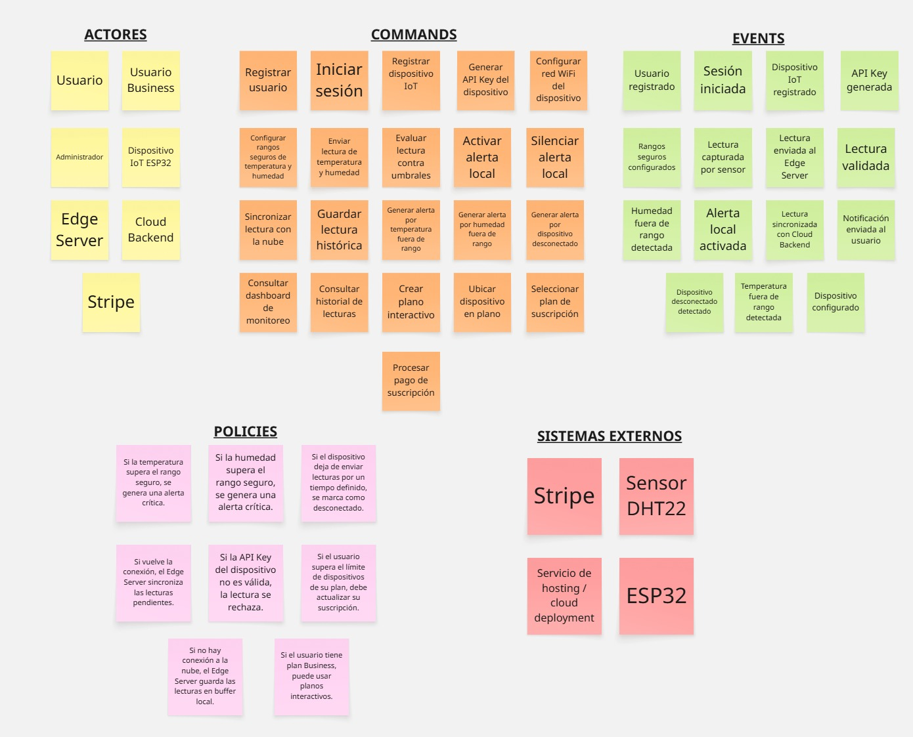
  <figcaption style="font-size: 0.9em; color: #555;">
    <strong>Figura 1:</strong> Big Picture EventStorming de OsitoPolar.
  </figcaption>
</figure>

### 2.5. Ubiquitous Language.


1. **User Profile (Perfil de Usuario):** Datos e información operativa que OsitoPolar recopila de cada usuario para personalizar su experiencia.

2. **Smart Dashboard (Panel Inteligente):** Interfaz central donde los usuarios monitorean el estado de sus equipos, reciben alertas y gestionan sus servicios.

3. **Performance Report (Reporte de Rendimiento):** Informe técnico con historial de uso, consumo energético, temperatura y fallas de cada equipo.

4. **Maintenance Schedule (Agenda de Mantenimientos):** Calendario inteligente para programar mantenimientos preventivos o correctivos.

5. **Failure Alert (Alerta de Falla):** Notificación automática ante anomalías críticas como sobrecalentamiento o cortes de energía.

6. **Equipment Inventory (Inventario de Equipos):** Registro de todos los equipos de congelación con sus datos técnicos y ubicación.

7. **Service Provider (Proveedor de Servicio):** Técnico o empresa que brinda mantenimiento, instalación o reparación de equipos de refrigeración.

8. **Technical History (Historial Técnico):** Registro detallado de todas las intervenciones realizadas a un equipo.

9. **Work Order (Orden de Trabajo):** Documento digital con las tareas asignadas a un técnico para una visita de servicio.

10. **Service Coordination (Coordinación de Servicio):** Proceso de conexión entre clientes y proveedores según disponibilidad, ubicación y necesidad.

11. **Automatic Report Generation (Generación Automática de Reportes):** Función que crea informes técnicos sin intervención manual.

12. **Real-Time Monitoring (Monitoreo en Tiempo Real):** Supervisión constante del estado operativo del equipo (temperatura, consumo, uso).

13. **Service Zone (Zona de Servicio):** Área donde un proveedor puede atender equipos con rapidez y eficiencia.

14. **Client Portfolio (Cartera de Clientes):** Lista de negocios atendidos por un proveedor, con sus datos y equipos registrados.

15. **Cold Equipment (Equipo de Congelación):** Unidad de refrigeración usada para conservar productos, como congeladoras, cámaras o vitrinas.

16. **Energy Consumption (Consumo Energético):** Registro del uso eléctrico de los equipos para detectar anomalías y optimizar recursos.

17. **Preventive Maintenance (Mantenimiento Preventivo):** Servicio planificado para evitar fallas y extender la vida útil del equipo.

18. **Corrective Maintenance (Mantenimiento Correctivo):** Servicio realizado para solucionar una falla existente en un equipo.

19. **Notification (Notificación):** Mensajes enviados automáticamente para informar sobre mantenimientos, fallas o cambios importantes.

<div style="page-break-after: always"></div>

## Capítulo III: Requirements Specification

### 3.1. User Stories.

Las historias de usuario desarrolladas para OsitoPolar fueron elaboradas considerando el nuevo enfoque del proyecto: una plataforma web para monitorear la cadena de frio mediante dispositivos IoT. Las funcionalidades se centran en registrar dispositivos, visualizar temperatura y humedad en tiempo real, configurar rangos seguros, recibir alertas criticas y gestionar planes de uso, incluyendo una opcion empresarial con planos interactivos para ubicar dispositivos dentro de una instalacion.
El trabajo fue realizado de manera colaborativa, priorizando la comprension del problema desde la perspectiva de negocios que operan refrigeradores, congeladores, camaras frias o almacenes refrigerados. Para facilitar la organizacion, priorizacion y trazabilidad de las tareas, se utilizo la plataforma Trello.

| **Epic / Story ID** | **Titulo** | **Descripcion** | **Criterios de Aceptacion** | **Relacionado con (Epic ID)** |
|---------------------|------------|-----------------|-----------------------------|-------------------------------|
| US-01 | Registro de usuario | Como nuevo usuario, quiero registrarme para acceder a la plataforma y monitorear mis activos refrigerados. | Dado que el usuario completa los datos requeridos, cuando envia el formulario, entonces el sistema crea su cuenta. | EP-01 |
| US-02 | Inicio de sesion | Como usuario registrado, quiero iniciar sesion para acceder al panel de monitoreo de OsitoPolar. | Dado que el usuario ingresa credenciales validas, cuando confirma el inicio de sesion, entonces accede al dashboard. | EP-01 |
| US-03 | Registrar dispositivo IoT | Como administrador, quiero registrar un dispositivo IoT para asociarlo al monitoreo de un equipo refrigerado. | Dado que el administrador ingresa el identificador del dispositivo, cuando guarda el registro, entonces el dispositivo queda disponible. | EP-02 |
| US-04 | Asociar dispositivo a activo refrigerado | Como administrador, quiero asociar un dispositivo a un refrigerador, congelador, camara fria o almacen. | Dado que existe un dispositivo disponible, cuando se asigna a un activo, entonces el sistema guarda la relacion. | EP-02 |
| US-05 | Visualizar dashboard de monitoreo | Como usuario, quiero ver un dashboard general para conocer rapidamente el estado de mis activos refrigerados. | Dado que existen dispositivos registrados, cuando ingreso al dashboard, entonces veo el estado de cada activo. | EP-03 |
| US-06 | Ver temperatura y humedad en tiempo real | Como usuario, quiero visualizar temperatura y humedad en tiempo real para confirmar que la cadena de frio se mantiene segura. | Dado que el dispositivo envia telemetria, cuando consulto el activo, entonces veo temperatura y humedad actualizadas. | EP-03 |
| US-07 | Configurar rangos seguros | Como administrador, quiero configurar rangos seguros de temperatura y humedad para cada activo refrigerado. | Dado que ingreso valores minimos y maximos validos, cuando guardo la configuracion, entonces el sistema actualiza el rango seguro. | EP-03 |
| US-08 | Recibir alerta por temperatura fuera de rango | Como usuario, quiero recibir una alerta cuando la temperatura salga del rango seguro para actuar antes de perder productos. | Dado que la temperatura supera el rango configurado, cuando el sistema procesa la lectura, entonces genera una alerta. | EP-04 |
| US-09 | Recibir alerta por humedad fuera de rango | Como usuario, quiero recibir una alerta cuando la humedad salga del rango seguro para proteger los productos almacenados. | Dado que la humedad supera los limites configurados, cuando se recibe la lectura, entonces el sistema crea una alerta. | EP-04 |
| US-10 | Recibir alerta por dispositivo desconectado | Como usuario, quiero recibir una alerta cuando un dispositivo IoT se desconecte para revisar el punto de monitoreo. | Dado que el dispositivo deja de enviar lecturas por el tiempo definido, cuando el sistema valida su estado, entonces genera una alerta de desconexion. | EP-04 |
| US-11 | Consultar historico de lecturas | Como usuario, quiero consultar el historico de lecturas para revisar el comportamiento de temperatura y humedad. | Dado que selecciono un rango de fechas, cuando solicito el historico, entonces el sistema muestra las lecturas correspondientes. | EP-05 |
| US-12 | Visualizar graficos de temperatura y humedad | Como usuario, quiero ver graficos de temperatura y humedad para analizar tendencias de mis activos refrigerados. | Dado que existen lecturas historicas, cuando abro el detalle del activo, entonces se muestran graficos de evolucion. | EP-05 |
| US-13 | Registrar ubicacion de dispositivo | Como administrador, quiero registrar la ubicacion fisica de un dispositivo para identificar rapidamente donde se encuentra. | Dado que ingreso una ubicacion valida, cuando guardo los cambios, entonces el dispositivo queda ubicado. | EP-08 |
| US-14 | Ubicar dispositivos en plano interactivo | Como usuario empresarial, quiero visualizar dispositivos en un plano interactivo para supervisar instalaciones grandes. | Dado que existen puntos configurados, cuando abro el plano, entonces veo la ubicacion y estado de cada dispositivo. | EP-08 |
| US-15 | Gestionar planes de uso | Como administrador de negocio, quiero revisar y seleccionar planes de uso para contratar el nivel adecuado de monitoreo. | Dado que ingreso a la seccion de planes, cuando consulto las opciones, entonces veo caracteristicas y limites. | EP-06 |
| US-16 | Consultar limites del plan | Como usuario, quiero conocer los limites de mi plan para saber cuantos dispositivos o funciones tengo disponibles. | Dado que tengo un plan activo, cuando ingreso a mi cuenta, entonces veo limites y uso actual. | EP-06 |
| US-17 | Exportar reporte de condiciones | Como usuario, quiero exportar reportes de condiciones de frio para sustentar el control de mis productos. | Dado que selecciono un activo y rango de fechas, cuando exporto el reporte, entonces el sistema genera un archivo descargable. | EP-05 |
| US-18 | Recibir resumen de incidentes | Como administrador, quiero recibir un resumen de incidentes para revisar las alertas generadas por mis activos refrigerados. | Dado que existen alertas registradas, cuando consulto el resumen, entonces veo cantidad, tipo y estado de incidentes. | EP-04 |
| US-19 | Generar API Key para dispositivo | Como administrador tecnico, quiero generar una API Key para que un dispositivo IoT pueda enviar telemetria de forma segura. | Dado que selecciono un dispositivo, cuando genero la credencial, entonces el sistema muestra una API Key. | EP-02 |
| US-20 | Enviar telemetria por API | Como dispositivo IoT, quiero enviar lecturas de temperatura y humedad por API para alimentar el monitoreo en tiempo real. | Dado que el dispositivo envia datos con credenciales validas, cuando la API recibe la lectura, entonces la registra correctamente. | EP-03 |
| US-21 | Validar telemetria entrante | Como sistema, quiero validar las lecturas entrantes para evitar datos incompletos o inconsistentes. | Dado que la lectura contiene temperatura, humedad y fecha, cuando se procesa, entonces se almacena correctamente. | EP-03 |
| US-22 | Consultar estado de salud del dispositivo | Como usuario, quiero consultar el estado de salud de cada dispositivo para saber si esta conectado y reportando lecturas. | Dado que el dispositivo envia lecturas recientes, cuando consulto su detalle, entonces aparece como conectado. | EP-03 |
| US-23 | Entender propuesta de valor principal | Como visitante, quiero ver claramente la propuesta de valor de OsitoPolar para entender como protege la cadena de frio. | Dado que ingreso al landing page, cuando carga la pagina, entonces veo el mensaje principal de monitoreo IoT. | EP-07 |
| US-24 | Explorar beneficios por rubro | Como visitante, quiero conocer beneficios para negocios con refrigeradores, congeladores, camaras frias o almacenes refrigerados. | Dado que navego la landing, cuando reviso las secciones de beneficios, entonces encuentro casos aplicables a mi negocio. | EP-07 |
| US-25 | Comprender funcionalidades IoT | Como visitante, quiero conocer las funcionalidades de monitoreo IoT para evaluar si la plataforma cubre mis necesidades. | Dado que reviso la landing, cuando llego a funcionalidades, entonces veo monitoreo, alertas, historico y planes. | EP-07 |
| US-26 | Solicitar una demo | Como visitante interesado, quiero solicitar una demo para iniciar contacto comercial con OsitoPolar. | Dado que completo el formulario de demo, cuando lo envio, entonces el sistema registra mi solicitud. | EP-07 |
| US-27 | Conocer mision y vision | Como visitante, quiero conocer la mision y vision de la startup para confiar en la propuesta. | Dado que ingreso a la seccion Nosotros, cuando leo el contenido, entonces entiendo el enfoque de OsitoPolar. | EP-07 |
| US-28 | Contactar ventas | Como visitante, quiero contactar al equipo de ventas para resolver dudas sobre planes y adopcion. | Dado que reviso la landing, cuando busco contacto, entonces encuentro un CTA visible. | EP-07 |
| US-29 | Acceder al inicio de sesion desde landing | Como usuario existente, quiero encontrar el acceso a inicio de sesion desde la landing para entrar rapidamente al sistema. | Dado que ingreso a la landing, cuando reviso el encabezado, entonces encuentro el boton de inicio de sesion. | EP-07 |
| US-30 | Acceder a la app desde la web | Como usuario, quiero acceder a la aplicacion web desde la landing para continuar con el monitoreo de mis dispositivos. | Dado que estoy en la landing, cuando presiono el CTA de plataforma, entonces soy redirigido a la app web. | EP-07 |
| US-31 | Registrar lectura manual | Como usuario, quiero registrar una lectura manual de respaldo para documentar condiciones cuando sea necesario. | Dado que ingreso temperatura y humedad validas, cuando guardo la lectura, entonces queda registrada en el historial. | EP-05 |
| US-32 | Configurar frecuencia de lectura | Como administrador, quiero configurar la frecuencia de lectura de un dispositivo para adaptar el monitoreo a cada activo. | Dado que selecciono una frecuencia valida, cuando guardo cambios, entonces el dispositivo queda configurado. | EP-02 |
| US-33 | Notificacion automatica por alerta critica | Como usuario, quiero recibir una notificacion automatica ante alertas criticas para reaccionar rapidamente. | Dado que se genera una alerta critica, cuando el sistema la registra, entonces envia una notificacion al usuario. | EP-04 |
| US-34 | Crear plano de instalacion | Como usuario empresarial, quiero crear o cargar un plano de instalacion para organizar visualmente los dispositivos. | Dado que cargo la informacion requerida, cuando guardo el plano, entonces queda disponible en la plataforma. | EP-08 |
| US-35 | Asignar dispositivo a punto del plano | Como usuario empresarial, quiero asignar un dispositivo a un punto del plano para identificar su ubicacion exacta. | Dado que selecciono un dispositivo y un punto, cuando guardo, entonces el dispositivo aparece en el plano. | EP-08 |
| US-36 | Filtrar dispositivos por estado | Como usuario, quiero filtrar dispositivos por estado para revisar rapidamente los que estan conectados, desconectados o en alerta. | Dado que selecciono un estado, cuando aplico el filtro, entonces la lista muestra solo dispositivos coincidentes. | EP-03 |
| US-37 | Consultar cumplimiento de rango seguro | Como administrador, quiero consultar el cumplimiento de rangos seguros para evaluar la estabilidad de la cadena de frio. | Dado que existen lecturas historicas, cuando consulto el indicador, entonces veo el porcentaje de tiempo dentro del rango seguro. | EP-05 |
| TS-38 | Registrar evento de alerta por API | Como desarrollador, quiero registrar eventos de alerta por API para mantener trazabilidad de incidentes de temperatura, humedad o conexion. | Dado que la API recibe un evento con datos completos, cuando lo procesa, entonces almacena la alerta. | EP-04 |
| TS-39 | Listar lecturas por rango de fechas | Como desarrollador, quiero implementar un endpoint para consultar lecturas por rango de fechas. | Dado que existen lecturas en el rango, cuando se consulta el endpoint, entonces retorna la lista. | EP-05 |
| TS-40 | Registrar nuevo usuario por API | Como desarrollador, quiero implementar el registro de usuarios por API para habilitar la creacion de cuentas. | Dado que se envia informacion valida, cuando la API procesa la solicitud, entonces crea el usuario. | EP-01 |
| TS-41 | Consultar estado de dispositivo por API | Como desarrollador, quiero consultar el estado de un dispositivo por API para mostrar conectividad y ultima lectura. | Dado que el dispositivo existe, cuando se consulta el endpoint, entonces retorna su estado. | EP-03 |
| TS-42 | Registrar telemetria de temperatura y humedad | Como desarrollador, quiero implementar el endpoint de telemetria para recibir temperatura y humedad desde dispositivos IoT. | Dado que se envia una lectura valida, cuando la API la recibe, entonces la almacena. | EP-03 |
| TS-43 | Actualizar configuracion de rangos seguros | Como desarrollador, quiero implementar un endpoint para actualizar rangos seguros por activo refrigerado. | Dado que se envian rangos validos, cuando la API procesa la solicitud, entonces actualiza la configuracion. | EP-03 |
| TS-44 | Consultar historico de lecturas por API | Como desarrollador, quiero consultar el historico de lecturas para alimentar graficos y reportes. | Dado que existen lecturas, cuando se consulta el endpoint, entonces retorna datos ordenados por fecha. | EP-05 |
| TS-45 | Generar reporte de cumplimiento de cadena de frio | Como desarrollador, quiero generar reportes de cumplimiento para evidenciar condiciones seguras de temperatura y humedad. | Dado que existen lecturas, cuando se solicita el reporte, entonces se genera con indicadores de cumplimiento. | EP-05 |
| TS-46 | Consultar dispositivos por instalacion o plano | Como desarrollador, quiero consultar dispositivos por instalacion o plano para mostrar su ubicacion en instalaciones empresariales. | Dado que existen dispositivos asociados, cuando se consulta el endpoint, entonces retorna sus posiciones. | EP-08 |
| TS-47 | Consultar activos refrigerados y su estado | Como desarrollador, quiero consultar activos refrigerados y su estado para alimentar el dashboard de monitoreo. | Dado que existen activos registrados, cuando se consulta el endpoint, entonces retorna su informacion y estado. | EP-02 |
| TS-48 | Enviar notificaciones por eventos criticos | Como desarrollador, quiero implementar el envio de notificaciones cuando se detecten eventos criticos. | Dado que se registra una alerta critica, cuando se procesa el evento, entonces el sistema envia la notificacion. | EP-04 |
| TS-49 | Consultar metricas del dispositivo | Como desarrollador, quiero consultar metricas del dispositivo para mostrar conectividad, ultima lectura y estabilidad de datos. | Dado que el dispositivo tiene lecturas, cuando se consulta el endpoint, entonces retorna sus metricas. | EP-03 |
| EP-01 | Gestion de Usuarios | Esta epic agrupa las funcionalidades de registro, autenticacion y acceso de usuarios a la plataforma. |  |  |
| EP-02 | Gestion de Dispositivos y Activos Refrigerados | Esta epic cubre el registro de dispositivos IoT, activos refrigerados, API Keys y configuraciones iniciales. |  |  |
| EP-03 | Monitoreo de Cadena de Frio | Esta epic abarca el dashboard, lecturas en tiempo real, telemetria y estado de dispositivos. |  |  |
| EP-04 | Alertas e Incidentes | Esta epic agrupa las alertas por temperatura, humedad, desconexion y notificaciones criticas. |  |  |
| EP-05 | Analitica e Historico | Esta epic cubre historicos, graficos, reportes y cumplimiento de rangos seguros. |  |  |
| EP-06 | Planes y Acceso Empresarial | Esta epic contempla planes de uso, limites del plan y funcionalidades empresariales. |  |  |
| EP-07 | Landing Page y Experiencia Comercial | Esta epic se enfoca en la propuesta de valor, beneficios, demo, contacto y acceso a la plataforma. |  |  |
| EP-08 | Planos Interactivos | Esta epic cubre la ubicacion visual de dispositivos dentro de instalaciones empresariales. |  |  |

<div style="page-break-after: always"></div>

### 3.2. Impact Mapping.

El siguiente Impact Mapping fue desarrollado en UXPressia de manera colaborativa por el equipo de OsitoPolar para alinear los objetivos de negocio con los requerimientos funcionales de la plataforma.


<figure style="page-break-inside: avoid; text-align: center;">
  
  <figcaption style="font-size: 0.9em; color: #555;">
    <strong>Figura 1:</strong> Impact Mapping.
  </figcaption>
</figure>

<div style="page-break-after: always"></div>

### 3.3. Product Backlog.

A continuación, presentaremos el Product Backlog, el cual contiene todas las funcionalidades y características necesarias para el desarrollo de la plataforma. Este listado incluye tanto las historias de usuario como las tareas técnicas que facilitarán el progreso del proyecto. Para priorizar las tareas, se ha utilizado la escala Fibonacci (1, 2, 3, 5, 8, 13, 21), la cual ayuda a estimar el esfuerzo relativo requerido para completar cada tarea. Además, hemos asignado cada item a un sprint, de acuerdo con su relevancia y dependencias.

Escala de Story Points (Fibonacci):

1: Tareas pequeñas que se pueden completar rápidamente.

2: Tareas de tamaño moderado.

3: Tareas que requieren más tiempo y esfuerzo.

5: Tareas complejas o con dependencia de otras tareas.

8: Tareas muy complejas o que afectan a múltiples áreas.


<figure style="page-break-inside: avoid; text-align: center;">
  
  <figcaption style="font-size: 0.9em; color: #555;">
    <strong>Figura 1:</strong> Product Backlog.
  </figcaption>
</figure>


| Orden | User Story ID | Titulo | Descripcion | Story Points |
|-------|---------------|--------|-------------|--------------|
| 1 | US-01 | Registro de usuario | Como nuevo usuario, quiero registrarme para acceder a la plataforma y monitorear mis activos refrigerados. | 5 |
| 2 | US-02 | Inicio de sesion | Como usuario registrado, quiero iniciar sesion para acceder al panel de monitoreo de OsitoPolar. | 3 |
| 3 | US-03 | Registrar dispositivo IoT | Como administrador, quiero registrar un dispositivo IoT para asociarlo al monitoreo de un equipo refrigerado. | 5 |
| 4 | US-04 | Asociar dispositivo a activo refrigerado | Como administrador, quiero asociar un dispositivo a un refrigerador, congelador, camara fria o almacen. | 5 |
| 5 | US-05 | Visualizar dashboard de monitoreo | Como usuario, quiero ver un dashboard general para conocer el estado de mis activos refrigerados. | 8 |
| 6 | US-06 | Ver temperatura y humedad en tiempo real | Como usuario, quiero visualizar temperatura y humedad en tiempo real para confirmar que la cadena de frio se mantiene segura. | 8 |
| 7 | US-07 | Configurar rangos seguros | Como administrador, quiero configurar rangos seguros de temperatura y humedad para cada activo refrigerado. | 5 |
| 8 | US-08 | Recibir alerta por temperatura fuera de rango | Como usuario, quiero recibir una alerta cuando la temperatura salga del rango seguro para actuar a tiempo. | 8 |
| 9 | US-09 | Recibir alerta por humedad fuera de rango | Como usuario, quiero recibir una alerta cuando la humedad salga del rango seguro para proteger los productos almacenados. | 8 |
| 10 | US-10 | Recibir alerta por dispositivo desconectado | Como usuario, quiero recibir una alerta cuando un dispositivo IoT se desconecte. | 8 |
| 11 | US-11 | Consultar historico de lecturas | Como usuario, quiero consultar el historico de lecturas para revisar el comportamiento de temperatura y humedad. | 5 |
| 12 | US-12 | Visualizar graficos de temperatura y humedad | Como usuario, quiero ver graficos de temperatura y humedad para analizar tendencias. | 5 |
| 13 | US-13 | Registrar ubicacion de dispositivo | Como administrador, quiero registrar la ubicacion fisica de un dispositivo para identificar donde se encuentra. | 3 |
| 14 | US-14 | Ubicar dispositivos en plano interactivo | Como usuario empresarial, quiero visualizar dispositivos en un plano interactivo para supervisar instalaciones grandes. | 8 |
| 15 | US-15 | Gestionar planes de uso | Como administrador de negocio, quiero revisar y seleccionar planes de uso para contratar el nivel adecuado de monitoreo. | 5 |
| 16 | US-16 | Consultar limites del plan | Como usuario, quiero conocer los limites de mi plan para saber cuantos dispositivos o funciones tengo disponibles. | 3 |
| 17 | US-17 | Exportar reporte de condiciones | Como usuario, quiero exportar reportes de condiciones de frio para sustentar el control de mis productos. | 5 |
| 18 | US-18 | Recibir resumen de incidentes | Como administrador, quiero recibir un resumen de incidentes para revisar las alertas generadas. | 5 |
| 19 | US-19 | Generar API Key para dispositivo | Como administrador tecnico, quiero generar una API Key para que un dispositivo IoT pueda enviar telemetria de forma segura. | 5 |
| 20 | US-20 | Enviar telemetria por API | Como dispositivo IoT, quiero enviar lecturas de temperatura y humedad por API para alimentar el monitoreo. | 8 |
| 21 | US-21 | Validar telemetria entrante | Como sistema, quiero validar las lecturas entrantes para evitar datos incompletos o inconsistentes. | 5 |
| 22 | US-22 | Consultar estado de salud del dispositivo | Como usuario, quiero consultar el estado de salud de cada dispositivo para saber si esta conectado y reportando lecturas. | 5 |
| 23 | US-23 | Entender propuesta de valor principal | Como visitante, quiero ver claramente la propuesta de valor de OsitoPolar para entender como protege la cadena de frio. | 3 |
| 24 | US-24 | Explorar beneficios por rubro | Como visitante, quiero conocer beneficios para negocios con refrigeradores, congeladores, camaras frias o almacenes refrigerados. | 3 |
| 25 | US-25 | Comprender funcionalidades IoT | Como visitante, quiero conocer las funcionalidades de monitoreo IoT para evaluar si la plataforma cubre mis necesidades. | 5 |
| 26 | US-26 | Solicitar una demo | Como visitante interesado, quiero solicitar una demo para iniciar contacto comercial con OsitoPolar. | 3 |
| 27 | US-27 | Conocer mision y vision | Como visitante, quiero conocer la mision y vision de la startup para confiar en la propuesta. | 2 |
| 28 | US-28 | Contactar ventas | Como visitante, quiero contactar al equipo de ventas para resolver dudas sobre planes y adopcion. | 3 |
| 29 | US-29 | Acceder al inicio de sesion desde landing | Como usuario existente, quiero encontrar el acceso a inicio de sesion desde la landing para entrar rapidamente al sistema. | 3 |
| 30 | US-30 | Acceder a la app desde la web | Como usuario, quiero acceder a la aplicacion web desde la landing para continuar con el monitoreo de mis dispositivos. | 3 |
| 31 | US-31 | Registrar lectura manual | Como usuario, quiero registrar una lectura manual de respaldo para documentar condiciones cuando sea necesario. | 3 |
| 32 | US-32 | Configurar frecuencia de lectura | Como administrador, quiero configurar la frecuencia de lectura de un dispositivo para adaptar el monitoreo. | 5 |
| 33 | US-33 | Notificacion automatica por alerta critica | Como usuario, quiero recibir una notificacion automatica ante alertas criticas para reaccionar rapidamente. | 8 |
| 34 | US-34 | Crear plano de instalacion | Como usuario empresarial, quiero crear o cargar un plano de instalacion para organizar visualmente los dispositivos. | 8 |
| 35 | US-35 | Asignar dispositivo a punto del plano | Como usuario empresarial, quiero asignar un dispositivo a un punto del plano para identificar su ubicacion exacta. | 8 |
| 36 | US-36 | Filtrar dispositivos por estado | Como usuario, quiero filtrar dispositivos por estado para revisar los conectados, desconectados o en alerta. | 3 |
| 37 | US-37 | Consultar cumplimiento de rango seguro | Como administrador, quiero consultar el cumplimiento de rangos seguros para evaluar la estabilidad de la cadena de frio. | 5 |

<div style="page-break-after: always"></div>

### 3.4. To-Be Scenario Mapping.
**Segmento objetivo #1: CLIENTES (DUEÑOS DE EQUIPOS DE REFRIGERACIÓN)**

<figure style="page-break-inside: avoid; text-align: center;">
  
  <figcaption style="font-size: 0.9em; color: #555;">
    <strong>Figura 1:</strong> To Be Scenario Mapping Clientes (Segmento 1).
  </figcaption>
</figure>


**Segmento objetivo #2: EMPRESAS PROVEEDORAS DE SERVICIOS Y EQUIPOS DE REFRIGERACIÓN**


<figure style="page-break-inside: avoid; text-align: center;">
  
  <figcaption style="font-size: 0.9em; color: #555;">
    <strong>Figura 2:</strong> To Be Scenario Mapping - Empresas Proveedoras (Segmento 2).
  </figcaption>
</figure>

<div style="page-break-after: always"></div>


## Capítulo IV: Solution Software Design
### 4.1. Strategic-Level Domain-Driven Design.

#### 4.1.1. Design-Level EventStorming.

##### 4.1.1.1 Candidate Context Discovery.
La sesión de Candidate Context Discovery se realizó inmediatamente después del taller de EventStorming, con una duración aproximada de 1 hora 30 minutos. Se utilizó como insumo la línea de tiempo de eventos generada, los clusters de eventos y agregados identificados, y los eventos pivote que marcaban transiciones de estado relevantes en la plataforma OsitoPolar.

Se aplicó la técnica **Start-with-Value**, cuyo principio consiste en priorizar aquellas partes del dominio que representan el mayor valor para el negocio. Esta técnica permitió separar con claridad qué bounded contexts debían considerarse Core, y cuáles como Supporting o Generic.

El proceso se organizó en tres pasos:

**1. Identificación de valor estratégico**

Cada integrante respondió a la pregunta: *¿Qué parte del sistema genera directamente valor para los usuarios y diferencia a OsitoPolar de otras soluciones de gestión de equipos de refrigeración?*

**2. Agrupación de eventos en torno al valor**

Se revisaron los clusters del EventStorming, destacando aquellos que respondían a las necesidades críticas de monitoreo, gestión técnica y trazabilidad de equipos. Los eventos fueron agrupados en bloques temáticos antes de la delimitación formal de los bounded contexts.

**3. Clasificación Core, Supporting, Generic**

Los contexts se categorizaron según su aporte al negocio y nivel de complejidad de su modelo.

**Candidate Contexts identificados:**

| Candidate Context | Eventos Clave Asociados | Clasificación | Descripción | Justificación |
|---|---|---|---|---|
| **IAM** | Usuario registrado, Sesión iniciada, Token generado | Generic | Gestión de usuarios, roles y autenticación mediante JWT. | Necesario para operar pero no diferenciador; existen soluciones estándar que podrían cubrirlo. |
| **Profiles** | Perfil creado, Perfil actualizado | Generic | Datos personales del usuario fuera del contexto de autenticación. | Complementa al IAM pero no representa valor diferenciador del negocio. |
| **Subscriptions and Payments** | Plan elegido, Suscripción confirmada, Pago procesado, Suscripción cancelada | Supporting | Gestión de planes de suscripción y pagos vía Stripe. | Clave para la sostenibilidad económica del negocio, pero externalizable a través de proveedores estándar. |
| **Technicians** | Técnico registrado, Técnico asignado, Calificación registrada | Supporting | Administración del catálogo de técnicos de servicio y sus métricas de rendimiento. | Apoya el flujo de atención técnica pero no constituye el núcleo diferenciador de la solución. |
| **Equipment Management** | Equipo registrado, Ubicación actualizada, Estado de equipo cambiado, Equipo eliminado | Core | Gestión del ciclo de vida completo de equipos de refrigeración y climatización. | Es el núcleo operativo de OsitoPolar; sin la gestión de equipos no existe base para el monitoreo ni para los servicios. |
| **Service Requests** | Solicitud creada, Técnico asignado, Solicitud resuelta, Feedback agregado | Core | Gestión del flujo de solicitudes de servicio técnico desde su creación hasta la resolución y retroalimentación. | Constituye el mecanismo principal de interacción entre clientes y técnicos; diferencia a OsitoPolar frente a métodos informales. |
| **Work Orders** | Orden de trabajo creada, Orden asignada, Orden en progreso, Orden resuelta, Feedback del cliente registrado | Core | Gestión de las órdenes de trabajo técnico concretas que ejecutan los técnicos sobre los equipos. | Provee trazabilidad completa del trabajo realizado sobre cada equipo, valor diferenciador frente a la gestión manual. |
| **Analytics** | Lectura de temperatura registrada, Lectura de energía registrada, Alerta de rango generada, Promedio diario calculado | Core | Recopilación, procesamiento y visualización de lecturas de temperatura y consumo energético de los equipos. | Es el núcleo técnico de OsitoPolar; la detección de anomalías térmicas y el análisis energético constituyen la propuesta de valor principal para el cliente. |

**Clasificación estratégica final:**

- **Core:** Equipment Management, Service Requests, Work Orders, Analytics.
- **Supporting:** Subscriptions and Payments, Technicians.
- **Generic:** IAM, Profiles.

Se definieron ocho bounded contexts candidatos, de los cuales 4 son Core, 2 Supporting y 2 Generic. La técnica Start-with-Value permitió asegurar que la atención principal del diseño táctico se concentre en los contextos de Equipment Management, Service Requests, Work Orders y Analytics, dado que allí reside la propuesta de valor diferenciadora de OsitoPolar: la gestión integral de equipos de refrigeración, la trazabilidad del servicio técnico y el análisis del desempeño operativo de los equipos.

---

##### 4.1.1.2 Domain Message Flows Modeling.
Para esta sección el objetivo fue visualizar cómo los bounded contexts colaboran (mediante mensajes, eventos y solicitudes sincrónicas) para soportar los casos de uso clave de la plataforma OsitoPolar. Se aplicó Domain Storytelling para describir las interacciones tanto operativas como técnicas en la gestión de equipos de refrigeración.

**Historia A — Cliente registra un equipo y recibe alertas de temperatura**

1. El **Cliente** (negocio de refrigeración) realiza el `SignUp` en el contexto **IAM**, que genera un JWT y emite el evento `UserRegistered`.
2. **IAM** notifica al contexto **Profiles**, que crea el perfil del usuario mediante `CreateProfileCommand`.
3. El cliente crea un equipo en **Equipment Management** con `CreateEquipmentCommand`, registrando modelo, marca, ubicación y tipo.
4. **Equipment Management** persiste el equipo y emite `EquipmentRegistered`.
5. El sistema IoT o el técnico registra lecturas de temperatura mediante `RecordTemperatureReadingCommand` en el contexto **Analytics**.
6. **Analytics** evalúa si la lectura supera el `TemperatureRange` configurado y genera el estado `Critical` o `Warning`.
7. La plataforma muestra en el dashboard del cliente las lecturas y alertas en tiempo real.

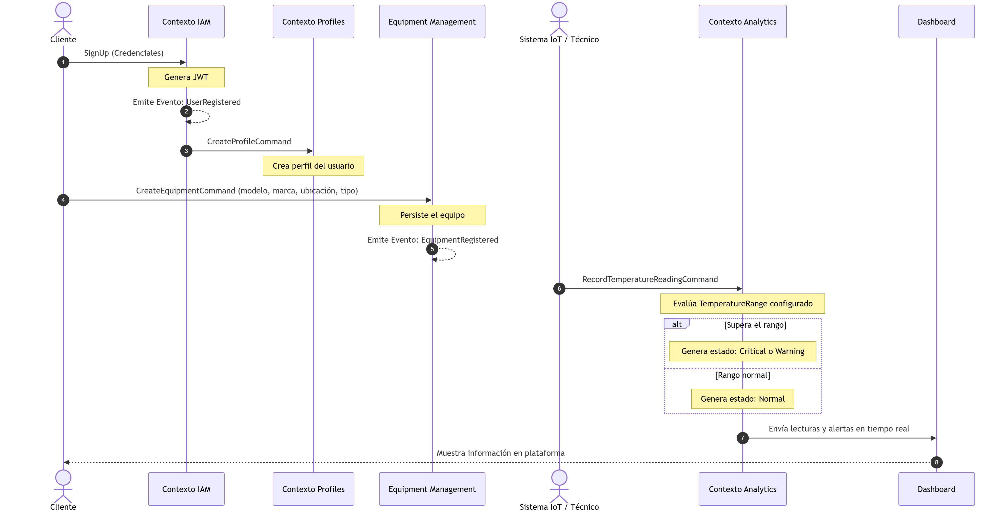

**Historia B — Cliente solicita servicio técnico para un equipo**

1. El cliente detecta una anomalía en su equipo y crea una `ServiceRequest` en **Service Requests** con `CreateServiceRequestCommand`, indicando equipo, descripción, prioridad y urgencia.
2. **Service Requests** registra la solicitud en estado `Pending`.
3. La empresa de servicios consulta las solicitudes pendientes y asigna un técnico disponible del contexto **Technicians** mediante `AssignTechnicianToServiceRequestCommand`.
4. **Service Requests** cambia el estado a `Accepted` y notifica al técnico asignado.
5. Se crea una `WorkOrder` en **Work Orders** con `CreateWorkOrderCommand`, vinculada a la `ServiceRequest` y al equipo correspondiente.
6. El técnico ejecuta el trabajo, actualiza el estado de la orden a `InProgress` y luego a `Resolved` mediante `AddWorkOrderResolutionDetailsCommand`.
7. **Work Orders** emite `WorkOrderResolved`, y el cliente puede agregar `CustomerFeedbackRating` (1-5 estrellas).
8. **Technicians** actualiza el `AverageRating` del técnico con la nueva calificación recibida.

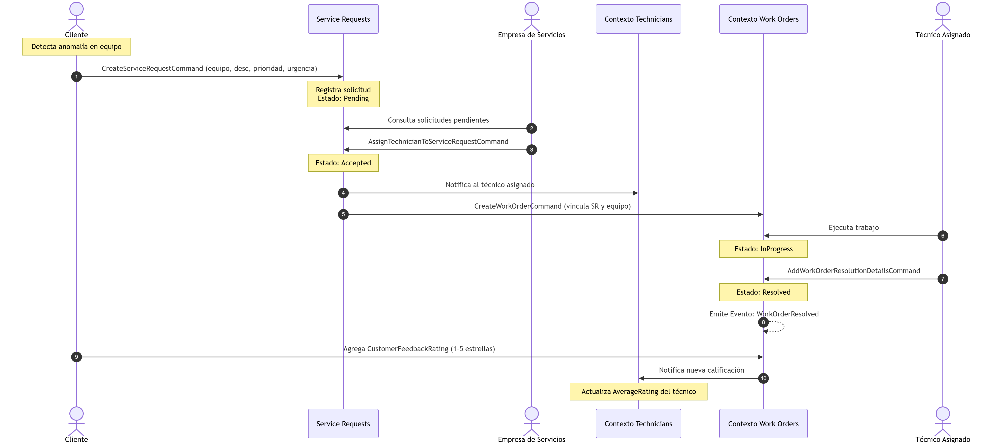

**Historia C — Empresa gestiona suscripción y accede a analítica avanzada**

1. El cliente selecciona un plan en **Subscriptions and Payments** con `CreateSubscriptionCommand`.
2. **Subscriptions and Payments** genera una sesión de Stripe Checkout y redirige al cliente para el pago.
3. Stripe procesa el pago y envía el webhook, que es manejado con `ProcessPaymentWebhookCommand`.
4. La suscripción queda confirmada en estado `Active` y se actualiza el `SubscriptionId` del usuario en **IAM**.
5. Con el plan activo, el cliente accede a las vistas de **Analytics** para consultar lecturas históricas de temperatura y energía, promedios diarios y el estado general del equipo mediante `GetEquipmentAnalyticsQuery`.

---
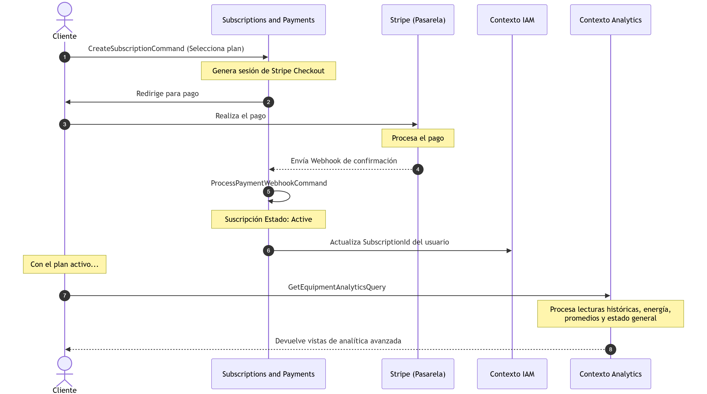

##### 4.1.1.3 Bounded Context Canvases.
A continuación se presentan los Bounded Context Canvases de los ocho contextos identificados para la plataforma OsitoPolar:

---

**IAM (Identity and Access Management)**

Gestiona el registro de usuarios y la autenticación mediante JWT, controlando el acceso basado en roles en toda la plataforma.

| Elemento | Detalle |
|---|---|
| **Clasificación** | Generic |
| **Responsabilidad** | Registro (`SignUp`), autenticación (`SignIn`) y autorización de usuarios. |
| **Aggregate Root** | `User` (Id, Username, PasswordHash, SubscriptionId) |
| **Comandos clave** | `SignUpCommand`, `SignInCommand` |
| **Queries clave** | `GetUserByIdQuery`, `GetUserByUsernameQuery` |
| **Eventos publicados** | `UserRegistered` |
| **Colaboraciones entrantes** | Ninguna (primer punto de entrada al sistema) |
| **Colaboraciones salientes** | → Profiles (crea perfil al registrar usuario vía `IamContextFacade`) |
| **Sistemas externos** | BCrypt (hashing), JWT (tokens) |

---

**Profiles**

Almacena los datos personales de los usuarios (nombre, email, dirección) fuera del contexto de autenticación, accesibles por otros bounded contexts mediante fachada ACL.

| Elemento | Detalle |
|---|---|
| **Clasificación** | Generic |
| **Responsabilidad** | Persistencia y consulta de datos de perfil de usuario. |
| **Aggregate Root** | `Profile` (Id, PersonName, EmailAddress, StreetAddress) |
| **Comandos clave** | `CreateProfileCommand` |
| **Queries clave** | `GetProfileByIdQuery`, `GetProfileByEmailQuery` |
| **Eventos publicados** | Ninguno |
| **Colaboraciones entrantes** | ← IAM (crea perfil al registrar usuario) |
| **Colaboraciones salientes** | Expone `IProfilesContextFacade` a otros contextos |
| **Sistemas externos** | Ninguno |

---

**Equipment Management**

Gestiona el ciclo de vida completo de los equipos de refrigeración y climatización: registro, ubicación, estado operativo y consumo energético.

| Elemento | Detalle |
|---|---|
| **Clasificación** | Core |
| **Responsabilidad** | CRUD de equipos y gestión de su estado, ubicación y tipo. |
| **Aggregate Root** | `Equipment` (Id, EquipmentIdentifier, OwnerId, Status, Type, Location, EnergyConsumption) |
| **Comandos clave** | `CreateEquipmentCommand`, `UpdateEquipmentLocationCommand`, `UpdateEquipmentPowerStateCommand`, `UpdateEquipmentTemperatureCommand`, `DeleteEquipmentCommand` |
| **Queries clave** | `GetEquipmentByIdQuery`, `GetEquipmentsByOwnerIdQuery`, `GetEquipmentsByStatusQuery` |
| **Eventos publicados** | `EquipmentRegistered`, `EquipmentStatusChanged` |
| **Colaboraciones entrantes** | ← IAM (autenticación de propietario) |
| **Colaboraciones salientes** | → Analytics (equipos referenciados en lecturas), → Service Requests (equipo vinculado a solicitud), → Work Orders (equipo vinculado a orden) |
| **Sistemas externos** | Ninguno |

---

**Service Requests**

Gestiona el flujo completo de solicitudes de servicio técnico: desde su creación por el cliente hasta la asignación del técnico, la resolución y la retroalimentación.

| Elemento | Detalle |
|---|---|
| **Clasificación** | Core |
| **Responsabilidad** | Ciclo de vida de solicitudes de servicio técnico con reglas de estado estrictas. |
| **Aggregate Root** | `ServiceRequest` (Id, OrderNumber, Status, Priority, Urgency, ClientId, CompanyId, EquipmentId, AssignedTechnicianId) |
| **Comandos clave** | `CreateServiceRequestCommand`, `AssignTechnicianToServiceRequestCommand`, `UpdateServiceRequestStatusCommand`, `AddCustomerFeedbackToServiceRequestCommand`, `CancelServiceRequestCommand`, `RejectServiceRequestCommand` |
| **Queries clave** | `GetServiceRequestByIdQuery`, `GetServiceRequestsByStatusQuery`, `GetServiceRequestsByEquipmentIdQuery` |
| **Eventos publicados** | `ServiceRequestCreated`, `TechnicianAssigned`, `ServiceRequestResolved` |
| **Colaboraciones entrantes** | ← Equipment Management (referencia al equipo), ← Technicians (técnico asignado) |
| **Colaboraciones salientes** | → Work Orders (se genera una Work Order al aceptar la solicitud) |
| **Sistemas externos** | Ninguno |

---

**Work Orders**

Gestiona las órdenes de trabajo técnico que los técnicos ejecutan sobre los equipos, incluyendo programación, resolución y retroalimentación del cliente.

| Elemento | Detalle |
|---|---|
| **Clasificación** | Core |
| **Responsabilidad** | Trazabilidad completa del trabajo técnico realizado: asignación, ejecución, resolución y calificación. |
| **Aggregate Root** | `WorkOrder` (Id, WorkOrderNumber, ServiceRequestId, Status, AssignedTechnicianId, EquipmentId, Cost, CustomerFeedbackRating) |
| **Comandos clave** | `CreateWorkOrderCommand`, `AssignTechnicianToWorkOrderCommand`, `UpdateWorkOrderStatusCommand`, `AddWorkOrderResolutionDetailsCommand`, `AddWorkOrderCustomerFeedbackCommand` |
| **Queries clave** | `GetWorkOrderByIdQuery`, `GetWorkOrdersByTechnicianIdQuery`, `GetWorkOrdersByEquipmentIdQuery` |
| **Eventos publicados** | `WorkOrderCreated`, `WorkOrderResolved` |
| **Colaboraciones entrantes** | ← Service Requests (vinculada a una solicitud), ← Technicians (técnico asignado), ← Equipment Management (equipo referenciado) |
| **Colaboraciones salientes** | → Technicians (actualización del rating del técnico) |
| **Sistemas externos** | Ninguno |

---

**Analytics**

Recopila, procesa y consulta lecturas de temperatura y consumo energético de los equipos de refrigeración, detectando anomalías y calculando promedios históricos.

| Elemento | Detalle |
|---|---|
| **Clasificación** | Core |
| **Responsabilidad** | Ingesta de lecturas IoT, detección de estados anómalos y consultas analíticas históricas. |
| **Aggregate Root** | `EquipmentAnalytics` (EquipmentId, TemperatureReadings, EnergyReadings) |
| **Comandos clave** | `RecordTemperatureReadingCommand`, `RecordEnergyReadingCommand` |
| **Queries clave** | `GetTemperatureReadingsQuery`, `GetEnergyReadingsQuery`, `GetDailyTemperatureAveragesQuery`, `GetEquipmentAnalyticsQuery` |
| **Eventos publicados** | `AnomalousReadingDetected` |
| **Colaboraciones entrantes** | ← Equipment Management (referencia de equipos monitoreados) |
| **Colaboraciones salientes** | Ninguna (solo expone queries) |
| **Sistemas externos** | Dispositivos IoT / sensores de temperatura y energía |

---

**Subscriptions and Payments**

Gestiona la selección de planes de suscripción y el procesamiento de pagos vía Stripe, controlando el ciclo de vida desde la elección del plan hasta la confirmación de la suscripción activa.

| Elemento | Detalle |
|---|---|
| **Clasificación** | Supporting |
| **Responsabilidad** | Alta, renovación y cancelación de suscripciones; integración de pagos con Stripe. |
| **Aggregates** | `Subscription` (Id, UserId, PlanName, BillingCycle, Status), `Payment` (Id, UserId, SubscriptionId, StripeSession, Amount, Status) |
| **Comandos clave** | `CreateSubscriptionCommand`, `UpgradePlanCommand`, `DeleteSubscriptionCommand`, `CreatePaymentSessionCommand`, `ProcessPaymentWebhookCommand` |
| **Queries clave** | `GetSubscriptionByIdQuery`, `GetPlansQuery` |
| **Eventos publicados** | `SubscriptionConfirmed`, `SubscriptionCancelled` |
| **Colaboraciones entrantes** | ← IAM (UserId del usuario suscriptor) |
| **Colaboraciones salientes** | → IAM (actualiza `SubscriptionId` en el usuario) |
| **Sistemas externos** | Stripe (pagos y webhooks) |

---

**Technicians**

Gestiona el catálogo de técnicos de servicio disponibles en la plataforma, incluyendo sus datos, especialización, disponibilidad y métricas de rendimiento (calificación promedio).

| Elemento | Detalle |
|---|---|
| **Clasificación** | Supporting |
| **Responsabilidad** | Registro, consulta y gestión del rendimiento de técnicos de servicio. |
| **Entidad Principal** | `Technician` (Id, FirstName, LastName, Email, Phone, Specialization, IsAvailable, AverageRating) |
| **Comandos clave** | `CreateTechnicianCommand` |
| **Queries clave** | `GetAllTechniciansQuery`, `GetTechnicianByIdQuery`, `GetTechnicianAverageRatingQuery` |
| **Eventos publicados** | `TechnicianCreatedEvent` |
| **Colaboraciones entrantes** | ← Work Orders (retroalimentación del cliente que actualiza el rating) |
| **Colaboraciones salientes** | → Service Requests (técnico asignado a solicitud), → Work Orders (técnico asignado a orden) |
| **Sistemas externos** | Ninguno |

---

#### 4.1.2. Context Mapping.


El mapa de contextos (Context Map) define las relaciones estratégicas y de integración entre los ocho Bounded Contexts identificados para la plataforma OsitoPolar. Estas relaciones establecen cómo fluyen los datos y qué contexto tiene el control sobre los contratos de integración.

Las relaciones identificadas son las siguientes:

- **IAM → Profiles** [Partnership / ACL]: Al registrar un usuario, IAM invoca la fachada `IProfilesContextFacade` de Profiles para crear el perfil correspondiente. IAM actúa como Upstream (U) y Profiles como Downstream (D). Profiles implementa un ACL para traducir el modelo de IAM al suyo propio.

- **IAM ← Subscriptions and Payments** [Customer/Supplier]: Subscriptions and Payments actualiza el `SubscriptionId` del usuario en IAM al confirmar una suscripción activa. Subscriptions and Payments es Upstream (U), IAM es Downstream (D).

- **Equipment Management → Analytics** [Customer/Supplier]: Analytics consume el `EquipmentId` de Equipment Management como clave de referencia para asociar lecturas a equipos. Equipment Management es Upstream (U), Analytics es Downstream (D).

- **Equipment Management → Service Requests** [Customer/Supplier]: Service Requests referencia el `EquipmentId` de Equipment Management al crear solicitudes de servicio. Equipment Management es Upstream (U), Service Requests es Downstream (D).

- **Equipment Management → Work Orders** [Customer/Supplier]: Work Orders referencia el `EquipmentId` de Equipment Management. Equipment Management es Upstream (U), Work Orders es Downstream (D).

- **Technicians → Service Requests** [Customer/Supplier]: Service Requests consume el `TechnicianId` de Technicians al asignar un técnico a una solicitud. Technicians es Upstream (U), Service Requests es Downstream (D).

- **Technicians → Work Orders** [Customer/Supplier]: Work Orders consume el `TechnicianId` de Technicians al asignar un técnico a una orden. Technicians es Upstream (U), Work Orders es Downstream (D).

- **Service Requests → Work Orders** [Partnership]: Al aceptar una solicitud de servicio, se genera automáticamente una Work Order vinculada. Service Requests es Upstream (U), Work Orders es Downstream (D).

- **Work Orders → Technicians** [Customer/Supplier]: Work Orders notifica al contexto Technicians cuando se registra la calificación de un cliente, para actualizar el `AverageRating` del técnico. Work Orders es Upstream (U), Technicians es Downstream (D).

A continuación se presenta el diagrama del Context Mapping utilizando notación estándar de Domain-Driven Design (DDD):

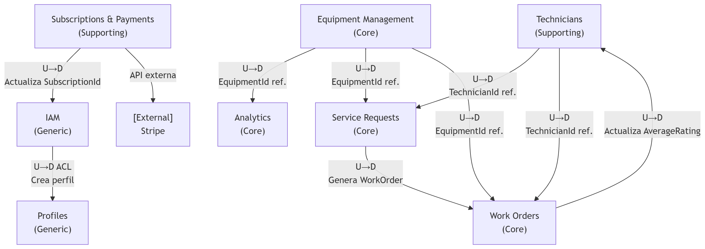


#### 4.1.3. Software Architecture.

##### 4.1.3.1. Software Architecture System Landscape Diagram.

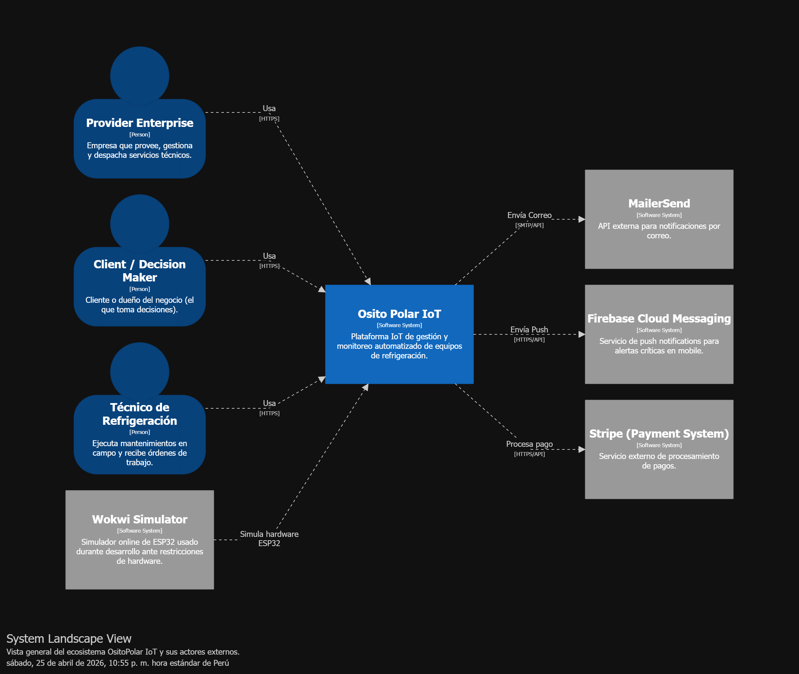
*Leyenda:*


##### 4.1.3.2. Software Architecture Context Level Diagrams.

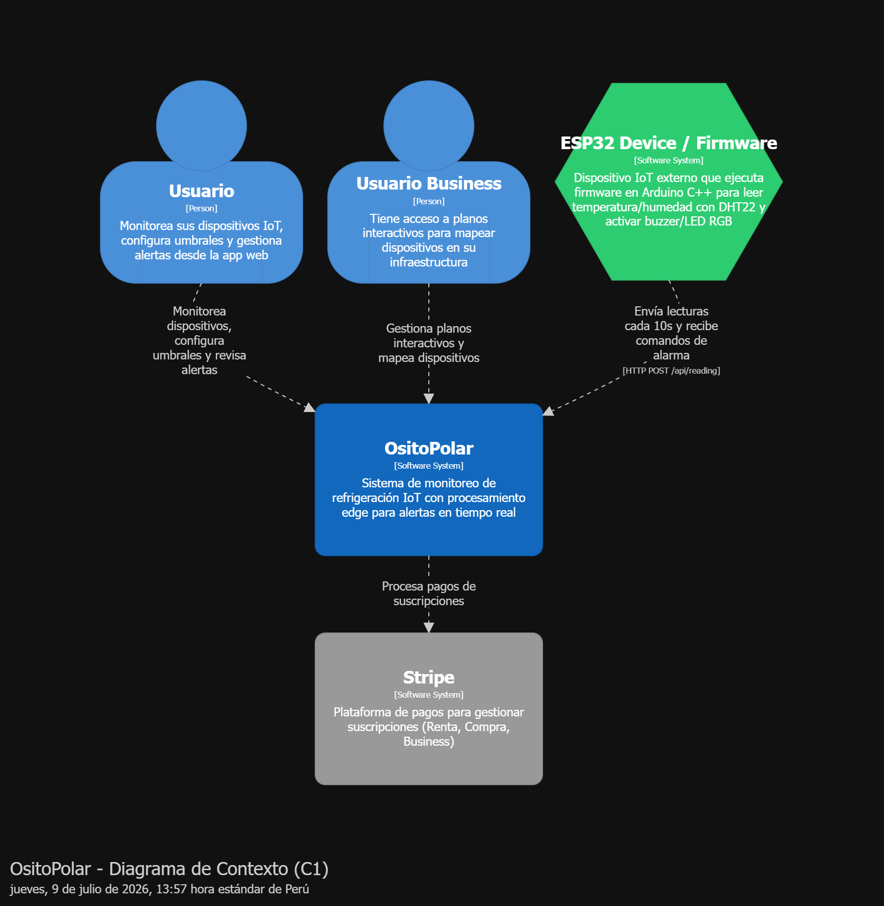
*Leyenda:*
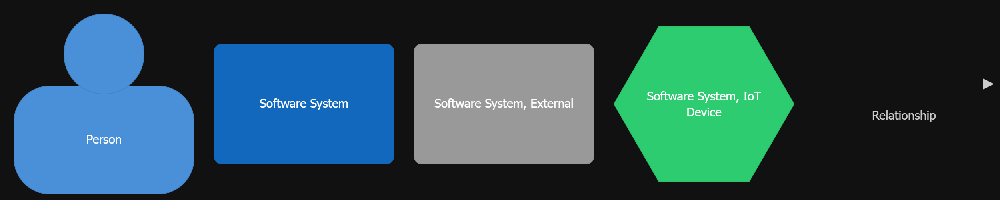

##### 4.1.3.3. Software Architecture Container Level Diagrams.

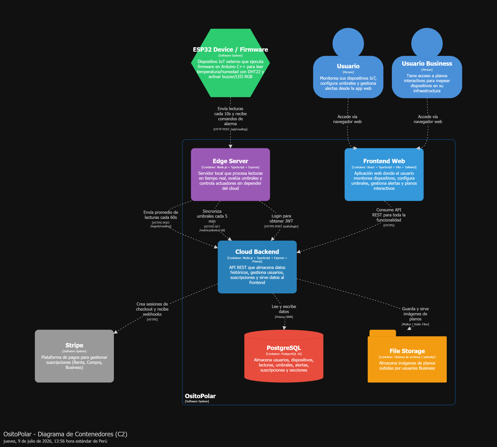
*Leyenda:*
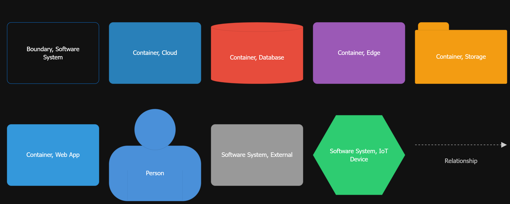

##### 4.1.3.4. Software Architecture Deployment Diagrams.

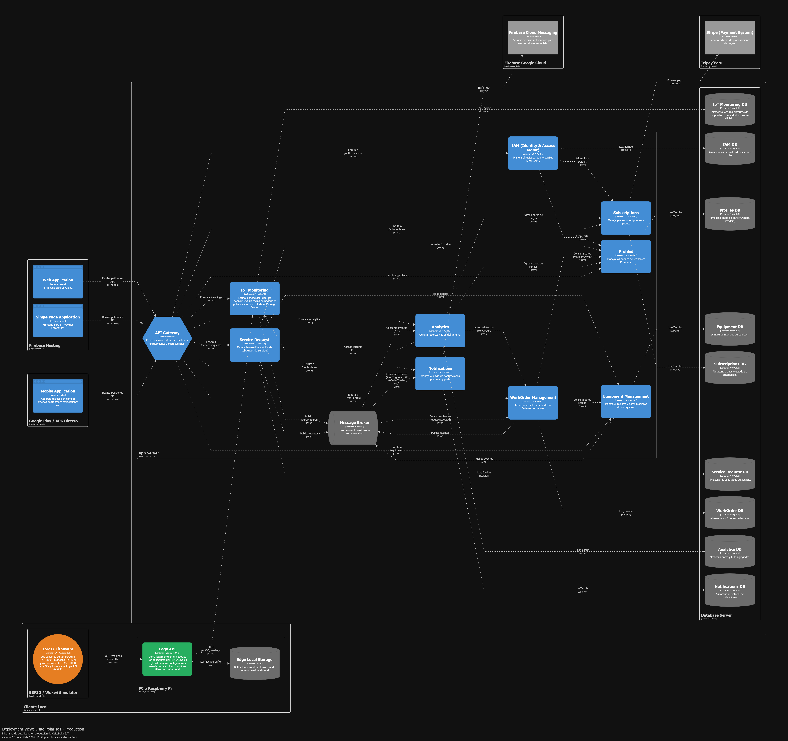
*Leyenda:*
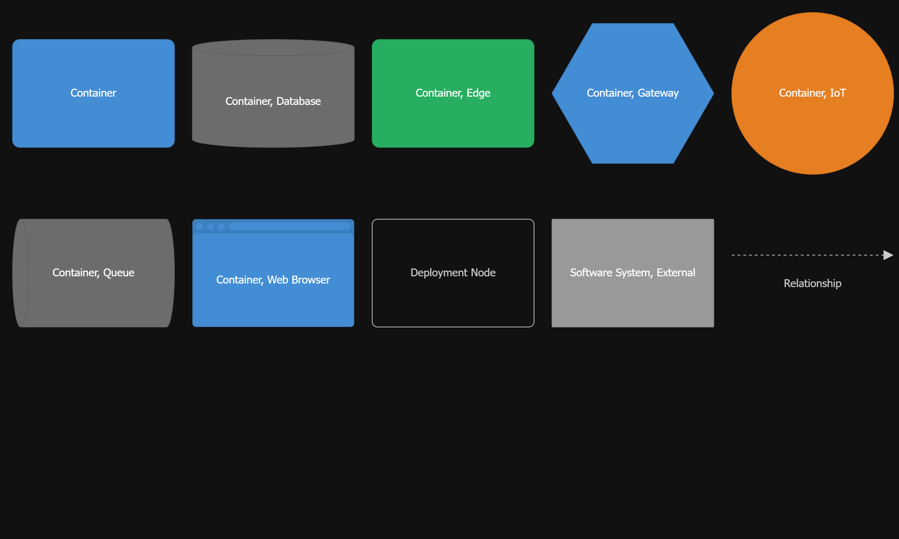

### 4.2. Tactical-Level Domain-Driven Design

#### 4.2.1. Bounded Context: IAM (Identity and Access Management)

##### 4.2.1.1. Domain Layer

El Domain Layer del bounded context **IAM** encapsula toda la lógica de autenticación y autorización de usuarios en la plataforma. Su responsabilidad principal es gestionar el ciclo de vida de los usuarios, incluyendo el registro (`SignUp`) y el inicio de sesión (`SignIn`), asegurando que las credenciales sean manejadas de forma segura mediante hashing de contraseñas.

**Aggregate Root:**

- `User` — Entidad raíz que representa a un usuario del sistema. Contiene `Id`, `Username`, `PasswordHash` y `SubscriptionId`(referencia al plan de suscripción). Expone métodos como `UpdateUsername`, `UpdatePasswordHash` y `UpdateSubscription`.

**Commands:**

- `SignUpCommand(Username, Password, Role)` — Registra un nuevo usuario.
- `SignInCommand(Username, Password)` — Autentica un usuario existente.

**Queries:**

- `GetAllUsersQuery` — Retorna todos los usuarios registrados.
- `GetUserByIdQuery(int Id)` — Retorna un usuario por su identificador.
- `GetUserByUsernameQuery(string Username)` — Retorna un usuario por su nombre de usuario.

**Repositories:**

- `IUserRepository` — Contrato de persistencia con operaciones de búsqueda por username.

**Domain Services:**

- `IUserCommandService` — Interfaz para manejar comandos de usuario (SignUp, SignIn).
- `IUserQueryService` — Interfaz para manejar consultas de usuario.

**Outbound Services (Application):**

- `IHashingService` — Abstracción para hashing de contraseñas (implementado con BCrypt).
- `ITokenService` — Abstracción para generación y validación de JWT tokens.

---

##### 4.2.1.2. Interface Layer

La capa de interfaz expone los endpoints REST de autenticación y gestión de usuarios, además de publicar una fachada ACL para que otros bounded contexts puedan consultar información de usuarios sin acoplarse directamente.

**Controllers REST:**

- `AuthenticationController` (`/api/v1/authentication`)
    - `POST /sign-up` — Registra un nuevo usuario.
    - `POST /sign-in` — Inicia sesión y retorna un JWT token.
- `UsersController` (`/api/v1/users`)
    - `GET /` — Lista todos los usuarios.
    - `GET /{id}` — Retorna un usuario por ID.

**Resources:**

- `SignUpResource(Username, Password, Role)`
- `SignInResource(Username, Password)`
- `AuthenticatedUserResource(Id, Username, Token)`
- `UserResource(Id, Username)`

**Assemblers (Transform):**

- `SignUpCommandFromResourceAssembler`
- `SignInCommandFromResourceAssembler`
- `AuthenticatedUserResourceFromEntityAssembler`
- `UserResourceFromEntityAssembler`

**ACL (Anti-Corruption Layer):**

- `IIamContextFacade` — Interfaz publicada para otros contextos.
- `IamContextFacade` — Implementación que permite crear usuarios y consultar IDs por username desde otros bounded contexts.

---

##### 4.2.1.3. Application Layer

La capa de aplicación orquesta los casos de uso del bounded context IAM, coordinando el repositorio de usuarios con los servicios de hashing y token para ejecutar los flujos de autenticación.

**Command Services:**

- `UserCommandService` — Implementa `IUserCommandService`.
    - `Handle(SignUpCommand)`: Verifica que el username no exista, hashea la contraseña con `IHashingService` y persiste el nuevo usuario.
    - `Handle(SignInCommand)`: Verifica credenciales con BCrypt, genera y retorna un JWT mediante `ITokenService`.

**Query Services:**

- `UserQueryService` — Implementa `IUserQueryService`.
    - `Handle(GetAllUsersQuery)`: Retorna todos los usuarios.
    - `Handle(GetUserByIdQuery)`: Retorna usuario por ID.
    - `Handle(GetUserByUsernameQuery)`: Retorna usuario por username.

**Outbound Services:**

- `IHashingService` / `ITokenService` — Interfaces de servicios externos definidas en Application para ser implementadas en Infrastructure.

---

##### 4.2.1.4. Infrastructure Layer

La capa de infraestructura provee las implementaciones concretas de los contratos definidos en el dominio y la aplicación: persistencia con Entity Framework Core, hashing con BCrypt, tokens JWT y middleware de autorización.

**Persistence (EFC):**

- `UserRepository` — Implementa `IUserRepository` usando `AppDbContext`. Permite búsqueda por username.
- `ModelBuilderExtensions.ApplyIamConfiguration()` — Configura la tabla `users` con columnas `id`, `username`, `password_hash`, `subscription_id`, `created_at`, `updated_at`.

**Hashing:**

- `HashingService` — Implementa `IHashingService` usando la librería BCrypt.Net para hashear y verificar contraseñas.

**Tokens JWT:**

- `TokenService` — Implementa `ITokenService`. Genera tokens JWT firmados con clave secreta, incluyendo claims de `id` y `username`.
- `TokenSettings` — Configuración del secreto JWT leído desde `appsettings.json`.

**Middleware Pipeline:**

- `RequestAuthorizationMiddleware` — Middleware que valida el JWT en cada request y adjunta el usuario autenticado al contexto HTTP.
- `AuthorizeAttribute` / `AllowAnonymousAttribute` — Atributos para marcar endpoints que requieren o no autenticación.
- `RequestAuthorizationMiddlewareExtensions` — Método de extensión para registrar el middleware en el pipeline de ASP.NET Core.

---

##### 4.2.1.5. Bounded Context Software Architecture Component Level Diagrams

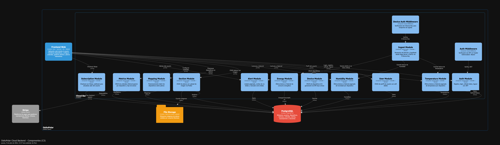

**Leyenda:**

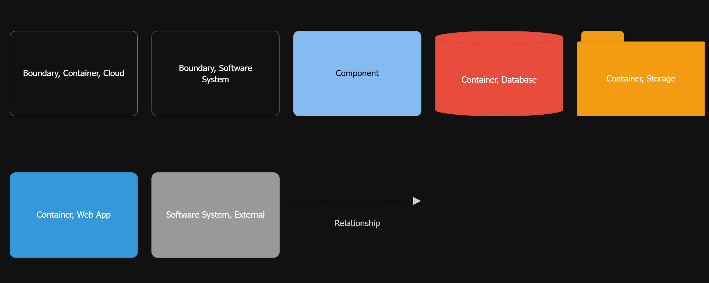

---

##### 4.2.1.6. Bounded Context Software Architecture Code Level Diagrams

###### 4.2.1.6.1. Bounded Context Domain Layer Class Diagrams

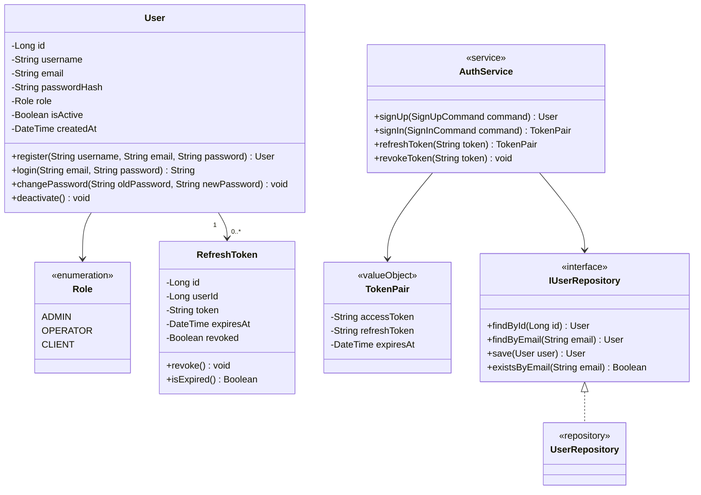
```mermaid
classDiagram
    class User {
        -Long id
        -String username
        -String email
        -String passwordHash
        -Role role
        -Boolean isActive
        -DateTime createdAt
        +register(String username, String email, String password) User
        +login(String email, String password) String
        +changePassword(String oldPassword, String newPassword) void
        +deactivate() void
    }

    class Role {
        <<enumeration>>
        ADMIN
        OPERATOR
        CLIENT
    }

    class RefreshToken {
        -Long id
        -Long userId
        -String token
        -DateTime expiresAt
        -Boolean revoked
        +revoke() void
        +isExpired() Boolean
    }

    class AuthService {
        <<service>>
        +signUp(SignUpCommand command) User
        +signIn(SignInCommand command) TokenPair
        +refreshToken(String token) TokenPair
        +revokeToken(String token) void
    }

    class TokenPair {
        <<valueObject>>
        -String accessToken
        -String refreshToken
        -DateTime expiresAt
    }

    class IUserRepository {
        <<interface>>
        +findById(Long id) User
        +findByEmail(String email) User
        +save(User user) User
        +existsByEmail(String email) Boolean
    }

    class UserRepository {
        <<repository>>
    }

    User --> Role
    User "1" --> "0..*" RefreshToken
    AuthService --> IUserRepository
    AuthService --> TokenPair
    IUserRepository <|.. UserRepository
```

###### 4.2.1.6.2. Bounded Context Database Design Diagram


---

#### 4.2.2. Bounded Context: Profiles

##### 4.2.2.1. Domain Layer

El Domain Layer del bounded context **Profiles** gestiona la información personal de los usuarios registrados en la plataforma, como administradores, operadores y responsables de monitoreo. Se encarga de representar los datos de perfil de manera estructurada mediante Value Objects, garantizando la validación de cada dato de dominio.

**Aggregate Root:**

- `Profile` — Entidad raíz que representa el perfil de un usuario. Contiene `Id`, `Name` (PersonName), `Email` (EmailAddress) y `Address` (StreetAddress). Expone propiedades computadas como `FullName`, `EmailAddress` y `StreetAddress`.

**Value Objects:**

- `PersonName(FirstName, LastName)` — Encapsula el nombre completo. Expone `FullName`.
- `EmailAddress(Address)` — Encapsula y valida el correo electrónico.
- `StreetAddress(Street, Number, City, PostalCode, Country)` — Encapsula la dirección física. Expone `FullAddress`.

**Commands:**

- `CreateProfileCommand(FirstName, LastName, Email, Street, Number, City, PostalCode, Country)` — Crea un nuevo perfil de usuario.

**Queries:**

- `GetAllProfilesQuery` — Retorna todos los perfiles.
- `GetProfileByIdQuery(int Id)` — Retorna un perfil por su ID.
- `GetProfileByEmailQuery(string Email)` — Retorna un perfil por su email.

**Repositories:**

- `IProfileRepository` — Contrato de persistencia con búsqueda por email.

**Domain Services:**

- `IProfileCommandService` — Interfaz para ejecutar comandos de perfil.
- `IProfileQueryService` — Interfaz para ejecutar consultas de perfil.

---

##### 4.2.2.2. Interface Layer

La capa de interfaz expone los endpoints REST para crear y consultar perfiles. Además, publica una fachada ACL que permite que el bounded context IAM cree perfiles automáticamente al registrar un usuario.

**Controllers REST:**

- `ProfilesController` (`/api/v1/profiles`)
    - `POST /` — Crea un nuevo perfil.
    - `GET /` — Lista todos los perfiles.
    - `GET /{profileId}` — Retorna un perfil por ID.

**Resources:**

- `CreateProfileResource(FirstName, LastName, Email, Street, Number, City, PostalCode, Country)`
- `ProfileResource(Id, FullName, Email, StreetAddress)`

**Assemblers (Transform):**

- `CreateProfileCommandFromResourceAssembler`
- `ProfileResourceFromEntityAssembler`

**ACL (Anti-Corruption Layer):**

- `IProfilesContextFacade` — Interfaz publicada para otros contextos.
- `ProfilesContextFacade` — Implementación que permite crear perfiles y obtener IDs por email desde otros bounded contexts (principalmente IAM).

---

##### 4.2.2.3. Application Layer

La capa de aplicación orquesta los casos de uso del bounded context Profiles, coordinando la creación y consulta de perfiles mediante el repositorio y la unidad de trabajo.

**Command Services:**

- `ProfileCommandService` — Implementa `IProfileCommandService`.
    - `Handle(CreateProfileCommand)`: Verifica que no exista un perfil con el mismo email, crea el perfil y lo persiste.

**Query Services:**

- `ProfileQueryService` — Implementa `IProfileQueryService`.
    - `Handle(GetAllProfilesQuery)`: Retorna todos los perfiles.
    - `Handle(GetProfileByIdQuery)`: Retorna perfil por ID.
    - `Handle(GetProfileByEmailQuery)`: Retorna perfil por email.

**ACL (Application):**

- `ProfilesContextFacade` — Implementación de la fachada que expone operaciones simplificadas para otros BCs.

---

##### 4.2.2.4. Infrastructure Layer

La capa de infraestructura provee la implementación concreta de persistencia mediante Entity Framework Core.

**Persistence (EFC):**

- `ProfileRepository` — Implementa `IProfileRepository` usando `AppDbContext`. Permite búsqueda por email.
- `ModelBuilderExtensions.ApplyProfilesConfiguration()` — Configura la tabla `profiles` con value objects mapeados como owned entities: `PersonName` → columnas `first_name`, `last_name`; `EmailAddress` → columna `email_address`; `StreetAddress` → columnas `street`, `number`, `city`, `postal_code`, `country`.

---

##### 4.2.2.5. Bounded Context Software Architecture Component Level Diagrams


**Leyenda:**


---

##### 4.2.2.6. Bounded Context Software Architecture Code Level Diagrams

###### 4.2.2.6.1. Bounded Context Domain Layer Class Diagrams

  ```mermaid
  classDiagram
      class OwnerProfile {
          -Long id
          -Long userId
          -String businessName
          -String ruc
          -String phone
          -String address
          -Sector sector
          +updateInfo(businessName, phone, address) void
          +changeSector(sector Sector) void
      }

      class ProviderProfile {
          -Long id
          -Long userId
          -String companyName
          -String ruc
          -String phone
          -String specialization
          -Decimal rating
          +updateInfo(companyName, phone) void
          +updateRating(newRating Decimal) void
      }

      class Sector {
          <<enumeration>>
          FOOD
          PHARMA
          HOSPITALITY
          OTHER
      }

      class IOwnerProfileRepository {
          <<interface>>
          +findById(id Long) OwnerProfile
          +findByUserId(userId Long) OwnerProfile
          +save(profile OwnerProfile) OwnerProfile
      }

      class IProviderProfileRepository {
          <<interface>>
          +findById(id Long) ProviderProfile
          +findByUserId(userId Long) ProviderProfile
          +save(profile ProviderProfile) ProviderProfile
      }

      class ProfileService {
          <<service>>
          +createOwnerProfile(command CreateOwnerCommand) OwnerProfile
          +createProviderProfile(command CreateProviderCommand) ProviderProfile
          +getOwnerProfile(userId Long) OwnerProfile
          +getProviderProfile(userId Long) ProviderProfile
      }

      class OwnerProfileRepository{
          <<repository>>
      }

      class ProviderProfileRepository {
          <<repository>>
      }

      OwnerProfile --> Sector
      ProfileService --> IOwnerProfileRepository
      ProfileService --> IProviderProfileRepository
      IOwnerProfileRepository <|.. OwnerProfileRepository
      IProviderProfileRepository <|.. ProviderProfileRepository
  ```

###### 4.2.2.6.2. Bounded Context Database Design Diagram


---


#### 4.2.3. Bounded Context: Analytics

##### 4.2.3.1. Domain Layer

El Domain Layer del bounded context **Analytics** gestiona la recopilación y análisis de datos operativos de los equipos de refrigeración: lecturas de temperatura, consumo energético y promedios diarios de temperatura.

**Aggregate Root:**

- `EquipmentAnalytics` — Entidad raíz asociada a un equipo (`EquipmentId`). Agrupa colecciones de `TemperatureReadings` y `EnergyReadings`. Expone métodos como `RecordTemperature`, `RecordEnergyConsumption`, `GetTemperatureStatus` y `GetEnergyStatus`.

**Entities:**

- `TemperatureReading(Id, EquipmentId, Temperature, Timestamp, Status)` — Lectura de temperatura puntual.
- `EnergyReading(Id, EquipmentId, Consumption, Unit, Timestamp, Status)` — Lectura de consumo energético.
- `DailyTemperatureAverage(Id, EquipmentId, Date, AverageTemperature, MinTemperature, MaxTemperature)` — Promedio diario de temperatura calculado.

**Value Objects:**

- `TemperatureRange(Min, Max)` — Rango válido de temperatura con métodos `IsWithinRange` y `IsValid`.
- `AnalyticsTimeframe(Hours)` — Ventana temporal para consultas analíticas. Máximo 8760h (1 año).
- `EReadingStatus` — Enum: `Normal`, `Warning`, `Critical`.

**Commands:**

- `RecordTemperatureReadingCommand(EquipmentId, Temperature, Timestamp?)`
- `RecordEnergyReadingCommand(EquipmentId, Consumption, Unit)`

**Queries:**

- `GetEquipmentAnalyticsQuery(int EquipmentId)`
- `GetTemperatureReadingsQuery(int EquipmentId, int Hours = 24)`
- `GetEnergyReadingsQuery(int EquipmentId, int Hours = 24)`
- `GetDailyTemperatureAveragesQuery(int EquipmentId, int Days = 7)`

**Repositories:**

- `IAnalyticsRepository` — Contrato con operaciones para temperatura, energía y promedios diarios.

---

##### 4.2.3.2. Interface Layer

**Controllers REST:**

- `AnalyticsController` (`/api/v1/analytics/equipments`)
    - `GET /{equipmentId}/readings?type=all|temperature|energy&hours=24` — Lecturas unificadas.
    - `GET /{equipmentId}/summaries?type=daily-averages&days=7` — Resúmenes analíticos.
    - `GET /overview?ids=1,2,3` — Vista general de múltiples equipos.

**Resources:**

- `UnifiedReadingResource(Id, EquipmentId, Type, Value, Unit, Timestamp, Status)`
- `AnalyticsSummaryResource(Id, EquipmentId, Date, Type, AverageTemperature, Min, Max)`
- `CreateTemperatureReadingResource`, `CreateEnergyReadingResource`

**Assemblers:**

- `CreateTemperatureReadingCommandFromResourceAssembler`
- `CreateEnergyReadingCommandFromResourceAssembler`
- `TemperatureReadingResourceFromEntityAssembler`
- `EnergyReadingResourceFromEntityAssembler`
- `DailyTemperatureAverageResourceFromEntityAssembler`

---

##### 4.2.3.3. Application Layer

**Command Services:**

- `AnalyticsCommandService` — Implementa `IAnalyticsCommandService`.
    - `Handle(RecordTemperatureReadingCommand)`: Valida rango -50°C a 100°C, persiste la lectura.
    - `Handle(RecordEnergyReadingCommand)`: Valida que el consumo no sea negativo, persiste la lectura.

**Query Services:**

- `AnalyticsQueryService` — Implementa `IAnalyticsQueryService`.
    - `Handle(GetTemperatureReadingsQuery)`: Lecturas de temperatura por equipo en ventana de horas.
    - `Handle(GetDailyTemperatureAveragesQuery)`: Promedios diarios por equipo.
    - `Handle(GetEnergyReadingsQuery)`: Lecturas de energía por equipo.

---

##### 4.2.3.4. Infrastructure Layer

**Persistence (EFC):**

- `AnalyticsRepository` — Implementa `IAnalyticsRepository`.
- `ModelBuilderExtensions.ApplyAnalyticsConfiguration()` — Configura las tablas:
    - `temperature_readings` — con índice compuesto `(equipment_id, timestamp)`. FK a `equipments`.
    - `energy_readings` — con índice compuesto `(equipment_id, timestamp)`. FK a `equipments`.
    - `daily_temperature_averages` — con índice único `(equipment_id, date)`. FK a `equipments`.
    - `equipment_analytics` — con índice único por `equipment_id`. FK a `equipments`.

---

##### 4.2.3.5. Bounded Context Software Architecture Component Level Diagrams


**Leyenda:**


---

##### 4.2.3.6. Bounded Context Software Architecture Code Level Diagrams

###### 4.2.3.6.1. Bounded Context Domain Layer Class Diagrams

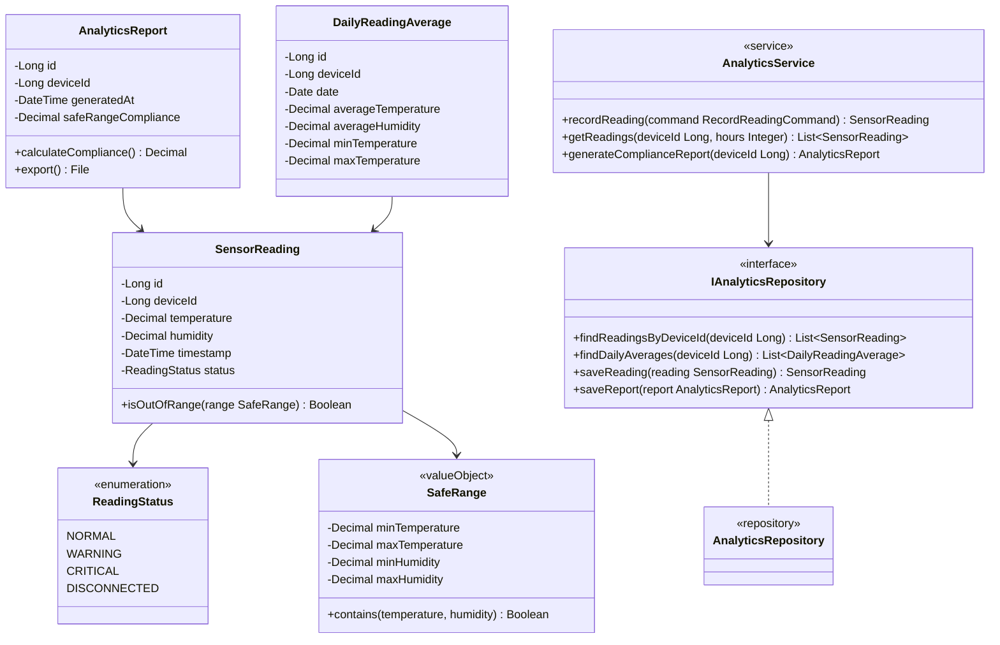
```mermaid
classDiagram
    class AnalyticsReport {
        -Long id
        -Long deviceId
        -DateTime generatedAt
        -Decimal safeRangeCompliance
        +calculateCompliance() Decimal
        +export() File
    }

    class SensorReading {
        -Long id
        -Long deviceId
        -Decimal temperature
        -Decimal humidity
        -DateTime timestamp
        -ReadingStatus status
        +isOutOfRange(range SafeRange) Boolean
    }

    class DailyReadingAverage {
        -Long id
        -Long deviceId
        -Date date
        -Decimal averageTemperature
        -Decimal averageHumidity
        -Decimal minTemperature
        -Decimal maxTemperature
    }

    class SafeRange {
        <<valueObject>>
        -Decimal minTemperature
        -Decimal maxTemperature
        -Decimal minHumidity
        -Decimal maxHumidity
        +contains(temperature, humidity) Boolean
    }

    class ReadingStatus {
        <<enumeration>>
        NORMAL
        WARNING
        CRITICAL
        DISCONNECTED
    }

    class IAnalyticsRepository {
        <<interface>>
        +findReadingsByDeviceId(deviceId Long) List~SensorReading~
        +findDailyAverages(deviceId Long) List~DailyReadingAverage~
        +saveReading(reading SensorReading) SensorReading
        +saveReport(report AnalyticsReport) AnalyticsReport
    }

    class AnalyticsRepository {
        <<repository>>
    }

    class AnalyticsService {
        <<service>>
        +recordReading(command RecordReadingCommand) SensorReading
        +getReadings(deviceId Long, hours Integer) List~SensorReading~
        +generateComplianceReport(deviceId Long) AnalyticsReport
    }

    SensorReading --> ReadingStatus
    SensorReading --> SafeRange
    AnalyticsReport --> SensorReading
    DailyReadingAverage --> SensorReading
    AnalyticsService --> IAnalyticsRepository
    IAnalyticsRepository <|.. AnalyticsRepository
```

###### 4.2.3.6.2. Bounded Context Database Design Diagram


---

#### 4.2.4. Bounded Context: Subscriptions and Payments

##### 4.2.4.1. Domain Layer

El Domain Layer del bounded context **Subscriptions and Payments** gestiona los planes de suscripción y el procesamiento de pagos de los usuarios de la plataforma, integrándose con Stripe como pasarela de pago externa.

**Aggregates:**

- `Subscription` — Entidad raíz con `Id`, `UserId`, `PlanName`, `BillingCycle`, `Features`, `StartDate`, `EndDate`, `Status`. Permite gestionar el ciclo de vida de la suscripción.
- `Payment` — Entidad raíz con `Id`, `UserId`, `SubscriptionId`, `StripeSession`, `Amount`, `Status`. Representa una transacción de pago.

**Value Objects:**

- `BillingCycle` — Representa el ciclo de facturación (mensual, anual).
- `Feature` — Representa una característica incluida en un plan.
- `Price(Amount, Currency)` — Precio del plan.
- `PaymentStatus` — Estado del pago (Pending, Completed, Failed, Refunded).
- `StripeSession(SessionId, SessionUrl)` — Datos de la sesión de pago en Stripe.

**Commands:**

- `CreateSubscriptionCommand`
- `DeleteSubscriptionCommand`
- `UpgradePlanCommand`
- `CreatePaymentSessionCommand`
- `ProcessPaymentWebhookCommand`

**Queries:**

- `GetSubscriptionByIdQuery(int Id)`
- `GetPlansQuery`

**Domain Services:**

- `ISubscriptionCommandService`, `ISubscriptionQueryService`
- `IPaymentCommandService`
- `IStripeService` — Abstracción de la integración con Stripe.

---

##### 4.2.4.2. Interface Layer

**Controllers REST:**

- `SubscriptionsController` (`/api/v1/subscriptions`)
    - `POST /` — Crea una nueva suscripción con sesión de pago Stripe.
    - `GET /{id}` — Retorna suscripción por ID.
    - `PUT /{id}/upgrade` — Actualiza el plan.
    - `DELETE /{id}` — Cancela la suscripción.

**Resources:**

- `CreateSubscriptionResource(UserId, PlanName, BillingCycle)`
- `SubscriptionResource(Id, UserId, PlanName, Status, StartDate, EndDate)`

**Assemblers:**

- `CreateSubscriptionCommandFromResourceAssembler`
- `SubscriptionResourceFromEntityAssembler`
- `UpgradeSubscriptionCommandFromResourceAssembler`

---

##### 4.2.4.3. Application Layer

**Command Services:**

- `SubscriptionsCommandServices` — Implementa `ISubscriptionCommandService`.
    - `Handle(CreateSubscriptionCommand)`: Crea la suscripción y genera la sesión de pago en Stripe.
    - `Handle(UpgradePlanCommand)`: Actualiza el plan del usuario.
    - `Handle(DeleteSubscriptionCommand)`: Cancela la suscripción.
- `PaymentCommandService` — Implementa `IPaymentCommandService`.
    - `Handle(CreatePaymentSessionCommand)`: Crea sesión de Stripe Checkout.
    - `Handle(ProcessPaymentWebhookCommand)`: Procesa webhooks de Stripe para confirmar pagos.

**Query Services:**

- `SubscriptionQueryService` — Retorna suscripciones por ID y lista planes disponibles.

---

##### 4.2.4.4. Infrastructure Layer

**Persistence (EFC):**

- `SubscriptionRepository` — Implementa `ISubscriptionRepository`.
- `PaymentRepository` — Implementa `IPaymentRepository`.
- `ModelBuilderExtensions.ApplySubscriptionsConfiguration()` — Configura tablas `subscriptions` y `payments`, con value objects `BillingCycle`, `Price`, `StripeSession` mapeados como columnas.

**External Integration:**

- `StripeSettings` — Configuración del API key de Stripe leída desde `appsettings.json`.
- Implementación de `IStripeService` usando el SDK oficial de Stripe para crear sesiones de Checkout y procesar webhooks.

---

##### 4.2.4.5. Bounded Context Software Architecture Component Level Diagrams


**Leyenda:**


---

##### 4.2.4.6. Bounded Context Software Architecture Code Level Diagrams

###### 4.2.4.6.1. Bounded Context Domain Layer Class Diagrams

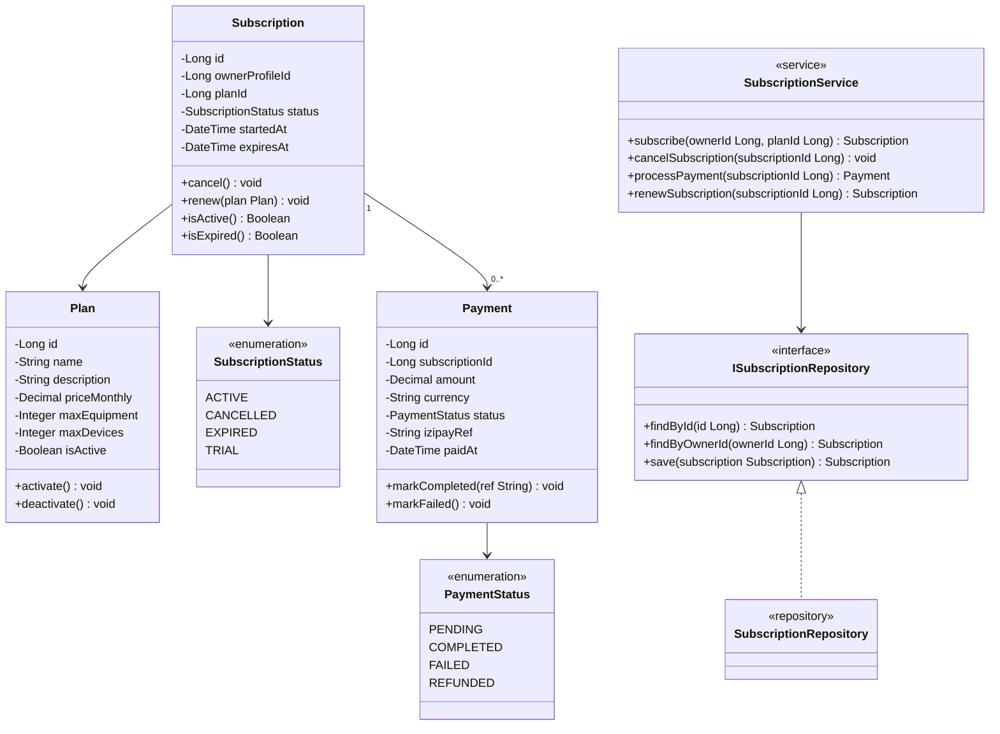
```mermaid
classDiagram
    class Plan {
        -Long id
        -String name
        -String description
        -Decimal priceMonthly
        -Integer maxEquipment
        -Integer maxDevices
        -Boolean isActive
        +activate() void
        +deactivate() void
    }

    class Subscription {
        -Long id
        -Long ownerProfileId
        -Long planId
        -SubscriptionStatus status
        -DateTime startedAt
        -DateTime expiresAt
        +cancel() void
        +renew(plan Plan) void
        +isActive() Boolean
        +isExpired() Boolean
    }

    class SubscriptionStatus {
        <<enumeration>>
        ACTIVE
        CANCELLED
        EXPIRED
        TRIAL
    }

    class Payment {
        -Long id
        -Long subscriptionId
        -Decimal amount
        -String currency
        -PaymentStatus status
        -String izipayRef
        -DateTime paidAt
        +markCompleted(ref String) void
        +markFailed() void
    }

    class PaymentStatus {
        <<enumeration>>
        PENDING
        COMPLETED
        FAILED
        REFUNDED
    }

    class ISubscriptionRepository {
        <<interface>>
        +findById(id Long) Subscription
        +findByOwnerId(ownerId Long) Subscription
        +save(subscription Subscription) Subscription
    }

    class SubscriptionRepository {
        <<repository>>
    }

    class SubscriptionService {
        <<service>>
        +subscribe(ownerId Long, planId Long) Subscription
        +cancelSubscription(subscriptionId Long) void
        +processPayment(subscriptionId Long) Payment
        +renewSubscription(subscriptionId Long) Subscription
    }

    Subscription --> Plan
    Subscription --> SubscriptionStatus
    Subscription "1" --> "0..*" Payment
    Payment --> PaymentStatus
    SubscriptionService --> ISubscriptionRepository
    ISubscriptionRepository <|.. SubscriptionRepository
```

###### 4.2.4.6.2. Bounded Context Database Design Diagram


---

#### 4.2.5. Bounded Context: Notifications

##### 4.2.5.1. Domain Layer

El Domain Layer del bounded context **Notifications** gestiona las notificaciones críticas de OsitoPolar. Su responsabilidad principal es informar a los usuarios cuando una lectura de temperatura o humedad sale del rango seguro, cuando un dispositivo IoT se desconecta o cuando ocurre un evento relevante para la continuidad de la cadena de frío.

**Aggregate Root:**

- `Notification` — Entidad raíz con `Id`, `UserId`, `Channel`, `Type`, `Title`, `Body`, `ReferenceId`, `ReferenceType`, `IsRead` y `SentAt`. Representa una alerta o mensaje enviado al usuario.
- `NotificationPreference` — Entidad que define los canales y tipos de alerta habilitados por usuario.

**Domain Events:**

- `TemperatureOutOfRangeDetected` — Evento recibido cuando una lectura excede el rango seguro.
- `HumidityOutOfRangeDetected` — Evento recibido cuando una lectura de humedad excede el rango seguro.
- `DeviceDisconnectedDetected` — Evento recibido cuando un dispositivo deja de reportar telemetría.

**Commands:**

- `SendNotificationCommand(UserId, Type, Channel, Title, Body, ReferenceId)`
- `UpdateNotificationPreferencesCommand(UserId, EmailEnabled, PushEnabled, AlertTemperature, AlertHumidity, AlertDisconnection)`
- `MarkNotificationAsReadCommand(NotificationId)`

**Queries:**

- `GetNotificationsByUserIdQuery(int UserId)` — Retorna las notificaciones de un usuario.
- `GetUnreadNotificationsQuery(int UserId)` — Retorna notificaciones pendientes de lectura.
- `GetNotificationPreferencesQuery(int UserId)` — Retorna las preferencias configuradas.

**Repositories:**

- `INotificationRepository` — Contrato de persistencia para notificaciones.
- `INotificationPreferenceRepository` — Contrato de persistencia para preferencias de notificación.

**Domain Services:**

- `INotificationCommandService`
- `INotificationQueryService`

---

##### 4.2.5.2. Interface Layer

**Controllers REST:**

- `NotificationsController` (`/api/v1/notifications`)
    - `GET /users/{userId}` — Lista las notificaciones del usuario.
    - `GET /users/{userId}/unread` — Lista notificaciones no leídas.
    - `PUT /{notificationId}/read` — Marca una notificación como leída.
- `NotificationPreferencesController` (`/api/v1/notification-preferences`)
    - `GET /users/{userId}` — Consulta preferencias de notificación.
    - `PUT /users/{userId}` — Actualiza preferencias.

**Resources:**

- `NotificationResource(Id, UserId, Channel, Type, Title, Body, IsRead, SentAt)`
- `UpdateNotificationPreferencesResource(EmailEnabled, PushEnabled, AlertTemperature, AlertHumidity, AlertDisconnection)`

**Assemblers:**

- `NotificationResourceFromEntityAssembler`
- `UpdateNotificationPreferencesCommandFromResourceAssembler`

---

##### 4.2.5.3. Application Layer

**Command Services:**

- `NotificationCommandService` — Implementa `INotificationCommandService`.
    - `Handle(SendNotificationCommand)`: Registra la notificación y la envía por el canal configurado.
    - `Handle(UpdateNotificationPreferencesCommand)`: Actualiza las preferencias del usuario.
    - `Handle(MarkNotificationAsReadCommand)`: Marca una notificación como leída.

**Query Services:**

- `NotificationQueryService` — Implementa `INotificationQueryService`.
    - `Handle(GetNotificationsByUserIdQuery)`: Retorna las notificaciones del usuario.
    - `Handle(GetUnreadNotificationsQuery)`: Retorna notificaciones no leídas.
    - `Handle(GetNotificationPreferencesQuery)`: Retorna preferencias del usuario.

---

##### 4.2.5.4. Infrastructure Layer

**Persistence (EFC):**

- `NotificationRepository` — Implementa `INotificationRepository` usando EF Core.
- `NotificationPreferenceRepository` — Implementa `INotificationPreferenceRepository` usando EF Core.
- `ModelBuilderExtensions.ApplyNotificationsConfiguration()` — Configura las tablas `notifications` y `notification_preferences`.

---

##### 4.2.5.5. Bounded Context Software Architecture Component Level Diagrams


**Leyenda:**


---

##### 4.2.5.6. Bounded Context Software Architecture Code Level Diagrams

###### 4.2.5.6.1. Bounded Context Domain Layer Class Diagrams

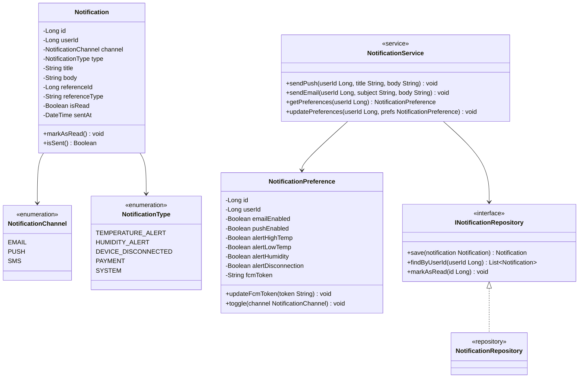
```mermaid
classDiagram
    class Notification {
        -Long id
        -Long userId
        -NotificationChannel channel
        -NotificationType type
        -String title
        -String body
        -Long referenceId
        -String referenceType
        -Boolean isRead
        -DateTime sentAt
        +markAsRead() void
        +isSent() Boolean
    }

    class NotificationChannel {
        <<enumeration>>
        EMAIL
        PUSH
        SMS
    }

    class NotificationType {
        <<enumeration>>
        TEMPERATURE_ALERT
        HUMIDITY_ALERT
        DEVICE_DISCONNECTED
        PAYMENT
        SYSTEM
    }

    class NotificationPreference {
        -Long id
        -Long userId
        -Boolean emailEnabled
        -Boolean pushEnabled
        -Boolean alertHighTemp
        -Boolean alertLowTemp
        -Boolean alertHumidity
        -Boolean alertDisconnection
        -String fcmToken
        +updateFcmToken(token String) void
        +toggle(channel NotificationChannel) void
    }

    class INotificationRepository {
        <<interface>>
        +save(notification Notification) Notification
        +findByUserId(userId Long) List~Notification~
        +markAsRead(id Long) void
    }

    class NotificationRepository {
        <<repository>>
    }

    class NotificationService {
        <<service>>
        +sendPush(userId Long, title String, body String) void
        +sendEmail(userId Long, subject String, body String) void
        +getPreferences(userId Long) NotificationPreference
        +updatePreferences(userId Long, prefs NotificationPreference) void
    }

    Notification --> NotificationChannel
    Notification --> NotificationType
    NotificationService --> INotificationRepository
    NotificationService --> NotificationPreference
    INotificationRepository <|.. NotificationRepository
```

###### 4.2.5.6.2. Bounded Context Database Design Diagram


## Capítulo V: Solution UI/UX Design

### 5.1. Style Guidelines
#### 5.1.1. General Style Guidelines

Se busca que el tono sea equilibrado, entre lo profesional y lo accesible, con un lenguaje claro, empático y respetuoso para atraer usuarios potenciales y mantener a nuestros usuarios.
Se eligió una paleta de colores fría pero amigable, y una tipografía moderna que combine profesionalismo y accesibilidad.

**Branding**

La identidad visual de OsitoPolar busca transmitir seguridad, innovación y cercanía.

**Logo:** Representa un oso polar con un ícono de refrigeración, combinando lo técnico con lo amigable. Disponible en versiones para fondos claros y oscuros, monocromático, horizontal y vertical.


**Typography**

Para mantener la formalidad y accesibilidad de la interfaz de usuario de OsitoPolar se establecerá las tipografías Helvetica y Open Sans por sus características funcionales, estéticas y por su alta compatibilidad en interfaces digitales, siendo Helvetica la primaria.

<figure style="page-break-inside: avoid; text-align: center;">
  
  <figcaption style="font-size: 0.9em; color: #555;">
    <strong>Figura 1:</strong> Tipografía Helvetica.
  </figcaption>
</figure>


<figure style="page-break-inside: avoid; text-align: center;">
  
  <figcaption style="font-size: 0.9em; color: #555;">
    <strong>Figura 2:</strong> Tipografía Open Sans.
  </figcaption>
</figure>


**Colors**

La paleta fue diseñada para representar ambientes fríos y tecnológicos, transmitiendo confianza y limpieza visual.

El color principal elegido es el celeste, pues es el que más se acopla a las características que describimos. Se optó por los colores negro, blanco y gris como neutros, los cuales serán utilizados para fondos o textos.
Se eligieron variantes de color verde, rojo, azul y amarillo para ciertos fondos y estados (alertas, servicio, calificaciones).


<figure style="page-break-inside: avoid; text-align: center;">
  
  <figcaption style="font-size: 0.9em; color: #555;">
    <strong>Figura 3:</strong> Guías Generales de Estilo - Colores.
  </figcaption>
</figure>


**Spacing**

Se establecerá un espaciado de 8 px y un margen mínimo de 16 px. Para el diseño modular, se implementarán grids flexibles que se adaptarán tanto a web como a dispositivos móviles, utilizando configuraciones de 12 y 4 columnas respectivamente.


#### 5.1.2. Web, Mobile and IoT Style Guidelines

En esta sección definimos los estándares visuales y de interacción para la versión web y mobile de OsitoPolar, asegurando una experiencia de usuario coherente, profesional y accesible en todos los dispositivos.
Es necesario que las interfaces web sean responsivas porque nos trae muchas ventajas tanto para el usuario como para el equipo desarrollador, entre las cuales tenemos: usabilidad en cualquier dispositivo, mejor eficiencia de costos y tiempo en el desarrollo y satisfacción del usuario.

Adoptando un enfoque mobile-first, usamos un sistema de grid de 12 columnas para que la interfaz se adapte a cualquier dispositivo.

**Tipografía**
Tomando en cuenta la guía de estilos, se usará la tipografía Helvetica en la mayoría de los textos de la aplicación, pues esta proyecta profesionalismo y claridad. Para que la visualización de los textos sea óptima, el tamaño de la fuente debe ajustarse automáticamente y adaptarse al dispositivo que se esté usando.


**Colores**
De acuerdo al rubro al que está orientado OsitoPolar, los colores deben reflejar tecnología, frescura y confianza. La elección de colores es la siguiente:

- Celeste (#0884C4): Se usará para el header y algunos botones.
- Blanco (#FFFFFF): Se usará para fondos neutros.
- Negro (#000000): Se usará en algunos botones y bordes.
- Gris claro (#808080): Se usará para líneas, bordes, separadores y botones deshabilitados.
- Blanco azul mar (#F4FCFC): Se usará para algunos fondos.
- Verde medio primavera (#00CC66): Se usará para notificaciones y estados positivos.
- Rojo claro (#FF4B4B): Se usará para alertas, errores y fallas críticas.
- Amarillo mandarina (#FFCC00): Se usará para ciertos agregados (notificaciones, calificaciones).

Sin embargo, la variación de botones y fondos que tendrá la plataforma hace que no siempre se elija la misma tonalidad, por lo que optamos por una paleta de celeste.


<figure style="page-break-inside: avoid; text-align: center;">
  
  <figcaption style="font-size: 0.9em; color: #555;">
    <strong>Figura 1:</strong> Guías de Estilo Web - Color Sky Blue.
  </figcaption>
</figure>


De la misma forma se opta por una paleta de rojo claro para diferenciar ventanas, fondos o íconos que muestren algún tipo de error en el sistema, alertas o estados.


<figure style="page-break-inside: avoid; text-align: center;">
  
  <figcaption style="font-size: 0.9em; color: #555;">
    <strong>Figura 22:</strong> Guías de Estilo Web - Color Rojo.
  </figcaption>
</figure>


### 5.2. Information Architecture

#### 5.2.1. Organization Systems

En esta sección, hemos implementado diferentes sistemas de organización basados en los grupos de información relevantes. La disposición visual del contenido se ha realizado de las siguientes maneras:

- **Jerárquica (visual hierarchy)**: Para resaltar los elementos más importantes, facilitando que los usuarios accedan de manera intuitiva a la información clave.

- **Organización secuencial (step-by-step)**: Utilizada en procesos que requieren una guía detallada, como la compra de maquinas, asegurando un flujo lógico y fácil de seguir.

- **Organización matricial**: Aplicada en áreas donde es necesario comparar o analizar datos relacionados, proporcionando al usuario una visión clara y estructurada de las opciones disponibles.

#### 5.2.2. Labeling Systems

En nuestra empresa, aplicamos estos sistemas de organización visual de la siguiente manera:

Jerarquía Visual: Destacamos información clave como el estado de los equipos y alertas críticas para facilitar su rápida identificación.

Organización Secuencial: El proceso de agendar mantenimiento o visitas técnicas se organiza paso a paso para guiar al usuario.

Organización Matricial: Usamos tablas comparativas para mostrar claramente las diferencias entre planes de suscripción y servicios, facilitando la elección del usuario.

#### 5.2.3. SEO Tags and Meta Tags

**Landing Page**
-Title: OsitoPolar - Monitorea y Gestiona tus Equipos de Congelación en Tiempo Real
-Meta Description: OsitoPolar te permite monitorear y gestionar el estado de tus equipos de congelación, optimizando su rendimiento y evitando fallas. Mantén tu inventario seguro con alertas y mantenimiento predictivo.
-Meta Keywords: monitoreo de congeladoras, gestión de equipos de frío, mantenimiento preventivo, OsitoPolar, alerta de fallas, eficiencia energética
-Meta Author: OsitoPolar

**Aplicación Web**
-Title: OsitoPolar - Plataforma de Gestión de Equipos de Congelación
-Meta Description: OsitoPolar facilita el monitoreo, mantenimiento y eficiencia de tus equipos de congelación. Gestiona en tiempo real el estado y rendimiento de tus equipos con facilidad.
-Meta Keywords: gestión de equipos de frío, monitoreo en tiempo real, mantenimiento predictivo, OsitoPolar, alerta de fallas, reporte de eficiencia
-Meta Author: OsitoPolar

#### 5.2.4. Searching Systems

Estas decisiones están orientadas a facilitar la navegación eficiente, evitando que los usuarios se sientan abrumados por grandes volúmenes de datos y asegurando que encuentren rápidamente lo que necesitan.

**Opciones de Búsqueda**  
**Barra de Búsqueda**  
La barra de búsqueda permite a los usuarios ingresar términos específicos, como el nombre de un equipo, tipo de servicio o estado del equipo, para encontrar rápidamente información relevante. Los resultados se muestran instantáneamente a medida que se escriben los términos.

**Categorías**  
Los usuarios pueden seleccionar entre diferentes categorías de servicios y equipos, como "Congeladoras", "Refrigeradores", "Mantenimiento Preventivo", "Alertas de Fallas" y "Historial de Consumo", para limitar los resultados a un grupo específico.

**Etiquetas Populares**  
Las etiquetas populares, como "Mantenimiento Programado" o "Alertas Críticas", permiten a los usuarios buscar servicios o equipos relacionados con términos comunes, facilitando la localización de opciones populares o especializadas.

**Filtros Disponibles**  
**Filtros por Tipo de Equipo**
- Congeladoras
- Refrigeradores
- Equipos de Frío Industrial

**Filtros por Estado del Equipo**
- En Funcionamiento
- En Reparación
- Necesita Mantenimiento

**Filtro por Fecha de Última Revisión**  
Los usuarios pueden ajustar el filtro para ver los equipos que han sido revisados en un periodo específico, como "Últimos 7 días", "Últimos 30 días", etc.

**Filtro por Consumo Energético**  
Los usuarios pueden ajustar el rango de consumo energético para encontrar equipos dentro de un rango de eficiencia energética deseado.

**Apariencia de los Datos Después de la Búsqueda**  
**Listados de Resultados**  
Los resultados de búsqueda se muestran en una lista ordenada con información clave, como el nombre del equipo, estado actual, próximas fechas de mantenimiento y consumo energético. Además, se incluyen opciones para ver más detalles o agendar visitas de mantenimiento.

**Resumen y Descripción**  
Cada resultado incluye un resumen que resalta la información más relevante, como el historial de mantenimiento o las alertas generadas, permitiendo a los usuarios realizar una evaluación rápida.

**Opciones de Ordenación y Filtros Aplicados**  
Los resultados pueden ordenarse por criterios como relevancia, estado del equipo o consumo energético. Los filtros aplicados se muestran claramente para que los usuarios puedan ajustar su búsqueda según sea necesario.

**Revisiones y Comentarios**  
Los usuarios pueden ver un resumen de las revisiones y comentarios de los técnicos o clientes anteriores sobre el equipo o servicio, lo que les ayuda a evaluar la calidad del servicio y tomar decisiones informadas.

#### 5.2.5. Navigation Systems

La estructura de navegación y las opciones disponibles en **OsitoPolar** están diseñadas para ofrecer una experiencia de usuario fluida y eficiente. A continuación, se resumen las secciones y elementos clave:

1. **Páginas Principales**
    - **Inicio**: Página principal del sitio web.
    - **Funcionalidades**: Detalles sobre las herramientas y servicios que ofrece OsitoPolar.
    - **Beneficios**: Información sobre las ventajas para empresas y proveedores.
    - **Nosotros**: Información sobre la empresa y su misión.
    - **Contacto**: Información de contacto y formulario.

2. **Opciones de Usuario**
    - **Login**: Acceso a cuentas de usuario.
    - **Sign-up**: Registro de nuevos usuarios.
    - **Iniciar sesión / Registrarse**: Alternativa para acceso o creación de cuenta.

3. **Búsqueda y Navegación**
    - **Búsqueda**: Barra de búsqueda para encontrar equipos, servicios o reportes.
    - **Categorías**: Filtros por tipo de equipo (Congeladoras, Refrigeradores, etc.).
    - **Explorar**: Opciones para navegar por diferentes secciones de la plataforma.

4. **Branding y Identidad**
    - **OsitoPolar**: Logo y nombre de la marca, repetidos en varias secciones para mantener la identidad visual de la plataforma.

### 5.3. Landing Page UI Design
#### 5.3.1. Landing Page Wireframe

El wireframe de la Landing Page organiza la propuesta de valor de OsitoPolar alrededor del monitoreo de cadena de frio, mostrando de forma clara los beneficios de controlar temperatura, humedad, alertas y dispositivos IoT desde una plataforma web.

<figure style="page-break-inside: avoid; text-align: center;">
  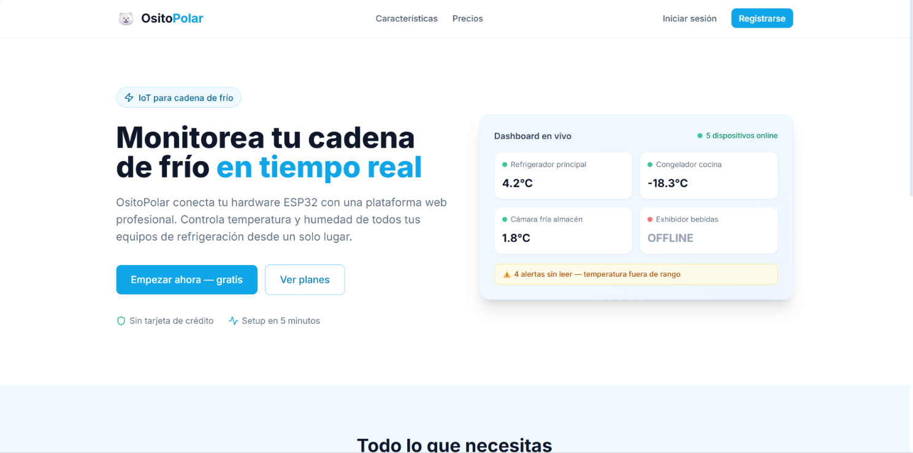
  <figcaption style="font-size: 0.9em; color: #555;">
    <strong>Figura 1:</strong> Landing Page - Seccion principal.
  </figcaption>
</figure>

#### 5.3.2. Landing Page Mockup

El mock-up actualizado de la Landing Page presenta la identidad visual y las secciones principales de OsitoPolar. Las capturas muestran el enfoque comercial del producto, sus funcionalidades de monitoreo IoT, la explicacion del servicio y los puntos de contacto para convertir visitantes en potenciales usuarios.

<figure style="page-break-inside: avoid; text-align: center;">
  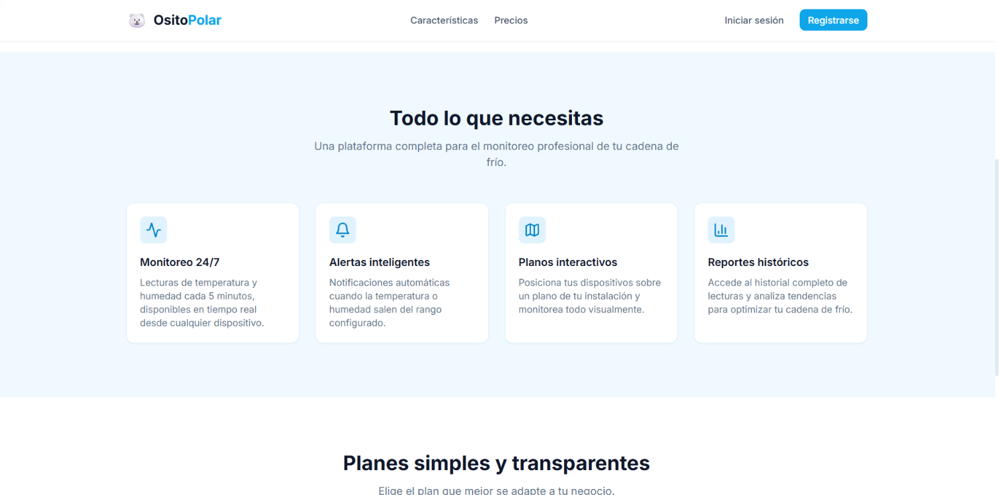
  <figcaption style="font-size: 0.9em; color: #555;">
    <strong>Figura 2:</strong> Landing Page - Funcionalidades y beneficios.
  </figcaption>
</figure>

<figure style="page-break-inside: avoid; text-align: center;">
  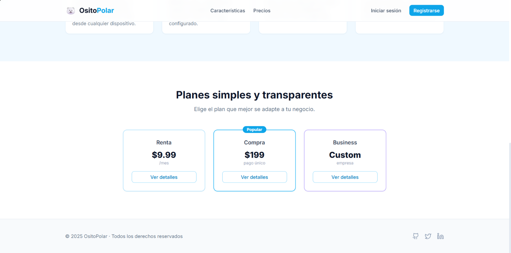
  <figcaption style="font-size: 0.9em; color: #555;">
    <strong>Figura 3:</strong> Landing Page - Informacion final y contacto.
  </figcaption>
</figure>


### 5.4. Applications UX/UI Design

#### 5.4.1. Applications Wireframes

Los wireframes de las aplicaciones web de OsitoPolar delinean la estructura y organización de las pantallas principales, especificando la ubicación de los elementos de la interfaz de usuario y la navegación. Estos esquemas visuales sirven como una guía precisa para el diseño final, asegurando una experiencia de usuario fluida e intuitiva. Los wireframes están enfocados en la funcionalidad y facilidad de uso, permitiendo que diseñadores y desarrolladores visualicen cómo los usuarios interactúan con la aplicación, optimizando la disposición de los elementos para crear una experiencia eficiente y atractiva.<figure style="page-break-inside: avoid; text-align: center;">
  
  <figcaption style="font-size: 0.9em; color: #555;">
    <strong>Figura 1:</strong> Wireframe - Contacto (Clientes).
  </figcaption>
</figure>

<figure style="page-break-inside: avoid; text-align: center;">
  
  <figcaption style="font-size: 0.9em; color: #555;">
    <strong>Figura 2:</strong> Wireframe - Contacto (Empresa).
  </figcaption>
</figure>

<figure style="page-break-inside: avoid; text-align: center;">
  
  <figcaption style="font-size: 0.9em; color: #555;">
    <strong>Figura 3:</strong> Wireframe - Control (Clientes).
  </figcaption>
</figure>

<figure style="page-break-inside: avoid; text-align: center;">
  
  <figcaption style="font-size: 0.9em; color: #555;">
    <strong>Figura 4:</strong> Wireframe - Estado de Cuenta (Clientes).
  </figcaption>
</figure>

<figure style="page-break-inside: avoid; text-align: center;">
  
  <figcaption style="font-size: 0.9em; color: #555;">
    <strong>Figura 5:</strong> Wireframe - Estado de Cuenta (Empresa).
  </figcaption>
</figure>

<figure style="page-break-inside: avoid; text-align: center;">
  
  <figcaption style="font-size: 0.9em; color: #555;">
    <strong>Figura 6:</strong> Wireframe - Analíticas Completas (Clientes).
  </figcaption>
</figure>

<figure style="page-break-inside: avoid; text-align: center;">
  
  <figcaption style="font-size: 0.9em; color: #555;">
    <strong>Figura 7:</strong> Wireframe - Inicio (Clientes).
  </figcaption>
</figure>

<figure style="page-break-inside: avoid; text-align: center;">
  
  <figcaption style="font-size: 0.9em; color: #555;">
    <strong>Figura 8:</strong> Wireframe - Inicio (Empresa).
  </figcaption>
</figure>

<figure style="page-break-inside: avoid; text-align: center;">
  
  <figcaption style="font-size: 0.9em; color: #555;">
    <strong>Figura 9:</strong> Wireframe - Inicio de la Aplicación.
  </figcaption>
</figure>

<figure style="page-break-inside: avoid; text-align: center;">
  
  <figcaption style="font-size: 0.9em; color: #555;">
    <strong>Figura 10:</strong> Wireframe - Inicio de Sesión (Clientes).
  </figcaption>
</figure>

<figure style="page-break-inside: avoid; text-align: center;">
  
  <figcaption style="font-size: 0.9em; color: #555;">
    <strong>Figura 11:</strong> Wireframe - Inicio de Sesión (Empresa).
  </figcaption>
</figure>

<figure style="page-break-inside: avoid; text-align: center;">
  
  <figcaption style="font-size: 0.9em; color: #555;">
    <strong>Figura 12:</strong> Wireframe - Mi Cuenta (Clientes).
  </figcaption>
</figure>

<figure style="page-break-inside: avoid; text-align: center;">
  
  <figcaption style="font-size: 0.9em; color: #555;">
    <strong>Figura 13:</strong> Wireframe - Mi Cuenta (Empresa).
  </figcaption>
</figure>

<figure style="page-break-inside: avoid; text-align: center;">
  
  <figcaption style="font-size: 0.9em; color: #555;">
    <strong>Figura 14:</strong> Wireframe - Mis Equipos (Clientes).
  </figcaption>
</figure>

<figure style="page-break-inside: avoid; text-align: center;">
  
  <figcaption style="font-size: 0.9em; color: #555;">
    <strong>Figura 15:</strong> Wireframe - Mis Equipos (Clientes, Detalle 1).
  </figcaption>
</figure>

<figure style="page-break-inside: avoid; text-align: center;">
  
  <figcaption style="font-size: 0.9em; color: #555;">
    <strong>Figura 16:</strong> Wireframe - Mis Equipos (Clientes, Detalle 2).
  </figcaption>
</figure>

<figure style="page-break-inside: avoid; text-align: center;">
  
  <figcaption style="font-size: 0.9em; color: #555;">
    <strong>Figura 17:</strong> Wireframe - Mis Equipos (Empresa).
  </figcaption>
</figure>

<figure style="page-break-inside: avoid; text-align: center;">
  
  <figcaption style="font-size: 0.9em; color: #555;">
    <strong>Figura 18:</strong> Wireframe - Notificaciones (Clientes).
  </figcaption>
</figure>

<figure style="page-break-inside: avoid; text-align: center;">
  
  <figcaption style="font-size: 0.9em; color: #555;">
    <strong>Figura 19:</strong> Wireframe - Notificaciones (Empresa).
  </figcaption>
</figure>

<figure style="page-break-inside: avoid; text-align: center;">
  
  <figcaption style="font-size: 0.9em; color: #555;">
    <strong>Figura 20:</strong> Wireframe - Registro (Clientes).
  </figcaption>
</figure>

<figure style="page-break-inside: avoid; text-align: center;">
  
  <figcaption style="font-size: 0.9em; color: #555;">
    <strong>Figura 21:</strong> Wireframe - Registro (Empresa).
  </figcaption>
</figure>


#### 5.4.2. Applications Wireflow Diagrams
En esta sección se presentan los Wireflows para cada objetivo del usuario, teniendo en cuenta los User Personas relevantes. Cada diagrama ilustra el flujo de interacción del usuario y cómo las acciones realizadas afectan las pantallas dentro de la aplicación.


#### **User Goal 1**: 
Como dueño de un negocio que utiliza equipos de refrigeración quiero estar pendiente del estado de cada equipo registrado.

**Task Flow**
<figure style="page-break-inside: avoid; text-align: center;">
  
  <figcaption style="font-size: 0.9em; color: #555;">
    <strong>Figura 1:</strong> Taskflow 1.
  </figcaption>
</figure>


**Wireflow**
<figure style="page-break-inside: avoid; text-align: center;">
  
  <figcaption style="font-size: 0.9em; color: #555;">
    <strong>Figura 2:</strong> Wireflow 1.
  </figcaption>
</figure>


#### **User Goal 2**:
Como dueño de un negocio que utiliza equipos de refrigeración quiero lograr administrar los nuevos equipos que registre.

**Task Flow**
<figure style="page-break-inside: avoid; text-align: center;">
  
  <figcaption style="font-size: 0.9em; color: #555;">
    <strong>Figura 3:</strong> Taskflow 2.
  </figcaption>
</figure>


**Wireflow**
<figure style="page-break-inside: avoid; text-align: center;">
  
  <figcaption style="font-size: 0.9em; color: #555;">
    <strong>Figura 4:</strong> Wireflow 2.
  </figcaption>
</figure>


#### **User Goal 3**:
Como dueño de un negocio que utiliza equipos de refrigeración quiero revisar las estadísticas completas de mis equipos.

**Task Flow**
<figure style="page-break-inside: avoid; text-align: center;">
  
  <figcaption style="font-size: 0.9em; color: #555;">
    <strong>Figura 5:</strong> Taskflow 3.
  </figcaption>
</figure>


**Wireflow**
<figure style="page-break-inside: avoid; text-align: center;">
  
  <figcaption style="font-size: 0.9em; color: #555;">
    <strong>Figura 6:</strong> Wireflow 3.
  </figcaption>
</figure>


#### **User Goal 4**:
Como dueño de un negocio que utiliza equipos de refrigeración quiero pedir nuevos equipos a un proveedor de manera sencilla.

**Task Flow**
<figure style="page-break-inside: avoid; text-align: center;">
  
  <figcaption style="font-size: 0.9em; color: #555;">
    <strong>Figura 7:</strong> Taskflow 4.
  </figcaption>
</figure>


**Wireflow**
<figure style="page-break-inside: avoid; text-align: center;">
  
  <figcaption style="font-size: 0.9em; color: #555;">
    <strong>Figura 8:</strong> Wireflow 4.
  </figcaption>
</figure>


#### **User Goal 5**:
Como proveedor de equipos de refrigeración quiero estar pendiente de los ordenes de pedios de mis clientes.

**Task Flow**
<figure style="page-break-inside: avoid; text-align: center;">
  
  <figcaption style="font-size: 0.9em; color: #555;">
    <strong>Figura 9:</strong> Taskflow 5.
  </figcaption>
</figure>


**Wireflow**
<figure style="page-break-inside: avoid; text-align: center;">
  
  <figcaption style="font-size: 0.9em; color: #555;">
    <strong>Figura 10:</strong> Wireflow 5.
  </figcaption>
</figure>


#### 5.4.3. Applications Mock-ups
En esta sección se presentan y detallan los mock-ups de las aplicaciones de OsitoPolar. Se resalta la aplicación de los principios de diseño, la arquitectura de la información, el diseño inclusivo y el Design System implementado en los productos digitales. Cada mock-up muestra cómo estos conceptos se integran en la interfaz de usuario. A continuación, se mostrarán las maquetas de la aplicación web, que representan visualmente cómo se verá y funcionará la plataforma OsitoPolar. Estas maquetas son fundamentales para comunicar el diseño a los desarrolladores y clientes, asegurando que la experiencia del usuario se alinee con la visión del proyecto.

<figure style="page-break-inside: avoid; text-align: center;">
  
  <figcaption style="font-size: 0.9em; color: #555;">
    <strong>Figura 1:</strong> Mockup - Inicio General de la App.
  </figcaption>
</figure>

<figure style="page-break-inside: avoid; text-align: center;">
  
  <figcaption style="font-size: 0.9em; color: #555;">
    <strong>Figura 2:</strong> Mockup - Registro (Clientes).
  </figcaption>
</figure>

<figure style="page-break-inside: avoid; text-align: center;">
  
  <figcaption style="font-size: 0.9em; color: #555;">
    <strong>Figura 3:</strong> Mockup - Inicio de Sesión (Clientes).
  </figcaption>
</figure>

<figure style="page-break-inside: avoid; text-align: center;">
  
  <figcaption style="font-size: 0.9em; color: #555;">
    <strong>Figura 4:</strong> Mockup - Inicio (Clientes).
  </figcaption>
</figure>

<figure style="page-break-inside: avoid; text-align: center;">
  
  <figcaption style="font-size: 0.9em; color: #555;">
    <strong>Figura 5:</strong> Mockup - Mis Equipos (Clientes).
  </figcaption>
</figure>

<figure style="page-break-inside: avoid; text-align: center;">
  
  <figcaption style="font-size: 0.9em; color: #555;">
    <strong>Figura 6:</strong> Mockup - Mis Equipos (Clientes, Detalle 1).
  </figcaption>
</figure>

<figure style="page-break-inside: avoid; text-align: center;">
  
  <figcaption style="font-size: 0.9em; color: #555;">
    <strong>Figura 7:</strong> Mockup - Mis Equipos (Clientes, Detalle 2).
  </figcaption>
</figure>

<figure style="page-break-inside: avoid; text-align: center;">
  
  <figcaption style="font-size: 0.9em; color: #555;">
    <strong>Figura 8:</strong> Mockup - Contacto (Clientes).
  </figcaption>
</figure>

<figure style="page-break-inside: avoid; text-align: center;">
  
  <figcaption style="font-size: 0.9em; color: #555;">
    <strong>Figura 9:</strong> Mockup - Notificaciones (Clientes).
  </figcaption>
</figure>

<figure style="page-break-inside: avoid; text-align: center;">
  
  <figcaption style="font-size: 0.9em; color: #555;">
    <strong>Figura 10:</strong> Mockup - Control (Clientes).
  </figcaption>
</figure>

<figure style="page-break-inside: avoid; text-align: center;">
  
  <figcaption style="font-size: 0.9em; color: #555;">
    <strong>Figura 11:</strong> Mockup - Estado de Cuenta (Clientes).
  </figcaption>
</figure>

<figure style="page-break-inside: avoid; text-align: center;">
  
  <figcaption style="font-size: 0.9em; color: #555;">
    <strong>Figura 12:</strong> Mockup - Mi Cuenta (Clientes).
  </figcaption>
</figure>

<figure style="page-break-inside: avoid; text-align: center;">
  
  <figcaption style="font-size: 0.9em; color: #555;">
    <strong>Figura 13:</strong> Mockup - Analíticas Completas (Clientes).
  </figcaption>
</figure>

- **Mockups Empresa:**

<figure style="page-break-inside: avoid; text-align: center;">
  
  <figcaption style="font-size: 0.9em; color: #555;">
    <strong>Figura 14:</strong> Mockup - Inicio de Sesión (Empresa).
  </figcaption>
</figure>

<figure style="page-break-inside: avoid; text-align: center;">
  
  <figcaption style="font-size: 0.9em; color: #555;">
    <strong>Figura 15:</strong> Mockup - Registro (Empresa).
  </figcaption>
</figure>

<figure style="page-break-inside: avoid; text-align: center;">
  
  <figcaption style="font-size: 0.9em; color: #555;">
    <strong>Figura 16:</strong> Mockup - Inicio (Empresa).
  </figcaption>
</figure>

<figure style="page-break-inside: avoid; text-align: center;">
  
  <figcaption style="font-size: 0.9em; color: #555;">
    <strong>Figura 17:</strong> Mockup - Contacto (Empresa).
  </figcaption>
</figure>

<figure style="page-break-inside: avoid; text-align: center;">
  
  <figcaption style="font-size: 0.9em; color: #555;">
    <strong>Figura 18:</strong> Mockup - Estado de Cuenta (Empresa).
  </figcaption>
</figure>

<figure style="page-break-inside: avoid; text-align: center;">
  
  <figcaption style="font-size: 0.9em; color: #555;">
    <strong>Figura 19:</strong> Mockup - Mi Cuenta (Empresa).
  </figcaption>
</figure>

<figure style="page-break-inside: avoid; text-align: center;">
  
  <figcaption style="font-size: 0.9em; color: #555;">
    <strong>Figura 20:</strong> Mockup - Mis Equipos (Empresa).
  </figcaption>
</figure>

<figure style="page-break-inside: avoid; text-align: center;">
  
  <figcaption style="font-size: 0.9em; color: #555;">
    <strong>Figura 21:</strong> Mockup - Notificaciones (Empresa).
  </figcaption>
</figure>

Link de los mockups: https://shorturl.at/jMDBY

#### 5.4.4. Applications User Flow Diagrams
### User Goal 1: 
- Como dueño de un negocio que utiliza equipos de refrigeración quiero estar pendiente del estado de cada equipo registrado.


### User Goal 2:
- Como dueño de un negocio que utiliza equipos de refrigeración quiero revisar las estadisticas completas de mis equipos.
  

### User Goal 3:
- Como dueño de un negocio que utiliza equipos de refrigeración quiero lograr administrar los nuevos equipos que registre.
  


### 5.5. Applications Prototyping
A continuación se presenta el prototipo de la aplicación web de OsitoPolar, el cual permite a los usuarios interactuar con la interfaz y explorar las diversas secciones de la plataforma. Este prototipo incluye las funcionalidades clave y características de la aplicación, proporcionando una vista preliminar de la experiencia del usuario. Además, facilita la evaluación y prueba de la interfaz antes de su implementación final, asegurando que el diseño sea intuitivo y eficiente.
Link del prototipo: https://shorturl.at/oIUJN

### 5.6. IoT Device Design

#### Introduccion

El dispositivo IoT de OsitoPolar esta disenado para monitorear en tiempo real las condiciones de equipos de refrigeracion, como refrigeradores, congeladores, camaras frias o almacenes refrigerados. Su objetivo es medir temperatura y humedad, enviar la informacion hacia la plataforma web y permitir la deteccion temprana de condiciones fuera del rango seguro o desconexiones del equipo.

Las decisiones de diseno priorizan una arquitectura simple, de bajo costo y alineada con el flujo definido para el sistema: el dispositivo captura datos mediante sensores, el firmware del ESP32 procesa y transmite las lecturas, el Edge Server recibe la informacion localmente y la Cloud API centraliza los datos para visualizacion, alertas y analitica.

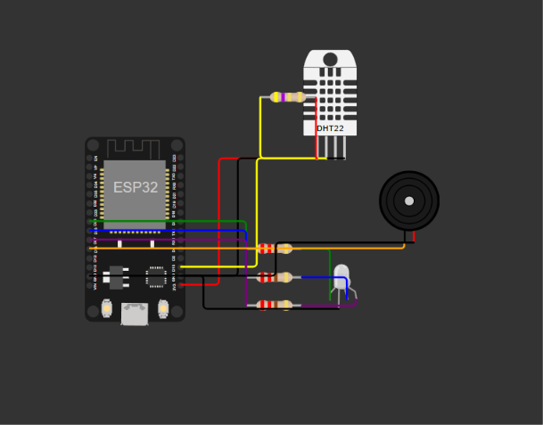

Figura 82. IoT Device Design de OsitoPolar.

#### Componentes del dispositivo

El nodo IoT esta compuesto por los siguientes elementos:

- **Microcontrolador ESP32-WROOM-32D:** unidad principal de procesamiento del dispositivo. Gestiona la lectura de sensores, controla los actuadores de alerta local y transmite los datos hacia el Edge Server mediante conectividad Wi-Fi.
- **Sensor DHT22:** sensor digital encargado de medir temperatura y humedad relativa dentro del equipo o ambiente refrigerado. Permite detectar desviaciones que puedan comprometer la cadena de frio.
- **LED RGB:** actuador visual utilizado para representar el estado del equipo monitoreado. Por ejemplo, verde para condiciones normales, amarillo para advertencia y rojo para alerta critica.
- **Buzzer activo:** actuador sonoro para alertas locales cuando la temperatura o humedad salen del rango seguro, o cuando se detecta una condicion critica.
- **Resistencia pull-up de 4.7kOhm o 10kOhm:** utilizada en la linea DATA del sensor DHT22 para estabilizar la senal digital.
- **Resistencias limitadoras de corriente:** utilizadas para proteger los pines del ESP32 y los canales del LED RGB.
- **Breadboard:** placa de prototipado usada para organizar las conexiones de alimentacion, tierra y senales entre los componentes.
- **Fuente de alimentacion USB 5V:** alimenta el ESP32 durante el prototipado. Desde el microcontrolador se distribuye energia a los componentes segun los voltajes requeridos.

#### Flujo de datos del dispositivo

1. El sensor DHT22 captura la temperatura y humedad del ambiente refrigerado.
2. El firmware del ESP32 lee los valores del sensor en intervalos definidos.
3. El ESP32 valida si las lecturas se encuentran dentro de los rangos configurados para el equipo.
4. Si existe una condicion fuera de rango, el dispositivo activa el LED RGB y el buzzer como alerta local.
5. El ESP32 envia las mediciones al Edge Server mediante una solicitud HTTP o un canal de comunicacion equivalente.
6. El Edge Server recibe los datos, los normaliza y los reenvia hacia la Cloud API.
7. La plataforma web muestra las mediciones en tiempo real y genera alertas para los usuarios responsables.

#### Convencion de colores de cables

| Color | Funcion |
| --- | --- |
| Rojo | Alimentacion 5V desde la fuente USB hacia el ESP32 o el breadboard |
| Negro | GND o tierra comun para todos los componentes |
| Amarillo | Senal DATA del sensor DHT22 hacia un pin GPIO del ESP32 |
| Verde | Canal de senal del LED RGB para estado normal |
| Azul | Canal de senal del LED RGB para estado de advertencia |
| Morado | Canal de senal del LED RGB para estado critico |
| Naranja | Senal de control del buzzer activo hacia un pin GPIO del ESP32 |

#### Relacion con la arquitectura de software

- **Embedded Application:** corresponde al firmware ejecutado en el ESP32. Se encarga de leer el sensor DHT22, controlar los actuadores locales y preparar los datos para envio.
- **Edge API:** recibe las lecturas generadas por el dispositivo IoT, funcionando como punto intermedio entre el hardware y la nube.
- **Cloud API:** centraliza la informacion de dispositivos, mediciones, alertas y reglas de negocio de la plataforma OsitoPolar.
- **Web Application:** permite a los usuarios visualizar el estado de sus equipos, revisar historicos y recibir alertas por temperatura, humedad o desconexion.


## Capítulo VI: Product Implementation, Validation & Deployment 

### 6.1. Software Configuration Management
#### 6.1.1. Software Development Environment Configuration

### Project Management

Para la administración del proyecto se recurrió al uso de herramientas de comunicación y control de versiones. Se creó una organización en GitHub para centralizar la gestión del código fuente y su versionado. En cuanto a la comunicación interna y las reuniones del equipo, se utilizó Discord.

**Organización del trabajo:** Github

**Reuniones:** Discord

**Comunicación:** Whatsapp

**Planificación y asignación de tareas:** Trello

**Enlaces**

- Github: https://github.com/
- Discord: https://discord.com/
- Trello: https://trello.com/


### Requirement Management

Para esta fase, se implementaron soluciones personalizadas que facilitaron la recolección, organización y priorización de los requisitos del proyecto.
Se utilizó Trello como una herramienta visual para gestionar tareas mediante tableros personalizados.
Se utilizó UXPressia para poder desarrollar los user personas, empathy maps, journey maps y lean UX canvas.
Se utilizó Miro para el desarrollo de los As-Is y To-Be Scenarios.


**Enlaces**

- Trello: https://trello.com/
- UXPressia: https://uxpressia.com/
- Miro: https://miro.com/es/


### Product UX/UI Design
En el diseño de la experiencia e interfaz de usuario, el equipo utilizó Figma para la creación de wireframes, mockups y prototipos interactivos, lo que permitió validar la propuesta de diseño antes de la implementación.

**Enlaces**
- Figma: https://www.figma.com/

### Software Development
Para el desarrollo de la Landing Page se usaron los lenguajes HTML, CSS y JavaScript en Visual Studio Code. La elaboración del informe se realizó en archivos .md en IDEs como IntelliJ IDEA y Rider (cada miembro del equipo trabajó en alguna de estas herramientas).
Para descargar, instalar y actualizar fácilmente estas IDEs utilizamos la aplicación de gestión JetBrains ToolBox.

**Enlaces**
- JetBrains ToolBox: https://www.jetbrains.com/toolbox-app/
- Visual Studio Code: https://code.visualstudio.com/


### Software Documentation
Para el control de versiones y la colaboración en el desarrollo del informe, se utilizó GitHub siguiendo la estrategia de trabajo GitHub Flow. Esta metodología permitió una gestión eficiente y ordenada del proyecto mediante el uso de ramas específicas para cada funcionalidad o corrección, lo que facilitó el trabajo colaborativo. Todo el contenido del proyecto fue centralizado y almacenado en un repositorio dentro de una organización creada en GitHub.
Para la documentación técnica del proyecto se optó por el uso de archivos en formato Markdown, debido a su simplicidad, legibilidad y excelente compatibilidad con GitHub.

**Enlaces**
- GitHub: https://github.com/

### Software Deployment
Para el despliegue de la Landing Page se utilizó GitHub Pages, una herramienta perfecta para publicar sitios web estáticos.

**Enlaces**
- GithubPages: https://pages.github.com/


#### 6.1.2. Source Code Management

Modelo de ramas Git Flow: main: rama principal donde siempre está el código estable y listo para producción. develop: rama de desarrollo donde se integran todas las nuevas funcionalidades antes de pasar a producción. feature/: ramas para trabajar nuevas funcionalidades. release/: ramas temporales para preparar una nueva versión estable. hotfix/: ramas para corregir errores en producción.

Versionado semántico (Semantic Versioning): Se aplicará el versionado semántico (Semantic Versioning 2.0.0), siguiendo el esquema: MAJOR.MINOR.PATCH.
1.0.0 → versión estable inicial

1.1.0 → agregaste nuevas funcionalidades

1.1.1 → arreglos de bugs

Convención de mensajes de commits El equipo seguirá la convención de mensajes de commits definida en “Conventional Commits”.
Ejemplos de mensajes:

- feat: agregar nuevo sistema de login
- fix: corregir validación en formulario de registro
- docs: actualizar README con instrucciones de despliegue

Nomenclatura de numeración de las versiones: Major changes: Cuando el código o versión nueva del proyecto a implementar presenta cambios significativos con la versión anterior, estos cambios llegan a ser incompatibles con la versión anterior. Minor changes: Cuando el código o versión nueva del proyecto a implementar presenta cambios con respecto a alguna característica Patch: Cuando se solucionan bugs menores.


**Repositorio de Github:**
- Enlace para acceder a la [organización en Github](https://github.com/iot-proyectos)
- Enlace para acceder al repositorio de la [Landing Page](https://github.com/iot-proyectos/LandingPage)
- Enlace para acceder al repositorio del [Informe](https://github.com/iot-proyectos/Report)

**Flujo de trabajo de GitFlow**
El flujo de trabajo se basará en un modelo de ramas Git Flow, el cuál se basa en la creación de ramas específicas para cada funcionalidad o corrección de errores. El modelo de "A succesful Git branching model"

--Insertar imagen

**Estructura de branches (Ramas):**


1. **Master branch (Rama principal):** Es la rama principal del proyecto, donde se almacena el código estable y listo para producción. Solo se integrarán cambios que hayan sido probados y validados previamente en las ramas de desarrollo y funcionalidad.

2. **Develop Branch (Rama de Desarrollo):** Esta rama actúa como un espacio de integración para el trabajo en equipo, permitiendo pruebas y ajustes de las nuevas funcionalidades antes de fusionarlas con la rama principal. Garantiza que el código sea funcional y estable.

3. **Feature branch (Ramas de funcionalidad):** Cada nueva funcionalidad o tarea específica se desarrollará en su propia rama. Una vez completada y probada, se integrará en la rama de desarrollo. Las ramas de funcionalidad seguirán un esquema de nombres descriptivos, como por ejemplo: `feature/chapter-01`.

#### 6.1.3. Source Code Style Guide & Conventions

El equipo adoptará nomenclatura en inglés para todas las variables, funciones, clases y archivos del proyecto, con el objetivo de mantener flexibilidad, escalabilidad y coherencia en el desarrollo. HTML / CSS Se sigue el Google HTML/CSS Style Guide.

Las clases CSS estarán en kebab-case (.main-header, .card-title).

Se utilizarán etiquetas semánticas

- &lt;header&gt;
- &lt;section&gt;
- &lt;article&gt;

Identificadores claros y descriptivos para accesibilidad y mantenimiento.

Se usó diferentes etiquetas para conformar la estructura del Landing Page del producto:

- header: Define todo el contenido introductorio de la página web.

- nav: Define las secciones de la página que estarán dedicadas a la navegación en la página.

- div: Esta etiqueta permite la separación de diferentes objetos dentro de nuestra página, esto nos permitió poder aplicar hojas de estilo específicas para cada parte de los objetos.

- img: Esta etiqueta permite la inserción de imágenes en la página web, se usó en diversas ocasiones dentro de la página.

- ul: Esta etiqueta sirve para definir una lista desordenada, mayormente se usó para la elaboración del menú interactivo de la página.

- li: Sirve para definir los elementos de las listas que se implementaron en la página, más especifico en la barra de búsqueda y el blog.

- a: Se usó para definir hipervínculos para mover a los usuarios a través de las diferentes secciones de la página.

- p: Definen los párrafos de texto, separándolos del resto de contenido.

- button: Declaran un botón interactivo modificable que permite a los usuarios realizar una acción en específico.

- h1 - h4: Definen los diferentes títulos y subtítulos de la página siendo h1 el mayor nivel y h4 el más bajo.


#### 6.1.4. Software Deployment Configuration


### Landing page deployment:
Para desplegar la landing page, es necesario cumplir con ciertos requisitos previos, como contar con una cuenta personal, una organización y un repositorio donde se alojarán los archivos. Una vez cumplidos estos requisitos, se pueden seguir los pasos detallados a continuación para realizar el despliegue:

1. Verificar que los archivos principales se encuentren en la raíz (root) del repositorio.
2. Asegurarse de que los archivos sigan las siguientes convenciones de nombres: "index.html" para la página principal, "styles.css" para los estilos, "script.js" para los scripts principales, "languages.js" para gestionar los textos en diferentes idiomas (español e inglés), y una carpeta llamada "assets/images" para las imágenes.
3. Subir los archivos al repositorio mediante un commit.
4. Acceder a la sección Settings > Pages y seleccionar el branch correspondiente, en este caso, "main".
5. Configurar la carpeta raíz (root) como la fuente de la página.
6. Esperar a que GitHub realice las verificaciones necesarias. Una vez finalizado el proceso, se generará un enlace que permitirá acceder a la landing page desplegada.

Adicionalmente, se implementó un archivo "languages.js" que contiene los textos en español e inglés. Este archivo es consumido por el script "main.js", el cual permite realizar el cambio de idioma dinámicamente en la landing page.ations Implementation

### Github Pages:


La URL que nos entrega Github Pages para acceder a la landing page es la siguiente: https://iot-proyectos.github.io/LandingPage/


### 6.2. Landing Page, Services & Applications Implementation.


En el siguiente enlace se estará mostrando la landing page de la startup:
[Video demostrativo de la landing page](https://upcedupe-my.sharepoint.com/:v:/g/personal/u20231c111_upc_edu_pe/IQAeOr9bSx-2T4NJ5MMy6oFYAV1TUJryHsIL4ZEcVvphgsU?nav=eyJyZWZlcnJhbEluZm8iOnsicmVmZXJyYWxBcHAiOiJPbmVEcml2ZUZvckJ1c2luZXNzIiwicmVmZXJyYWxBcHBQbGF0Zm9ybSI6IldlYiIsInJlZmVycmFsTW9kZSI6InZpZXciLCJyZWZlcnJhbFZpZXciOiJNeUZpbGVzTGlua0NvcHkifX0&e=7A15cz)

En la sección siguiente se detallará el proceso de implementación, documentación y despliegue del Landing.

#### 6.2.1. Sprint 1
##### 6.2.1.1. Sprint Planning 1
<table>
<tr>
    <th colspan="5">Sprint 1</th>
    <th colspan="9">Sprint 1</th>
  </tr>
      <tr>
    <td colspan="13">Sprint Planning Background</td>
  </tr>
  <tr>
    <td colspan="5">Date</td>
    <td colspan="8">2026-05-10</td>
</tr>
  <tr>
    <td colspan="5">Time</td>
    <td colspan="8">9:45 PM</td>
  </tr>
  <tr>
    <td colspan="5">Location</td>
    <td colspan="8">Via Discord</td>
<tr>
    <td colspan="5">Prepared By</td>
    <td colspan="8">Cacho Seminario, Diego Alonso</td>
</tr>
<tr>
    <td colspan="5">Attendees (to planning meeting)</td>
    <td colspan="8">Osito Polar Team</td>
</tr>
<tr>
    <td colspan="5">Sprint  1 Review Summary</td>
    <td colspan="8">Esta sección se dedicó a mejorar el codigo de la Landing page para poder usarse mejor y tener una estructura clara y desplegamos la primera versión del Web App.</td>
</tr>
<tr>
    <td colspan="5">Sprint 1 Retrospective Summary</td>
    <td colspan="8">En esta sección tuvimos varios aciertos ya que hubieron ideas para integrar lo de los idiomas bastante convicentes pero nos quedamos con una en especifica, poniendo a prueba nuestra resolución de problemas.</td>
</tr>
<tr>
    <td colspan="13">Sprint Goal & User Stories</td>
</tr>
<tr>
    <td colspan="5">Sprint 1 Goal</td>
       <td colspan="8">Nuestro enfoque está en implementar la landing page de OsitoPolar, asegurando su adaptabilidad a diferentes dispositivos, coherencia visual y funcionalidad multilingüe. Creemos que esto ofrece una experiencia de navegación más clara, atractiva y accesible a los usuarios potenciales de nuestra solución. Esto se confirmará cuando los usuarios puedan cambiar el idioma fácilmente desde la interfaz, navegar la página sin errores visuales desde cualquier dispositivo, y se valide que imágenes y textos estén correctamente integrados y espaciados. Además de realizar y desplegar la primera versión de la Web App. </td>

</tr>
<tr>
    <td colspan="5">Sprint 1 Velocity</td>
    <td colspan="8">15</td>
<tr>
    <td colspan="5">Sum of Story Points</td>
    <td colspan="8">14</td>
</tr>
</table>


##### 6.2.1.2. Aspect Leaders and Collaborators

Durante este primer Sprint, el equipo se enfocó principalmente en el desarrollo, la mejora estructural y visual de la Landing Page de OsitoPolar, asegurando su visualización en distintos dispositivos (diseño responsive), la integración armoniosa de imágenes y textos, y la implementación de un cambio de idioma dinámico mediante un botón.
Con el fin de organizar de manera más eficiente el trabajo colaborativo, se ha elaborado la matriz de Liderazgo y Colaboración (LACX). Esta matriz asigna responsabilidades específicas a cada miembro del equipo en relación con los aspectos clave del Sprint.
<table>
  <tr>
    <td colspan="2"><strong>Team Member (Last Name, First Name)</strong></td>
    <td><strong>GitHub Username</strong></td>
    <td><strong>Diseño visual y maquetación web (Landing Page)<br>Leader (L) / Collaborator (C)</strong></td>
    <td><strong>Implementación técnica del cambio de idioma (Multilenguaje funcional)<br>Leader (L) / Collaborator (C)</strong></td>
    <td><strong>Responsividad y pruebas en distintos dispositivos<br>Leader (L) / Collaborator (C)</strong></td>
  </tr>
  <tr>
    <td colspan="2">Cacho Seminario, Diego Alonso </td>
    <td>Memesitos</td>
    <td>L</td>
    <td>C</td>
    <td>C</td>
  </tr>
  <tr>
    <td colspan="2">Hernandez Poma, Sebastian Eduardo </td>
    <td>Necxuz18</td>
    <td>C</td>
    <td>L</td>
    <td>L</td>
  </tr>
  <tr>
    <td colspan="2"> Medina Cruzado, Raúl Adrian </td>
    <td>imisterdg</td>
    <td>C</td>
    <td>C</td>
    <td>C</td>
  </tr>
  <tr>
    <td colspan="2">Inga Orihuela, Christian Fabrizio
</td>
    <td>Christian1905</td>
    <td>C</td>
    <td>C</td>
    <td>C</td>
  </tr>
  <tr>
    <td colspan="2">Mora Blas, Diego Alonzo </td>
    <td>diegoalonzomora</td>
    <td>C</td>
    <td>C</td>
    <td>C</td>
  </tr>
</table>


##### 6.2.1.3. Sprint Backlog 1

El objetivo principal de este Sprint es elaborar la Landing Page de OsitoPolar, comunicando claramente que la plataforma permite monitorear la cadena de frio con dispositivos IoT, visualizar temperatura y humedad en tiempo real, recibir alertas ante desconexion o valores fuera de rango y conocer los planes disponibles para negocios con infraestructura refrigerada. La plataforma elegida para el control de tareas fue Trello.


Enlace: https://trello.com/b/xAOjqyPz/inteligenciaartesanal-ositopolar

<table>
<tr>
    <th colspan="3">Sprint #</th>
    <th colspan="10">Sprint 1</th>
</tr>
<tr>
    <td colspan="3">User Story</td>
    <td colspan="10">Work-Item/Task</td>
</tr>
<tr>
    <td colspan="1">Id</td>
    <td colspan="2">Title</td>
    <td colspan="1">Id</td>
    <td colspan="2">Title</td>
    <td colspan="3">Description</td>
    <td colspan="1">Estimation (Hours)</td>
    <td colspan="2">Assigned To</td>
    <td colspan="1">Status (To do/ In-Process/ To-Review/ Done)</td>
</tr>
<tr>
    <td colspan="1">US-23</td>
    <td colspan="2">Entender la propuesta de monitoreo de cadena de frio</td>
    <td colspan="1">UT-01</td>
    <td colspan="2">Crear seccion Hero enfocada en IoT</td>
    <td colspan="3">Presentar a OsitoPolar como una plataforma web para vigilar temperatura, humedad y estado de conexion de equipos refrigerados.</td>
    <td colspan="1">0.5</td>
    <td colspan="2">Medina Cruzado, Raul Adrian</td>
    <td colspan="1">Done</td>
</tr>
<tr>
    <td colspan="1">US-23</td>
    <td colspan="2">Entender la propuesta de monitoreo de cadena de frio</td>
    <td colspan="1">UT-02</td>
    <td colspan="2">Aplicar estilos visuales del Hero</td>
    <td colspan="3">Aplicar estilos para comunicar tecnologia, refrigeracion, monitoreo continuo y confianza operativa.</td>
    <td colspan="1">0.5</td>
    <td colspan="2">Cacho Seminario, Diego Alonso</td>
    <td colspan="1">Done</td>
</tr>
<tr>
    <td colspan="1">US-23</td>
    <td colspan="2">Entender la propuesta de monitoreo de cadena de frio</td>
    <td colspan="1">UT-03</td>
    <td colspan="2">Agregar interacciones iniciales</td>
    <td colspan="3">Agregar desplazamiento, botones y comportamiento basico para dirigir al usuario a planes, beneficios y solicitud de demo.</td>
    <td colspan="1">0.5</td>
    <td colspan="2">Medina Cruzado, Raul Adrian</td>
    <td colspan="1">Done</td>
</tr>
<tr>
    <td colspan="1">US-24</td>
    <td colspan="2">Identificar beneficios por tipo de negocio refrigerado</td>
    <td colspan="1">UT-04</td>
    <td colspan="2">Crear seccion Beneficios</td>
    <td colspan="3">Mostrar beneficios para negocios con refrigeradores, congeladores, camaras frias y almacenes refrigerados.</td>
    <td colspan="1">0.5</td>
    <td colspan="2">Hernandez Poma, Sebastian Eduardo</td>
    <td colspan="1">Done</td>
</tr>
<tr>
    <td colspan="1">US-24</td>
    <td colspan="2">Identificar beneficios por tipo de negocio refrigerado</td>
    <td colspan="1">UT-05</td>
    <td colspan="2">Estilizar tarjetas de beneficios</td>
    <td colspan="3">Aplicar estilos a beneficios como prevencion de perdidas, visibilidad en tiempo real y respuesta temprana ante alertas.</td>
    <td colspan="1">0.5</td>
    <td colspan="2">Inga Orihuela, Christian Fabrizio</td>
    <td colspan="1">Done</td>
</tr>
<tr>
    <td colspan="1">US-24</td>
    <td colspan="2">Identificar beneficios por tipo de negocio refrigerado</td>
    <td colspan="1">UT-06</td>
    <td colspan="2">Agregar interacciones en beneficios</td>
    <td colspan="3">Agregar comportamiento visual para destacar beneficios de monitoreo, trazabilidad y alertas por fuera de rango.</td>
    <td colspan="1">0.5</td>
    <td colspan="2">Medina Cruzado, Raul Adrian</td>
    <td colspan="1">Done</td>
</tr>
<tr>
    <td colspan="1">US-25</td>
    <td colspan="2">Comprender funcionalidades IoT principales</td>
    <td colspan="1">UT-07</td>
    <td colspan="2">Crear seccion Funcionalidades</td>
    <td colspan="3">Presentar funcionalidades: registro de dispositivos, dashboard, temperatura/humedad, alertas, historial y planos interactivos.</td>
    <td colspan="1">1</td>
    <td colspan="2">Mora Blas, Diego Alonzo</td>
    <td colspan="1">Done</td>
</tr>
<tr>
    <td colspan="1">US-25</td>
    <td colspan="2">Comprender funcionalidades IoT principales</td>
    <td colspan="1">UT-08</td>
    <td colspan="2">Aplicar estilos a funcionalidades</td>
    <td colspan="3">Ordenar visualmente las funciones alrededor del monitoreo de cadena de frio y la gestion de dispositivos IoT.</td>
    <td colspan="1">0.5</td>
    <td colspan="2">Cacho Seminario, Diego Alonso</td>
    <td colspan="1">Done</td>
</tr>
<tr>
    <td colspan="1">US-25</td>
    <td colspan="2">Comprender funcionalidades IoT principales</td>
    <td colspan="1">UT-09</td>
    <td colspan="2">Agregar interacciones a funcionalidades</td>
    <td colspan="3">Agregar efectos y validaciones visuales para explicar los flujos de monitoreo, alerta y visualizacion historica.</td>
    <td colspan="1">0.5</td>
    <td colspan="2">Medina Cruzado, Raul Adrian</td>
    <td colspan="1">Done</td>
</tr>
<tr>
    <td colspan="1">US-26</td>
    <td colspan="2">Solicitar una demo de monitoreo IoT</td>
    <td colspan="1">UT-10</td>
    <td colspan="2">Crear seccion Solicitar Demo</td>
    <td colspan="3">Permitir que negocios interesados pidan una demostracion de monitoreo de equipos refrigerados.</td>
    <td colspan="1">1</td>
    <td colspan="2">Hernandez Poma, Sebastian Eduardo</td>
    <td colspan="1">Done</td>
</tr>
<tr>
    <td colspan="1">US-26</td>
    <td colspan="2">Solicitar una demo de monitoreo IoT</td>
    <td colspan="1">UT-11</td>
    <td colspan="2">Estilizar formulario de demo</td>
    <td colspan="3">Aplicar estilos al formulario y orientar los campos a empresas con equipos o instalaciones refrigeradas.</td>
    <td colspan="1">0.5</td>
    <td colspan="2">Inga Orihuela, Christian Fabrizio</td>
    <td colspan="1">Done</td>
</tr>
<tr>
    <td colspan="1">US-26</td>
    <td colspan="2">Solicitar una demo de monitoreo IoT</td>
    <td colspan="1">UT-12</td>
    <td colspan="2">Validar interacciones del formulario</td>
    <td colspan="3">Agregar validaciones basicas para los datos del negocio, contacto y tipo de infraestructura refrigerada.</td>
    <td colspan="1">0.5</td>
    <td colspan="2">Medina Cruzado, Raul Adrian</td>
    <td colspan="1">Done</td>
</tr>
<tr>
    <td colspan="1">US-27</td>
    <td colspan="2">Conocer mision y vision de OsitoPolar</td>
    <td colspan="1">UT-13</td>
    <td colspan="2">Crear seccion Nosotros</td>
    <td colspan="3">Explicar la vision del equipo sobre proteccion de cadena de frio mediante monitoreo IoT accesible.</td>
    <td colspan="1">0.5</td>
    <td colspan="2">Mora Blas, Diego Alonzo</td>
    <td colspan="1">Done</td>
</tr>
<tr>
    <td colspan="1">US-28</td>
    <td colspan="2">Consultar planes de uso</td>
    <td colspan="1">UT-14</td>
    <td colspan="2">Crear seccion Planes</td>
    <td colspan="3">Presentar planes de uso, incluyendo una opcion empresarial con planos interactivos para ubicar dispositivos.</td>
    <td colspan="1">0.5</td>
    <td colspan="2">Cacho Seminario, Diego Alonso</td>
    <td colspan="1">Done</td>
</tr>
<tr>
    <td colspan="1">US-00</td>
    <td colspan="2">-</td>
    <td colspan="1">NT-15</td>
    <td colspan="2">Implementar cambio de idioma</td>
    <td colspan="3">Implementar cambio de idioma para comunicar la propuesta de monitoreo IoT en espanol e ingles.</td>
    <td colspan="1">2</td>
    <td colspan="2">Hernandez Poma, Sebastian Eduardo</td>
    <td colspan="1">Done</td>
</tr>
<tr>
    <td colspan="1">US-00</td>
    <td colspan="2">-</td>
    <td colspan="1">NT-16</td>
    <td colspan="2">Agregar imagenes de cadena de frio</td>
    <td colspan="3">Agregar imagenes relacionadas con sensores, refrigeracion, dashboard y monitoreo de condiciones ambientales.</td>
    <td colspan="1">0.5</td>
    <td colspan="2">Hernandez Poma, Sebastian Eduardo</td>
    <td colspan="1">Done</td>
</tr>

</table>
##### 6.2.1.4. Development Evidence for Sprint Review

En este primer Sprint hemos realizado la implementación de nuestra Landing Page, donde todo el equipo ha aportado en varias tareas. En la siguiente tabla se muestran los commits realizados.

<table>
    <tr>
        <th colspan="2">Repository</th>
        <th colspan="2">Branch</th>
        <th colspan="2">Commit Id</th>
        <th colspan="2">Commit Message</th>
        <th colspan="2">Commit Message Body</th>
        <th colspan="2">Commited on (Date)</th>
    </tr>
        <tr>
        <td colspan="2">iot-proyectos/LandingPage</td>
        <td colspan="2">main</td>
        <td colspan="2">9caef73</td>
        <td colspan="2">chore: added html file</td>
        <td colspan="2">added html file</td>
        <td colspan="2">25/04/2026</td>
    </tr>
        <tr>
        <td colspan="2">iot-proyectos/LandingPage</td>
        <td colspan="2">main</td>
        <td colspan="2">ae1fd12</td>
        <td colspan="2">feat: added header and footer section</td>
        <td colspan="2">added header and footer section</td>
        <td colspan="2">25/04/2026</td>
    </tr>
     <tr>
        <td colspan="2">iot-proyectos/LandingPage</td>
        <td colspan="2">main</td>
        <td colspan="2">10093f4</td>
        <td colspan="2">style: Add styles</td>
        <td colspan="2">Add styles</td>
        <td colspan="2">25/04/2026</td>
    </tr>
    <tr>
        <td colspan="2">iot-proyectos/LandingPage</td>
        <td colspan="2">main</td>
        <td colspan="2">5a4332d</td>
        <td colspan="2">feat: added script.js</td>
        <td colspan="2">added script.js</td>
        <td colspan="2">25/04/2026</td>
    </tr>
    <tr>
        <td colspan="2">iot-proyectos/LandingPage</td>
        <td colspan="2">main</td>
        <td colspan="2">72f4157</td>
        <td colspan="2">feat: added hero section.</td>
        <td colspan="2">added hero section.</td>
        <td colspan="2">25/04/2026</td>
    </tr>
   <tr>
        <td colspan="2">iot-proyectos/LandingPage</td>
        <td colspan="2">main</td>
        <td colspan="2">e875205</td>
        <td colspan="2">fix: fixed header section.</td>
        <td colspan="2">fixed header section.</td>
        <td colspan="2">25/04/2026</td>
    </tr>
   <tr>
        <td colspan="2">iot-proyectos/LandingPage</td>
        <td colspan="2">main</td>
        <td colspan="2">9624ec5</td>
        <td colspan="2">feat: update hero section images and testimonials</td>
        <td colspan="2">update hero section images and testimonials</td>
        <td colspan="2">25/04/2026</td>
    </tr>
   <tr>
        <td colspan="2">iot-proyectos/LandingPage</td>
        <td colspan="2">main</td>
        <td colspan="2">9bc4018</td>
        <td colspan="2">feat: Funcionalidades Section</td>
        <td colspan="2">Funcionalidades Section</td>
        <td colspan="2">25/04/2026</td>
    </tr>
   <tr>
        <td colspan="2">iot-proyectos/LandingPage</td>
        <td colspan="2">main</td>
        <td colspan="2">9e6c718</td>
        <td colspan="2">feat: add language toggle button and translation functionality (WIP)</td>
        <td colspan="2">add language toggle button and translation functionality (WIP)</td>
        <td colspan="2">25/04/2026</td>
    </tr>
   <tr>
        <td colspan="2">iot-proyectos/LandingPage</td>
        <td colspan="2">main</td>
        <td colspan="2">a99916d</td>
        <td colspan="2">feat: nosotros section</td>
        <td colspan="2">nosotros section</td>
        <td colspan="2">25/04/2026</td>
    </tr>
   <tr>
        <td colspan="2">iot-proyectos/LandingPage</td>
        <td colspan="2">main</td>
        <td colspan="2">022b681</td>
        <td colspan="2">feat: add multilingual support for functionalities and company sections</td>
        <td colspan="2">add multilingual support for functionalities and company sections</td>
        <td colspan="2">25/04/2026</td>
    </tr>
   <tr>
        <td colspan="2">iot-proyectos/LandingPage</td>
        <td colspan="2">main</td>
        <td colspan="2">3ddec9f</td>
        <td colspan="2">feat: update about section image to enhance visual content</td>
        <td colspan="2">update about section image to enhance visual content</td>
        <td colspan="2">26/04/2026</td>
    </tr>


</table>

##### 6.2.1.5. Testing Suite Evidence for Sprint Review

En esta sección se presenta la evidencia de las pruebas realizadas sobre el microservicio BC-Profiles (Profiles Bounded Context) durante el Sprint Review. Se aplicaron pruebas unitarias y de integración para validar el correcto funcionamiento de las capas Domain, Application e Interfaces del servicio.

###### Herramientas utilizadas

Para la ejecución de las pruebas se emplearon las siguientes herramientas y frameworks:

| Herramienta | Versión | Propósito |
|-------------|---------|-----------|
| xUnit | 2.9.x | Framework de testing para .NET, utilizado como base para la definición y ejecución de los tests |
| Moq | 4.20.x | Biblioteca de mocking para simular dependencias como repositorios y Unit of Work |
| FluentAssertions | 6.12.x | Librería de aserciones con sintaxis fluida para validaciones más expresivas y legibles |
| Microsoft.AspNetCore.Mvc.Testing | 9.0.x | Framework para pruebas de integración HTTP utilizando WebApplicationFactory |
| Microsoft.EntityFrameworkCore.InMemory | 9.0.x | Proveedor de base de datos en memoria para simular la persistencia sin depender de MySQL |
| .NET 9 SDK | 9.0.x | SDK utilizado para compilar y ejecutar el proyecto y los tests |

###### Unit Tests – Domain Layer

Se realizaron pruebas unitarias sobre el aggregate Profile del dominio para verificar la correcta construcción de entidades a partir de comandos y la inicialización por defecto de los Value Objects.

```csharp
using FluentAssertions;
using OsitoPolar.Profiles.Service.Domain.Model.Aggregates;
using OsitoPolar.Profiles.Service.Domain.Model.Commands;

namespace Profiles.API.Tests.Domain;

public class ProfileTests
{
    [Fact]
    public void Constructor_WithValidCommand_ShouldCreateProfile()
    {
        
        var command = new CreateProfileCommand(
            "Diego", "Pérez", "diego@email.com",
            "Av. La Marina", "123", "Lima", "15088", "Perú");

        
        var profile = new Profile(command);

        
        profile.FullName.Should().Be("Diego Pérez");
        profile.EmailAddress.Should().Be("diego@email.com");
        profile.StreetAddress.Should().Contain("Lima");
    }

    [Fact]
    public void DefaultConstructor_ShouldCreateEmptyProfile()
    {
        
        var profile = new Profile();

        
        profile.FullName.Should().NotBeNull();
        profile.EmailAddress.Should().NotBeNull();
    }
}
```

Resultados obtenidos: Ambos tests se ejecutaron satisfactoriamente. Se verificó que el constructor del aggregate Profile crea correctamente la entidad a partir de un CreateProfileCommand, mapeando adecuadamente los Value Objects PersonName, EmailAddress y StreetAddress. Asimismo, el constructor por defecto inicializa los Value Objects sin valores nulos, garantizando la integridad del modelo de dominio.

###### Unit Tests – Application Layer (Command Service)

Se realizaron pruebas unitarias sobre ProfileCommandService utilizando mocks de IProfileRepository e IUnitOfWork para validar la lógica de creación de perfiles y el manejo de excepciones.

```csharp
using FluentAssertions;
using Moq;
using OsitoPolar.Profiles.Service.Application.Internal.CommandServices;
using OsitoPolar.Profiles.Service.Domain.Model.Aggregates;
using OsitoPolar.Profiles.Service.Domain.Model.Commands;
using OsitoPolar.Profiles.Service.Domain.Repositories;
using OsitoPolar.Profiles.Service.Shared.Domain.Repositories;

namespace Profiles.API.Tests.Application;

public class ProfileCommandServiceTests
{
    private readonly Mock<IProfileRepository> _mockProfileRepository;
    private readonly Mock<IUnitOfWork> _mockUnitOfWork;
    private readonly ProfileCommandService _service;

    public ProfileCommandServiceTests()
    {
        _mockProfileRepository = new Mock<IProfileRepository>();
        _mockUnitOfWork = new Mock<IUnitOfWork>();
        _service = new ProfileCommandService(
            _mockProfileRepository.Object,
            _mockUnitOfWork.Object);
    }

    [Fact]
    public async Task Handle_CreateProfileCommand_ShouldReturnProfile()
    {
        
        var command = new CreateProfileCommand(
            "Diego", "Pérez", "diego@email.com",
            "Av. La Marina", "123", "Lima", "15088", "Perú");

        _mockProfileRepository
            .Setup(r => r.AddAsync(It.IsAny<Profile>()))
            .Returns(Task.CompletedTask);

        _mockUnitOfWork
            .Setup(u => u.CompleteAsync())
            .Returns(Task.CompletedTask);

        
        var result = await _service.Handle(command);

        
        result.Should().NotBeNull();
        result!.FullName.Should().Be("Diego Pérez");
        _mockProfileRepository.Verify(r => r.AddAsync(It.IsAny<Profile>()), Times.Once);
        _mockUnitOfWork.Verify(u => u.CompleteAsync(), Times.Once);
    }

    [Fact]
    public async Task Handle_WhenRepositoryThrows_ShouldReturnNull()
    {
        
        var command = new CreateProfileCommand(
            "Diego", "Pérez", "diego@email.com",
            "Av. La Marina", "123", "Lima", "15088", "Perú");

        _mockProfileRepository
            .Setup(r => r.AddAsync(It.IsAny<Profile>()))
            .ThrowsAsync(new Exception("Database error"));

        
        var result = await _service.Handle(command);

       
        result.Should().BeNull();
    }
}
```

Resultados obtenidos: Los tests del ProfileCommandService se ejecutaron exitosamente. Se comprobó que el servicio invoca correctamente el repositorio y el Unit of Work durante la creación de un perfil, retornando la entidad creada. Adicionalmente, se validó que ante una excepción en la capa de persistencia, el servicio maneja el error de forma controlada retornando null, sin propagar la excepción al controlador.

###### Unit Tests – Application Layer (Query Service)

Se realizaron pruebas unitarias sobre ProfileQueryService para verificar la correcta delegación de consultas al repositorio y el manejo de resultados vacíos.

```csharp
using FluentAssertions;
using Moq;
using OsitoPolar.Profiles.Service.Application.Internal.QueryServices;
using OsitoPolar.Profiles.Service.Domain.Model.Aggregates;
using OsitoPolar.Profiles.Service.Domain.Model.Queries;
using OsitoPolar.Profiles.Service.Domain.Repositories;

namespace Profiles.API.Tests.Application;

public class ProfileQueryServiceTests
{
    private readonly Mock<IProfileRepository> _mockProfileRepository;
    private readonly ProfileQueryService _service;

    public ProfileQueryServiceTests()
    {
        _mockProfileRepository = new Mock<IProfileRepository>();
        _service = new ProfileQueryService(_mockProfileRepository.Object);
    }

    [Fact]
    public async Task Handle_GetAllProfilesQuery_ShouldReturnAllProfiles()
    {
        
        var profiles = new List<Profile>
        {
            new("Diego", "Pérez", "diego@email.com", "Calle 1", "100", "Lima", "15000", "Perú"),
            new("Ana", "García", "ana@email.com", "Calle 2", "200", "Lima", "15001", "Perú")
        };

        _mockProfileRepository
            .Setup(r => r.ListAsync())
            .ReturnsAsync(profiles);

        
        var result = await _service.Handle(new GetAllProfilesQuery());

        
        result.Should().HaveCount(2);
    }

    [Fact]
    public async Task Handle_GetProfileByIdQuery_WhenExists_ShouldReturnProfile()
    {
       
        var profile = new Profile("Diego", "Pérez", "diego@email.com",
            "Calle 1", "100", "Lima", "15000", "Perú");

        _mockProfileRepository
            .Setup(r => r.FindByIdAsync(1))
            .ReturnsAsync(profile);

        
        var result = await _service.Handle(new GetProfileByIdQuery(1));

        
        result.Should().NotBeNull();
        result!.FullName.Should().Be("Diego Pérez");
    }

    [Fact]
    public async Task Handle_GetProfileByIdQuery_WhenNotExists_ShouldReturnNull()
    {
        
        _mockProfileRepository
            .Setup(r => r.FindByIdAsync(999))
            .ReturnsAsync((Profile?)null);

    
        var result = await _service.Handle(new GetProfileByIdQuery(999));

        result.Should().BeNull();
    }
}
```

Resultados obtenidos: Todos los tests del ProfileQueryService pasaron correctamente. Se verificó que la consulta GetAllProfilesQuery retorna la totalidad de perfiles registrados, que GetProfileByIdQuery retorna el perfil correspondiente cuando existe en el repositorio, y que retorna null cuando el identificador consultado no corresponde a ningún registro existente.

###### Integration Tests – REST API Endpoints

Se realizaron pruebas de integración sobre los endpoints REST del ProfilesController utilizando WebApplicationFactory para instanciar el servidor de prueba y Microsoft.EntityFrameworkCore.InMemory como proveedor de base de datos en memoria, eliminando la dependencia con MySQL.

```csharp
using System.Net;
using System.Net.Http.Json;
using FluentAssertions;
using Microsoft.AspNetCore.Mvc.Testing;
using Microsoft.EntityFrameworkCore;
using Microsoft.Extensions.DependencyInjection;
using OsitoPolar.Profiles.Service.Infrastructure.Persistence.EFC.Configuration;

namespace Profiles.API.Tests.Integration;

public class ProfilesControllerIntegrationTests
    : IClassFixture<WebApplicationFactory<Program>>
{
    private readonly HttpClient _client;

    public ProfilesControllerIntegrationTests(
        WebApplicationFactory<Program> factory)
    {
        _client = factory.WithWebHostBuilder(builder =>
        {
            builder.ConfigureServices(services =>
            {
                var descriptor = services.SingleOrDefault(
                    d => d.ServiceType == typeof(DbContextOptions<ProfilesDbContext>));
                if (descriptor != null)
                    services.Remove(descriptor);

                services.AddDbContext<ProfilesDbContext>(options =>
                    options.UseInMemoryDatabase("TestDb"));
            });
        }).CreateClient();
    }

    [Fact]
    public async Task GetAllProfiles_ShouldReturnOk()
    {
        
        var response = await _client.GetAsync("/api/v1/profiles");

        
        response.StatusCode.Should().Be(HttpStatusCode.OK);
    }

    [Fact]
    public async Task CreateProfile_WithValidData_ShouldReturnCreated()
    {
        
        var createRequest = new
        {
            FirstName = "Diego",
            LastName = "Pérez",
            Email = "diego@test.com",
            Street = "Av. La Marina",
            Number = "123",
            City = "Lima",
            PostalCode = "15088",
            Country = "Perú"
        };

        
        var response = await _client.PostAsJsonAsync("/api/v1/profiles", createRequest);

        
        response.StatusCode.Should().Be(HttpStatusCode.Created);
    }

    [Fact]
    public async Task GetProfileById_WhenNotExists_ShouldReturnNotFound()
    {
        
        var response = await _client.GetAsync("/api/v1/profiles/999");

        
        response.StatusCode.Should().Be(HttpStatusCode.NotFound);
    }
}
```

Resultados obtenidos: Las pruebas de integración se ejecutaron satisfactoriamente. El endpoint GET /api/v1/profiles respondió con status code 200 OK, confirmando que el pipeline HTTP y la inyección de dependencias funcionan correctamente. El endpoint POST /api/v1/profiles respondió con 201 Created al recibir un payload válido, verificando el flujo completo desde el controller hasta la persistencia en memoria. Finalmente, el endpoint GET /api/v1/profiles/{id} respondió con 404 Not Found para un identificador inexistente, validando el manejo correcto de recursos no encontrados.

###### Resumen de ejecución del Testing Suite

| Test Class | Tests Ejecutados | Tests Pasados | Tests Fallidos | Cobertura |
|------------|:----------------:|:-------------:|:--------------:|:---------:|
| ProfileTests | 2 | 2 | 0 | Domain Layer |
| ProfileCommandServiceTests | 2 | 2 | 0 | Application Layer (Commands) |
| ProfileQueryServiceTests | 3 | 3 | 0 | Application Layer (Queries) |
| ProfilesControllerIntegrationTests | 3 | 3 | 0 | Interfaces Layer (REST) |
| Total | 10 | 10 | 0 | Todas las capas |

En conclusión, la suite de pruebas implementada para el microservicio BC-Profiles cubre las capas fundamentales de la arquitectura DDD adoptada. Las pruebas unitarias validan de forma aislada la lógica del dominio y los servicios de aplicación mediante el uso de mocks, mientras que las pruebas de integración verifican el comportamiento end-to-end de los endpoints REST con una base de datos en memoria. Los 10 tests ejecutados pasaron satisfactoriamente, lo cual demuestra que la funcionalidad implementada durante el sprint cumple con los criterios de aceptación definidos y que el microservicio mantiene la integridad esperada en sus operaciones de creación y consulta de perfiles.

###### Landing Page

Como equipo, lo que logramos en este primer Sprint fue la exitosa implementación de nuestra Landing Page y su posterior despliegue gracias a la herramienta GitHub Pages. A continuación, presentaremos lo logrado a través de imágenes mostrando las principales vistas.

- Esta es la sección inicial, donde está el header y nuestra propuesta de valor.
  

- Aquí se puede observar la sección donde se presenta a los usuarios a los que está orientado nuestra plataforma.
  


- Esta sección describe las funcionalidades claves principales de nuestra plataforma OsitoPolar.
  


- Tenemos en esta sección la visualización de los beneficios que obtendrá cada uno de nuestros usuarios de cada segmento.
  
  


- Por último, está la sección donde podemos solicitar una demo.
  


- Para más detalles, visualizar el video: [Video demostrativo de la landing page](https://upcedupe-my.sharepoint.com/:v:/g/personal/u20231c111_upc_edu_pe/IQAeOr9bSx-2T4NJ5MMy6oFYAUG9i8dFYt45TIvlXmJ_M_I?nav=eyJyZWZlcnJhbEluZm8iOnsicmVmZXJyYWxBcHAiOiJPbmVEcml2ZUZvckJ1c2luZXNzIiwicmVmZXJyYWxBcHBQbGF0Zm9ybSI6IldlYiIsInJlZmVycmFsTW9kZSI6InZpZXciLCJyZWZlcnJhbFZpZXciOiJNeUZpbGVzTGlua0NvcHkifX0&e=2Kps8L)


##### 6.2.1.6. Execution Evidence for Sprint Review

Durante el Sprint 1 se ejecuto la primera version funcional de la Landing Page de OsitoPolar, con el objetivo de validar que la propuesta de valor pudiera ser entendida por usuarios externos y que el sitio estuviera disponible desde un entorno publico. La ejecucion se realizo sobre el despliegue en GitHub Pages y se revisaron los flujos principales de navegacion definidos para esta entrega.

El flujo validado inicio en la seccion principal del sitio, donde el usuario puede identificar rapidamente el nombre de la solucion, la propuesta de valor y el enfoque de monitoreo para equipos de refrigeracion. Luego se recorrio la informacion de beneficios, segmentos objetivo, funcionalidades principales y llamada a la accion para solicitar una demo. Esta revision permitio confirmar que la Landing Page comunicaba correctamente el problema que aborda OsitoPolar: la falta de visibilidad sobre temperatura, humedad y estado operativo de equipos refrigerados.

Tambien se comprobo la navegacion entre secciones mediante los enlaces del encabezado, verificando que cada opcion redirigiera al bloque correspondiente sin errores visuales ni saltos inesperados. Se reviso la adaptacion responsive en vista de escritorio y pantalla reducida, asegurando que los textos, imagenes, botones y formularios se mantuvieran legibles y ordenados.

Como evidencia de ejecucion, el equipo registro capturas de las secciones principales de la Landing Page funcionando y un video demostrativo del recorrido completo. En esta ejecucion se validaron los siguientes puntos:

- Carga correcta de la pagina desplegada desde GitHub Pages.
- Visualizacion del hero section con propuesta de valor y llamado a la accion.
- Presentacion de segmentos objetivo relacionados con negocios que usan refrigeracion.
- Visualizacion de funcionalidades clave como monitoreo, alertas y reportes.
- Revision de beneficios y diferenciadores de OsitoPolar.
- Funcionamiento del formulario o seccion para solicitar una demo.
- Navegacion basica entre secciones desde el menu principal.
- Correcta visualizacion en resoluciones de escritorio y mobile.

El resultado de la ejecucion fue satisfactorio para el alcance del Sprint 1, ya que la Landing Page quedo publicada, accesible y alineada con la primera version de comunicacion del producto. Las observaciones identificadas se reservaron para el Sprint 2, principalmente ajustes de contenido, idioma, consistencia visual y mejoras en la relacion entre la Landing Page y el frontend de la aplicacion.

##### 6.2.1.7. Services Documentation Evidence for Sprint Review

Durante este Sprint solo se realizó la Landing Page, no se han documentado nuevos Endpoints relacionados con el alcance definido, por lo tanto, no se dispone de documentación generada en OpenAPI para esta entrega.

##### 6.2.1.8. Software Deployment Evidence for Sprint Review

Durante el presente Sprint, se llevó a cabo el despliegue de la Landing Page del proyecto utilizando GitHub Pages como proveedor de hosting. Esta actividad forma parte del proceso de Deployment, siendo un primer paso en la publicación de productos desarrollados en este Sprint.

**Pasos realizados**

1. Iniciamos sesión en GitHub. En caso de no tener cuenta o querer trabajar con una nueva, nos registramos.
   


2. Luego de iniciar sesión o registrarnos, seleccionamos a nuestro perfil de usuario y luego elegimos "Your organizations".
   
   


3. En la nueva pestaña seleccionamos "New organization", luego seleccionamos el plan gratuito y finalmente rellenamos los datos para crear la organización
   


4. Dentro de la organización seleccionamos "People" para invitar a los miembros del equipo.
   
   


5. Luego de tener al equipo completo en la organización, creamos un nuevo repositorio. En nuestro caso tenemos solo dos repositorios por el momento, uno para el informe y el otro para el Landing Page. Nos dirigimos a este último.
   
   


6. Al estar en el repositorio "Landing Page", nos dirigimos a settings y seleccionamos "pages" (1). Luego seleccionamos la rama y ruta en la que está el código que deseamos desplegar (2). Guardamos (3) y finalmente tendremos que esperar unos minutos para que el enlace esté disponible (4).
   
   

7. Podemos visualizar el resultado.
   

##### 6.2.1.9. Team Collaboration Insights during Sprint

Durante este Sprint, el equipo ha colaborado activamente en el desarrollo de la Landing Page. Las actividades fueron gestionadas a través de GitHub, permitiendo una trazabilidad clara de los aportes de cada miembro del equipo. Se realizaron tareas de codificación, revisión, organización del repositorio y mejoras visuales y funcionales del producto.
Cada miembro del equipo tuvo participación activa, realizando commits, revisando código, y apoyando en la estructura y documentación del proyecto.


Contributors:


#### 6.2.2. Sprint 2
##### 6.2.2.1. Sprint Planning 2
<table>
<tr>
    <th colspan="5">Sprint 2</th>
    <th colspan="9">Sprint 2</th>
  </tr>
      <tr>
    <td colspan="13">Sprint Planning Background</td>
  </tr>
  <tr>
    <td colspan="5">Date</td>
    <td colspan="8">2025-05-10</td>
</tr>
  <tr>
    <td colspan="5">Time</td>
    <td colspan="8">10:30 PM</td>
  </tr>
  <tr>
    <td colspan="5">Location</td>
    <td colspan="8">Via Discord</td>
<tr>
    <td colspan="5">Prepared By</td>
    <td colspan="8">Diego Cacho</td>
</tr>
<tr>
    <td colspan="5">Attendees (to planning meeting)</td>
    <td colspan="8">Diego Mora, Christian Inga, Sebastian Hernandez, Raúl Medina</td>
</tr>
<tr>
    <td colspan="5">Sprint 1 Review Summary</td>
    <td colspan="8">Durante el primer Sprint nos enfocamos en desarrollar la Landing page y logramos desplegarla con éxito; no obstante, cometimos un error al configurarla con el idioma español por defecto, cuando en realidad debió estar orientada al inglés.</td>
</tr>
<tr>
    <td colspan="5">Sprint 1 Retrospective Summary</td>
    <td colspan="8">Durante el primer Sprint trabajamos de forma colaborativa y completamos varias tareas con éxito. Sin embargo, se presentaron más errores de los esperados. Identificamos como oportunidades de mejora la falta de revisión cruzada entre equipos y la necesidad de documentarnos mejor sobre cada sección desarrollada. </td>
</tr>
<tr>
    <td colspan="13">Sprint Goal & User Stories</td>
</tr>
<tr>
    <td colspan="5">Sprint 2 Goal</td>
       <td colspan="8">Nuestro enfoque está en entregar una aplicación web de una sola página (SPA) completamente funcional y visualmente mejorada, incluyendo la corrección de la experiencia en la landing page.
Creemos que esto proporcionará mayor claridad y usabilidad a los clientes potenciales y primeros usuarios que están evaluando nuestra plataforma.
Esto se confirmará cuando la landing page refleje los ajustes de diseño, la navegación sea fluida dentro de la SPA y la aplicación esté desplegada y accesible públicamente.</td>

</tr>
<tr>
    <td colspan="5">Sprint 2 Velocity</td>
    <td colspan="8">32</td>
<tr>
    <td colspan="5">Sum of Story Points</td>
    <td colspan="8">30</td>
</tr>
</table>


##### 6.2.2.2. Aspect Leaders and Collaborators

Durante este segundo Sprint, el equipo se enfocó en la corrección de la Landing Page y en el desarrollo del Single Page Aplication (Frontend) de OsitoPolar.
Con el fin de organizar de manera más eficiente el trabajo colaborativo, se ha elaborado la matriz de Liderazgo y Colaboración (LACX). Esta matriz asigna responsabilidades específicas a cada miembro del equipo en relación con los aspectos clave del Sprint.
<table>
  <tr>
    <td colspan="2"><strong>Team Member (Last Name, First Name)</strong></td>
    <td><strong>GitHub Username</strong></td>
    <td><strong>Correcciones generales de la Landing Page<br>Leader (L) / Collaborator (C)</strong></td>
    <td><strong>Implementación de la gestión de equipos de refrigeración<br>Leader (L) / Collaborator (C)</strong></td>
    <td><strong>Implementación de gráficos analíticos<br>Leader (L) / Collaborator (C)</strong></td>
    <td><strong>Despliegue de la aplicación web<br>Leader (L) / Collaborator (C)</strong></td>
  </tr>
  <tr>
    <td colspan="2">Cacho Seminario, Diego Alonso </td>
    <td>Memesitos</td>
    <td>C</td>
    <td>C</td>
    <td>C</td>
    <td>C</td>
  </tr>
  <tr>
    <td colspan="2">Hernandez Poma, Sebastian Eduardo </td>
    <td>Necxuz18</td>
    <td>L</td>
    <td>L</td>
    <td>L</td>
    <td>C</td>
  </tr>
  <tr>
    <td colspan="2"> Medina Cruzado, Raúl Adrian </td>
    <td>imisterdg</td>
    <td>C</td>
    <td>C</td>
    <td>C</td>
    <td>C</td>
  </tr>
  <tr>
    <td colspan="2">Inga Orihuela, Christian Fabrizio
</td>
    <td>Christian1905</td>
    <td>C</td>
    <td>C</td>
    <td>C</td>
    <td>C</td>
  </tr>
  <tr>
    <td colspan="2">Mora Blas, Diego Alonzo </td>
    <td>diegoalonzomora</td>
    <td>C</td>
    <td>C</td>
    <td>C</td>
    <td>L</td>
  </tr>
</table>

##### 6.2.2.3. Sprint Backlog 2

El objetivo principal de este Sprint es implementar la primera version de la plataforma web de OsitoPolar, enfocada en registrar dispositivos IoT, visualizar el estado de equipos refrigerados, consultar temperatura y humedad, configurar rangos seguros y recibir alertas cuando un dispositivo se desconecta o cuando las condiciones salen del rango definido. La plataforma elegida para el control de tareas fue Trello.

<table>
<tr>
    <th colspan="3">Sprint #</th>
    <th colspan="10">Sprint 2</th>
</tr>
<tr>
    <td colspan="3">User Story</td>
    <td colspan="10">Work-Item/Task</td>
</tr>
<tr>
    <td colspan="1">Id</td>
    <td colspan="2">Title</td>
    <td colspan="1">Id</td>
    <td colspan="2">Title</td>
    <td colspan="3">Description</td>
    <td colspan="1">Estimation (Hours)</td>
    <td colspan="2">Assigned To</td>
    <td colspan="1">Status (To do/ In-Process/ To-Review/ Done)</td>
</tr>
<tr>
    <td colspan="1">US-06</td>
    <td colspan="2">Registrar dispositivos IoT</td>
    <td colspan="1">UT-01</td>
    <td colspan="2">Crear estructura de dispositivos</td>
    <td colspan="3">Crear componentes, entidades y servicios para registrar sensores asociados a refrigeradores, congeladores, camaras frias o almacenes.</td>
    <td colspan="1">2</td>
    <td colspan="2">Hernandez Poma, Sebastian Eduardo</td>
    <td colspan="1">Done</td>
</tr>
<tr>
    <td colspan="1">US-06</td>
    <td colspan="2">Registrar dispositivos IoT</td>
    <td colspan="1">UT-02</td>
    <td colspan="2">Implementar CRUD de dispositivos</td>
    <td colspan="3">Implementar crear, listar, editar y eliminar dispositivos con nombre, ubicacion, tipo de activo, estado de conexion y rangos seguros.</td>
    <td colspan="1">3</td>
    <td colspan="2">Hernandez Poma, Sebastian Eduardo</td>
    <td colspan="1">Done</td>
</tr>
<tr>
    <td colspan="1">US-09</td>
    <td colspan="2">Visualizar temperatura y humedad en tiempo real</td>
    <td colspan="1">UT-03</td>
    <td colspan="2">Crear modelo de telemetria</td>
    <td colspan="3">Definir estructura para lecturas de temperatura, humedad, fecha, dispositivo y estado de recepcion.</td>
    <td colspan="1">3</td>
    <td colspan="2">Medina Cruzado, Raul Adrian</td>
    <td colspan="1">Done</td>
</tr>
<tr>
    <td colspan="1">US-09</td>
    <td colspan="2">Visualizar temperatura y humedad en tiempo real</td>
    <td colspan="1">UT-04</td>
    <td colspan="2">Implementar dashboard de monitoreo</td>
    <td colspan="3">Mostrar tarjetas de dispositivos con temperatura, humedad, estado de conexion y condicion actual dentro/fuera de rango.</td>
    <td colspan="1">3</td>
    <td colspan="2">Hernandez Poma, Sebastian Eduardo</td>
    <td colspan="1">Done</td>
</tr>
<tr>
    <td colspan="1">US-10</td>
    <td colspan="2">Configurar rangos seguros</td>
    <td colspan="1">UT-05</td>
    <td colspan="2">Agregar controles de rango</td>
    <td colspan="3">Permitir definir temperatura y humedad minima y maxima por dispositivo o tipo de activo refrigerado.</td>
    <td colspan="1">2</td>
    <td colspan="2">Cacho Seminario, Diego Alonso</td>
    <td colspan="1">Done</td>
</tr>
<tr>
    <td colspan="1">US-10</td>
    <td colspan="2">Configurar rangos seguros</td>
    <td colspan="1">UT-06</td>
    <td colspan="2">Validar valores de configuracion</td>
    <td colspan="3">Aplicar validaciones para evitar rangos incoherentes y mostrar mensajes de error claros al usuario.</td>
    <td colspan="1">2</td>
    <td colspan="2">Inga Orihuela, Christian Fabrizio</td>
    <td colspan="1">Done</td>
</tr>
<tr>
    <td colspan="1">US-07</td>
    <td colspan="2">Recibir alertas por fuera de rango</td>
    <td colspan="1">UT-07</td>
    <td colspan="2">Crear modulo de alertas</td>
    <td colspan="3">Crear componentes, modelos y servicios para alertas por temperatura, humedad y criticidad.</td>
    <td colspan="1">3</td>
    <td colspan="2">Mora Blas, Diego Alonzo</td>
    <td colspan="1">Done</td>
</tr>
<tr>
    <td colspan="1">US-07</td>
    <td colspan="2">Recibir alertas por fuera de rango</td>
    <td colspan="1">UT-08</td>
    <td colspan="2">Implementar reglas de alerta</td>
    <td colspan="3">Crear la logica que marque una lectura como alerta cuando temperatura o humedad salgan del rango seguro configurado.</td>
    <td colspan="1">3</td>
    <td colspan="2">Medina Cruzado, Raul Adrian</td>
    <td colspan="1">Done</td>
</tr>
<tr>
    <td colspan="1">US-11</td>
    <td colspan="2">Detectar dispositivos desconectados</td>
    <td colspan="1">UT-09</td>
    <td colspan="2">Agregar estado de conexion</td>
    <td colspan="3">Mostrar dispositivos conectados, desconectados o sin lectura reciente en el dashboard.</td>
    <td colspan="1">2</td>
    <td colspan="2">Cacho Seminario, Diego Alonso</td>
    <td colspan="1">Done</td>
</tr>
<tr>
    <td colspan="1">US-11</td>
    <td colspan="2">Detectar dispositivos desconectados</td>
    <td colspan="1">UT-10</td>
    <td colspan="2">Generar alerta de desconexion</td>
    <td colspan="3">Crear alerta cuando un dispositivo no reporte lecturas dentro del intervalo esperado.</td>
    <td colspan="1">2</td>
    <td colspan="2">Inga Orihuela, Christian Fabrizio</td>
    <td colspan="1">Done</td>
</tr>
<tr>
    <td colspan="1">US-12</td>
    <td colspan="2">Consultar historico de condiciones</td>
    <td colspan="1">UT-11</td>
    <td colspan="2">Agregar graficos historicos</td>
    <td colspan="3">Implementar graficos de temperatura y humedad por dispositivo para analizar variaciones y eventos fuera de rango.</td>
    <td colspan="1">4</td>
    <td colspan="2">Hernandez Poma, Sebastian Eduardo</td>
    <td colspan="1">Done</td>
</tr>
<tr>
    <td colspan="1">US-28</td>
    <td colspan="2">Gestionar planes de uso</td>
    <td colspan="1">UT-12</td>
    <td colspan="2">Crear vista de planes</td>
    <td colspan="3">Mostrar planes disponibles, limites por cantidad de dispositivos y beneficios del plan empresarial.</td>
    <td colspan="1">2</td>
    <td colspan="2">Mora Blas, Diego Alonzo</td>
    <td colspan="1">Done</td>
</tr>
<tr>
    <td colspan="1">US-29</td>
    <td colspan="2">Ubicar dispositivos en planos interactivos</td>
    <td colspan="1">UT-13</td>
    <td colspan="2">Diseñar vista inicial de plano</td>
    <td colspan="3">Crear una primera vista para ubicar dispositivos dentro de una instalacion refrigerada como funcionalidad del plan empresarial.</td>
    <td colspan="1">3</td>
    <td colspan="2">Cacho Seminario, Diego Alonso</td>
    <td colspan="1">To-Review</td>
</tr>

</table>


Link Trello Sprint Backlog #2: https://shorturl.at/VgV08
##### 6.2.2.4. Development Evidence for Sprint Review

En este segundo Sprint hemos realizado la implementación de nuestra Single Page Aplication. En la siguiente tabla se muestran los commits realizados.


<table>
    <tr>
        <th colspan="2">Repository</th>
        <th colspan="2">Branch</th>
        <th colspan="2">Commit Id</th>
        <th colspan="2">Commit Message</th>
        <th colspan="2">Commit Message Body</th>
        <th colspan="2">Commited on (Date)</th>
    </tr>
    <tr>
        <td colspan="2">iot-proyectos/OsitoPolar-Frontend</td>
        <td colspan="2">main</td>
        <td colspan="2">b31f2a4</td>
        <td colspan="2">feat: implement spa base structure</td>
        <td colspan="2">implemented the initial structure for the single page application</td>
        <td colspan="2">13/05/2026</td>
    </tr>
    <tr>
        <td colspan="2">iot-proyectos/OsitoPolar-Frontend</td>
        <td colspan="2">main</td>
        <td colspan="2">c82de19</td>
        <td colspan="2">feat: add equipment management module</td>
        <td colspan="2">added components and services for equipment management</td>
        <td colspan="2">13/05/2026</td>
    </tr>
    <tr>
        <td colspan="2">iot-proyectos/OsitoPolar-Frontend</td>
        <td colspan="2">main</td>
        <td colspan="2">f9a54e0</td>
        <td colspan="2">feat: add analytics views</td>
        <td colspan="2">added charts and analytics views for monitored equipment</td>
        <td colspan="2">14/05/2026</td>
    </tr>
    <tr>
        <td colspan="2">iot-proyectos/OsitoPolar-Frontend</td>
        <td colspan="2">main</td>
        <td colspan="2">d47ac91</td>
        <td colspan="2">fix: update landing page language content</td>
        <td colspan="2">corrected landing page text and language behavior for sprint review</td>
        <td colspan="2">14/05/2026</td>
    </tr>
</table>


##### 6.2.2.5. Testing Suite Evidence for Sprint Review

Durante el Sprint 2 se ejecuto una suite de pruebas orientada a validar la estabilidad del Frontend Web y la correcta integracion inicial con los servicios del sistema. El objetivo fue comprobar que los flujos principales de OsitoPolar funcionaran correctamente desde la interfaz, especialmente aquellos relacionados con autenticacion, visualizacion de equipos refrigerados, lectura de estados y presentacion de alertas.

Las pruebas se realizaron de forma manual y semiautomatizada utilizando el navegador web, herramientas de inspeccion del browser y casos de prueba definidos a partir de las historias de usuario del sprint. Para los componentes de interfaz se validaron renderizado, navegacion, estados visuales, formularios y manejo de errores. Para la comunicacion con servicios se verifico que las solicitudes enviadas por el frontend utilizaran los contratos esperados y que la interfaz respondiera adecuadamente ante respuestas exitosas o fallidas.

**Herramientas utilizadas**

- Navegador web para validacion funcional de pantallas.
- DevTools para inspeccion de consola, red, estilos y responsive design.
- GitHub para trazabilidad de commits asociados a correcciones.
- Datos de prueba para simular equipos, lecturas de temperatura/humedad y estados de alerta.
- Pruebas unitarias de componentes y servicios frontend para validar comportamiento esperado.

**Casos de prueba ejecutados**

| ID | Caso de prueba | Resultado esperado | Estado |
| :--- | :--- | :--- | :--- |
| TS2-01 | Carga inicial del Frontend Web | La aplicacion carga sin errores de consola y muestra la pantalla principal | Passed |
| TS2-02 | Inicio de sesion con credenciales validas | El usuario accede al dashboard principal | Passed |
| TS2-03 | Inicio de sesion con credenciales invalidas | La aplicacion muestra mensaje de error sin redirigir al dashboard | Passed |
| TS2-04 | Visualizacion de equipos refrigerados | Se listan los equipos registrados con su estado operativo | Passed |
| TS2-05 | Visualizacion de temperatura y humedad | Cada equipo muestra valores de telemetria en formato legible | Passed |
| TS2-06 | Estado fuera de rango | La interfaz destaca visualmente una lectura critica | Passed |
| TS2-07 | Estado de dispositivo desconectado | La aplicacion muestra alerta o estado de desconexion | Passed |
| TS2-08 | Navegacion responsive | Las pantallas principales se adaptan a resoluciones reducidas | Passed |
| TS2-09 | Manejo de respuesta vacia | La interfaz muestra estado vacio sin romper el layout | Passed |
| TS2-10 | Correccion de contenido de Landing Page | Los textos actualizados se muestran correctamente en el despliegue | Passed |

**Ejemplo de prueba de componente**

El siguiente ejemplo representa una prueba unitaria aplicada al componente de tarjeta de equipo. Su objetivo es validar que una lectura fuera del rango seguro active el estado visual de alerta, comportamiento clave para el monitoreo de cadena de frio.

```ts
import { render, screen } from '@testing-library/react';
import { EquipmentStatusCard } from './EquipmentStatusCard';

describe('EquipmentStatusCard', () => {
  it('shows critical status when temperature is outside the safe range', () => {
    render(
      <EquipmentStatusCard
        name="Camara fria A"
        temperature={12.5}
        humidity={82}
        minTemperature={0}
        maxTemperature={8}
        connectionStatus="online"
      />
    );

    expect(screen.getByText('Camara fria A')).toBeInTheDocument();
    expect(screen.getByText('12.5 C')).toBeInTheDocument();
    expect(screen.getByText('Estado critico')).toBeInTheDocument();
  });
});
```

**Ejemplo de prueba de servicio**

Tambien se considero la validacion del servicio encargado de obtener lecturas de sensores. Esta prueba verifica que el frontend pueda transformar la respuesta del backend en datos utilizables por la interfaz.

```ts
import { getDeviceReadings } from './telemetryService';

describe('telemetryService', () => {
  it('returns normalized temperature and humidity readings', async () => {
    global.fetch = vi.fn().mockResolvedValue({
      ok: true,
      json: async () => [
        {
          deviceId: 'device-001',
          temperature: 4.2,
          humidity: 71,
          recordedAt: '2026-06-01T20:30:00Z'
        }
      ]
    });

    const readings = await getDeviceReadings('device-001');

    expect(readings).toHaveLength(1);
    expect(readings[0].temperature).toBe(4.2);
    expect(readings[0].humidity).toBe(71);
  });
});
```

**Estado final de la suite**

La suite de pruebas del Sprint 2 finalizo con los casos principales aprobados. No se identificaron errores bloqueantes para la revision del sprint. Las observaciones restantes estuvieron relacionadas con mejoras visuales, refinamiento de textos, mayor cobertura automatizada y preparacion de pruebas end-to-end para el Sprint 3, especialmente sobre el flujo completo sensor IoT -> Cloud API -> Frontend Web.

##### 6.2.2.6. Execution Evidence for Sprint Review

En este segundo Sprint realizamos mejoras y correcciones de idioma en la Landing Page y la implementación de nuestro Frontend.

**Landing Page**

- Esta es la sección inicial, donde está el header y nuestra propuesta de valor.


- Aquí se puede observar la sección donde se presenta a los usuarios a los que está orientado nuestra plataforma.


- Esta sección describe las funcionalidades claves principales de nuestra plataforma OsitoPolar.


- Tenemos en esta sección la visualización de los beneficios que obtendrá cada uno de nuestros usuarios de cada segmento.


- La sección donde podemos solicitar una demo.


**Frontend**

- Esta es la sección inicial llamada "Home", es lo primero que verá el usuario al ingresar a la aplicación.


- En esta se pueden observar las máquinas que están siendo monitoreadas y donde también se pueden registrar, editar y eliminar.


- En estas secciones se pueden visualizan los atributos, configuraciones y análisis de temperatura de los equipos de refrigeración.


- Tenemos la sección donde se visualizan las notificaciones.


- Por último, la sección por defecto que muestra el mensaje que nos indica que la página no ha sido encontrada.


##### 6.2.2.7. Services Documentation Evidence for Sprint Review

No se emplearon servicios adicionales, ya que este segundo sprint se centró exclusivamente en la implementación de la primera versión del web application.

##### 6.2.2.8. Software Deployment Evidence for Sprint Review

Durante este Sprint hemos desplegado el frontend.

- Usaremos Beeceptor es una herramienta en línea para probar y depurar APIs.


- Usaremos Firebase, el cuál es una plataforma de desarrollo de Google que ofrece servicios backend listos para usar, como autenticación, bases de datos en tiempo real, notificaciones y, en este caso, hosting web estático.


- Finalmente se puede visualizar nuestro proyecto desplegado.


##### 6.2.2.9. Team Collaboration Insights during Sprint

Durante este Sprint, el equipo ha colaborado en el desarrollo del frontend y correcciones de diseño e idioma. Los miembros del equipo revisaban y señalaban ciertos errores a quién se encargaba de los commits. Por falta de tiempo y experiencia en el equipo no se pudo realizar una colaboración perfecta. Las actividades fueron gestionadas a través de GitHub, permitiendo una trazabilidad clara de los aportes de cada miembro del equipo. Se realizaron tareas de codificación, revisión, organización del repositorio y mejoras visuales y funcionales del producto.

**LandingPage**


**Frontend**


### 6.2.3. Sprint 3

Este tercer y último sprint representa la fase de consolidación técnica del proyecto OsitoPolar. El enfoque principal radicó en la integración del hardware físico (Edge Device) con la infraestructura Cloud, y la culminación de la aplicación móvil para el consumo y visualización de telemetría en tiempo real, cerrando así el ciclo de vida del desarrollo.

#### 6.2.3.1. Sprint Planning 3

| Sprint 3 | |
| :--- | :--- |
| **Sprint Planning Background** | |
| Date | 2026-06-05 |
| Time | 8:00 PM |
| Location | Vía Discord |
| Prepared By | Cacho Seminario, Diego Alonso |
| Attendees | Diego Mora, Christian Inga, Sebastian Hernandez, Raúl Medina, Diego Cacho |
| **Sprint 2 Review Summary** | Durante el segundo Sprint logramos desplegar satisfactoriamente la aplicación web y corregir los errores de la Landing Page, obteniendo un MVP web funcional. Sin embargo, quedó pendiente la integración nativa móvil y la captura real de telemetría IoT. |
| **Sprint 2 Retrospective Summary** | Identificamos que la separación de tareas mejoró nuestro rendimiento, pero las pruebas de integración entre frontend y backend tomaron más tiempo del estimado. Acordamos realizar pruebas conjuntas tempranas para la integración del hardware. |
| **Sprint Goal & User Stories** | |
| **Sprint 3 Goal** | Lograr la comunicación bidireccional exitosa entre los dispositivos IoT (Edge) y la Base de Datos en la nube, y reflejar estos datos de manera dinámica y en tiempo real en la aplicación móvil nativa. Esto se validará cuando un cambio físico en el sensor de temperatura se visualice correctamente en la app móvil. |
| **Sprint 3 Velocity** | 25 |
| **Sum of Story Points** | 25 |

#### 6.2.3.2. Aspect Leaders and Collaborators
Para garantizar el éxito de esta fase crítica de integración, las responsabilidades se distribuyeron aprovechando la especialización técnica de cada miembro:

| Team Member (Last Name, First Name) | GitHub Username | Lógica Edge & Hardware IoT<br>Leader (L) / Collaborator (C) | Desarrollo App Móvil<br>Leader (L) / Collaborator (C) | Endpoints Cloud & BD<br>Leader (L) / Collaborator (C) | Despliegue y Pruebas E2E<br>Leader (L) / Collaborator (C) |
| :--- | :--- | :--- | :--- | :--- | :--- |
| Cacho Seminario, Diego Alonso | Memesitos | C | L | C | C |
| Hernandez Poma, Sebastian Eduardo | Necxuz18 | C | C | C | L |
| Medina Cruzado, Raúl Adrian | imisterdg | L | C | C | C |
| Inga Orihuela, Christian Fabrizio | Christian1905 | C | C | C | L |
| Mora Blas, Diego Alonzo | diegoalonzomora | C | C | L | C |

#### 6.2.3.3. Sprint Backlog 3
Durante este sprint se abordaron las historias de usuario criticas para completar el ecosistema IoT de OsitoPolar, integrando el dispositivo fisico, la recepcion de telemetria en la nube, las alertas automaticas y la visualizacion empresarial de dispositivos dentro de instalaciones refrigeradas.

| ID | Title | Description | Estimation (Hours) | Status |
| :--- | :--- | :--- | :--- | :--- |
| **US-15** | Generar API Key para dispositivo IoT | Como administrador, quiero generar una API Key por dispositivo para autenticar el envio de telemetria desde sensores instalados en equipos refrigerados. | 3 | Done |
| **US-16** | Enviar telemetria de temperatura y humedad | Como dispositivo IoT, quiero enviar lecturas de temperatura y humedad al servidor Cloud para que la plataforma muestre el estado de la cadena de frio en tiempo real. | 5 | Done |
| **US-17** | Visualizar historico de lecturas | Como usuario, quiero revisar el historico de temperatura y humedad por dispositivo para analizar variaciones, incidentes y tiempos fuera de rango. | 5 | Done |
| **US-18** | Detectar alertas por condiciones fuera de rango | Como usuario, quiero recibir alertas cuando la temperatura o humedad salgan del rango seguro configurado para proteger los productos refrigerados. | 4 | Done |
| **US-19** | Detectar dispositivos desconectados | Como usuario, quiero recibir una alerta cuando un dispositivo deje de reportar datos para identificar fallas de conectividad o problemas del sensor. | 3 | Done |
| **US-20** | Desplegar base de datos y API en Cloud | Como equipo de desarrollo, queremos desplegar la base de datos y la API en un entorno Cloud para recibir telemetria desde dispositivos reales. | 2 | Done |
| **US-21** | Ubicar dispositivos en plano interactivo | Como usuario empresarial, quiero ubicar dispositivos dentro de un plano de mi instalacion para identificar rapidamente donde ocurre una alerta. | 4 | To-Review |
| **US-22** | Validar flujo end-to-end IoT | Como equipo de QA, queremos validar el flujo completo sensor -> Cloud API -> dashboard web para asegurar que las lecturas y alertas se visualicen correctamente. | 4 | Done |
#### 6.2.3.4. Development Evidence for Sprint Review

**Mobile App (Generación de API Keys y Consumo):**
Se implementó la lógica en el `ManagementViewModel` de Android utilizando Kotlin y corrutinas. Se integró la librería `java.util.UUID` para generar llaves criptográficas únicas al momento de crear un dispositivo, enviándolas al backend a través de Retrofit. Asimismo, se construyó el flujo `fetchHistory()` para mapear las respuestas JSON de temperaturas a objetos de estado visuales en Jetpack Compose.

**Edge Device (Captura de Telemetría):**
Se desarrolló el firmware del microcontrolador encargado de leer los sensores físicos. Se implementó un ciclo de captura que empaqueta los datos de temperatura y humedad en formato JSON y los transmite mediante peticiones HTTP POST al endpoint expuesto por la Cloud API, adjuntando la API Key en los headers para su autorización.

**Backend (Endpoints de Integración):**
Se actualizó el repositorio del dispositivo para soportar la creación bajo demanda (Lazy Creation) de mapas (Sections) en caso de usuarios nuevos, asegurando que el despliegue multi-tenant funcione sin errores. Se expusieron y aseguraron las rutas para servir el historial de lecturas a la aplicación móvil.

#### 6.2.3.5. Testing Suite Evidence for Sprint Review
Se ejecutó una batería de pruebas integrales para garantizar la resiliencia del sistema:
1.  **API Testing (Postman):** Se verificó la correcta inserción de datos simulando el envío de payloads desde el dispositivo IoT, confirmando respuestas HTTP 201 (Created) y el manejo de errores HTTP 401 (Unauthorized) al enviar API Keys inválidas.
2.  **Hardware Testing:** Se validó que el Edge Device pudiera recuperar la conexión tras caídas simuladas de la red Wi-Fi, asegurando la continuidad de la telemetría.
3.  **Mobile UI Testing:** Se comprobó que el flujo de registro de dispositivos bloqueara intentos con campos vacíos y mostrara correctamente los cuadros de diálogo de éxito con las llaves generadas.

#### 6.2.3.6. Execution Evidence for Sprint Review
La ejecución exitosa del proyecto se evidenció mediante:
* La captura de registros en la consola del backend confirmando la recepción continua de datos: `[OsitoPolar] Telemetry received from device X`.
* La creación automática de "Sections" vacías para nuevos usuarios directamente desde la interacción móvil.
* La visualización fluida de la lista del historial de temperaturas en la interfaz de Android, diferenciando visualmente las lecturas normales de aquellas que superaban los umbrales de alerta (ej. temperaturas menores a -10°C).

#### 6.2.3.7. Services Documentation Evidence for Sprint Review
La documentación de los servicios fue actualizada para reflejar los nuevos contratos de comunicación establecidos en este sprint. Se detallaron los esquemas de petición y respuesta para la inyección de telemetría, especificando la obligatoriedad del header de autorización para los dispositivos IoT. Esta documentación servirá como guía definitiva para la futura integración de nuevos modelos de sensores al ecosistema OsitoPolar.

#### 6.2.3.8. Software Deployment Evidence for Sprint Review
La arquitectura se migró exitosamente de un entorno de desarrollo local a una infraestructura de producción en la nube:
* **Base de Datos:** Migración a **Neon.tech** (PostgreSQL Serverless), permitiendo alta disponibilidad y conexión remota. Se ejecutaron las migraciones correspondientes utilizando Prisma.
* **Backend API:** Despliegue en **Railway**, configurando las variables de entorno (`DATABASE_URL`, claves JWT y de pago) para aceptar peticiones externas.
* **Mobile App:** Modificación del `BASE_URL` en el cliente Retrofit para apuntar al servidor de producción, culminando con la generación del archivo APK (Android Package Kit) firmado y listo para su distribución e instalación en dispositivos físicos.

#### 6.2.3.9. Team Collaboration Insights during Sprint
La comunicación del equipo durante este sprint de cierre fue intensiva y altamente coordinada. 
* Se utilizó **GitHub** para el manejo de ramas (branching) separando los desarrollos del firmware IoT y la interfaz móvil, resolviendo conflictos de integración de manera colaborativa.
* Se mantuvo una trazabilidad completa de los avances mediante herramientas de gestión ágil, actualizando los estados de las tareas.
* Las reuniones de sincronización en Discord fueron fundamentales para desbloquear cuellos de botella técnicos, especialmente durante la calibración de los tiempos de envío entre el sensor físico y la recepción en el servidor Railway.

## 6.3. Validation Interviews.
En esta sección se presentan los detalles de las entrevistas de validación realizadas.

### 6.3.1. Diseño de Entrevistas.

<h4>Objetivo de la Entrevista</h4>
<p>Validar la usabilidad, efectividad y propuesta de valor de la plataforma OsitoPolar para los segmentos clave. Se evaluará si las funcionalidades cubren las necesidades operativas reales y si los flujos son intuitivos para usuarios con distintos perfiles técnicos.</p>

<h4>Elementos de Validación</h4>
<ul>
  <li><strong>Landing Page:</strong> Claridad en la propuesta de valor, acceso a funcionalidades clave, llamados a la acción.</li>
  <li><strong>Aplicación Web/Móvil:</strong> Flujos críticos como registro de equipos, solicitud de servicios, visualización de reportes, asignación de técnicos y generación de alertas.</li>
</ul>

<h4>User Flows a Validar</h4>

<h5>Para el Segmento: Negocios con Equipos de Refrigeración</h5>
<ol>
  <li>Registro y configuración inicial</li>
  <li>Monitoreo y alertas</li>
  <li>Solicitud de servicios</li>
  <li>Visualización de reportes</li>
  <li>Evaluación del servicio</li>
</ol>

<h5>Para el Segmento: Empresas Proveedoras de Servicios</h5>
<ol>
  <li>Recepción de solicitudes</li>
  <li>Gestión de técnicos</li>
  <li>Historial técnico</li>
  <li>Generación de reportes</li>
  <li>Gestión de cartera de clientes</li>
</ol>

<h4>Formato de Registro de Entrevista</h4>
<ul>
  <li>Nombre completo</li>
  <li>Edad</li>
  <li>Distrito de residencia</li>
  <li>Rol en su empresa</li>
  <li>Dispositivo utilizado para la prueba</li>
</ul>

<h3>Preguntas para el Segmento 1: Negocios que utilizan Equipos de Refrigeración</h3>
<ul>
  <li>¿De que manera te pareció útil la información del Landing Page?</li>
</ul>
<h4>Registro y Gestión de Equipos</h4>
<ul>
  <li>¿Qué tan fácil fue registrar tus equipos de refrigeración?</li>
  <li>¿La información solicitada fue clara y necesaria?</li>
  <li>¿Hubo algún paso que te generó dudas?</li>
</ul>

<h4>Monitoreo y Alertas</h4>
<ul>
  <li>¿Cómo sentiste el proceso para acceder al estado de tus equipos?</li>
  <li>¿De que manera te sirvió la sección de alertas de los equipos?</li>
  <li>¿Cómo afectaría tu toma de decisiones estas alertas?</li>
</ul>

<h4>Solicitudes de Servicio</h4>
<ul>
  <li>¿Cómo fue tu experiencia solicitando un servicio?</li>
  <li>¿La opción para programar mantenimiento estaba visible y disponible?¿Qué te pareció su implementación?</li>
  <li>¿Cómo fue tu proceso al solicitar un tipo de servicio?</li>
</ul>

<h4>Visualización de Reportes</h4>
<ul>
  <li>¿De que manera te ayudo los reportes de los equipos a conocer el estado en el que se ?</li>
  <li>¿Cómo es que los reportes de consumo energético te sirvieron para detectar posibles problemas?</li>
  <li>¿Qué agregarías o mejorarías en estos reportes?</li>
</ul>

<h4>Evaluación del Servicio</h4>
<ul>
  <li>¿Fue sencillo dejar una evaluación después del servicio?¿Cómo fue tu experiencia al usar esta funcionalidad?</li>
  <li>¿De qué manera consideras útil poder modificar tu evaluación si hubo cambios posteriores?</li>
</ul>

<h3>Preguntas para el Segmento 2: Empresas Proveedoras de Servicios</h3>

<h4>Recepción y Gestión de Solicitudes</h4>
<ul>
  <li>¿Puedes describir cómo es el proceso de recibir una nueva solicitud de servicio en la plataforma y qué aspectos destacarías, tanto positivos como áreas de mejora? </li>
  <li>¿Cómo describirías tu experiencia al asignar un técnico a una solicitud de servicio en la plataforma, y qué elementos del procedimiento te resultaron más útiles o desafiantes?</li>
  <li>¿Cómo ha sido tu experiencia al realizar el seguimiento del estado de los servicios en tiempo real, y qué características de esta funcionalidad consideras más valiosas o cuáles mejorarías? </li>
</ul>

<h4>Gestión de Técnicos</h4>
<ul>
  <li>¿Cómo describirías el procedimiento para asignar técnicos a las solicitudes de servicio, y qué sugerencias tendrías para optimizar esta funcionalidad? </li>
  <li>¿Qué información sobre el desempeño de los técnicos encuentras en la plataforma, y cómo te ayuda o qué aspectos adicionales te gustaría ver?</li>
  <li> ¿De qué manera el sistema de métricas de desempeño de la plataforma ha impactado en la gestión de tus técnicos, y qué mejoras sugerirías para hacerlo más útil? </li>
</ul>

<h4>Historial y Reportes Técnicos</h4>
<ul>
  <li>¿Cómo ha sido tu experiencia al acceder al historial técnico de los equipos atendidos, y qué aspectos del procedimiento te parecen efectivos o cuáles cambiarías? </li>
  <li>¿Cómo describirías la utilidad y claridad de los reportes generados por la plataforma para tus clientes, y qué elementos crees que podrían mejorarse?</li>
  <li>¿Puedes contarme cómo es el proceso de generación automática de reportes en la plataforma y qué aspectos consideras que funcionan bien o podrían optimizarse?</li>
</ul>

<h4>Gestión de Cartera de Clientes</h4>
<ul>
  <li>¿Cómo describirías tu experiencia al visualizar y gestionar la lista de clientes y sus servicios en la plataforma, y qué funcionalidades destacarías o mejorarías? </li>
  <li>¿Qué tan sencillo o complejo ha sido para ti filtrar información por estado del servicio o tipo de equipo, y qué sugerencias tendrías para mejorar esta funcionalidad?</li>
</ul>


### 6.3.2. Registro de Entrevistas.
En esta sección tenemos el análisis de las entrevistas por segmentos objetivos.

| Entrevista 1: Negocio que utiliza maquinas de refrigeración                            |                                                                                                                                                                  |
|-----------------------------------------------------|------------------------------------------------------------------------------------------------------------------------------------------------------------------|
| Nombre Entrevistado                                 | Angelica Apaza Bocanegra                                                                                                                                                   |
| Edad                                                | 25                                                                                                                                                              |
| Profesión                                           | Venta productos coreanos                                                                                                                                               |
| Departamento                                        | Lima                                                                                                                                                             |
| Dispositivo utilizado                               | Móvil, PC                                                                                                                                                        |
|                            | https://upcedupe-my.sharepoint.com/:v:/g/personal/u20231d149_upc_edu_pe/EfkUteJ1oStNiGwDX151iwYB12vkNL4fBVUwo8OrxsEb7A?nav=eyJyZWZlcnJhbEluZm8iOnsicmVmZXJyYWxBcHAiOiJPbmVEcml2ZUZvckJ1c2luZXNzIiwicmVmZXJyYWxBcHBQbGF0Zm9ybSI6IldlYiIsInJlZmVycmFsTW9kZSI6InZpZXciLCJyZWZlcnJhbFZpZXciOiJNeUZpbGVzTGlua0NvcHkifX0&e=TuAXCY                                                                                                                                                         |
| Duración de la Entrevista                           | 0:00 - 7:08                                                                                                                                                             |
| Análisis de la Entrevista                       |                                                                                                                                                                  |
| Registro y Gestión de Equipos                      | Consideró el proceso muy sencillo y rápido. Registró sus vitrinas refrigeradas fácilmente desde el celular, resaltando que los campos solicitados eran claros y adecuados para negocios pequeños como el suyo.                                                                                                                           |
| Monitoreo y Alertas                              | Valoró mucho esta funcionalidad. En una ocasión recibió una alerta que le permitió evitar la pérdida de productos por una puerta mal cerrada. Destacó que ahora puede tomar decisiones rápidas frente a cualquier problema técnico sin esperar que los equipos fallen. |
| Solicitudes de Servicio                           | Tuvo una experiencia positiva al agendar servicio técnico. Comentó que la opción estaba bien ubicada en la plataforma y que pudo seleccionar técnicos cercanos con buenas referencias, todo desde la misma interfaz.                                        |
| Visualización de Reportes | Gracias a los reportes, identificó un consumo elevado en horarios sin actividad comercial. Esto le permitió ajustar el uso de sus equipos y prevenir problemas técnicos, destacando lo útil que sería recibir sugerencias automáticas según los datos.                                  |
| Evaluación del Servicio                  | Pudo calificar al técnico inmediatamente después del servicio, lo que le pareció práctico. Además, comentó que le fue útil poder actualizar su evaluación cuando el técnico regresó para ajustar un detalle pendiente.    |

<br><br>

| Entrevista 2: Negocio que utiliza maquinas de refrigeración                            |                                                                                                                                                                  |
|-----------------------------------------------------|------------------------------------------------------------------------------------------------------------------------------------------------------------------|
| Nombre Entrevistado                                 | Cotrina Aguilar                                                                                                                                              |
| Edad                                                | 25                                                                                                                                                               |
| Profesión                                           | Negocio familiar de restaurante                                                                                                                                              |
| Departamento                                        | Lima                                                                                                                                                             |
| Dispositivo utilizado                               | Móvil, PC                                                                                                                                                        |
|                                                                             | https://upcedupe-my.sharepoint.com/:v:/g/personal/u20231d149_upc_edu_pe/ER0nJN6-JHJMp3hRgrRyfaEBMxWxoLptRtd2x9RVnaMrDQ?nav=eyJyZWZlcnJhbEluZm8iOnsicmVmZXJyYWxBcHAiOiJPbmVEcml2ZUZvckJ1c2luZXNzIiwicmVmZXJyYWxBcHBQbGF0Zm9ybSI6IldlYiIsInJlZmVycmFsTW9kZSI6InZpZXciLCJyZWZlcnJhbFZpZXciOiJNeUZpbGVzTGlua0NvcHkifX0&e=b4aVrH                                                                                                                                                             |
| Duración de la Entrevista                           | 0:00 - 5:07                                                                                                                                                            |
| Análisis de la Entrevista                       |                                                                                                                                                                  |
| Registro y Gestión de Equipos                      | Resaltó que el registro fue rápido y sin complicaciones. Mencionó que tenía varias congeladoras, y que pudo organizarlas por ubicación sin necesidad de capacitación. Sintió que los datos solicitados eran los adecuados para tener trazabilidad de sus equipos.                                                                                                                           |
| Monitoreo y Alertas                              | Consideró esta sección como “clave”. Comentó que una de sus congeladoras mostró aumento de consumo, lo que permitió detectar acumulación de escarcha a tiempo. Valoró que puede consultar el estado del equipo sin estar físicamente frente a él. |
| Solicitudes de Servicio                           | Tuvo una experiencia positiva al pedir servicio técnico. Dijo que la plataforma le mostró técnicos cercanos con calificaciones visibles, y que pudo programar mantenimiento directamente sin tener que llamar por teléfono.                                        |
| Visualización de Reportes | Los reportes le permitieron detectar anomalías en el horario de uso. Por ejemplo, notó que un equipo funcionaba más tiempo del esperado en horas sin movimiento. Destacó que el panel le permitió ahorrar energía y evitar fallos mayores.                                   |
| Evaluación del Servicio                  | Pudo calificar al técnico tras el servicio sin salir de la plataforma. Lo consideró práctico y mencionó que luego pudo modificar su evaluación al recibir una visita de seguimiento. Para él, esto aporta transparencia y mejora la relación con los técnicos.    |

<br>

| Entrevista 3: Negocio que utiliza maquinas de refrigeración                            |                                                                                                                                                                  |
|-----------------------------------------------------|------------------------------------------------------------------------------------------------------------------------------------------------------------------|
| Nombre Entrevistado                                 | Piero Tenorio                                                                                                                                                   |
| Edad                                                | 27                                                                                                                                                               |
| Profesión                                           | Propietaria de una cafeteria                                                                                                                                                |
| Departamento                                        | Lima                                                                                                                                                             |
| Dispositivo utilizado                               | Móvil, PC                                                                                                                                                        |
|                            | https://upcedupe-my.sharepoint.com/:v:/g/personal/u20231d149_upc_edu_pe/EWk9jd_YyTRPutJtyAXZGHwBTMYIvwxY8ZgvW7y9S8tjMQ?nav=eyJyZWZlcnJhbEluZm8iOnsicmVmZXJyYWxBcHAiOiJPbmVEcml2ZUZvckJ1c2luZXNzIiwicmVmZXJyYWxBcHBQbGF0Zm9ybSI6IldlYiIsInJlZmVycmFsTW9kZSI6InZpZXciLCJyZWZlcnJhbFZpZXciOiJNeUZpbGVzTGlua0NvcHkifX0&e=iWsGGQ                                                                                                                                                            |
| Duración de la Entrevista                           | 0:00 - 7:00                                                                                                                                                            |
| Análisis de la Entrevista                       |                                                                                                                                                             |
| Registro y Gestión de Equipos                      | Describió el proceso de registro como sencillo y rápido. Registró sus dos equipos (una refrigeradora para insumos y otra para postres) usando su celular. Resaltó que los campos solicitados estaban bien definidos y que no necesitó asistencia adicional.                                                                                                                           |
| Monitoreo y Alertas                              | Valoró mucho el monitoreo en tiempo real y las alertas por cambios de temperatura. Mencionó una experiencia en la que la puerta mal cerrada de su equipo fue detectada a tiempo gracias a la alerta, lo que evitó la pérdida de productos. Destacó que ahora toma decisiones técnicas de forma más rápida y segura. |
| Solicitudes de Servicio                           | La opción de agendar servicio técnico directamente desde la plataforma le pareció clara y útil. Comentó que pudo seleccionar el equipo y elegir entre técnicos con evaluaciones visibles, todo desde un mismo panel sin necesidad de llamadas externas.                                      |
| Visualización de Reportes | Los reportes la ayudaron a detectar que una refrigeradora consumía más energía en momentos de bajo movimiento. Gracias a eso pudo ajustar su uso para mejorar la eficiencia. También identificó un problema en el motor de otra unidad que funcionaba en exceso durante la madrugada.                                 |
| Evaluación del Servicio                  | Pudo calificar al técnico de forma inmediata y desde la misma plataforma. Consideró muy útil la opción para modificar su evaluación tras una visita de seguimiento. Esta funcionalidad le dio confianza en la continuidad del servicio.  |

<br>

| Entrevista 1: Proveedores de equipos de refrigeración                            |                                                                                                                                                                  |
|-----------------------------------------------------|------------------------------------------------------------------------------------------------------------------------------------------------------------------|
| Nombre Entrevistado                                 | Piero Medina                                                                                                                                                   |
| Edad                                                | 29                                                                                                                                                               |
| Profesión                                           | Proveedor de equipos de refrigeración                                                                                                                                                |
| Departamento                                        | Lima                                                                                                                                                             |
| Dispositivo utilizado                               | Móvil, PC                                                                                                                                                        |
|                            |   https://upcedupe-my.sharepoint.com/:v:/g/personal/u20231d149_upc_edu_pe/Ebz1VsZ9GplEhq0A98QWRdoBXmoA5A0WsHwa2PR_beyv_Q?e=FYGbPF&nav=eyJyZWZlcnJhbEluZm8iOnsicmVmZXJyYWxBcHAiOiJTdHJlYW1XZWJBcHAiLCJyZWZlcnJhbFZpZXciOiJTaGFyZURpYWxvZy1MaW5rIiwicmVmZXJyYWxBcHBQbGF0Zm9ybSI6IldlYiIsInJlZmVycmFsTW9kZSI6InZpZXcifX0%3D                                                                                                                                                          |
| Duración de la Entrevista                           | 0:00 - 7:00                                                                                                                                                         |
| Análisis de la Entrevista                       |                                                                                                                                                                  |
| Recepción y Gestión de Solicitudes                     |  El entrevistado valora la claridad de la sección de equipos, donde puede ver tipo de equipo, cliente y duración estimada. Le parece positivo poder aceptar solicitudes desde la misma pantalla. Como área de mejora, destaca la falta de detalle técnico en algunas solicitudes, lo que lo obliga a contactar al cliente directamente.                                                                                                                           |
| Gestión de Técnicos                             | Considera que el proceso de asignación de técnicos es intuitivo y funcional, pudiendo ver especialidades y ubicaciones. Sugiere mejorar la agrupación por rutas y que se incluya un ranking interno de desempeño. También valora las métricas disponibles, aunque propone añadir gráficos mensuales por técnico. |
| Historial y Reportes Técnicos                        | El entrevistado accede sin dificultad al historial de visitas, técnicos y servicios. Resalta la estructura organizada, pero propone permitir exportar en PDF o Excel. En cuanto a reportes para clientes, los considera claros, aunque recomienda agregar gráficos de consumo o temperatura. Valora la automatización del sistema de reportes y sugiere campos personalizables.                                        |
| Gestión de Cartera de Clientes | Indica que la visualización por cliente está bien organizada, incluyendo estado, facturación y servicios activos. Considera útil implementar alertas automáticas para mantenimientos periódicos. El sistema de filtros por tipo o estado de servicio funciona bien, pero con alta carga recomienda etiquetas personalizadas o carpetas por cliente.                                |
<br>

| Entrevista 2: Proveedores de equipos de refrigeración                            |                                                                                                                                                                  |
|-----------------------------------------------------|------------------------------------------------------------------------------------------------------------------------------------------------------------------|
| Nombre Entrevistado                                 | Javier                                                                                                                                                  |
| Edad                                                | 22                                                                                                                                                              |
| Profesión                                           | Proveedor de equipos de refrigeración                                                                                                                                                |
| Departamento                                        | Lima                                                                                                                                                             |
| Dispositivo utilizado                               | Móvil, PC                                                                                                                                                        |
|                            | https://upcedupe-my.sharepoint.com/:v:/g/personal/u20231d149_upc_edu_pe/EZbdlZxG4rNAjQkQ2V72wsUBEq3uZSySRgM0noWzbBZ4Ew?nav=eyJyZWZlcnJhbEluZm8iOnsicmVmZXJyYWxBcHAiOiJPbmVEcml2ZUZvckJ1c2luZXNzIiwicmVmZXJyYWxBcHBQbGF0Zm9ybSI6IldlYiIsInJlZmVycmFsTW9kZSI6InZpZXciLCJyZWZlcnJhbFZpZXciOiJNeUZpbGVzTGlua0NvcHkifX0&e=zlDqC0                                                                                                                                                          |
| Duración de la Entrevista                           | 0:00 - 5:59                                                                                                                                                          |
| Análisis de la Entrevista                       |                                                                                                                                                                  |
| Recepción y Gestión de Solicitudes                     | El entrevistado destaca que el panel de equipos permite una recepción rápida y clara de las solicitudes, incluyendo cliente, tipo de equipo y duración sugerida. El proceso le resulta visual y eficiente. Como área de mejora, sugiere que el formulario de solicitud obligue a incluir más detalles técnicos para evitar llamadas adicionales.                                                                                                                         |
| Gestión de Técnicos                             | Considera que el procedimiento de asignación es sencillo, especialmente por la visibilidad de especialidades dentro del módulo de técnicos. Propone como mejora la posibilidad de asignar varias visitas simultáneas por zonas geográficas. También aprecia las métricas disponibles y su impacto motivacional entre técnicos, sugiriendo agregar rankings y gráficos comparativos por mes y por tipo de equipo.|
| Historial y Reportes Técnicos                        | Utiliza con frecuencia el historial técnico de cada equipo registrado, lo cual le ha permitido evitar errores y mejorar la continuidad del servicio. Sugiere habilitar la opción de exportación en PDF. En cuanto a los reportes, los considera prácticos y bien recibidos por los clientes, aunque recomienda enriquecerlos con gráficos más visuales de consumo energético o temperatura. También sugiere personalizar los campos según cliente o servicio.                                       |
| Gestión de Cartera de Clientes | Afirma que la cartera de clientes está bien organizada dentro del panel, facilitando la consulta de facturación, servicios y tareas pendientes. Para mejorar, propone que el sistema incluya alertas automáticas para mantenimientos programados. En cuanto al filtrado de información, aunque lo considera funcional, sugiere implementar carpetas o etiquetas personalizadas para clientes con mayor volumen de órdenes activas.                                   |
<br>

| Entrevista 3: Proveedores de equipos de refrigeración                            |                                                                                                                                                                  |
|-----------------------------------------------------|------------------------------------------------------------------------------------------------------------------------------------------------------------------|
| Nombre Entrevistado                                 | David Meneces                                                                                                                                         |
| Edad                                                | 24                                                                                                                                                             |
| Profesión                                           | Proveedor de equipos de refrigeración                                                                                                                                              |
| Departamento                                        | Lima                                                                                                                                                             |
| Dispositivo utilizado                               | Móvil, PC                                                                                                                                                        |
|                            | https://upcedupe-my.sharepoint.com/:v:/g/personal/u20231d149_upc_edu_pe/EX8DLH7XRRlLvDGBlGgUye0BI3cZEC9CsqqwPdiVli4sbg?nav=eyJyZWZlcnJhbEluZm8iOnsicmVmZXJyYWxBcHAiOiJPbmVEcml2ZUZvckJ1c2luZXNzIiwicmVmZXJyYWxBcHBQbGF0Zm9ybSI6IldlYiIsInJlZmVycmFsTW9kZSI6InZpZXciLCJyZWZlcnJhbFZpZXciOiJNeUZpbGVzTGlua0NvcHkifX0&e=iRzKnF                                                                                                                                                            |
| Duración de la Entrevista                           | 0:00 - 16:27                                                                                                                                                         |
| Análisis de la Entrevista                       |                                                                                                                                                                  |
| Recepción y Gestión de Solicitudes                     | El entrevistado destaca que el panel de equipos permite una recepción rápida y clara de las solicitudes, incluyendo cliente, tipo de equipo y duración sugerida. El proceso le resulta visual y eficiente. Como área de mejora, sugiere que el formulario de solicitud obligue a incluir más detalles técnicos para evitar llamadas adicionales.                                                                                                                           |
| Gestión de Técnicos                             | Considera que el procedimiento de asignación es sencillo, especialmente por la visibilidad de especialidades dentro del módulo de técnicos. Propone como mejora la posibilidad de asignar varias visitas simultáneas por zonas geográficas. También aprecia las métricas disponibles y su impacto motivacional entre técnicos, sugiriendo agregar rankings y gráficos comparativos por mes y por tipo de equipo. |
| Historial y Reportes Técnicos                        | Utiliza con frecuencia el historial técnico de cada equipo registrado, lo cual le ha permitido evitar errores y mejorar la continuidad del servicio. Sugiere habilitar la opción de exportación en PDF. En cuanto a los reportes, los considera prácticos y bien recibidos por los clientes, aunque recomienda enriquecerlos con gráficos más visuales de consumo energético o temperatura. También sugiere personalizar los campos según cliente o servicio.                                       |
| Gestión de Cartera de Clientes | Afirma que la cartera de clientes está bien organizada dentro del panel, facilitando la consulta de facturación, servicios y tareas pendientes. Para mejorar, propone que el sistema incluya alertas automáticas para mantenimientos programados. En cuanto al filtrado de información, aunque lo considera funcional, sugiere implementar carpetas o etiquetas personalizadas para clientes con mayor volumen de órdenes activas.                                 |

#### 6.3.3. Evaluaciones según heurísticas

**UX Heuristics & Principles Evaluation**  
**Usability – Inclusive Design – Information Architecture**

**Información del Proyecto**
- **Carrera:** Ingeniería de Software
- **Curso:** Desarrollo de Soluciones IOT
- **Auditor:** Inteligencia Artesanal
- **Cliente:** Inteligencia Artesanal
- **Site o App a Evaluar:** OsitoPolar

---

### Tareas a Evaluar

**Para el Segmento Negocios que utilizan equipos de refrigeración:**
1. Registro y gestión de equipos
2. Monitoreo y alertas
3. Solicitudes de servicio técnico

**Para el Segmento Empresas proveedoras de servicios y equipos de refrigeración:**
1. Recepción y gestión de solicitudes
2. Visualización de historial y reportes técnicos
3. Gestión de cartera de clientes

---

### Escala de Severidad

| Nivel | Descripción |
|-------|-------------|
| 1     | Problema superficial: puede ser fácilmente superado por el usuario o ocurre con muy poca frecuencia. No necesita ser arreglado a no ser que exista disponibilidad de tiempo. |
| 2     | Problema menor: puede ocurrir con más frecuencia o es más difícil de superar para el usuario. Debería tener una prioridad baja para resolverse en la próxima versión. |
| 3     | Problema mayor: ocurre frecuentemente o los usuarios no son capaces de resolverlo. Debería tener alta prioridad para corregirse. |
| 4     | Problema muy grave: error que impide al usuario continuar utilizando la herramienta. Debe corregirse antes del lanzamiento. |

---

### Tabla Resumen

| #  | Problema                                                                                 | Escala de severidad | Heurística/Principio violado                  | Tarea evaluada                          |
|----|------------------------------------------------------------------------------------------|----------------------|----------------------------------------------|-----------------------------------------|
| 1  | El formulario de solicitud de servicio no exige detalles técnicos suficientes           | 2                    | Prevención de errores / Flexibilidad         | Recepción y gestión de solicitudes      |
| 2  | No hay exportación de reportes en PDF o Excel                                            | 2                    | Control del usuario / Flexibilidad           | Historial y reportes técnicos           |
| 3  | No se pueden modificar fácilmente rutas de técnicos asignados                            | 2                    | Flexibilidad y eficiencia de uso             | Gestión de técnicos                     |
| 4  | No hay rankings ni gráficos comparativos de desempeño técnico                            | 2                    | Visibilidad del estado del sistema           | Gestión de técnicos                     |
| 5  | No hay sugerencias automáticas en base a los reportes de consumo                         | 3                    | Ayuda y documentación / Personalización      | Visualización de reportes               |
| 6  | No se pueden crear carpetas ni etiquetas personalizadas para clientes con alta carga     | 2                    | Flexibilidad y eficiencia de uso             | Gestión de cartera de clientes          |

---

### Descripción de Problemas

**Problema #1:**
- **Tarea Evaluada:** Recepción y gestión de solicitudes
- **Recomendación:** Incorporar campos obligatorios que detallen la falla o contexto del equipo para evitar llamadas adicionales y agilizar el servicio.

**Problema #2:**
- **Tarea Evaluada:** Historial y reportes técnicos
- **Recomendación:** Añadir opción de exportación en formatos estándares para facilitar el análisis offline o la presentación a terceros.

**Problema #3:**
- **Tarea Evaluada:** Gestión de técnicos
- **Recomendación:** Incluir dashboard comparativo por técnico que muestre desempeño mensual y por tipo de equipo.

**Problema #4:**
- **Tarea Evaluada:** Visualización de reportes
- **Recomendación:** Implementar recomendaciones basadas en datos históricos y patrones detectados, para asistir en la toma de decisiones técnicas o de ahorro energético.

**Problema #5:**
- **Tarea Evaluada:** Gestión de cartera de clientes
- **Recomendación:** Activar alertas en base a ciclos de mantenimiento definidos por el proveedor o sistema.

**Problema #6:**
- **Tarea Evaluada:** Gestión de cartera de clientes
- **Recomendación:** Permitir organización avanzada con carpetas o tags personalizados según volumen o tipo de cliente.

---

### User Flows a Validar

**Para el Segmento Negocios que utilizan equipos de refrigeración:**
1. Registro de vitrinas o congeladoras
2. Gestión y visualización de alertas por temperatura
3. Solicitud y evaluación de técnicos desde la misma interfaz

**Para el Segmento Empresas proveedoras de servicios y equipos de refrigeración:**
1. Recepción detallada de solicitudes técnicas
2. Asignación eficiente de técnicos por especialidad o zona
3. Revisión de historial técnico y descarga de reportes
4. Gestión avanzada por cliente con alertas y etiquetas


## 6.4. Video About-the-Product.
En esta sección se muestra una captura del video about the product que se encuentra incrustado en el landing page, además del link en los anexos.

Video about the product: [Video about the product](https://upcedupe-my.sharepoint.com/:v:/g/personal/u202223990_upc_edu_pe/IQDcGXphpoXvR44ZFIsnfJofAQbB1rrxSDvLSztbtUw37nA?nav=eyJyZWZlcnJhbEluZm8iOnsicmVmZXJyYWxBcHAiOiJPbmVEcml2ZUZvckJ1c2luZXNzIiwicmVmZXJyYWxBcHBQbGF0Zm9ybSI6IldlYiIsInJlZmVycmFsTW9kZSI6InZpZXciLCJyZWZlcnJhbFZpZXciOiJNeUZpbGVzTGlua0NvcHkifX0&e=WqvaId)


## Conclusiones y recomendaciones

A lo largo del desarrollo del modelo de negocio digital OsitoPolar, hemos logrado validar la necesidad real y urgente de soluciones tecnológicas en el sector de refrigeración, tanto en los negocios que dependen de estos equipos como en las empresas proveedoras de servicios técnicos.
El proceso de investigación, entrevistas y análisis ha revelado importantes hallazgos que refuerzan la relevancia de nuestra propuesta de valor.

Desde el análisis de entrevistas, logramos comprobar:
- Existe una falta generalizada de control y monitoreo sobre los equipos de refrigeración, lo cual genera pérdidas económicas importantes.
- La mayoría de los negocios revisa de manera manual el estado de sus equipos, mientras que los técnicos/empresarios trabajan con herramientas desorganizadas (WhatsApp, Excel, llamadas).
- Todos los entrevistados manifestaron interés por una solución digital que centralice la información, agilice la atención y brinde trazabilidad técnica.

Las hipótesis planteadas durante el proceso Lean UX fueron validadas:
- Los usuarios consideran útil una herramienta con alertas automáticas, historial técnico y reportes.
- Existe disposición a pagar por el servicio, siempre que el valor sea percibido claramente en ahorro de pérdidas o tiempo.
- La diferencia competitiva de OsitoPolar —automatización, trazabilidad y facilidad de uso— fue bien recibida y genera ventaja frente a competidores más rígidos o complejos.

Se logró validar las necesidades de nuestros usuarios objetivos y diseñar un producto más alineado a ellos gracias a múltiples herramientas como el User Persona, User Task Matrix, As-Is y To-Be Scenarios.
A partir de esto hemos desarrollado historias de usuario que nos servirán para tener en cuenta las funcionalidades que implementaremos en las siguientes tareas. Hemos diseñado también nuestra Landing Page y Web Aplication en herramientas de diseño colaborativas.

Algunas recomendaciones que tomamos en cuenta que podrían impulsar el desarrollo y crecimiento en el mercado de OsitoPolar son:
- Desarrollar un MVP centrado en funciones clave: alertas, historial técnico, gestión de citas y reportes.
- Realizar pruebas piloto en campo con usuarios reales antes del lanzamiento masivo.
- Consolidar alianzas con proveedores locales, para lograr una adopción más rápida y posicionar la plataforma como un estándar del sector.

Este trabajo ha demostrado que OsitoPolar no solo resuelve un problema real, sino que tiene el potencial de transformar la forma en que se gestiona la refrigeración comercial y técnica en el Perú. Los próximos pasos deberán enfocarse en escalar esta solución de manera sostenible y centrada en el usuario.


## Video About-the-Team

En esta seccion se documenta el video About-the-Team del proyecto OsitoPolar. El video resume el proceso de trabajo realizado por el equipo durante el ciclo de vida del proyecto, desde la investigacion inicial y definicion del problema hasta el diseno, implementacion, validacion y despliegue de la solucion IoT para monitoreo de cadena de frio.

El contenido del video enfatiza la colaboracion entre los integrantes, la distribucion de responsabilidades por sprint, los principales retos tecnicos enfrentados y la forma en que el equipo aplico liderazgo compartido, comunicacion constante y toma de decisiones colaborativa. Asimismo, cada integrante presenta un testimonio breve sobre sus aportes al proyecto y la relacion de dichos aportes con el Student Outcome 5.

**URL del video en OneDrive:** [About The Team](https://upcedupe-my.sharepoint.com/:v:/g/personal/u20231c111_upc_edu_pe/IQBERk8de_wETKh2wqJR62jtAdkSm6lQHb0x_BY7FYz5sp0?nav=eyJyZWZlcnJhbEluZm8iOnsicmVmZXJyYWxBcHAiOiJPbmVEcml2ZUZvckJ1c2luZXNzIiwicmVmZXJyYWxBcHBQbGF0Zm9ybSI6IldlYiIsInJlZmVycmFsTW9kZSI6InZpZXciLCJyZWZlcnJhbFZpZXciOiJNeUZpbGVzTGlua0NvcHkifX0&e=M8uqPr)


#### Relacion con el Student Outcome

El desarrollo de OsitoPolar permitio evidenciar el cumplimiento del Student Outcome 5, debido a que el equipo organizo responsabilidades por sprint, distribuyo liderazgos segun especialidad tecnica y mantuvo una coordinacion constante para cumplir los objetivos definidos. Las actividades de investigacion, documentacion, desarrollo, pruebas y despliegue requirieron colaboracion activa entre los miembros, especialmente durante la integracion del dispositivo IoT con la capa Edge, la Cloud API y las interfaces de usuario.

El video About-the-Team complementa esta evidencia mostrando los testimonios de los integrantes, la forma en que se tomaron decisiones tecnicas y de producto, y el impacto del trabajo colaborativo en la consolidacion de una solucion IoT funcional para el monitoreo de refrigeracion.

## Bibliografía

- Axios. (s.f.). *Axios: Promise based HTTP client for the browser and node.js*. Recuperado el 10 de julio de 2025, de https://axios-http.com/docs/intro

- Cohn, M. (s.f.). *User stories articles*. Mountain Goat Software. Recuperado el 10 de julio de 2025, de https://www.mountaingoatsoftware.com/blog/tag/user-stories

- Conventional Commits. (s.f.). *Conventional commits*. Recuperado el 10 de julio de 2025, de https://www.conventionalcommits.org/

- Google. (s.f.). *Firebase Hosting*. Recuperado el 10 de julio de 2025, de https://firebase.google.com/docs/hosting?hl=es-419

- Google. (s.f.). *Google HTML/CSS style guide*. Recuperado el 10 de julio de 2025, de https://google.github.io/styleguide/htmlcssguide.html

- Nielsen Norman Group. (s.f.). *Front-end style-guides: Definition, requirements, component checklist*. Recuperado el 10 de julio de 2025, de https://www.nngroup.com/articles/front-end-style-guides/

- Nielsen Norman Group. (s.f.). *The four dimensions of tone of voice*. Recuperado el 10 de julio de 2025, de https://www.nngroup.com/articles/tone-of-voice-dimensions/

- Nvie. (s.f.). *A successful Git branching model*. Recuperado el 10 de julio de 2025, de https://nvie.com/posts/a-successful-git-branching-model/

- Preston-Werner, T. (s.f.). *Semantic versioning 2.0.0*. Recuperado el 10 de julio de 2025, de https://semver.org/

- PrimeVue. (s.f.). *PrimeVue: The most complete UI component library for Vue.js*. Recuperado el 10 de julio de 2025, de https://primevue.org

- Render. (s.f.). *Deployments*. Recuperado el 10 de julio de 2025, de https://render.com/docs/deploys

- REST API Tutorial. (s.f.). *What is REST?*. Recuperado el 10 de julio de 2025, de https://www.restapitutorial.com/introduction/whatisrest

- RESTfulAPI.net. (s.f.). *REST API tutorial*. Recuperado el 10 de julio de 2025, de https://restfulapi.net

- Stripe. (s.f.). *Payments overview*. Recuperado el 10 de julio de 2025, de https://docs.stripe.com/payments?payments=popular

- UXPressia. (s.f.). *User vs. buyer persona: Differences and free template*. Recuperado el 10 de julio de 2025, de https://uxpressia.com/blog/user-persona-vs-buyer-persona-difference

- W3Schools. (s.f.). *HTML style guide and coding conventions*. Recuperado el 10 de julio de 2025, de https://www.w3schools.com/html/html5_syntax.asp

## Anexos

### Repositorios del proyecto

- Organización GitHub: https://github.com/iot-proyectos
- Repositorio del informe: https://github.com/iot-proyectos/Report
- Repositorio de la Landing Page: https://github.com/iot-proyectos/LandingPage
- Repositorio Frontend Web: https://github.com/iot-proyectos/OsitoPolar-Frontend
- Repositorio Backend / Cloud API: https://github.com/iot-proyectos/OsitoPolar-Backend
- Repositorio Mobile: https://github.com/iot-proyectos/OsitoPolar-Mobile

### Videos de Exposiciones

En esta seccion se organizan los videos de exposicion del proyecto de acuerdo con las entregas solicitadas en el statement. Cada enlace corresponde a la evidencia publicada para la sustentacion del avance respectivo.

| Entrega | Nombre sugerido segun statement | Enlace |
| :--- | :--- | :--- |
| AV1 | upc-pre-202610-1asi0572-6776-ositopolar-expo-av1.mp4 | [Video de exposicion AV1](https://upcedupe-my.sharepoint.com/:v:/g/personal/u2032222001_upc_edu_pe/ESOPHU5GHEZGgBnK1e7uFVcBotVap94eOrrzWJIRhrJREQ?nav=eyJyZWZlcnJhbEluZm8iOnsicmVmZXJyYWxBcHAiOiJPbmVEcml2ZUZvckJ1c2luZXNzIiwicmVmZXJyYWxBcHBQbGF0Zm9ybSI6IldlYiIsInJlZmVycmFsTW9kZSI6InZpZXciLCJyZWZlcnJhbFZpZXciOiJNeUZpbGVzTGlua0NvcHkifX0&e=irIdp1) |
| TB1 | upc-pre-202610-1asi0572-6776-ositopolar-expo-tb1.mp4 | [Video de exposicion TB1](https://upcedupe-my.sharepoint.com/:v:/g/personal/u2023222001_upc_edu_pe/EUSP6C-FnFZFhqELTWnDrfgBBnB-QgeehRsw6agebPFu-A?nav=eyJyZWZlcnJhbEluZm8iOnsicmVmZXJyYWxBcHAiOiJPbmVEcml2ZUZvckJ1c2luZXNzIiwicmVmZXJyYWxBcHBQbGF0Zm9ybSI6IldlYiIsInJlZmVycmFsTW9kZSI6InZpZXciLCJyZWZlcnJhbFZpZXciOiJNeUZpbGVzTGlua0NvcHkifX0&e=G9ZqQ4) |
| AV2 | upc-pre-202610-1asi0572-6776-ositopolar-expo-av2.mp4 | [Video de exposicion AV2](https://upcedupe-my.sharepoint.com/:v:/g/personal/u20231c111_upc_edu_pe/IQCHuZtyO5dITpQWo22Mfl_VAafEa-kbuvAf8CAHE5-czF0?nav=eyJyZWZlcnJhbEluZm8iOnsicmVmZXJyYWxBcHAiOiJPbmVEcml2ZUZvckJ1c2luZXNzIiwicmVmZXJyYWxBcHBQbGF0Zm9ybSI6IldlYiIsInJlZmVycmFsTW9kZSI6InZpZXciLCJyZWZlcnJhbFZpZXciOiJNeUZpbGVzTGlua0NvcHkifX0&e=DllWug) |
| TB2 / Trabajo Final | upc-pre-202610-1asi0572-6776-ositopolar-expo-tb2.mp4 | [Video de exposicion TB2](https://upcedupe-my.sharepoint.com/personal/u202223990_upc_edu_pe/_layouts/15/stream.aspx?id=%2Fpersonal%2Fu202223990_upc_edu_pe%2FDocuments%2Fupc-pre-202610-1asi0572-6776-InteligenciaArtesanal-expo-tb2%2Emp4&nav=eyJyZWZlcnJhbEluZm8iOnsicmVmZXJyYWxBcHAiOiJPbmVEcml2ZUZvckJ1c2luZXNzIiwicmVmZXJyYWxBcHBQbGF0Zm9ybSI6IldlYiIsInJlZmVycmFsTW9kZSI6InZpZXciLCJyZWZlcnJhbFZpZXciOiJNeUZpbGVzTGlua0NvcHkifX0&ga=1&referrer=StreamWebApp%2EWeb&referrerScenario=AddressBarCopied%2Eview%2E9d5379fc-a1b6-4458-807d-cd9f3d7d0fc5) |

### Videos demostrativos y complementarios

- Video de demostración de la Landing Page: [Video demostrativo de la landing page](https://upcedupe-my.sharepoint.com/:v:/g/personal/u20231c111_upc_edu_pe/IQAeOr9bSx-2T4NJ5MMy6oFYAUG9i8dFYt45TIvlXmJ_M_I?nav=eyJyZWZlcnJhbEluZm8iOnsicmVmZXJyYWxBcHAiOiJPbmVEcml2ZUZvckJ1c2luZXNzIiwicmVmZXJyYWxBcHBQbGF0Zm9ybSI6IldlYiIsInJlZmVycmFsTW9kZSI6InZpZXciLCJyZWZlcnJhbFZpZXciOiJNeUZpbGVzTGlua0NvcHkifX0&e=DOgTz1)
- Video about the product: [Video about the product](https://upcedupe-my.sharepoint.com/:v:/g/personal/u202223990_upc_edu_pe/IQDcGXphpoXvR44ZFIsnfJofAQbB1rrxSDvLSztbtUw37nA?nav=eyJyZWZlcnJhbEluZm8iOnsicmVmZXJyYWxBcHAiOiJPbmVEcml2ZUZvckJ1c2luZXNzIiwicmVmZXJyYWxBcHBQbGF0Zm9ybSI6IldlYiIsInJlZmVycmFsTW9kZSI6InZpZXciLCJyZWZlcnJhbFZpZXciOiJNeUZpbGVzTGlua0NvcHkifX0&e=WqvaId)

- Video about the team: [Video About The Team](https://upcedupe-my.sharepoint.com/:v:/g/personal/u20231c111_upc_edu_pe/IQBERk8de_wETKh2wqJR62jtAdkSm6lQHb0x_BY7FYz5sp0?nav=eyJyZWZlcnJhbEluZm8iOnsicmVmZXJyYWxBcHAiOiJPbmVEcml2ZUZvckJ1c2luZXNzIiwicmVmZXJyYWxBcHBQbGF0Zm9ybSI6IldlYiIsInJlZmVycmFsTW9kZSI6InZpZXciLCJyZWZlcnJhbFZpZXciOiJNeUZpbGVzTGlua0NvcHkifX0&e=M8uqPr)
