

 <h1>Universidad Peruana de Ciencias Aplicadas</h1>
 
  <h2>Carrera: Ingeniería de Software</h2>
  <h2>Ciclo: 2026-10</h2>
 
  <h2>Curso: 1ASI0572 Desarrollo de Soluciones IOT</h2>
  <h2>Sección: 4378</h2>
  <h2>Profesor: Leon Baca, Marco Antonio </h2>
 
 <h1>Informe del Trabajo Final</h1>
  <h2>Startup: IA: Inteligencia Artesanal</h2>
  <h2>Producto: OsitoPolar</h2>
 
  <h2>Integrantes</h2>
<ul style="list-style: none;">
  <li><h3>########## ###########, ##########</h3></li>
  <li><h3> u20231c069 Mora Blas, Diego Alonzo</h3></li>
  <li><h3>U202223990 Cacho Seminario, Diego Alonso</h3></li>
  <li><h3>U20231C996 Hernandez Poma, Sebastian Eduardo</h3></li>
  <li><h3>U20231C111 Inga Orihuela, Christian Fabrizio</h3></li>
</ul>
 
   <h3>Abril 2026</h3>

## Registro de Versiones del Informe

| Versión | Fecha      | Autor                | Descripción de modificación                                     |
|---------|------------|----------------------|-----------------------------------------------------------------|
| 1.0     | 23/04/2026 | Diego Cacho          | Implementación de datos del trabajo                             |
| 1.0     | 25/04/2026 | Sebastian Hernandez          |                             |

## Project Report Collaboration Insights *(POR MODIFICAR POR CADA ENTREGA)
- **URL de la organización del proyecto:**  
  [https://github.com/##########](https://github.com/############)

- **URL del repositorio del informe del proyecto:**  
  [https://github.com/##########/Report](https://github.com/############/Report)

- **URL del repositorio del landing page del proyecto:**  
  [https://github.com/##########/Landing-Page](https://github.com/############/Landing-Page)

  

- **URL del repositorio del frontend del proyecto:**  
  [https://github.com/##########/OsitoPolar-Frontend](https://github.com/############/OsitoPolar-Frontend)
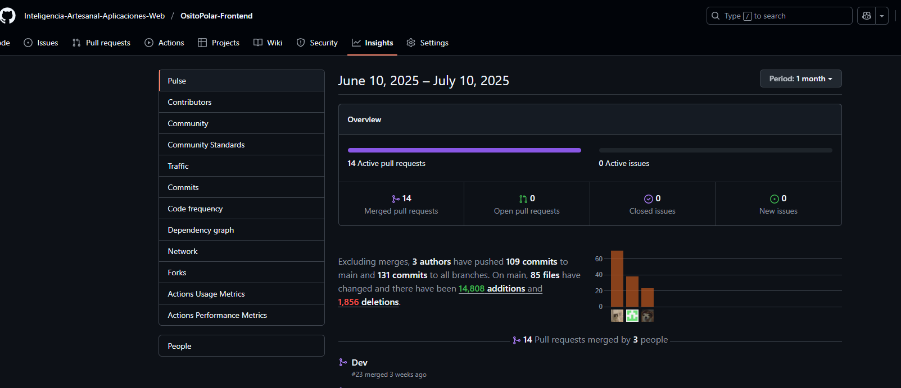

- **URL del repositorio del backend del proyecto:**  
  [https://github.com/##########/OsitoPolar-Platform](https://github.com/############/OsitoPolar-Platform)
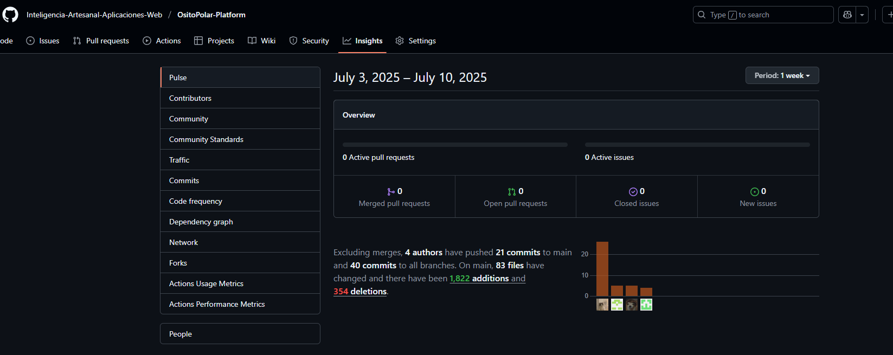

## Contenido

- [Student Outcome](#student-outcome)

- [Capítulo I: Introducción](#c1)
    - [1.1. Startup Profile](#11-startup-profile)
        - [1.1.1. Descripción de la Startup](#111-descripción-de-la-startup)
        - [1.1.2. Perfiles de integrantes del equipo](#112-perfiles-de-integrantes-del-equipo)
    - [1.2. Solution Profile](#12-solution-profile)
        - [1.2.1 Antecedentes y problemática](#121-antecedentes-y-problemática)
        - [1.2.2 Lean UX Process](#122-lean-ux-process)
            - [1.2.2.1. Lean UX Problem Statements](#1221-lean-ux-problem-statements)
            - [1.2.2.2. Lean UX Assumptions](#1222-lean-ux-assumptions)
            - [1.2.2.3. Lean UX Hypothesis Statements](#1223-lean-ux-hypothesis-statements)
            - [1.2.2.4. Lean UX Canvas](#1224-lean-ux-canvas)
    - [1.3. Segmentos objetivo](#13-segmentos-objetivo)

- [Capítulo II: Requirements Elicitation & Analysis](#c2)
    - [2.1. Competidores](#21-competidores)
        - [2.1.1. Análisis competitivo](#211-análisis-competitivo)
        - [2.1.2. Estrategias y tácticas frente a competidores](#212-estrategias-y-tácticas-frente-a-competidores)
    - [2.2. Entrevistas](#22-entrevistas)
        - [2.2.1. Diseño de entrevistas](#221-diseño-de-entrevistas)
        - [2.2.2. Registro de entrevistas](#222-registro-de-entrevistas)
        - [2.2.3. Análisis de entrevistas](#223-análisis-de-entrevistas)
    - [2.3. Needfinding](#23-needfinding)
        - [2.3.1. User Personas](#231-user-personas)
        - [2.3.2. User Task Matrix](#232-user-task-matrix)
        - [2.3.3. User Journey Mapping](#233-user-journey-mapping)
        - [2.3.4. Empathy Mapping](#234-empathy-mapping)
        - [2.3.5. As-is Scenario Mapping](#235-as-is-scenario-mapping)
    - [2.4. Ubiquitous Language](#24-ubiquitous-language)

- [Capítulo III: Requirements Specification](#c3)
    - [3.1. To-Be Scenario Mapping](#31-to-be-scenario-mapping)
    - [3.2. User Stories](#32-user-stories)
    - [3.3. Impact Mapping](#33-impact-mapping)
    - [3.4. Product Backlog](#34-product-backlog)

- [Capítulo IV: Product Design](#c4)
    - [4.1. Style Guidelines](#41-style-guidelines)
        - [4.1.1. General Style Guidelines](#411-general-style-guidelines)
        - [4.1.2. Web Style Guidelines](#412-web-style-guidelines)
    - [4.2. Information Architecture](#42-information-architecture)
        - [4.2.1. Organization Systems](#421-organization-systems)
        - [4.2.2. Labeling Systems](#422-labeling-systems)
        - [4.2.3. SEO Tags and Meta Tags](#423-seo-tags-and-meta-tags)
        - [4.2.4. Searching Systems](#424-searching-systems)
        - [4.2.5. Navigation Systems](#425-navigation-systems)
    - [4.3. Landing Page UI Design](#43-landing-page-ui-design)
        - [4.3.1. Landing Page Wireframe](#431-landing-page-wireframe)
        - [4.3.2. Landing Page Mock-up](#432-landing-page-mock-up)
    - [4.4. Web Applications UX/UI Design](#44-web-applications-uxui-design)
        - [4.4.1. Web Applications Wireframes](#441-web-applications-wireframes)
        - [4.4.2. Web Applications Wireflow Diagrams](#442-web-applications-wireflow-diagrams)
        - [4.4.3. Web Applications Mock-ups](#443-web-applications-mock-ups)
        - [4.4.4. Web Applications User Flow Diagrams](#444-web-applications-user-flow-diagrams)
    - [4.5. Web Applications Prototyping](#45-web-applications-prototyping)
    - [4.6. Domain-Driven Software Architecture](#46-domain-driven-software-architecture)
        - [4.6.1. Software Architecture Context Diagram](#461-software-architecture-context-diagram)
        - [4.6.2. Software Architecture Container Diagrams](#462-software-architecture-container-diagrams)
        - [4.6.3. Software Architecture Components Diagrams](#463-software-architecture-components-diagrams)
    - [4.7. Software Object-Oriented Design](#47-software-object-oriented-design)
        - [4.7.1. Class Diagrams](#471-class-diagrams)
        - [4.7.2. Class Dictionary](#472-class-dictionary)
    - [4.8. Database Design](#48-database-design)
        - [4.8.1. Database Diagram](#481-database-diagram)

- [Capítulo V: Product Implementation, Validation & Deployment](#c5)
    - [5.1. Software Configuration Management](#51-software-configuration-management)
        - [5.1.1. Software Development Environment Configuration](#511-software-development-environment-configuration)
        - [5.1.2. Source Code Management](#512-source-code-management)
        - [5.1.3. Source Code Style Guide & Conventions](#513-source-code-style-guide--conventions)
        - [5.1.4. Software Deployment Configuration](#514-software-deployment-configuration)
    - [5.2. Landing Page, Services & Applications Implementation](#52-landing-page-services--applications-implementation)
        - [5.2.1. Sprint 1](#521-sprint-1)
            - [5.2.1.1. Sprint Planning 1](#5211-sprint-planning-1)
            - [5.2.1.2. Aspect Leaders and Collaborators](#5212-aspect-leaders-and-collaborators)
            - [5.2.1.3. Sprint Backlog 1](#5213-sprint-backlog-1)
            - [5.2.1.4. Development Evidence for Sprint Review](#5214-development-evidence-for-sprint-review)
            - [5.2.1.5. Execution Evidence for Sprint Review](#5215-execution-evidence-for-sprint-review)
            - [5.2.1.6. Services Documentation Evidence for Sprint Review](#5216-services-documentation-evidence-for-sprint-review)
            - [5.2.1.7. Software Deployment Evidence for Sprint Review](#5217-software-deployment-evidence-for-sprint-review)
            - [5.2.1.8. Team Collaboration Insights during Sprint](#5218-team-collaboration-insights-during-sprint)
        - [5.2.2. Sprint 2](#522-sprint-2)
            - [5.2.2.1. Sprint Planning 2](#5221-sprint-planning-2)
            - [5.2.2.2. Aspect Leaders and Collaborators](#5222-aspect-leaders-and-collaborators)
            - [5.2.2.3. Sprint Backlog 2](#5223-sprint-backlog-2)
            - [5.2.2.4. Development Evidence for Sprint Review](#5224-development-evidence-for-sprint-review)
            - [5.2.2.5. Execution Evidence for Sprint Review](#5225-execution-evidence-for-sprint-review)
            - [5.2.2.6. Services Documentation Evidence for Sprint Review](#5226-services-documentation-evidence-for-sprint-review)
            - [5.2.2.7. Software Deployment Evidence for Sprint Review](#5227-software-deployment-evidence-for-sprint-review)
            - [5.2.2.8. Team Collaboration Insights during Sprint](#5228-team-collaboration-insights-during-sprint)
        - [5.2.3. Sprint 3](#523-sprint-3)
            - [5.2.3.1. Sprint Planning 3](#5231-sprint-planning-3)
            - [5.2.3.2. Aspect Leaders and Collaborators](#5232-aspect-leaders-and-collaborators)
            - [5.2.3.3. Sprint Backlog 3](#5233-sprint-backlog-3)
            - [5.2.3.4. Development Evidence for Sprint Review](#5234-development-evidence-for-sprint-review)
            - [5.2.3.5. Execution Evidence for Sprint Review](#5235-execution-evidence-for-sprint-review)
            - [5.2.3.6. Services Documentation Evidence for Sprint Review](#5236-services-documentation-evidence-for-sprint-review)
            - [5.2.3.7. Software Deployment Evidence for Sprint Review](#5237-software-deployment-evidence-for-sprint-review)
            - [5.2.3.8. Team Collaboration Insights during Sprint](#5238-team-collaboration-insights-during-sprint)
        - [5.2.4. Sprint 4](#524-sprint-4)
            - [5.2.4.1. Sprint Planning 4](#5241-sprint-planning-4)
            - [5.2.4.2. Aspect Leaders and Collaborators](#5242-aspect-leaders-and-collaborators)
            - [5.2.4.3. Sprint Backlog 4](#5243-sprint-backlog-4)
            - [5.2.4.4. Development Evidence for Sprint Review](#5244-development-evidence-for-sprint-review)
            - [5.2.4.5. Execution Evidence for Sprint Review](#5245-execution-evidence-for-sprint-review)
            - [5.2.4.6. Services Documentation Evidence for Sprint Review](#5246-services-documentation-evidence-for-sprint-review)
            - [5.2.4.7. Software Deployment Evidence for Sprint Review](#5247-software-deployment-evidence-for-sprint-review)
            - [5.2.4.8. Team Collaboration Insights during Sprint](#5248-team-collaboration-insights-during-sprint)
    - [5.3. Validation Interviews](#53-validation-interviews)
        - [5.3.1. Diseño de Entrevistas](#531-diseño-de-entrevistas)
        - [5.3.2. Registro de Entrevistas](#532-registro-de-entrevistas)
        - [5.3.3. Evaluaciones según heurísticas](#533-evaluaciones-según-heurísticas)
    - [5.4. Video About-the-Product](#54-video-about-the-product)
- [Conclusiones](#conclusiones)
- [Bibliografía](#bibliografía)
- [Anexos](#anexos)

## Student Outcome
El curso contribuye al cumplimiento del Student Outcome ABET:

**ABET – EAC - Student Outcome 5**

**Criterio**: *La capacidad de funcionar efectivamente en un equipo cuyos miembros
juntos proporcionan liderazgo, crean un entorno de colaboración e inclusivo,
establecen objetivos, planifican tareas y cumplen objetivos.*

En el siguiente cuadro se describe las acciones realizadas y enunciados de
conclusiones por parte del grupo, que permiten sustentar el haber alcanzado el logro
del ABET – EAC - Student Outcome 5.

| Criterio específico                                                    | Acciones realizadas                                                                                                                                                                                                    | Conclusiones                          |
| :--------------------------------------------------------------------- | :--------------------------------------------------------------------------------------------------------------------------------------------------------------------------------------------------------------------- | :------------------------------------ |
| Trabaja en equipo para proporcionar liderazgo en forma conjunta.       | **Cacho Seminario, Diego Alonso** TB1: Para el desarrollo de la TB1, aporte creando los documentos de exposicion, reporte de participación y además prepare el reporte principal con los items anteriores para la entrega.   **Mora Blas, Diego Alonzo** TB1: .  **Hernandez Poma, Sebastian Eduardo** TB1: .  **########, #########** TB1: .  **##########, ############** TB1: . | Durante la TB1, el equipo logró realizar las primeras partes del trabajo, verificamos el funcionamiento del proyecto junto al su escalabilidad con soluciones basadas en IoT. |
| Participación y colaboración en plataformas y herramientas de trabajo. | **Cacho Seminario, Diego Alonso** TB1: Como primera entrega utilice las herramientas de Github y Canva para poder redactar y crear la información necesaria para el trabajo de Osito Polar.  **Mora Blas, Diego Alonzo** TB1: .  **Hernandez Poma, Sebastian Eduardo** TB1: .  **########, #########** TB1: .  **##########, ############** TB1: . | Durante la TB1, el equipo logró utilizar las herramientas apropiadas para la entrega, se uso GitHub como repositorio principal para el proyecto, Google Docs para el reporte de participación y Canva como herramienta para crear el video de exposición. . |

# Capitulo 1: Introducción

## 1.1 Startup Profile

### 1.1.1 Descripción de la Startup

OsitoPolar es una aplicación web orientada a mejorar la gestión y el mantenimiento de equipos de congelación en negocios que dependen críticamente del frío, como supermercados, minimarkets, laboratorios, restaurantes y empresas del sector alimentario o farmacéutico. La solución conecta a estos negocios con técnicos y proveedores especializados en refrigeración, permitiendo una gestión integral, preventiva y automatizada de sus sistemas de congelación.

La plataforma ofrece funcionalidades clave como monitoreo en tiempo real de temperatura, consumo energético y tiempo de uso, generación de reportes técnicos, alertas automatizadas por fallas, historial de rendimiento y programación inteligente de mantenimientos. Estas herramientas están diseñadas para ayudar a negocios que dependen del uso de sistemas de refrigeración, técnicos especializados en refrigeración y proveedores de equipos a optimizar sus operaciones, evitar pérdidas económicas por fallas inesperadas y mantener un registro completo del estado y uso de sus equipos.

Misión: Nuestra misión en OsitoPolar es proporcionar una solución tecnológica inteligente que permita a los negocios proteger su inventario y optimizar la gestión de sus equipos de refrigeración, ofreciendo al mismo tiempo herramientas especializadas para mejorar la eficiencia operativa de los técnicos y proveedores del sector.

Visión: Queremos ser la empresa lider en gestión y mantenimiento de equipos de refrigeración, empezando por Lima y prontamente expandirnos a más lugares del Perú.

### 1.1.2 Perfiles de integrantes del equipo

| **Integrante**            | **Diego Alonzo Mora Blas**                                                                                                                                                                                                                                                                                                                                                                                                     |
| ------------------------- | ------------------------------------------------------------------------------------------------------------------------------------------------------------------------------------------------------------------------------------------------------------------------------------------------------------------------------------------------------------------------------------------------------------------------------ |
| **Código del Estudiante** | U20231c069                                                                                                                                                                                                                                                                                                                                                                                                                     |
| **Carrera**               | Ingeniería de Software                                                                                                                                                                                                                                                                                                                                                                                                         |
| **Descripción**           | Estudiante de Ingenieria de Software cursando el 7mo ciclo de mi carrera en la UPC. Soy una persona la cual aprende rapido y se adapta con gran facilidad al contexto del proyecto. Como miembro de equipo he realizado cursos de Ciberseguridad llegando a poder realizar pruebas de penetraciones de nivel intermedio ademas de conocimientos en multiples vulnerabilidad y manejos de diferentes lenguajes de programacion. |
| **Foto**                  |                                                                                                                                                                                                                                                                                                                                       |

---

| **Integrante**            | **Diego Alonso Cacho Seminario**                                                                                                                                                                                                                                                                                                                                                                                                                                                                                           |
| ------------------------- | -------------------------------------------------------------------------------------------------------------------------------------------------------------------------------------------------------------------------------------------------------------------------------------------------------------------------------------------------------------------------------------------------------------------------------------------------------------------------------------------------------------------------- |
| **Código del Estudiante** | U202223990                                                                                                                                                                                                                                                                                                                                                                                                                                                                                                                 |
| **Carrera**               | Ingeniería de Software                                                                                                                                                                                                                                                                                                                                                                                                                                                                                                     |
| **Descripción**           | Soy estudiante de Ingeniería de Software cursando el 7mo ciclo de mi carrera en la UPC y tengo 21 años. Me considero una persona tranquila y diligente, intentó realizar mis tareas y trabajos lo antes posible para evitar contratiempos en un futuro, especialmente si son actividades que consumen mucho tiempo. Como miembro de equipo buscaré ayudar a mis compañeros cuando lo necesiten, realizando además mis entregas lo más temprano posible. Habilidades en C++, C#, Python, Flutter, Unity 2D/3D, html/css/js. |
| **Foto**                  |                                                                                                                                                                                                                                                                                                                                                                                                                                   |

---

| **Integrante** | **Hernandez Poma, SebastIan Eduardo** |
|----------------|----------------------------------|
| **Código del Estudiante** | U20231C996 |
| **Carrera** | Ingeniería de Software |
| **Descripción** | Estudiante de Ingeniería de Software con interés en el desarrollo de soluciones tecnológicas innovadoras y enfocadas en la experiencia del usuario. Destaca por su orientación al aprendizaje continuo, la resolución de problemas y la aplicación de metodologías modernas en proyectos de software. Posee habilidades en análisis, diseño y desarrollo de aplicaciones, así como una visión estratégica para integrar tecnología y creatividad en entornos profesionales. |
| **Foto** |  |

---

| **Integrante** | **Christian Fabrizio Inga Orihuela** |
|----------------|----------------------------------|
| **Código del Estudiante** | U20231C111 |
| **Carrera** | Ingeniería de Software |
| **Descripción** | Tengo 20 años y actualmente me encuentro cursando el séptimo ciclo de la carrera de ingeniería de software. Cuento con una gran disposición para el trabajo colaborativo y la capacidad de adaptarme rápidamente a diferentes metodologías de aprendizaje y dinámicas de grupo, asegurando siempre un desempeño confiable y organizado. |
| **Foto** |  |

---

| **Integrante** | **##################** |
|----------------|----------------------------------|
| **Código del Estudiante** | U########### |
| **Carrera** | Ingeniería de Software |
| **Descripción** | ################. |
| **Foto** |  |

## 1.2 Solution Profile

### 1.2.1 Antecedentes y Problematica

| Las 5Ws y 2Hs | Pregunta                                           | Descripción                                                                                                                                                                                                                                                                                                                                                                                    |
|---------------|----------------------------------------------------|------------------------------------------------------------------------------------------------------------------------------------------------------------------------------------------------------------------------------------------------------------------------------------------------------------------------------------------------------------------------------------------------|
| What?         | ¿Cuál es el problema?                              | Actualmente, los negocios que dependen de equipos de congelación enfrentan grandes desafíos operativos ante fallas inesperadas o falta de mantenimiento. Las fallas térmicas, los altos consumos energéticos no detectados a tiempo y la ausencia de un monitoreo constante pueden derivar en la pérdida de productos, reducción de la calidad del servicio y pérdidas económicas importantes. |
| When?         | ¿Cuándo sucede este problema?                      | Estas situaciones ocurren principalmente durante horarios de operación continua, especialmente en momentos donde no hay personal técnico disponible de forma inmediata, o cuando no se ha realizado un seguimiento adecuado del estado del equipo a lo largo del tiempo.                                                                                                                       |
| Where?        | ¿Dónde se produce este suceso?                     | El problema afecta a negocios ubicados en todo el país, principalmente en Lima, donde la cadena de frío es esencial en sectores como alimentación, medicina y distribución. También impacta a empresas proveedoras de refrigeración que atienden múltiples clientes sin una plataforma centralizada de control.                                                                                |
| Who?          | ¿Quiénes están involucrados?                       | Están involucrados tanto los administradores y dueños de negocios que utilizan congeladoras como los técnicos y empresas proveedoras de servicios de refrigeración.                                                                                                                                                                                                                            |
| Why?          | ¿Cuál es la causa del problema?                    | La causa principal es la falta de soluciones tecnológicas accesibles que integren monitoreo, alertas, historial y programación automática en un solo lugar. Muchas empresas aún dependen de sistemas manuales o no tienen control de lo que sucede con sus equipos hasta que ocurre una falla crítica.                                                                                         |
| How?          | ¿Qué llevó a la persona a llegar a esta situación? | Lo que llevó a los negocios y técnicos a este punto ha sido la acumulación de imprevistos y la falta de digitalización en el mantenimiento preventivo, que genera una alta dependencia de intervenciones reactivas en vez de planificadas. Esto incrementa los costos, los tiempos de respuesta y el desgaste operativo.                                                                       |
| How much?     | ¿Cuánto es el impacto financiero?                  | Aunque el impacto económico varía según el tipo de negocio, la pérdida por una falla en un equipo de refrigeración puede ascender desde cientos hasta miles de soles en productos dañados, sin considerar el tiempo operativo perdido, la pérdida de clientes y la inversión en reparación o reposición de equipos.                                                                            |

### 1.2.2 Lean UX Process

#### 1.2.2.1 Lean UX Problem Statements

El estado actual de la industria de la refrigeración comercial y técnica enfrenta importantes desafíos relacionados con la gestión, el mantenimiento y la trazabilidad de los equipos de congelación. Negocios que dependen críticamente del frío —como supermercados, minimarkets, laboratorios, restaurantes y empresas del sector alimentario o farmacéutico— aún lidian con la falta de monitoreo en tiempo real y con procesos de mantenimiento reactivos. Esto genera pérdidas económicas, ineficiencia energética y riesgos para el inventario.

Lo que las soluciones actuales no logran abordar es la necesidad de una plataforma confiable y automatizada que permita una gestión centralizada, predictiva y transparente tanto para los negocios como para los técnicos y proveedores de refrigeración. La falta de historial técnico accesible, reportes detallados y alertas preventivas limita la capacidad de respuesta ante fallas y deteriora la calidad del servicio técnico ofrecido.

**OsitoPolar** cierra esta brecha al ofrecer una solución tecnológica integral que conecta negocios con técnicos especializados, brindando funcionalidades como monitoreo en tiempo real de temperatura y consumo, programación inteligente de mantenimientos, alertas por fallas, reportes automáticos y trazabilidad completa de cada equipo. Además, proporciona a los proveedores de servicios un módulo para visualizar y gestionar eficientemente los equipos que atienden, organizar visitas y acceder al historial técnico de manera ágil.

Nuestro enfoque inicial está en los negocios de Lima que necesitan asegurar el funcionamiento óptimo de sus sistemas de congelación, así como en los proveedores que buscan profesionalizar y escalar su servicio con herramientas digitales modernas.

Sabremos que hemos tenido éxito cuando observemos una reducción en fallas imprevistas, una optimización del consumo energético, mayor eficiencia operativa por parte de los técnicos especializados y un incremento en la satisfacción de los clientes finales. Esto se evidenciará en la continuidad del servicio y en la fidelización de los negocios que dependen de sistemas de refrigeración, técnicos especializados y proveedores de equipos que utilizan la plataforma.

#### 1.2.2.2 Lean UX Assumption

# Business Outcomes

- Aumentar en al menos un 15% la cantidad de negocios que dependen del uso de sistemas de refrigeración, técnicos especializados en refrigeración y proveedores de equipos activos dentro de la aplicación.

- Lograr una mayor visibilidad de la plataforma OsitoPolar a través de redes sociales, especialmente entre negocios de alimentos y técnicos de refrigeración.

- Generar confianza y seguridad en estos actores respecto al monitoreo y mantenimiento automatizado de sus sistemas de refrigeración.

- Mantener informados a los usuarios finales —negocios, técnicos y proveedores— sobre incidentes recientes como fallas térmicas, cortes de energía o uso irregular de los equipos.

- Alcanzar una base sólida de clientes dispuestos a pagar por una membresía premium que incluya mantenimiento predictivo, reportes personalizados y soporte técnico prioritario.

- Establecer alianzas estratégicas con plataformas como Google Maps o servicios de geolocalización para ampliar el alcance de cobertura y optimizar la programación de visitas técnicas.

- Fomentar la participación activa de negocios, técnicos y proveedores mediante encuestas, valoraciones de técnicos y comentarios sobre el desempeño de los equipos.

- Diseñar una interfaz limpia, simple e intuitiva que garantice una experiencia fluida y atractiva para nuevos usuarios del sector, evitando la sobrecarga visual o de funcionalidades.

- Implementar inteligencia artificial que permita trazar estrategias de mantenimiento inteligente, rutas eficientes para los técnicos y recomendaciones proactivas ante posibles fallos.

# User Outcomes

## ¿Quién será nuestro usuario?

- **Negocios que dependen críticamente del uso de sistemas de refrigeración** como supermercados, minimarkets, restaurantes, laboratorios y empresas del rubro alimentario y farmacéutico.
- **Técnicos especializados en refrigeración** que brindan mantenimiento a dichos sistemas.
- **Proveedores de equipos de refrigeración** que desean ofrecer un servicio posventa más eficiente.

## ¿Dónde encaja nuestro producto en su vida?

- En situaciones donde los negocios necesitan garantizar la continuidad operativa de sus equipos de frío, evitando pérdidas económicas por fallas imprevistas.
- En el día a día de técnicos de refrigeración que deben gestionar múltiples clientes, visitas y mantenimientos.
- En la operación diaria de los negocios que necesitan registros y reportes precisos del desempeño de sus sistemas de refrigeración.

## ¿Qué problemas tiene nuestro producto y cómo se pueden resolver?

- El principal desafío es asegurar que los datos de monitoreo (temperatura, consumo energético, fallas, etc.) sean precisos, actualizados y confiables.
    -   Solución: Se debe integrar sensores calibrados y sistemas de verificación automática que validen las lecturas antes de almacenarlas.

- Otro problema puede ser la adopción inicial de la plataforma por parte de negocios que dependen del uso de sistemas de refrigeración, técnicos especializados en refrigeración y proveedores de equipos que no están familiarizados con la tecnología.
    - Solución: Esto se abordará con una interfaz sencilla, explicaciones paso a paso y soporte técnico accesible.

## ¿Cómo y Cuándo es usado nuestro producto?

- Se accede desde la aplicación web, tanto desde computadoras como dispositivos móviles.
- Se utiliza diariamente para monitorear el estado de los equipos de frío, recibir alertas, programar mantenimientos o revisar el historial técnico.
- También se activa automáticamente en segundo plano cuando se integran sensores de monitoreo con la plataforma.

## ¿Qué problemas tiene nuestro producto?

- En sus etapas iniciales, puede carecer de ciertas integraciones con hardware de terceros.
- Algunos negocios que dependen del uso de sistemas de refrigeración, técnicos especializados o proveedores de equipos pueden requerir capacitación para comprender todas las funcionalidades avanzadas.
- También podría haber desafíos para que los técnicos adopten el uso digital en lugar del método tradicional.

## ¿Qué características son importantes para la app?

- Monitoreo en tiempo real de temperatura, consumo energético y tiempo de uso.
- Alertas automáticas por fallas detectadas en los equipos.
- Historial técnico completo con reportes exportables en PDF.
- Calendario de mantenimiento preventivo con notificaciones programadas.
- Módulo exclusivo para técnicos con gestión de visitas y clientes.
- Soporte técnico inteligente y recomendaciones predictivas mediante IA.
- Registro de múltiples ubicaciones y usuarios con distintos roles.
- Interfaz intuitiva y minimalista para garantizar fácil adopción.

## ¿Cómo debe verse nuestro producto y cómo comportarse?

- **Interfaz amigable y confiable**: Negocios que dependen del uso de sistemas de refrigeración, así como, técnicos especializados y proveedores de equipos deben sentirse seguros al usar la aplicación. La interfaz debe ser clara, ordenada y fácil de navegar, sin sobrecargar de información, con gráficos e indicadores intuitivos.
- **Diseño centrado en tareas críticas**: Desde el primer acceso, negocios que dependen del uso de sistemas de refrigeración, técnicos especializados y proveedores de equipos deben poder ver si hay fallas, cuándo es la próxima visita técnica, y acceder rápidamente a los reportes y al historial de sus equipos.
- **Accesibilidad multiplataforma**: Disponible en web y móvil, adaptable para quienes trabajan tanto en oficina como en campo. Notificaciones inmediatas ante cualquier problema detectado.
- **Simplicidad**: La app debe permitirles gestionar sus negocios, equipos en riesgo y visitas programadas, todo desde un panel centralizado. También pueden agendar visitas y generar reportes técnicos en segundos.

## ¿Qué valor busca el cliente?

- **Gestión técnica simplificada**: Los proveedores y técnicos buscan dejar de ser reactivos. OsitoPolar los vuelve proactivos con mantenimiento predictivo, historiales claros y clientes organizados.
- **Seguridad operativa y cero sorpresas**: Los negocios quieren evitar pérdidas por fallas en frío. OsitoPolar les da monitoreo constante, alertas automáticas y control total sobre sus equipos.
- **Eficiencia energética y trazabilidad**: Los dueños quieren saber si sus equipos consumen de más, si están rindiendo mal, o si un componente ya debería ser reemplazado. El sistema lo identifica antes que ocurra el fallo.

## ¿Qué beneficios adicionales obtendrá el cliente?

- Visibilidad total del estado de sus equipos, desde cualquier lugar, en cualquier momento.
- Soporte técnico más ágil gracias al historial previo y alertas automáticas.
- Menores costos operativos gracias a mantenimientos a tiempo y mayor eficiencia energética.
- Reportes personalizados y exportables.
- Automatización de visitas técnicas cuando se detectan patrones de falla.

## ¿Cómo atraeremos usuarios?

- **Marketing dirigido a nichos clave**: Supermercados, restaurantes y empresas de frío serán contactados directamente mediante LinkedIn, correos y llamadas estratégicas.
- **Alianzas con proveedores de equipos**: Trabajaremos con empresas que venden congeladoras o cámaras frigoríficas para que incluyan OsitoPolar en sus paquetes posventa.
- **Prueba gratuita de versiones de pago**: Un modelo de 14 días gratis con monitoreo limitado para mostrar el valor de la plataforma en tiempo real.

## ¿Cómo generaremos ingresos?

- **Suscripción mensual de negocios**: Por el uso de la plataforma, según número de equipos, tipo de reportes y funcionalidades.
- **Modelo freemium**: Habrá una versión gratuita que brindará algunas funciones limitadas, pero con anuncios, lo que generará ingresos adicionales.
- **Publicidad dirigida (opcional)**: Marcas de refrigeración podrían pagar por visibilidad dentro de la plataforma si se llega a una masa crítica de técnicos y negocios.

## ¿Cuál es nuestra competencia y cómo la superamos?

- **Competencia**: Las principales competidoras son aplicaciones relacionadas con la gestión de datos y orientada al servicio técnico de mantenimiento de equipos de refrigeración.
- **Nuestra ventaja**: OsitoPolar fue diseñado exclusivamente para negocios que dependen de equipos de frío. No somos una herramienta genérica, somos expertos en el nicho. No solo registramos visitas o mantenimientos, también detectamos anomalías en tiempo real, generamos alertas y automatizamos acciones.

## ¿Cuál es nuestro mayor riesgo?

- **Adopción lenta por parte del personal tradicional**: Algunos proveedores aún dependen de agendas físicas o Excel y podrían resistirse al cambio.
- **Falta de adopción inicial**: La dificultad para convencer a los negocios que dependen del uso de sistemas de refrigeración, técnicos especializados y proveedores de equipos de que la app es útil y confiable puede retrasar su adopción.
- **Desconfianza en la precisión de los sensores**: Si los datos no son confiables, la plataforma pierde valor

## ¿Cómo lo resolveremos?

- **Algoritmos de validación**: Implementaremos algoritmos de IA que verifiquen la información y filtren los reportes ambiguos o antiguos, garantizando solo datos confiables y actuales.
- **Capacitación y soporte**: Para resolver la falta de adopción, ofreceremos tutoriales interactivos, videos explicativos y soporte técnico accesible para que negocios que dependen del uso de sistemas de refrigeración, técnicos especializados y proveedores de equipos se familiaricen con las funciones.
- **Estrategia progresiva de integraciones**: Comenzaremos con los equipos más usados y luego ampliaremos compatibilidad mediante APIs y alianzas con fabricantes.
- **Sensores certificados**: Solo se integrarán sensores probados.

#### 1.2.2.2 Lean UX Hypothesis Statements

**Hipótesis 1: Eficiencia operativa y reducción de fallas inesperadas**

Creemos que al ofrecer una plataforma integral que unifique todas las funciones de monitoreo, mantenimiento y gestión técnica de equipos de refrigeración, aumentaremos la eficiencia operativa de los negocios y proveedores del sector, reduciendo la complejidad y el riesgo de fallas inesperadas.  
Sabremos que estamos en lo correcto cuando veamos un aumento en la cantidad de negocios que reportan menos incidencias por fallas térmicas, así como una mejora en la planificación de sus mantenimientos preventivos.

---

**Hipótesis 2: Control de pérdidas operativas y consumo energético**

Creemos que el control de pérdidas operativas y el consumo energético es una prioridad para los negocios que dependen del uso de sistemas de refrigeración, técnicos especializados y proveedores de equipos; por lo tanto, al proporcionar herramientas de análisis de rendimiento y alertas automatizadas, mejoraremos su capacidad para actuar de manera preventiva y reducir costos innecesarios.  
Sabremos que estamos en lo correcto cuando observemos una adopción creciente de nuestras funcionalidades de monitoreo en tiempo real y reportes técnicos, así como una disminución en las pérdidas económicas por interrupciones del sistema de refrigeración.

---

**Hipótesis 3: Mejora en el servicio técnico personalizado y predictivo**

Creemos que al proporcionar reportes técnicos automáticos, históricos de uso y rendimiento por equipo, permitiremos a los técnicos y empresas proveedoras ofrecer un servicio personalizado y predictivo, mejorando la calidad del soporte brindado a sus clientes.  
Sabremos que estamos en lo correcto cuando recibamos retroalimentación positiva de técnicos sobre la utilidad de los reportes y el historial, y cuando sus clientes reporten mayor satisfacción con la rapidez y eficacia del servicio técnico.

---

**Hipótesis 4: Trazabilidad y protección de la información técnica**

Creemos que al garantizar la trazabilidad de todas las acciones realizadas sobre cada unidad de refrigeración, así como la protección de la información técnica en la plataforma, construiremos confianza entre negocios y proveedores de servicios.  

---

**Hipótesis 5: Transición a una gestión moderna de refrigeración**

Creemos que al ofrecer una solución digital intuitiva y especializada tanto para negocios como para técnicos, facilitaremos la transición hacia una gestión moderna de refrigeración, minimizando la curva de aprendizaje.  
Sabremos que estamos en lo correcto cuando observemos una rápida adopción de nuestra plataforma, baja tasa de abandono y una mayor frecuencia de uso de las funcionalidades clave por parte de usuarios nuevos y recurrentes.

#### 1.2.2.4 Lean UX Canvas

El presente Lean UX Canvas se ha desarrollado para ofrecer una visión estratégica y concisa de la solución OsitoPolar. Este marco nos permite alinear rápidamente los objetivos de negocio con las necesidades de nuestros usuarios y las hipótesis clave que guían nuestro desarrollo.
A través de este lienzo, hemos desglosado el problema central que enfrentan los negocios que dependen de equipos de refrigeración, definido las soluciones propuestas y anticipado los resultados que esperamos alcanzar.
Asimismo, hemos identificado a nuestros usuarios clave y sus beneficios, y hemos establecido una serie de hipótesis que nos permitirán validar nuestro enfoque con la mínima inversión de tiempo y recursos posible, asegurando que cada paso que demos esté centrado en generar valor real.

<figure style="page-break-inside: avoid; text-align: center;">
  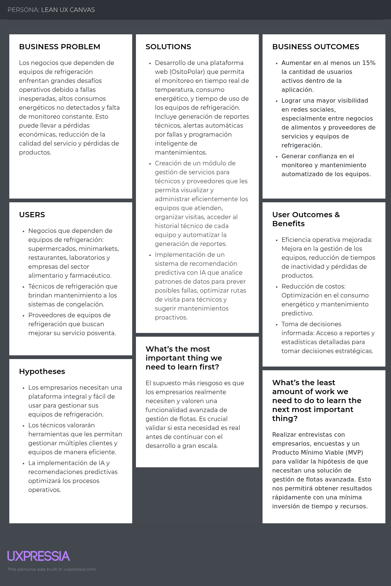
  <figcaption style="font-size: 0.9em; color: #555;">
    <strong>Figura 1:</strong> Lean UX Canvas.
  </figcaption>
</figure>

## 1.3 Segmentos objetivos

**Segmento Objetivo #1: Negocios que utilizan equipos de refrigeración**

**Aspectos demográficos:**
- **Tipo de negocio**: Pequeñas, medianas y grandes empresas
- **Rubro**: Alimentario, farmacéutico, restauración y comercio minorista
- **Nivel de necesidad**: Alta dependencia de sistemas de refrigeración

**Aspectos geográficos:**
- **Nacionalidad**: Peruana
- **Zona geográfica**: Urbana
- **Departamento**: Lima (con proyección de expansión nacional)

**Aspectos psicográficos:**
- Empresas que buscan evitar pérdidas económicas por fallas en refrigeración.
- Negocios que requieren control eficiente del consumo energético.
- Administradores interesados en implementar tecnología para optimizar sus operaciones y mantener la calidad del inventario.

---

**Segmento Objetivo #2: Empresas proveedoras de servicios y equipos de refrigeración**

**Aspectos demográficos:**
- **Tipo de empresa**: Técnicos independientes, PYMES y proveedores especializados en refrigeración.
- **Rol**: Técnicos de mantenimiento, instaladores, empresas de soporte técnico.

**Aspectos geográficos:**
- **Nacionalidad**: Peruana
- **Zona geográfica**: Urbana
- **Departamento**: Lima (con visión de expansión a nivel nacional)

**Aspectos psicográficos:**
- Técnicos que desean organizar sus visitas de forma eficiente y centralizada.
- Empresas que buscan mejorar la trazabilidad de sus servicios y ofrecer reportes automáticos.
- Profesionales que desean brindar un servicio más personalizado y predictivo a sus clientes.

## Capítulo II: Requirements Elicitation & Analysis 

### 2.1. Competidores

**Competidor 1: ServiceTitan**
ServiceTitan es una plataforma de gestión de servicios basada en la nube que ofrece soluciones de software para empresas de servicios, incluidos técnicos de HVAC, fontaneros y electricistas. Proporciona funcionalidades de programación, gestión de trabajos, facturación y más. Esta plataforma es conocida por su facilidad de uso y por ayudar a las empresas a optimizar sus operaciones de servicio técnico en tiempo real.

---

**Competidor 2: CoolMaster**
CoolMaster es una solución de software diseñada específicamente para el sector de refrigeración comercial. Ofrece monitoreo remoto de sistemas de refrigeración, alertas tempranas de fallas y gestión eficiente del consumo energético. La plataforma está orientada a optimizar la eficiencia operativa de negocios que dependen críticamente de sistemas de frío, como supermercados y centros de distribución.

---

**Competidor 3: TempGenius**
TempGenius es un software de monitoreo de temperatura y humedad en tiempo real para diversas industrias, incluida la de la refrigeración comercial. Permite a los usuarios realizar un seguimiento de sus equipos de refrigeración mediante sensores conectados a la nube, generar reportes y recibir alertas automáticas por variaciones en los niveles de temperatura. Su principal enfoque es mejorar la visibilidad y control de las operaciones de refrigeración para evitar pérdidas económicas.

#### 2.1.1. Análisis competitivo

<table> 
  <tr>
    <th colspan="7"> Competitive Analysis Landscape </th>
  </tr>
  <tr>
    <td colspan="2" rowspan="2">¿Por qué llevar acabo este análisis? </td>
    <td colspan="5"> Pregunta </td>
  </tr>
  <tr>
    <td colspan="5"> Respuesta </td>
  </tr>
  <tr>
    <td colspan="2"> Productos </td>
    <td> OsitoPolar </td>
    <td> ServiceTitan </td>
    <td> CoolMaster </td>
    <td> TempGenius </td>
  </tr>
  <tr>
    <td rowspan="2">Perfil</td>
    <td>Overview</td>
    <td> OsitoPolar es una plataforma integral de monitoreo y gestión para sistemas de refrigeración, que conecta negocios con técnicos especializados. Ofrece monitoreo en tiempo real, alertas automáticas, mantenimiento preventivo, y trazabilidad de cada equipo. </td>
    <td> ServiceTitan es una plataforma de gestión de servicios basada en la nube que ofrece soluciones de software para empresas de servicios, incluidos técnicos de HVAC, fontaneros y electricistas. </td>
    <td> CoolMaster es una solución de software diseñada específicamente para el sector de refrigeración comercial. Ofrece monitoreo remoto de sistemas de refrigeración, alertas preventivas y gestión energética. </td>
    <td> TempGenius es un software de monitoreo de temperatura y humedad en tiempo real para diversas industrias, incluida la refrigeración comercial. Permite a los usuarios gestionar y recibir alertas automáticas sobre sus equipos. </td>
  </tr>
  <tr>
    <td>Ventaja competitiva ¿Qué valor ofrece a los clientes?</td>
    <td> Ofrece una solución automatizada y centralizada para negocios que necesitan monitorear y gestionar sus equipos de refrigeración. Permite a los técnicos optimizar sus visitas y el mantenimiento preventivo, mejorando la eficiencia operativa. </td>
    <td> Ofrece una plataforma todo-en-uno para la gestión de servicios con características como la programación de citas, facturación y seguimiento en tiempo real de proyectos. </td>
    <td> Ofrece soluciones específicas para la gestión de sistemas de refrigeración, con funcionalidades avanzadas de monitoreo, alertas y análisis de consumo energético. </td>
    <td> Ofrece monitoreo preciso en tiempo real de la temperatura y humedad, con alertas automáticas, y un enfoque especial en la fiabilidad y precisión de los datos. </td>
  </tr>
  <tr>
    <td rowspan="2">Perfil de Marketing</td>
    <td> Mercado Objetivo </td>
    <td> Negocios que dependen de sistemas de refrigeración, como supermercados, minimarkets, laboratorios, restaurantes, entre otros. También incluye técnicos de refrigeración y proveedores de equipos. </td>
    <td> Empresas de servicios como HVAC, fontaneros, electricistas, y otros proveedores de servicios técnicos. </td>
    <td> Negocios que dependen de sistemas de refrigeración como supermercados, laboratorios, restaurantes y otros en el sector alimentario y farmacéutico. </td>
    <td> Usuarios de diversas industrias, especialmente en áreas que requieren monitoreo continuo de temperatura y humedad, como el sector alimentario y farmacéutico. </td>
  </tr>
  <tr>
    <td> Estrategias de Marketing </td>
    <td> Marketing digital, colaboraciones estratégicas con empresas del sector alimentario y farmacéutico, demostraciones gratuitas y promociones en redes sociales. </td>
    <td> Marketing digital, colaboraciones con empresas de servicios y promoción en plataformas de negocio. </td>
    <td> Marketing dirigido a negocios en el sector alimentario y farmacéutico, con énfasis en la reducción de fallas y el ahorro energético. </td>
    <td> Marketing en redes sociales, promociones para nuevos usuarios y colaboraciones con industrias reguladas como la farmacéutica y alimentaria. </td>
  </tr>
  <tr>
    <td rowspan="3">Perfil de Producto</td>
    <td> Productos & Servicios </td>
    <td> Gestión de equipos de refrigeración en tiempo real, alertas automáticas, mantenimiento preventivo, reportes técnicos automáticos y trazabilidad de cada equipo. </td>
    <td> Plataforma de gestión de servicios que incluye programación de citas, gestión de personal, facturación, y seguimiento de proyectos en tiempo real. </td>
    <td> Plataforma de monitoreo y gestión de sistemas de refrigeración, con alertas preventivas, informes automáticos y análisis de rendimiento energético. </td>
    <td> Plataforma de monitoreo de temperatura y humedad en tiempo real, con alertas automáticas, reportes detallados y gestión de datos históricos. </td>
  </tr>
  <tr>
    <td> Precios & Costos </td>
    <td> Modelo basado en comisiones bajas por cada reserva o cita pagada para negocios, con una versión gratuita para usuarios. </td>
    <td> Suscripción mensual o anual, con tarifas adicionales por características avanzadas o soporte personalizado. </td>
    <td> Varía según el plan y características seleccionadas, con opciones para negocios grandes o pequeños. </td>
    <td> Varía según la cantidad de equipos monitoreados y las características seleccionadas, con modelos de suscripción mensual o anual. </td>
  </tr>
  <tr> 
    <td>Canales de distribución (Web y/o Móvil)</td>
    <td> Plataforma en línea y aplicación móvil disponible para dispositivos iOS y Android. </td>
    <td> Plataforma en línea y aplicación móvil disponible para dispositivos iOS y Android. </td>
    <td> Plataforma en línea y aplicación móvil. </td>
    <td> Aplicación móvil disponible en tiendas de aplicaciones y plataforma en línea. </td>
  </tr>
  <tr>
    <td rowspan="4"> Análisis SWOT </td>
    <td> Fortalezas </td>
    <td> Monitoreo en tiempo real, alertas automáticas y mantenimiento preventivo para evitar fallas críticas. Función de trazabilidad completa de los equipos. </td>
    <td> Amplia funcionalidad para gestión de servicios y seguimiento en tiempo real de proyectos. </td>
    <td> Especialización en el monitoreo y la gestión de sistemas de refrigeración, con enfoque en ahorro energético. </td>
    <td> Precisión en el monitoreo de temperatura y humedad, con alertas automáticas y un enfoque flexible en diferentes industrias. </td>
  </tr>
  <tr>
    <td> Debilidades </td>
    <td> Dependencia de la adopción inicial por parte de los usuarios, lo que podría afectar la expansión. </td>
    <td> Puede ser más complejo de usar para pequeñas empresas sin experiencia en gestión de software. </td>
    <td> Enfoque limitado al sector de refrigeración, lo que puede dificultar la expansión a otros mercados. </td>
    <td> Puede resultar costoso para pequeñas empresas debido a las suscripciones y los costos adicionales por dispositivos. </td>
  </tr>
  <tr>
    <td> Oportunidades </td>
    <td> Expansión en el sector de la gestión de refrigeración, con foco en la eficiencia operativa y la reducción de costos. </td>
    <td> Expansión a nuevos mercados, introducción de nuevos servicios, mejorar la experiencia del usuario. </td>
    <td> Expansión a nuevos mercados, mejora continua de características y funciones, colaboraciones estratégicas con otros servicios. </td>
    <td> Expansión a nuevos mercados, introducción de nuevas características y servicios, colaboraciones estratégicas con marcas de belleza. </td>
  </tr>
  <tr>
    <td> Amenazas </td>
    <td> Competencia de aplicaciones ya establecidas en la gestión de refrigeración y mantenimiento. </td>
    <td> Competencia de otras plataformas de gestión de servicios que ofrecen características similares. </td>
    <td> Alta competencia en el mercado de soluciones para refrigeración y dependencia de la infraestructura de clientes. </td>
    <td> Competencia de otras plataformas de monitoreo de temperatura y humedad, con características similares y precios más bajos. </td>
  </tr>
</table>

#### 2.1.2. Estrategias y tácticas frente a competidores

Hemos identificado diversas estrategias y tácticas para diferenciarse y competir efectivamente con otros actores del mercado de la gestión y monitoreo de sistemas de refrigeración. A continuación se detallan las principales:

---

**1. Estrategias de Diferenciación:**

- **Automatización y Mantenimiento Preventivo**: A diferencia de los competidores, **OsitoPolar** se enfoca en ofrecer una solución integral con monitoreo en tiempo real, alertas automáticas y un sistema de mantenimiento preventivo. Esto permite a los negocios reducir las incidencias por fallas inesperadas y gestionar sus equipos de refrigeración de manera proactiva.

- **Trazabilidad Completa de Equipos**: Ofrecemos una plataforma que proporciona un historial técnico detallado de cada equipo, algo que competidores como **ServiceTitan** no ofrecen de forma especializada para el sector de refrigeración. Esto garantiza un mayor control sobre los activos y la calidad del servicio.

- **Interfaz Intuitiva y Fácil de Usar**: A diferencia de **CoolMaster**, que se centra más en el sector de refrigeración sin necesariamente pensar en la accesibilidad del usuario, **OsitoPolar** prioriza la simplicidad de uso, lo que facilita la adopción rápida por parte de los negocios y técnicos, independientemente de su experiencia tecnológica.

---

**2. Tácticas de Marketing:**

- **Marketing Digital y Demostraciones Gratuitas**: Enfocaremos nuestras campañas en redes sociales, demostraciones en vivo, y colaboraciones con negocios del sector alimentario y farmacéutico, destacando nuestra capacidad para reducir fallas y ahorrar costos en operaciones. Esta táctica se diferencia de **TempGenius**, que aún no ha adoptado un enfoque digital tan agresivo.

- **Fidelización de Usuarios a Largo Plazo**: Implementaremos programas de fidelización y un sistema de recompensas para los técnicos y negocios que continúen usando nuestra plataforma y colaboren con nosotros para mejorar el servicio. De esta forma, buscamos aumentar la lealtad, algo que muchos competidores no han logrado gestionar adecuadamente.

---

**3. Estrategias de Precios:**

- **Modelo Freemium**: Ofrecemos una versión básica gratuita para atraer a pequeños negocios y usuarios que no están seguros de pagar por un servicio premium de inmediato. Este modelo es más flexible que el de **ServiceTitan**, que depende de suscripciones pagadas desde el principio.

- **Comisiones Bajas por Reserva**: Para los negocios, aplicamos comisiones reducidas por cada cita reservada a través de nuestra plataforma, lo que facilita la adopción, especialmente en comparación con otros competidores como **CoolMaster**, que tiene costos fijos más elevados.

---

**4. Expansión y Adaptabilidad:**

- **Enfoque Regional Inicial y Expansión Nacional**: A diferencia de competidores como **TempGenius**, que tiene un enfoque global, **OsitoPolar** comenzará en Lima con planes de expansión a otras ciudades del Perú. Esto nos permite adaptarnos mejor a las necesidades locales antes de expandirnos a nivel internacional.

- **Colaboraciones con Proveedores Locales**: Formaremos alianzas estratégicas con proveedores de equipos de refrigeración y servicios técnicos en Perú, lo que nos diferenciará de la competencia al contar con un sistema robusto y adaptado específicamente para el mercado peruano.

---

### 2.2. Entrevistas.

#### 2.2.1. Diseño de entrevistas

**Segmento 1: Negocios que utilizan equipos de refrigeración**

1. ¿Qué edad tiene?
2. ¿De dónde es y a qué se dedica?
3. ¿Qué tipo de negocio tiene y qué productos necesita mantener en frío?
4. ¿Cuántos equipos de refrigeración tiene actualmente?
5. ¿Ha tenido pérdidas por fallas en sus equipos? ¿Qué impacto tuvo?
6. ¿Cómo monitorea hoy el estado (temperatura, consumo, fallas) de esos equipos?
7. ¿Con qué frecuencia realiza mantenimiento y quién se encarga?
8. ¿Utiliza alguna herramienta digital para la gestión de estos equipos?
9. ¿Qué tan útil le parecería recibir alertas automáticas por fallas o variaciones de temperatura?
10. ¿Le interesaría tener un historial técnico y reportes automáticos por cada equipo?
11. ¿Estaría dispuesto a pagar una suscripción si esto evita pérdidas y mejora la eficiencia?
12. ¿Qué funcionalidades sí o sí debería tener una herramienta de este tipo para que usted la use?
13. ¿Preferiría acceder a la herramienta desde su celular o computadora?
14. ¿Qué le haría dejar de usar una aplicación de este tipo?

**Segmento 2: Empresas proveedoras de servicios y equipos de refrigeración**

1. ¿Qué edad tiene?
2. ¿De dónde es?
3. ¿A qué se dedica específicamente y hace cuánto trabaja en el rubro?
4. ¿Cuántos clientes o negocios atiende regularmente?
5. ¿Cómo organiza sus visitas técnicas y mantenimientos?
6. ¿Lleva un historial técnico de los equipos que repara? ¿Cómo lo gestiona?
7. ¿Cuáles son las principales dificultades que enfrenta su empresa al coordinar servicios técnicos?
8. ¿Cómo coordina hoy sus rutas o visitas? ¿Utiliza alguna herramienta o lo hace manualmente?
9. ¿Qué tan útil le sería tener una app donde pueda ver todos los equipos que provee o atiende?
10. ¿Le interesaría recibir alertas sobre fallas en los equipos de sus clientes en el momento en el que suceden?
11. ¿Qué tanto valora poder generar reportes automáticos y mantener trazabilidad de cada intervención?
12. ¿Estaría dispuesto a usar una plataforma que le ayude a organizarse mejor y escalar su servicio?
13. ¿Ha probado alguna solución parecida antes? ¿Por qué la dejó de usar (si la dejó)?
14. ¿Qué beneficios cree que podría tener la implementación de una solución digital como OsitoPolar a su empresa?

---
#### 2.2.2. Registro de entrevistas

## Segmento objetivo #1: Negocios que utilizan equipos de refrigeración

### Entrevista 1:

- **Nombres y apellidos:** Adriana Moloche
- **Edad:** 32
- **Distrito:** San Martín de Porres
- **Dispositivo móvil:** iPhone 11
- **Navegador preferido:** Safari
- **Marcas/influencias:** Tiendas de conveniencia Tambo, refrigeradores Samsung

- **Inicio:** 0:02
- **Duración:** 3:18 min
- **URL:** [https://bit.ly/4j6lCpZ](https://bit.ly/4j6lCpZ)
- **Resumen:** Adriana es una emprendedora que administra una bodega tipo mini market en San Martín de Porres. Su actividad diaria depende del correcto funcionamiento de sus equipos de refrigeración, ya que conserva productos perecibles como embutidos, bebidas y lácteos. Durante la entrevista, manifestó haber experimentado pérdidas económicas debido a fallas inesperadas en sus congeladoras, y recalcó la ausencia de mecanismos digitales que le ayuden a prevenir esos eventos. Actualmente, revisa la temperatura manualmente y realiza mantenimientos periódicos cada 20 días, lo cual considera una tarea rutinaria pero propensa a errores. Se mostró muy interesada en la idea de contar con una solución tecnológica que le notifique fallas de manera automática, que le brinde un historial técnico detallado y reportes por cada servicio realizado. Además, resaltó la importancia de tener opciones de suscripción accesibles, adaptadas a negocios pequeños como el suyo. Mencionó que estaría dispuesta a pagar por el servicio si se le garantiza una reducción significativa en las pérdidas operativas. Para ella, una herramienta como OsitoPolar representa una alternativa innovadora que podría profesionalizar su gestión sin exigir conocimientos técnicos complejos. Esta entrevista refleja claramente la necesidad de digitalizar los procesos de mantenimiento en pequeños negocios que dependen críticamente del frío.

---
#### Entrevista 2:
- **Nombres y apellidos:** Luis Mamani Torres
- **Edad:** 37
- **Distrito:** Comas
- **Dispositivo móvil:** Samsung Galaxy A53
- **Navegador preferido:** Chrome
- **Marcas/influencias:** Locales gastronómicos con alta calificación, Sheraton, equipos de refrigeración industrial LG

- **Inicio:** 0:25
- **Duración:** 9:03 min
- **URL:** [https://bit.ly/45c4QlW](https://bit.ly/45c4QlW)
- **Resumen:** Luis es un empresario del rubro gastronómico especializado en cevichería, con experiencia previa como coordinador de cocina en hoteles de prestigio como el Sheraton. Actualmente administra un solo local en el distrito de Comas, donde emplea equipos de refrigeración para conservar insumos altamente sensibles como pescados y mariscos. Recalcó que en su rubro la cadena de frío es esencial, ya que un solo error podría implicar pérdidas económicas y riesgos sanitarios. Aunque reconoce que puede gestionar su negocio manualmente por su tamaño actual, también admite que una herramienta como OsitoPolar sería vital si decidiera expandirse. Indicó que empresas del sector avícola cuentan con sistemas similares, aunque menos sofisticados. En ese sentido, considera que OsitoPolar presenta una propuesta más completa y especializada. Destacó que funcionalidades como alertas automáticas, reportes de consumo y planificación de mantenimiento le permitirían optimizar sus operaciones, especialmente si tuviera varios locales. A pesar de no usar una solución digital actualmente, Luis mostró una actitud muy abierta a la adopción de tecnología si esta garantiza eficiencia y prevención de pérdidas. Esta entrevista demuestra que incluso negocios con una sola sede reconocen el valor de la digitalización y están dispuestos a invertir en soluciones escalables.

##### Segmento objetivo #2: Empresas proveedoras de servicios y equipos de refrigeración

### Entrevista 1:

- **Nombres y apellidos:** Wilder Canchan
- **Edad:** 45
- **Distrito:** Los Olivos
- **Dispositivo móvil:** Xiaomi Redmi Note 10
- **Navegador preferido:** Chrome
- **Marcas/influencias:** Empresas de refrigeración comercial, Coldex, Miray

- **Inicio:** 0:43
- **Duración:** 7:03 min
- **URL:** [https://bit.ly/4jS816Q](https://bit.ly/4jS816Q)
- **Resumen:** Wilder es técnico especializado en refrigeración y aire acondicionado, con más de 7 años de experiencia atendiendo aproximadamente a 25 clientes al mes. Durante la entrevista, comentó que su principal dificultad radica en la coordinación con los clientes para las visitas técnicas, especialmente por errores en la ubicación o en los horarios acordados. Actualmente, gestiona sus servicios vía telefónica y utiliza Google Maps como apoyo para las rutas. Consideró que una plataforma como OsitoPolar le permitiría centralizar su operación, recibir alertas sobre fallas, y mejorar tanto la planificación de su agenda como la comunicación con los clientes. También destacó la posibilidad de llevar un historial técnico de cada equipo atendido, lo cual le ayudaría a prepararse mejor antes de cada visita. En su opinión, el uso de una app profesional elevaría la imagen de su empresa, mejorando la confianza y fidelización del cliente. Esta entrevista muestra cómo la tecnología puede mejorar considerablemente el desempeño de empresas técnicas, sobre todo en aspectos logísticos y de trazabilidad.

---

#### Entrevista 2:

- **Nombres y apellidos:** Jackeline Bravo
- **Edad:** 36
- **Distrito:** Comas
- **Dispositivo móvil:** iPhone 12
- **Navegador preferido:** Safari
- **Marcas/influencias:** Microsoft Office, empresas con software de gestión integrado, servicios de refrigeración premium

- **Inicio:** 0:30
- **Duración:** 5:48 min
- **URL:** [https://bit.ly/43iyR14](https://bit.ly/43iyR14)
- **Resumen:** Jackeline tiene 13 años de experiencia en el rubro de servicios y mantenimiento de refrigeración, y se desempeña en el área administrativa de una empresa que atiende tanto a clientes fijos como temporales. Actualmente, gestiona los reportes técnicos con Excel y planifica las rutas a través de cronogramas manuales y aplicaciones móviles como Google Maps. Destacó que una herramienta como OsitoPolar podría marcar una diferencia sustancial en la organización de su equipo, ya que centralizaría toda la información de los equipos atendidos y permitiría la visualización en tiempo real del estado de cada unidad. Subrayó la importancia de poder ingresar datos desde el lugar de trabajo, facilitando el flujo de información y reduciendo errores administrativos. También recalcó el valor de las alertas automáticas, ya que permitirían actuar de forma inmediata ante cualquier incidente. Concluyó que una solución digital como esta no solo optimizaría procesos, sino que elevaría el estándar del servicio ofrecido. Su testimonio confirma la necesidad de profesionalización de procesos técnicos mediante tecnología accesible y especializada.

---

#### Entrevista 3:

- **Nombres y apellidos:** Santiago Vique
- **Edad:** 48
- **Distrito:** San Martín de Porres
- **Dispositivo móvil:** Samsung Galaxy S21
- **Navegador preferido:** Firefox
- **Marcas/influencias:** Grupo Backus, Grupo Mambrino, sistemas de refrigeración industrial europeos

- **Inicio:** 0:11
- **Duración:** 7:09 min
- **URL:** [https://bit.ly/43gc8T9](https://bit.ly/43gc8T9)
- **Resumen:**  Santiago es dueño de una empresa de instalación y mantenimiento de sistemas de refrigeración industrial. Cuenta con más de una década de experiencia y trabaja con clientes de gran envergadura como el Grupo Backus y Mambrino. En la entrevista, señaló que una de sus principales dificultades es la falta de información previa sobre las fallas de los equipos al momento de coordinar servicios, lo que repercute en la preparación del personal técnico y en la eficiencia de las visitas. Actualmente emplea archivos PDF y hojas de cálculo, lo cual limita el acceso ágil y compartido de los datos. Opinó que OsitoPolar facilitaría la organización de rutas, mejoraría la trazabilidad del historial técnico de cada unidad, y permitiría preparar los materiales de forma más precisa antes de la atención. También valoró que una app así agilizaría la comunicación con los clientes, lo que podría traducirse en una mejora sustancial en la calidad del servicio. Finalmente, destacó que la digitalización le permitiría optimizar recursos, reducir tiempos de respuesta y aumentar la satisfacción del cliente. Esta entrevista confirma la demanda de herramientas profesionales que automaticen procesos críticos en empresas con operaciones complejas.
---

## 2.2.3. Análisis de entrevistas

Basándonos en las entrevistas, hemos llevado a cabo un análisis en el que destacamos los puntos compartidos y tendencias comunes entre los usuarios.

### Hallazgos para el Segmento #1: NEGOCIOS QUE UTILIZAN EQUIPOS DE REFRIGERACIÓN

- Los entrevistados administran negocios donde la refrigeración es crítica para la calidad de sus productos.
- Monitorean manualmente las temperaturas y el consumo de energía sin utilizar herramientas digitales.
- Han experimentado pérdidas económicas directas debido a fallas en los equipos de refrigeración.
- Muestran interés en recibir alertas por fallas, variaciones de temperatura o consumo energético.
- El precio es un factor decisivo para la adopción de una nueva tecnología.
- Valoran la posibilidad de probar un demo antes de comprometerse con una suscripción.
- Los negocios de mayor escala perciben mayor valor en una solución de monitoreo digital.

**Hypothesis Statement para Segmento #1:**
"Los negocios pequeños y medianos que dependen de equipos de refrigeración para mantener la calidad de sus productos sufren pérdidas económicas significativas debido a la falta de monitoreo automatizado. Una solución digital que ofrezca alertas en tiempo real sobre fallas y variaciones de temperatura, con un modelo de precios flexible, reduciría estas pérdidas y mejoraría la eficiencia operativa."

### Hallazgos para el Segmento #2: EMPRESAS PROVEEDORAS DE SERVICIOS Y EQUIPOS DE REFRIGERACIÓN

- Algunos tienen más de 10 años de experiencia en el rubro.
- Todos los entrevistados tienen como motivación principal brindar equipos de calidad y mejorar la eficiencia del servicio que ofrecen a sus clientes. Buscan optimizar los tiempos de respuesta y asegurar la satisfacción del cliente, especialmente en sectores que requieren atención técnica frecuente, como la refrigeración y el mantenimiento de equipos.
- Los entrevistados comparten una motivación común, aunque sus prioridades varían en áreas como la optimización de la gestión de datos, la precisión en las intervenciones y la atención al cliente.
- Todos mencionan que la coordinación de rutas es una dificultad, ya que actualmente se realiza de manera manual mediante WhatsApp, Google Maps, o cronogramas proporcionados por los clientes.
- La mayoría cree que a veces la labor ineficiente de coordinación del cliente es un problema, tanto para brindar su ubicación como para precisar la falla o problema de su equipo de refrigeración.
- La falta de un sistema digital que centralice y facilite el acceso a los datos de los equipos y las intervenciones es otra limitante que impacta en la eficiencia de sus operaciones.
- La mayoría de los entrevistados utilizan métodos tradicionales como Excel para gestionar el historial técnico de los equipos.
- Todos creen que una solución digital tendría un impacto positivo en su empresa.
- Ninguno ha probado antes una solución digital que mejore la venta, gestión y mantenimiento de equipos de refrigeración más allá de herramientas tradicionales.

**Análisis estadístico**

<figure style="page-break-inside: avoid; text-align: center;">
  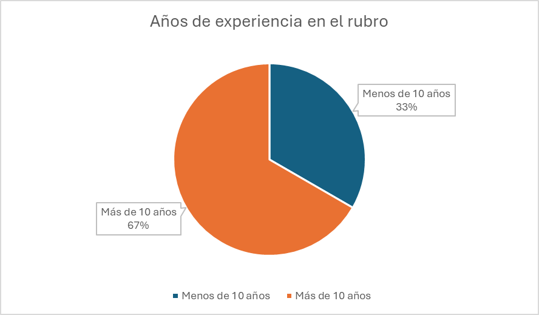
  <figcaption style="font-size: 0.9em; color: #555;">
    <strong>Figura 1:</strong> Gráfico Circular - Segmento 2.
  </figcaption>
</figure>

- Más del 50% de los empresarios tiene un número mayor a 10 años de experiencia en el rubro.

---

<figure style="page-break-inside: avoid; text-align: center;">
  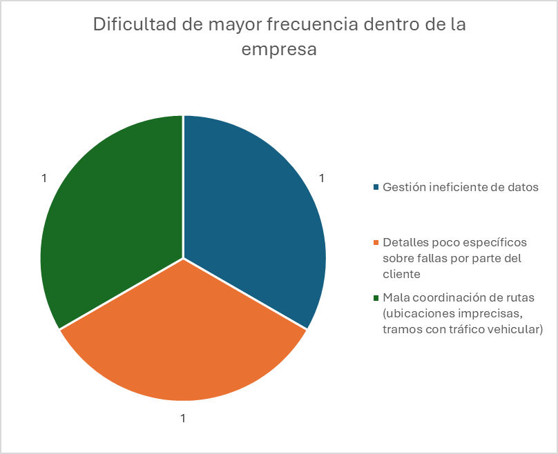
  <figcaption style="font-size: 0.9em; color: #555;">
    <strong>Figura 2:</strong> Gráfico Circular 2 - Segmento 2.
  </figcaption>
</figure>

- Los empresarios tienen diferentes frecuencias de ciertas dificultades, a pesar de que tienen casi los mismos problemas.

---
<figure style="page-break-inside: avoid; text-align: center;">
  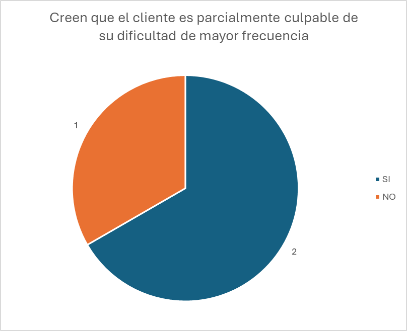
  <figcaption style="font-size: 0.9em; color: #555;">
    <strong>Figura 3:</strong> Gráfico Circular 3 - Segmento 2.
  </figcaption>
</figure>

- El 67% de los empresarios creen que el cliente es parcialmente causante de su problema de mayor frecuencia. Algunos de ellos han expresado su inconformidad respecto a los clientes que no explican bien las fallas de sus equipos.

---

<figure style="page-break-inside: avoid; text-align: center;">
  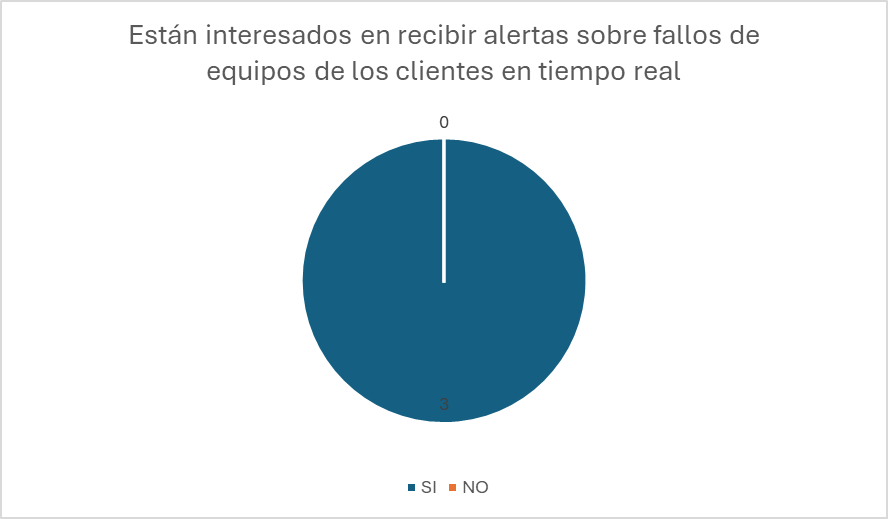
  <figcaption style="font-size: 0.9em; color: #555;">
    <strong>Figura 4:</strong> Gráfico Circular 4 - Segmento 2.
  </figcaption>
</figure>

- El 100% está interesado en recibir notificaciones sobre fallos que ocurren en equipos de refrigeración. Ellos creen que con dicha funcionalidad podrían hacer un mantenimiento preventivo más eficiente y lograr la satisfacción del cliente.

---
<figure style="page-break-inside: avoid; text-align: center;">
  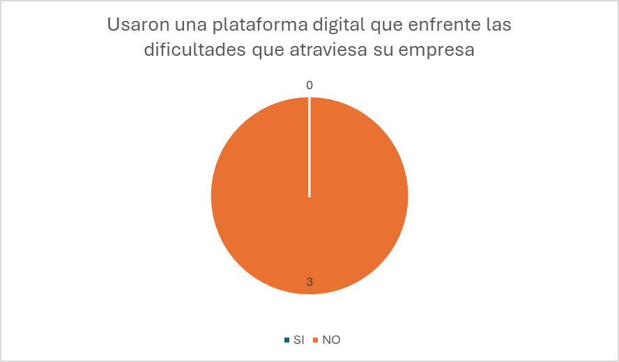
  <figcaption style="font-size: 0.9em; color: #555;">
    <strong>Figura 5:</strong> Gráfico Circular 5 - Segmento 2.
  </figcaption>
</figure>

- Ni uno de los empresarios ha usado una plataforma digital que se asemeje a la que se muestran interesados. Ellos usaron aplicaciones para mejorar la eficiencia de su trabajo como WhatsApp y Maps o programas como Microsoft Excel. Sin embargo, estos no poseen todas las funcionalidades que necesitan.

---
<figure style="page-break-inside: avoid; text-align: center;">
  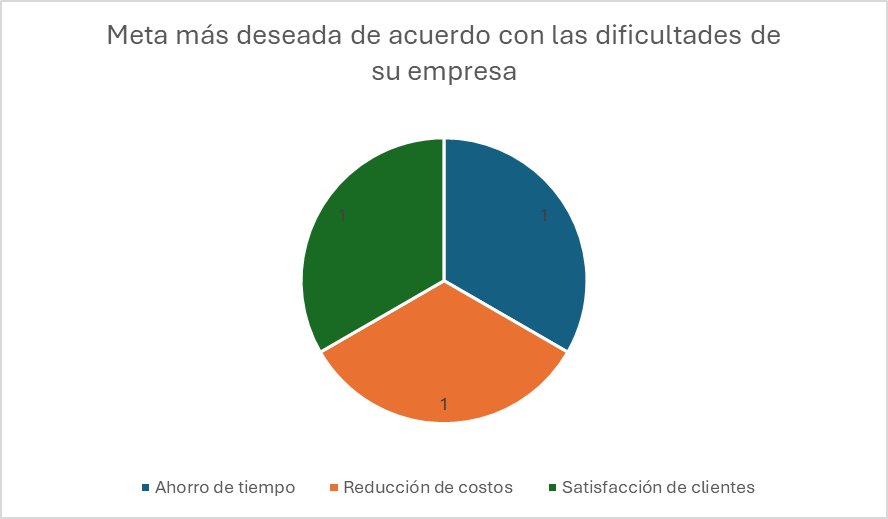
  <figcaption style="font-size: 0.9em; color: #555;">
    <strong>Figura 6:</strong> Gráfico Circular 6 - Segmento 2.
  </figcaption>
</figure>

- Cada empresario tiene una meta deseada de mayor prioridad diferente al resto a pesar de que todos ellos comparten los mismos deseos y esperan que una plataforma digital pueda ayudarles a obtenerlos.

---

### 2.3. Needfinding.

#### 2.3.1. User Personas.
En esta sección se presentan las fichas de User Personas construidas a partir de los datos recogidos del análisis de entrevistas al segmento #1: "Negocios que utilizan equipos de refrigeración" y al segmento #2: "Empresas proveedoras de servicios y equipos de refrigeración". Estas fichas permiten representar de forma clara y estratégica los perfiles del segmento objetivo, considerando sus metas, habilidades, motivaciones y dificultades. Al integrar tanto la perspectiva del usuario como las tendencias del sector, estas representaciones sirven como una herramienta clave para el diseño de soluciones digitales centradas en el usuario y alineadas con las oportunidades del mercado.

##### Segmento objetivo #1: Negocios que utilizan equipos de refrigeración
<figure style="page-break-inside: avoid; text-align: center;">
  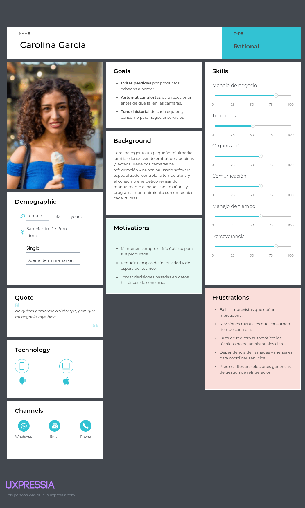
  <figcaption style="font-size: 0.9em; color: #555;">
    <strong>Figura 1:</strong> User Persona - Carolina García.
  </figcaption>
</figure>

##### Segmento objetivo #2: Empresas proveedoras de servicios y equipos de refrigeración
<figure style="page-break-inside: avoid; text-align: center;">
  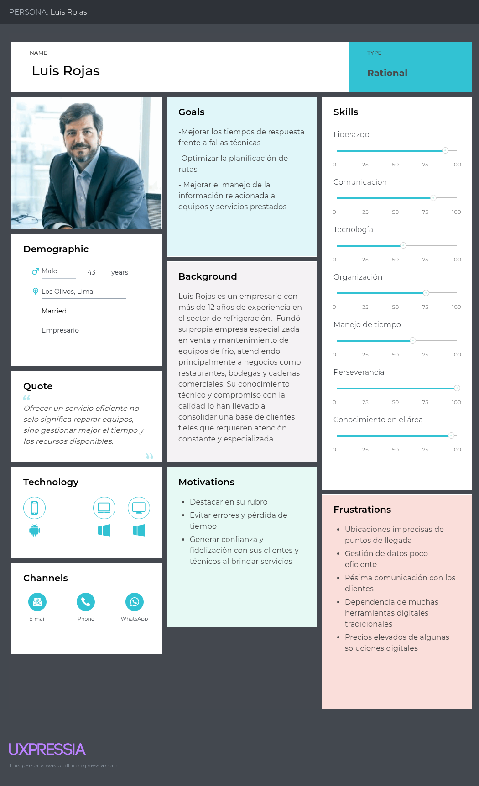
  <figcaption style="font-size: 0.9em; color: #555;">
    <strong>Figura 2:</strong> User Persona - Luis Rojas.
  </figcaption>
</figure>

#### 2.3.2. User Task Matrix.

En esta sección se presenta el User Task Matrix, construido a partir de los User Persona que representan a los dos segmentos clave identificados:

Segmento 1: Negocios que utilizan equipos de refrigeración (representado por Carolina García).

Segmento 2: Empresas proveedoras de servicios y equipos de refrigeración (representado por Luis Rojas).

Las tareas fueron identificadas a partir del análisis cualitativo de entrevistas, y cada una fue evaluada según su frecuencia y nivel de importancia para los respectivos perfiles.

<table>
  <tr>
    <th rowspan="2">Tarea / Task</th>
    <th colspan="2">Carolina García</th>
    <th colspan="2">Luis Rojas</th>
  </tr>
  <tr>
    <th>Frecuencia</th>
    <th>Importancia</th>
    <th>Frecuencia</th>
    <th>Importancia</th>
  </tr>
  <tr>
    <td>Detectar o identificar fallas en los equipos</td>
    <td>Baja</td>
    <td>Alta</td>
    <td>Alta</td>
    <td>Alta</td>
  </tr>
  <tr>
    <td>Coordinar servicios de mantenimiento</td>
    <td>Media</td>
    <td>Alta</td>
    <td>Alta</td>
    <td>Alta</td>
  </tr>
  <tr>
    <td>Planificar rutas de llegada al punto de atención</td>
    <td>Alta</td>
    <td>Media</td>
    <td>Baja</td>
    <td>Alta</td>
  </tr>
  <tr>
    <td>Realizar mantenimiento preventivo o solicitarlo</td>
    <td>Media</td>
    <td>Alta</td>
    <td>Alta</td>
    <td>Alta</td>
  </tr>
  <tr>
    <td>Gestionar datos de los equipos de refrigeración</td>
    <td>Baja</td>
    <td>Alta</td>
    <td>Alta</td>
    <td>Alta</td>
  </tr>
  <tr>
    <td>Gestionar costos por pérdidas de productos</td>
    <td>Alta</td>
    <td>Alta</td>
    <td>Media</td>
    <td>Media</td>
  </tr>
  <tr>
    <td>Evaluar la calidad de los equipos y servicios brindados</td>
    <td>Media</td>
    <td>Alta</td>
    <td>Media</td>
    <td>Alta</td>
  </tr>
  <tr>
    <td>Monitorear el desempeño de los técnicos</td>
    <td>Baja</td>
    <td>Media</td>
    <td>Alta</td>
    <td>Alta</td>
  </tr>
  <tr>
    <td>Monitorear el desempeño de los equipos brindados</td>
    <td>Alta</td>
    <td>Alta</td>
    <td>Baja</td>
    <td>Alta</td>
  </tr>
  <tr>
    <td>Usar reportes técnicos para tomar decisiones</td>
    <td>Baja</td>
    <td>Alta</td>
    <td>Media</td>
    <td>Alta</td>
  </tr>
  <tr>
    <td>Comunicar fallas al técnico o proveedor</td>
    <td>Alta</td>
    <td>Alta</td>
    <td>Media</td>
    <td>Alta</td>
  </tr>
</table>

**Análisis**

#### 2.3.3. User Journey Mapping.
**Segmento objetivo #1: Negocios que utilizan equipos de refrigeración**
Este User Journey Map representa el recorrido actual de Carolina García. El mapa ilustra su experiencia completa desde que maneja continuamente los datos registrados de la empresa hasta su seguimiento luego de la realización de la venta o servicio.
Esta sección refleja la situación actual sin intervención de soluciones tecnológicas, mostrando los puntos de contacto, tareas clave, emociones y posibles fricciones que enfrenta en su día a día. Este recorrido permite entender los desafíos que enfrenta Carolina.

<figure style="page-break-inside: avoid; text-align: center;">
  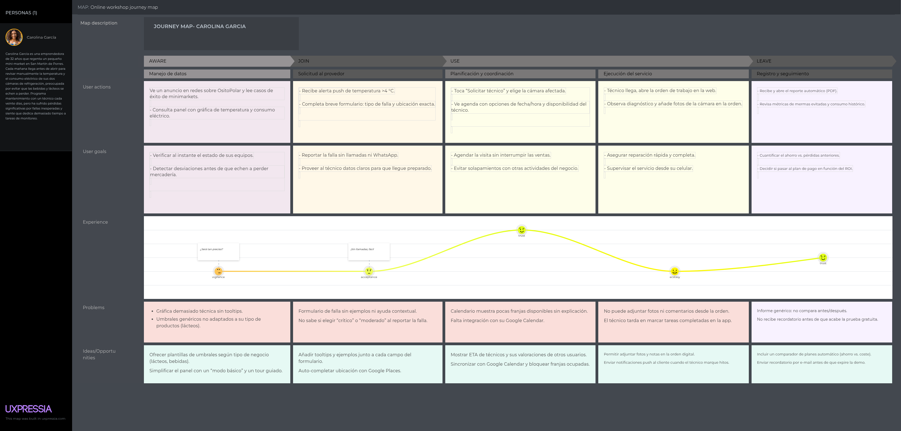
  <figcaption style="font-size: 0.9em; color: #555;">
    <strong>Figura 1:</strong> Segmento 1 del Journey Map.
  </figcaption>
</figure>

**Segmento objetivo #2: EMPRESAS PROVEEDORAS DE SERVICIOS Y EQUIPOS DE REFRIGERACIÓN**

Este User Journey Map representa el recorrido actual de Luis Rojas. El mapa ilustra su experiencia completa desde que maneja continuamente los datos registrados de la empresa hasta su seguimiento luego de la realización de la venta o servicio.
Esta sección refleja la situación actual sin intervención de soluciones tecnológicas, mostrando los puntos de contacto, tareas clave, emociones y posibles fricciones que enfrenta en su día a día. Este recorrido permite entender los desafíos que enfrenta Luis.
<figure style="page-break-inside: avoid; text-align: center;">
  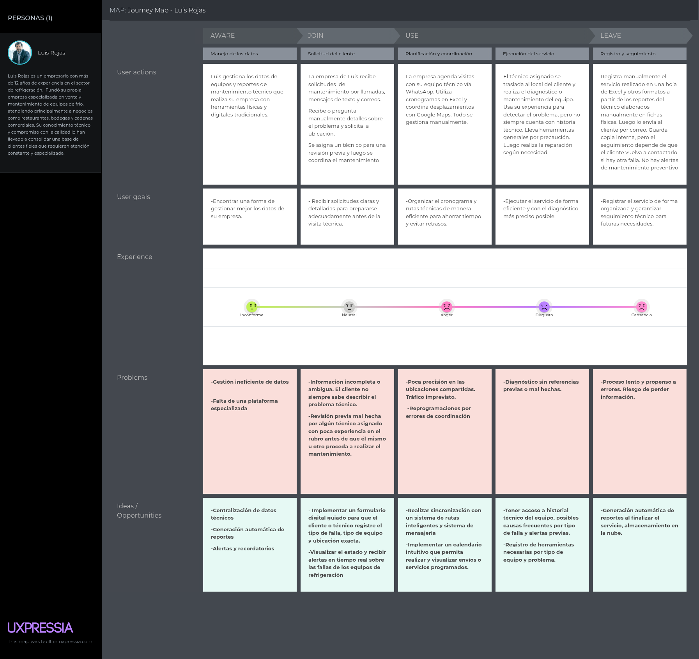
  <figcaption style="font-size: 0.9em; color: #555;">
    <strong>Figura 2:</strong> Segmento 2 del Journey Map.
  </figcaption>
</figure>

#### 2.3.4. Empathy Mapping.

**Segmento objetivo #1: Negocios que utilizan equipos de refrigeración**
<figure style="page-break-inside: avoid; text-align: center;">
  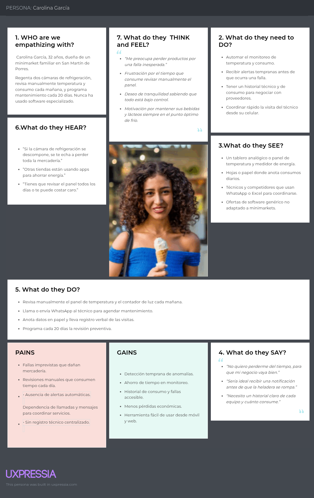
  <figcaption style="font-size: 0.9em; color: #555;">
    <strong>Figura 1:</strong> Segmento 1 del Mapa de Empatía.
  </figcaption>
</figure>

**Segmento objetivo #2: EMPRESAS PROVEEDORAS DE SERVICIOS Y EQUIPOS DE REFRIGERACIÓN**
<figure style="page-break-inside: avoid; text-align: center;">
  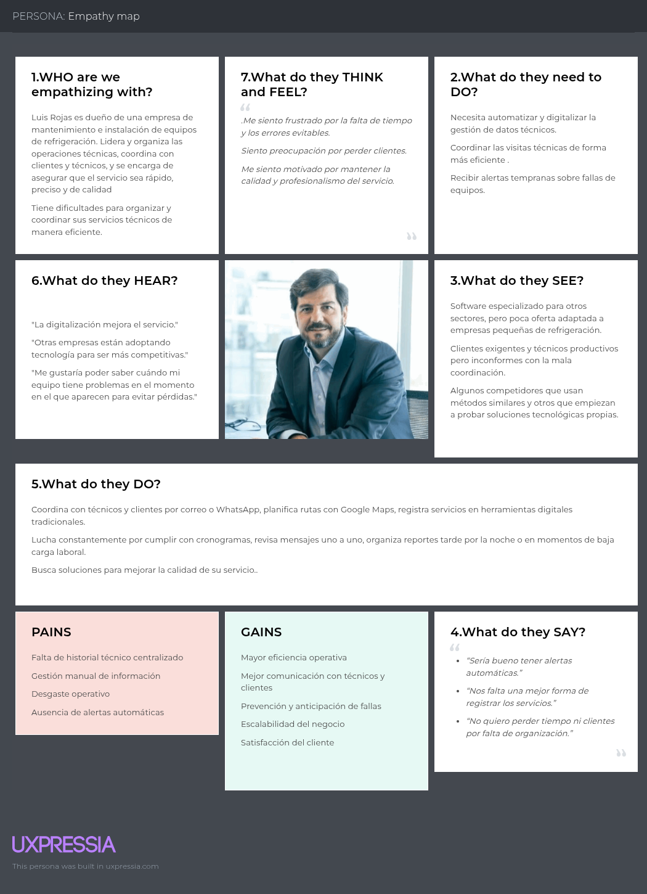
  <figcaption style="font-size: 0.9em; color: #555;">
    <strong>Figura 2:</strong> Segmento 2 del Mapa de Empatía.
  </figcaption>
</figure>

#### 2.3.5. As-is Scenario Mapping.

En esta sección, nuestro equipo tomó en cuenta las etapas para su desarrollo. Iniciamos con la recolección de información proveniente de las entrevistas y análisis de estas de cada segmento respectivo, seguida de una lluvia de ideas, una revisión en conjunto e identificación de las fases y las áreas positivas y negativas.
Una vez definido todo, procedimos a crear los As-is Scenario Mapping vinculados a cada User Persona en la plataforma Miro.
Desde la perspectiva del usuario, este mapa nos permite visualizar su situación real: acciones actuales, emociones, pensamientos, puntos de dolor, etc.

**Segmento objetivo #2: EMPRESAS PROVEEDORAS DE SERVICIOS Y EQUIPOS DE REFRIGERACIÓN**
<figure style="page-break-inside: avoid; text-align: center;">
  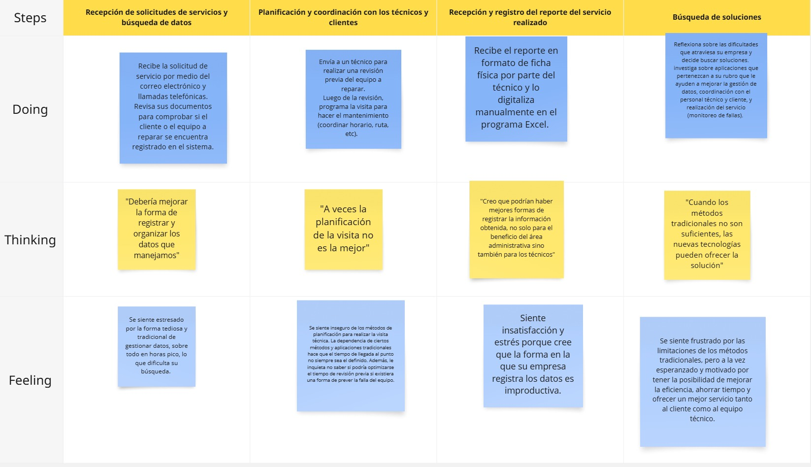
  <figcaption style="font-size: 0.9em; color: #555;">
    <strong>Figura 1:</strong> Segmento 2 del Escenario As-Is.
  </figcaption>
</figure>

### 2.4. Ubiquitous Language.

1. **User Profile (Perfil de Usuario):** Datos e información operativa que OsitoPolar recopila de cada usuario para personalizar su experiencia.

2. **Smart Dashboard (Panel Inteligente):** Interfaz central donde los usuarios monitorean el estado de sus equipos, reciben alertas y gestionan sus servicios.

3. **Performance Report (Reporte de Rendimiento):** Informe técnico con historial de uso, consumo energético, temperatura y fallas de cada equipo.

4. **Maintenance Schedule (Agenda de Mantenimientos):** Calendario inteligente para programar mantenimientos preventivos o correctivos.

5. **Failure Alert (Alerta de Falla):** Notificación automática ante anomalías críticas como sobrecalentamiento o cortes de energía.

6. **Equipment Inventory (Inventario de Equipos):** Registro de todos los equipos de congelación con sus datos técnicos y ubicación.

7. **Service Provider (Proveedor de Servicio):** Técnico o empresa que brinda mantenimiento, instalación o reparación de equipos de refrigeración.

8. **Technical History (Historial Técnico):** Registro detallado de todas las intervenciones realizadas a un equipo.

9. **Work Order (Orden de Trabajo):** Documento digital con las tareas asignadas a un técnico para una visita de servicio.

10. **Service Coordination (Coordinación de Servicio):** Proceso de conexión entre clientes y proveedores según disponibilidad, ubicación y necesidad.

11. **Automatic Report Generation (Generación Automática de Reportes):** Función que crea informes técnicos sin intervención manual.

12. **Real-Time Monitoring (Monitoreo en Tiempo Real):** Supervisión constante del estado operativo del equipo (temperatura, consumo, uso).

13. **Service Zone (Zona de Servicio):** Área donde un proveedor puede atender equipos con rapidez y eficiencia.

14. **Client Portfolio (Cartera de Clientes):** Lista de negocios atendidos por un proveedor, con sus datos y equipos registrados.

15. **Cold Equipment (Equipo de Congelación):** Unidad de refrigeración usada para conservar productos, como congeladoras, cámaras o vitrinas.

16. **Energy Consumption (Consumo Energético):** Registro del uso eléctrico de los equipos para detectar anomalías y optimizar recursos.

17. **Preventive Maintenance (Mantenimiento Preventivo):** Servicio planificado para evitar fallas y extender la vida útil del equipo.

18. **Corrective Maintenance (Mantenimiento Correctivo):** Servicio realizado para solucionar una falla existente en un equipo.

19. **Notification (Notificación):** Mensajes enviados automáticamente para informar sobre mantenimientos, fallas o cambios importantes.

## Capítulo III: Requirements Specification 

### 3.1. To-Be Scenario Mapping.
**Segmento objetivo #1: CLIENTES (DUEÑOS DE EQUIPOS DE REFRIGERACIÓN)**

<figure style="page-break-inside: avoid; text-align: center;">
  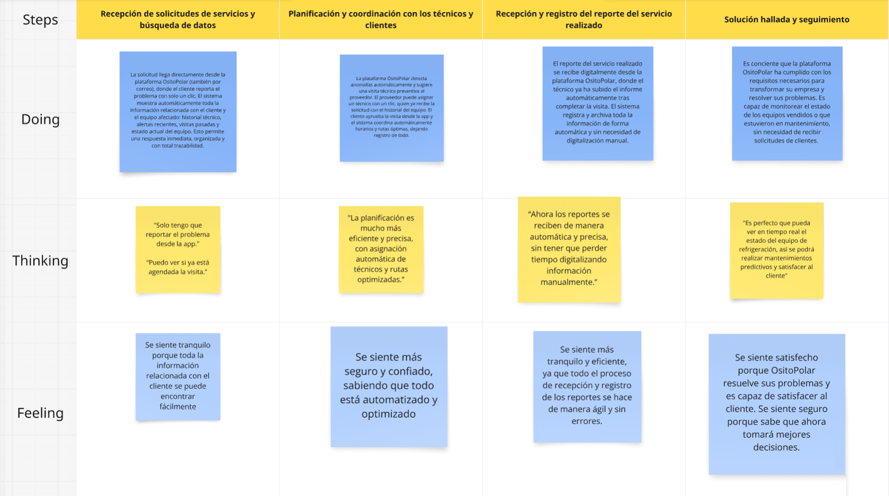
  <figcaption style="font-size: 0.9em; color: #555;">
    <strong>Figura 1:</strong> To Be Scenario Mapping Clientes (Segmento 1).
  </figcaption>
</figure>

**Segmento objetivo #2: EMPRESAS PROVEEDORAS DE SERVICIOS Y EQUIPOS DE REFRIGERACIÓN**

<figure style="page-break-inside: avoid; text-align: center;">
  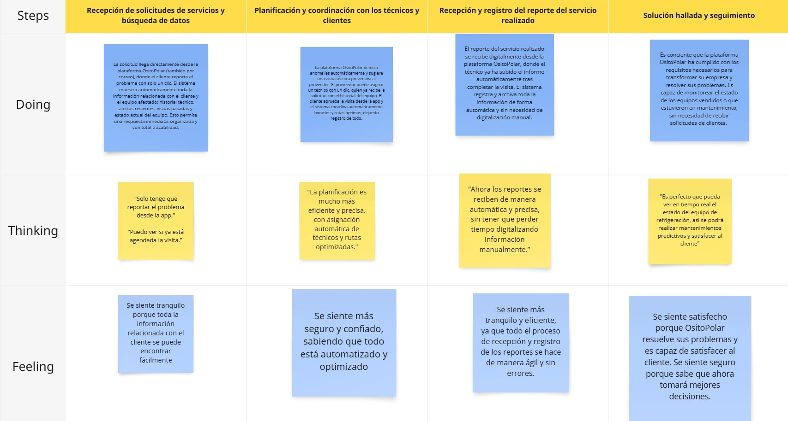
  <figcaption style="font-size: 0.9em; color: #555;">
    <strong>Figura 2:</strong> To Be Scenario Mapping - Empresas Proveedoras (Segmento 2).
  </figcaption>
</figure>

### 3.2. User Stories.

Las historias de usuario desarrolladas en este proyecto fueron elaboradas en conjunto por el equipo de desarrollo de OsitoPolar, considerando las necesidades y funcionalidades clave tanto para los clientes (dueños de equipos de refrigeración) como para los empresarios (proveedores de equipos y servicios de mantenimiento y refrigeración). Las historias fueron organizadas bajo épicas que agrupan funcionalidades similares. Los criterios de aceptación de todas las historias siguen la sintaxis Gherkin.
El trabajo fue realizado de manera colaborativa, priorizando la comprensión del problema desde la perspectiva del usuario final. Para facilitar la organización, priorización y trazabilidad de las tareas, se utilizó la plataforma Trello

| **Epic / Story ID** | **Título**                                                         | **Descripción**                                                                                                                                                                                                                    | **Criterios de Aceptación**                                                                                                                                                                                                                                                                                                                                                                                                                                                                                                                                                                                         | **Relacionado con (Epic ID)** |
|---------------------|--------------------------------------------------------------------|------------------------------------------------------------------------------------------------------------------------------------------------------------------------------------------------------------------------------------|---------------------------------------------------------------------------------------------------------------------------------------------------------------------------------------------------------------------------------------------------------------------------------------------------------------------------------------------------------------------------------------------------------------------------------------------------------------------------------------------------------------------------------------------------------------------------------------------------------------------|-------------------------------|
| US-01               | Registro de usuario                                                | Como nuevo usuario, quiero registrarme para acceder a la plataforma y empezar a gestionar mis equipos de refrigeración                                                                                                             | **Escenario 1: Crear cuenta exitosamente**   Dado que el nuevo usuario tiene todos los datos correctos, cuando completa el registro, entonces su cuenta es creada correctamente.  **Escenario 2: Intento de crear cuenta con email ya registrado**  Dado que el nuevo usuario intenta registrarse con un correo ya registrado, cuando envía el formulario, entonces el sistema muestra un mensaje indicando que el correo ya existe.                                                                                                                                                                    | EP-01                         |
| US-02               | Inicio de sesión                                                   | Como usuario, quiero acceder a mi cuenta en la plataforma para utilizar sus funcionalidades.                                                                                                                                       | **Escenario 1: Iniciar sesión correctamente**   Dado que el usuario tiene una cuenta activa, cuando ingresa sus datos correctamente, entonces accede a su panel de control.  **Escenario 2: Intento de iniciar sesión con datos incorrectos**  Dado que el usuario ingresa datos incorrectos, cuando intenta iniciar sesión, entonces el sistema muestra un mensaje de error.                                                                                                                                                                                                                           | EP-01                         |
| US-03               | Solicitar servicio de reparación                                   | Como cliente, quiero solicitar un servicio de reparación para mis equipos de refrigeración cuando detecto fallas.                                                                                                                  | **Escenario 1: Solicitar servicio de reparación**   Dado que el cliente ha identificado una falla, cuando solicita el servicio desde la plataforma, entonces se genera la solicitud de servicio.  **Escenario 2: Confirmación de solicitud de servicio**  Dado que el cliente ha solicitado el servicio, cuando el sistema recibe la solicitud, entonces muestra un mensaje confirmando la recepción.                                                                                                                                                                                                   | EP-03                         |
| US-04               | Ver estado del servicio solicitado                                 | Como cliente, quiero ver el estado actual de mi solicitud de servicio para estar informado sobre el avance del proceso.                                                                                                            | **Escenario 1: Verificación del estado de la solicitud**   Dado que el cliente ha solicitado el servicio, cuando ingresa a la plataforma, entonces puede ver el estado actualizado de su solicitud.  **Escenario 2: Actualización de estado en tiempo real**  Dado que el cliente está visualizando su solicitud, cuando el técnico inicia el trabajo, entonces el estado se actualiza.                                                                                                                                                                                                                 | EP-03                         |
| US-05               | Ver reporte de servicio realizado                                  | Como cliente, quiero ver el reporte de servicio detallado para saber qué reparaciones se hicieron en mi equipo.                                                                                                                    | **Escenario 1: Generación del reporte de servicio**  Dado que el servicio ha sido completado, cuando el técnico termina, entonces el sistema genera un reporte detallado.  **Escenario 2: Enviar reporte al cliente por correo** Dado que el reporte ha sido generado, cuando se ha finalizado el servicio, entonces el sistema envía el reporte al cliente por correo electrónico.                                                                                                                                                                                                                         | EP-04                         |
| US-06               | Agregar equipos                                                    | Como cliente, quiero agregar mis equipos de refrigeración en la plataforma para llevar un control.                                                                                                                                 | **Escenario 1: Agregar equipo de refrigeración** Dado que el cliente quiere agregar un equipo, cuando ingresa los detalles del equipo, entonces el sistema lo registra correctamente.  **Escenario 2: Editar información del equipo**   Dado que el cliente desea editar la información del equipo, cuando realiza los cambios, entonces el sistema actualiza la información del equipo.                                                                                                                                                                                                                | EP-02                         |
| US-07               | Recibir alerta de falla en equipo                                  | Como cliente, quiero recibir una alerta automática cuando mi equipo de refrigeración presente una falla para tomar acción rápidamente.                                                                                             | **Escenario 1: Alerta de falla detectada**   Dado que el equipo de refrigeración está funcionando mal, cuando se detecta una falla, entonces el sistema envía una alerta al cliente.  **Escenario 2: Alerta de mantenimiento preventivo** Dado que el equipo está funcionando correctamente, cuando el sistema detecta una necesidad de mantenimiento preventivo, entonces envía una alerta preventiva al cliente.                                                                                                                                                                                          | EP-05                         |
| US-08               | Solicitar mantenimiento preventivo                                 | Como cliente, quiero solicitar mantenimiento preventivo para evitar fallas futuras en mis equipos de refrigeración.                                                                                                                | **Escenario 1: Solicitar mantenimiento preventivo**  Dado que el cliente quiere programar mantenimiento preventivo, cuando selecciona la opción, entonces puede elegir la fecha y hora.  **Escenario 2: Confirmación de solicitud de mantenimiento**   Dado que el cliente ha solicitado el mantenimiento, cuando el sistema lo registra, entonces le envía una confirmación con los detalles.                                                                                                                                                                                                          | EP-03                         |
| US-09               | Ver consumo energético de equipos                                  | Como cliente, quiero ver un informe del consumo energético de mis equipos para analizar su eficiencia.                                                                                                                             | **Escenario 1: Visualización de consumo energético**  Dado que el cliente tiene equipos registrados, cuando ingresa a la plataforma, entonces puede ver el informe de consumo energético de cada equipo.  **Escenario 2: Comparación del consumo energético**   Dado que el cliente quiere comparar, cuando selecciona dos equipos, entonces el sistema genera una comparación de su consumo energético.                                                                                                                                                                                                | EP-04                         |
| US-10               | Recepción de alertas automáticas para servicio                     | Como empresario, quiero recibir alertas automáticas cuando un cliente solicite un servicio de reparación o mantenimiento para brindar el servicio inmediatamente.                                                                  | **Escenario 1: Recepción de solicitud de servicio** Dado que el cliente ha solicitado un servicio, cuando se recibe la solicitud, entonces el sistema envía una alerta al empresario.  **Escenario 2: Alerta de mantenimiento preventivo solicitado**  Dado que un cliente ha solicitado mantenimiento preventivo, cuando se registra la solicitud, entonces el sistema envía una alerta automática al empresario.                                                                                                                                                                                      | EP-05                         |
| US-11               | Asignar técnico a solicitud de servicio                            | Como empresario, quiero asignar un técnico a una solicitud de servicio para garantizar que se realice el trabajo adecuado.                                                                                                         | **Escenario 1: Asignar técnico a servicio** Escenario 1: Dado que el empresario recibe una solicitud de servicio, cuando elige un técnico, entonces el sistema asigna al técnico seleccionado a la solicitud.  **Escenario 2: Confirmación de asignación de técnico** Dado que el técnico ha sido asignado, cuando el empresario lo confirma, entonces el sistema envía una notificación al técnico con los detalles.                                                                                                                                                                                   | EP-03                         |
| US-12               | Ver historial de servicios realizados                              | Como empresario, quiero ver el historial de servicios realizados para cada cliente y equipo, para llevar un control adecuado.                                                                                                      | **Escenario 1: Visualizar historial de servicios**  Dado que el empresario tiene acceso al historial de servicios, cuando accede a la plataforma, entonces puede ver el historial completo de servicios realizados.  **Escenario 2: Filtrar historial por cliente o equipo** Dado que el empresario quiere filtrar los servicios, cuando selecciona un cliente o equipo, entonces el sistema filtra los servicios realizados según el filtro seleccionado                                                                                                                                               | EP-04                         |
| US-13               | Realizar seguimiento a solicitudes de servicio                     | Como empresario, quiero realizar un seguimiento detallado a las solicitudes de servicio de mis técnicos, para saber cómo van.                                                                                                      | **Escenario 1: Ver estado de la solicitud de servicio**  Dado que el empresario tiene acceso a solicitudes, cuando ingresa al sistema, entonces puede ver el estado actualizado de cada solicitud de servicio.  **Escenario 2: Actualización del estado de la solicitud** Dado que el empresario quiere seguir el progreso, cuando un técnico actualiza el estado de la solicitud, entonces el sistema muestra el estado en tiempo real.                                                                                                                                                                | EP-03                         |
| US-14               | Generar reporte de desempeño de técnicos                           | Como empresario, quiero generar reportes sobre el desempeño de mis técnicos para evaluar su eficiencia y productividad.                                                                                                            | **Escenario 1: Generar reporte de desempeño**  Dado que el empresario quiere evaluar el desempeño de sus técnicos, cuando selecciona la opción de generar reporte, entonces el sistema crea un informe con los datos.  ** Escenario 2: Descargar reporte de desempeño** Dado que el reporte ha sido generado, cuando el empresario quiere descargarlo, entonces el sistema permite descargar el archivo en formato PDF.                                                                                                                                                                                 | EP-04                         |
| US-15               | Configurar alertas de mantenimiento                                | Como empresario, quiero configurar alertas automáticas para el mantenimiento preventivo de los equipos.                                                                                                                            | **Escenario 1: Configuración de alerta de mantenimiento**  Dado que el empresario quiere configurar alertas, cuando ingresa los parámetros, entonces el sistema configura la alerta correctamente.  **Escenario 2: Modificación de alerta configurada**  Dado que el empresario ha configurado una alerta, cuando decide cambiar la frecuencia, entonces el sistema actualiza la alerta.                                                                                                                                                                                                                | EP-05                         |
| US-16               | Visualizar clientes y servicios asociados                          | Como empresario, quiero ver todos los clientes que han solicitado servicio para organizar el trabajo de los técnicos.                                                                                                              | **Escenario 1: Ver clientes y servicios asociados** Dado que el empresario quiere visualizar la información, cuando accede a la funcionalidad correspondiente, entonces puede consultar los clientes con sus servicios relacionados. **Escenario 2: Filtrar por estado de servicio** Dado que el empresario necesita filtrar resultados, cuando aplica el filtro por estado, entonces el sistema muestra los datos correspondientes.                                                                                                                                                                    | EP-04                         |
| US-17               | Visualizar equipos entregados a clientes                           | Como empresario, quiero ver todos los equipos que fueron entregados a clientes para realizar su seguimiento.                                                                                                                       | **Escenario 1: Ver equipos asociados** Dado que el empresario quiere visualizar la información de equipos, cuando accede al listado de equipos, entonces puede consultar los que están asociados a clientes. **Escenario 2: Filtrar por estado y tipo de equipo** Dado que el empresario necesita filtrar los resultados, cuando aplica los criterios, entonces el sistema muestra los equipos correspondientes.                                                                                                                                                                                        | EP-02                         |
| US-18               | Recibir notificaciones de eventos importantes                      | Como cliente, quiero recibir notificaciones sobre eventos importantes como el progreso del servicio para mantenerme informado.                                                                                                     | **Escenario 1: Problema reportado durante el servicio** Dado que el técnico detecta una complicación o requiere aprobación, cuando se genera un evento interno, entonces el sistema envía una notificación que requiere acción del cliente. **Escenario 2: Notificación sobre progreso del servicio** Dado que el servicio está en ejecución, cuando el estado cambia, entonces se envía una notificación al cliente.                                                                                                                                                                                   | EP-05                         |
| US-19               | Realizar evaluación de servicio                                    | Como cliente, quiero evaluar el servicio para mostrar mi conformidad.                                                                                                                                                              | **Escenario 1: Evaluar el servicio una vez finalizado** Dado que el cliente ha recibido el servicio, cuando accede a la opción de evaluación, entonces puede registrar una calificación del 1 al 5. **Escenario 2: Corrección de evaluación del servicio** Dado que el cliente ya evaluó el servicio, cuando realiza una modificación dentro del plazo permitido, entonces el sistema actualiza la calificación registrada.                                                                                                                                                                             | EP-06                         |
| US-20               | Registrar técnicos                                                 | Como empresario, quiero registrar técnicos en la plataforma para integrarlos a mi red de soporte técnico.                                                                                                                          | **Escenario 1: Registro exitoso de un técnico** Dado que el empresario desea registrar un técnico, cuando completa los datos requeridos y confirma, entonces el sistema lo registra correctamente. **Escenario 2: Intento de registro con datos incompletos** Dado que faltan datos obligatorios, cuando intenta registrar al técnico, entonces el sistema impide la operación hasta que se completen los campos necesarios.                                                                                                                                                                            | EP-01                         |
| US-21               | Visualizar perfil del técnico                                      | Como empresario, quiero visualizar el perfil de cada técnico, incluyendo sus datos personales y métricas de desempeño, para evaluar su rendimiento.                                                                                | **Escenario 1: Acceso a información completa del técnico** Dado que el empresario selecciona un técnico, cuando accede a su información, entonces puede consultar datos personales, historial de servicios y calificaciones. **Escenario 2: Técnico sin evaluaciones registradas** Dado que el técnico aún no ha sido evaluado, cuando se consulta su perfil, entonces no se muestran métricas de desempeño.                                                                                                                                                                                            | EP-01                         |
| US-22               | Recibir alertas de fallas en equipos                               | Como empresario, quiero recibir alertas cuando alguno de los equipos de mis clientes presenta fallas, para notificar al cliente y organizar atención.                                                                              | **Escenario 1: Recepción de alerta automática por sensor** Dado que un equipo monitoreado presenta una falla, cuando el sistema la detecta, entonces genera una alerta inmediata para el empresario. **Escenario 2: Comunicación con el cliente** Dado que el empresario ha recibido una alerta, cuando revisa el equipo afectado, entonces puede iniciar una notificación directa al cliente desde la plataforma.                                                                                                                                                                                      | EP-05                         |
| US-23               | Visualizar propuesta de valor principal                            | Como visitante, quiero conocer la propuesta de valor de OsitoPolar, para entender si la plataforma se ajusta a mis necesidades.                                                                                                    | **Escenario 1: Propuesta visible al ingresar** Dado que estoy en la página oficial de OsitoPolar, cuando la página carga, entonces debo acceder inmediatamente a una frase que explique claramente la propuesta de valor. **Escenario 2: Propuesta orientada a gestión de refrigeración** Dado que soy un visitante del segmento 1, cuando reviso la propuesta de valor, entonces esta debe mencionar conceptos relacionados con gestión inteligente y monitoreo de equipos.                                                                                                                            | EP-07                         |
| US-24               | Explorar soluciones específicas para mi rubro                      | Como visitante, quiero conocer las soluciones específicas que ofrece OsitoPolar para mi tipo de negocio, para saber si se ajusta a mis necesidades.                                                                                | **Escenario 1: Acceso a información para negocios** Dado que accedo a las soluciones ofrecidas, cuando reviso el contenido disponible, entonces debo encontrar descripciones específicas dirigidas a negocios que utilizan o gestionan equipos de refrigeración. **Escenario 2: Acceso a información para empresas proveedoras** Dado que accedo a las soluciones ofrecidas, cuando reviso el contenido disponible, entonces debo encontrar información específica para empresas proveedoras de equipos o servicios de mantenimiento.                                                                   | EP-07                         |
| US-25               | Comprender funcionalidades destacadas                              | Como visitante, quiero comprender las funcionalidades clave de la plataforma, para evaluar si se adapta a mi operación.                                                                                                            | **Escenario 1: Acceso a funcionalidades principales** Dado que consulto las características de la plataforma, cuando reviso la lista de funcionalidades, entonces debo identificar opciones clave como monitoreo en tiempo real, automatización de alertas y gestión remota. **Escenario 2: Descripciones orientadas a valor** Dado que leo las descripciones de las funcionalidades, cuando evalúo cada una, entonces debo entender el beneficio que aporta para operaciones de refrigeración o mantenimiento.                                                                                         | EP-07                         |
| US-26               | Solicitar una demo fácilmente                                      | Como visitante, quiero solicitar una demo de la plataforma, para iniciar contacto con OsitoPolar.                                                                                                                                  | **Escenario 1: Disponibilidad de opción para solicitar demo** Dado que estoy explorando la plataforma, cuando busco cómo solicitar una demostración, entonces debo encontrar una opción clara y accesible para iniciar el proceso. **Escenario 2: Acceso a canal de contacto** Dado que selecciono la opción de solicitar una demo, cuando soy redirigido, entonces debo acceder a un canal funcional de contacto como un formulario, correo electrónico o enlace directo.                                                                                                                              | EP-07                         |
| US-27               | Conocer misión y visión de la startup                              | Como visitante, quiero conocer la misión y visión de OsitoPolar, para entender su enfoque y propuesta de valor.                                                                                                                    | **Escenario 1: Acceso a la misión de la empresa** Dado que accedo a la información institucional de OsitoPolar, cuando reviso su contenido corporativo, entonces debo encontrar una descripción clara de su misión. **Escenario 2: Acceso a la visión de la empresa** Dado que accedo a la información institucional, cuando reviso su contenido estratégico, entonces debo encontrar una descripción clara de su visión a futuro.                                                                                                                                                                      | EP-07                         |
| US-28               | Contactar fácilmente con ventas                                    | Como visitante empresario, quiero contactar fácilmente con el equipo de ventas, para iniciar una posible relación comercial.                                                                                                       | **Escenario 1: Disponibilidad de medio de contacto comercial** Dado que estoy interesado en contactar al equipo de ventas, cuando busco información de contacto, entonces debo encontrar una opción clara para iniciar la comunicación. **Escenario 2: Redirección al canal adecuado** Dado que selecciono la opción de contacto, cuando soy redirigido, entonces debo llegar a un canal funcional como un formulario, dirección de correo o número de contacto.                                                                                                                                        | EP-07                         |
| US-29               | Acceder fácilmente a la plataforma                                 | Como visitante, quiero acceder fácilmente al inicio de sesión, para ingresar rápidamente a mi cuenta.                                                                                                                              | **Escenario 1: Acceso al inicio de sesión** Dado que soy un usuario registrado, cuando busco cómo ingresar a mi cuenta, entonces debo encontrar una opción claramente identificable para iniciar sesión. **Escenario 2: Redirección al formulario de autenticación** Dado que selecciono la opción de inicio de sesión, cuando soy redirigido, entonces debo llegar al formulario correspondiente para ingresar mis credenciales.                                                                                                                                                                       | EP-07                         |
| US-30               | Descargar la app móvil desde la web                                | Como visitante interesado en usar OsitoPolar desde el celular, quiero descargar fácilmente la app móvil, para instalarla y comenzar a usarla.                                                                                      | **Escenario 1: Acceso a opciones de descarga móvil** Dado que estoy interesado en utilizar la aplicación en mi celular, cuando exploro la plataforma, entonces debo encontrar un enlace o referencia a la descarga de la app móvil. **Escenario 2: Redirección a la tienda correspondiente** Dado que selecciono el enlace de descarga, cuando soy redirigido, entonces debo acceder a la tienda de aplicaciones correspondiente según mi sistema operativo.                                                                                                                                            | EP-07                         |
| US-31               | Controlar encendido y apagado del equipo                           | Como cliente, quiero poder encender y apagar remotamente mis equipos de refrigeración desde la plataforma, para tener un mayor control operativo.                                                                                  | **Escenario 1: Encendido remoto del equipo** Dado que el cliente tiene un equipo registrado, cuando ejecuta una acción de encendido sobre el equipo, entonces el sistema transmite la instrucción y cambia el estado del equipo a encendido. **Escenario 2: Apagado remoto del equipo** Dado que el cliente tiene un equipo activo, cuando ejecuta una acción de apagado, entonces el sistema transmite la instrucción y cambia el estado del equipo a apagado.                                                                                                                                         | EP-02                         |
| US-32               | Ajustar temperatura del equipo                                     | Como cliente, quiero ajustar la temperatura de mis equipos de refrigeración desde la plataforma, para mantener condiciones óptimas según mi operación.                                                                             | **Escenario 1: Aumentar temperatura** Dado que el cliente tiene acceso a un equipo, cuando incrementa el valor de temperatura deseada, entonces el sistema actualiza la configuración del equipo con el nuevo valor. **Escenario 2: Disminuir temperatura** Dado que el cliente tiene acceso a un equipo, cuando reduce el valor de temperatura deseada, entonces el sistema actualiza la configuración del equipo con el nuevo valor.                                                                                                                                                                  | EP-02                         |
| TS-33               | Registrar nuevo equipo a través de API RESTful                     | Como desarrollador, quiero exponer un endpoint RESTful que permita registrar nuevos equipos de refrigeración, para facilitar su control y monitoreo desde la plataforma.                                                           | **Escenario 1: Registro exitoso** Dado que el endpoint `/equipment` está disponible, cuando se envía una solicitud POST con los datos válidos (nombre, tipo, ubicación, etc.), entonces se recibe una respuesta con estado 201 y los datos del equipo registrado. **Escenario 2: Registro con datos inválidos** Dado que el endpoint está disponible, cuando se envía una solicitud POST con campos obligatorios vacíos o mal formateados, entonces se recibe una respuesta 400 con mensaje "Invalid or incomplete data".                                                                               | EP-02                         |
| TS-34               | Eliminar técnico asignado a través de API RESTful                  | Como desarrollador, quiero eliminar un técnico del sistema desde el API para gestionar la asignación de servicios y roles técnicos.                                                                                                | **Escenario 1: Técnico eliminado correctamente** Dado que el endpoint `/technicians/{id}` está disponible y el ID existe, cuando se hace un DELETE, entonces se devuelve código 204 y el técnico es removido del sistema. **Escenario 2: Intentar eliminar técnico inexistente** Dado que el ID del técnico no existe, cando se hace un DELETE,entonces se devuelve código 404 con mensaje "Technician not found".                                                                                                                                                                                      | EP-01                         |
| TS-35               | Notificación automática por alerta crítica a través de API RESTful | Como desarrollador, quiero implementar un mecanismo que exponga alertas críticas detectadas en los equipos a través de una API RESTful, para activar notificaciones automáticas al usuario.                                        | **Escenario 1: Envío de notificación al detectar falla** Dado que el sistema recibe una alerta crítica desde un equipo, cuando se procesa la alerta, entonces el sistema debe enviar una notificación al usuario.**Escenario 2: Falla detectada sin notificación activa** Dado que el sistema de notificaciones está deshabilitado, cuando se genera la alerta crítica, entonces no se envía notificación y se registra solo en el historial.                                                                                                                                                               | EP-05                         |
| TS-36               | Crear solicitud de mantenimiento a través de API RESTful           | Como desarrollador, quiero implementar una API que me permita crear solicitudes de mantenimiento para que los negocios reporten necesidades de soporte técnico.                                                                    | **Escenario 1: Creación exitosa de solicitud** Dado que el endpoint `/api/v1/maintenance-requests` está disponible, cuando se envía una solicitud POST con los datos del equipo y la descripción del problema, entonces se recibe una respuesta 201 y se guarda la solicitud en el sistema. **Escenario 2: Datos incompletos en la solicitud** Dado que el endpoint está disponible, cuando se omite un campo obligatorio (como el ID del equipo), entonces  se recibe una respuesta 400 con mensaje "Invalid data".                                                                                    | EP-03                         |
| TS-37               | Crear registro de intervención técnica a través de API RESTful     | Como desarrollador, quiero registrar intervenciones técnicas realizadas a través de la API, para llevar seguimiento del mantenimiento.                                                                                             | **Escenario 1: Registro exitoso** Dado que el endpoint `/api/v1/interventions` está disponible, cuando  se envía una solicitud POST con los datos del técnico y equipo, entonces  el sistema responde con 201 y se almacena el registro. **Escenario 2: Registro con técnico no existente** Dado que el ID del técnico no existe, cuando se realiza la solicitud POST, entonces  se devuelve un 404 con mensaje "Technician not found".                                                                                                                                                                     | EP-03                         |
| TS-38               | Registrar evento de alerta manual a través de API RESTful          | Como desarrollador, quiero registrar una alerta manual vía API para que los técnicos puedan ingresar incidentes detectados en campo.                                                                                               | **Escenario 1: Registrar alerta manual correctamente** Dado que el endpoint `/api/v1/alerts` está activo, cuando  se envía una solicitud POST con tipo de alerta, equipo y descripción, entonces  se responde con estado 201 y se almacena el evento. **Escenario 2: Registrar alerta sin equipo asociado** Dado que se omite el ID del equipo en la solicitud, cuando se hace el POST, entonces se responde con estado 400 y mensaje "Device must be specified".                                                                                                                                      | EP-05                         |
| TS-39               | Evaluar servicio a través de API RESTful                           | Como desarrollador, quiero implementar un endpoint RESTful que permita a los clientes registrar y actualizar una evaluación de servicio, para reflejar su experiencia.                                                             | **Escenario 1: Evaluación inicial del servicio** Dado que el endpoint `/api/v1/reviews` está disponible y el cliente ha recibido un servicio, cuando se envía una solicitud POST con la puntuación (1-5), entonces el sistema responde con 201 y almacena la evaluación asociada al servicio correspondiente. **Escenario 2: Edición dentro del plazo permitido**  Dado que el cliente ya evaluó un servicio y han pasado menos de 48 horas, cuando realiza una solicitud PUT a /api/v1/reviews/{id} con una nueva puntuación, entonces el sistema responde con 200 y actualiza la evaluación anterior. | EP-06                         |
| TS-40               | Registrar nuevo usuario a través de API RESTful                    | Como desarrollador, quiero exponer un endpoint para registrar nuevos usuarios en la plataforma, validando datos como correo único y formato de contraseña, para permitir el acceso seguro de nuevos usuarios.                      | **Escenario 1: Registro exitoso** Dado que el endpoint `/api/v1/users` está disponible, cuando se envía una solicitud POST con datos válidos (nombre, email único, contraseña válida), entonces el sistema responde con 201 y devuelve el usuario registrado. **Escenario 2: Registro con email existente** Dado un correo ya registrado, cuando se intenta registrar nuevamente, entonces se devuelve un 400 con mensaje "Email already registered".                                                                                                                                                   | EP-01                         |
| TS-41               | Consultar estado de solicitud de servicio por API                  | Como desarrollador, quiero exponer un endpoint para consultar el estado de una solicitud de servicio, permitiendo a clientes y empresarios hacer seguimiento en tiempo real desde la plataforma.                                   | **Escenario 1: Consulta exitosa del estado** Dado que el endpoint `/api/v1/requests/{id}` está disponible, cuando se envía una solicitud GET con un ID válido, entonces el sistema responde con 200 y devuelve el estado actual de la solicitud. **Escenario 2: Consulta con ID inexistente** Dado que el ID no existe, entonces se devuelve 404 con mensaje "Request not found".                                                                                                                                                                                                                       | EP-03                         |
| TS-42               | Solicitar mantenimiento preventivo vía API                         | Como desarrollador, quiero implementar un endpoint para registrar solicitudes de mantenimiento preventivo, diferenciadas de las solicitudes por reparación.                                                                        | **Escenario 1: Solicitud exitosa de mantenimiento preventivo** Dado que el endpoint `/api/v1/preventive-maintenance` está disponible, cuando se envía una solicitud POST con datos válidos (equipo, fecha deseada), entonces el sistema responde con 201 y guarda la solicitud. **Escenario 2: Solicitud con datos incompletos** Dado que falta un campo obligatorio, entonces se responde con 400 y mensaje de error.                                                                                                                                                                                  | EP-03                         |
| TS-43               | Asignar técnico a solicitud de servicio por API                    | Como desarrollador, quiero crear un endpoint que permita asignar un técnico a una solicitud de servicio, para gestionar la ejecución técnica desde la plataforma.                                                                  | **Escenario 1: Asignación exitosa** Dado que el endpoint `/api/v1/requests/{id}/assign-technician` está disponible, cuando se envía una solicitud PUT con un técnico válido, entonces se devuelve 200 y se actualiza la solicitud. **Escenario 2: Técnico no existente** Dado un ID de técnico inválido, entonces se responde con 404 y mensaje "Technician not found".                                                                                                                                                                                                                                 | EP-03                         |
| TS-44               | Consultar historial de servicios por API                           | Como desarrollador, quiero exponer un endpoint para consultar el historial de servicios por cliente o equipo, permitiendo búsquedas y filtrado desde el panel de control.                                                          | **Escenario 1: Historial completo por cliente** Dado que el endpoint `/api/v1/service-history?client_id={id}` está disponible, cuando se hace la consulta, entonces se responde con 200 y la lista de servicios asociados. **Escenario 2: Historial filtrado por equipo** Dado que se agrega un parámetro de equipo, entonces el sistema devuelve solo los servicios asociados a ese equipo.                                                                                                                                                                                                            | EP-04                         |
| TS-45               | Generar y exportar reporte de desempeño técnico                    | Como desarrollador, quiero implementar la generación de reportes de desempeño técnico, incluyendo número de servicios, evaluaciones y tiempos promedio, y permitir su descarga en PDF.                                             | **Escenario 1: Generar reporte exitosamente** Dado que el endpoint `/api/v1/reports/performance` está disponible, cuando se hace una solicitud GET, entonces se devuelve un resumen con métricas. **Escenario 2: Descargar reporte PDF** Dado que el reporte ya fue generado, cuando se solicita la descarga, entonces el sistema entrega un archivo PDF con los datos generados.                                                                                                                                                                                                                       | EP-04                         |
| TS-46               | Consultar clientes con sus servicios asociados por API             | Como desarrollador, quiero implementar un endpoint que permita listar clientes junto con los servicios que tienen registrados, para facilitar la planificación desde el panel empresarial.                                         | **Escenario 1: Consulta de clientes con servicios** Dado que el endpoint `/api/v1/clients/services` está disponible, cuando se realiza una solicitud GET, entonces se devuelve la lista de clientes y sus servicios. **Escenario 2: Filtro por estado de servicio** Dado un parámetro de estado (ej. "in progress"), entonces el sistema devuelve solo los clientes con servicios en ese estado.                                                                                                                                                                                                        | EP-04                         |
| TS-47               | Consultar equipos entregados y su estado por API                   | Como desarrollador, quiero exponer un endpoint para visualizar los equipos entregados a clientes, junto con su estado y tipo, para mantener un registro accesible desde el sistema empresarial.                                    | **Escenario 1: Listado de equipos entregados** Dado que el endpoint `/api/v1/delivered-devices` está disponible, cuando se hace una solicitud GET, entonces se devuelve una lista con los equipos y sus estados. **Escenario 2: Filtro por tipo y estado** Dado que se agregan parámetros de tipo o estado, entonces se devuelve la lista filtrada según los criterios.                                                                                                                                                                                                                                 | EP-02                         |
| TS-48               | Sistema de envío de notificaciones por eventos relevantes          | Como desarrollador, quiero que el sistema pueda enviar notificaciones automáticas o manuales ante eventos clave (problemas detectados, cambios de estado), para mantener informados a clientes y técnicos.                         | **Escenario 1: Envío automático de notificación por cambio de estado** Dado que una solicitud cambia a "in progress", entonces el sistema envía una notificación al cliente. **Escenario 2: Envío manual por parte del técnico** Dado que un técnico detecta una situación crítica, cuando registra un evento, entonces se notifica al cliente automáticamente.                                                                                                                                                                                                                                         | EP-05                         |
| TS-49               | Consultar perfil del técnico con métricas por API                  | Como desarrollador, quiero crear un endpoint que muestre el perfil completo de un técnico incluyendo datos personales, historial y métricas de desempeño, para su visualización por el empresario.                                 | **Escenario 1: Visualización del perfil completo** Dado que el endpoint `/api/v1/technicians/{id}` está disponible, cuando se realiza una consulta GET, entonces se devuelve la información personal, servicios realizados y evaluación promedio. **Escenario 2: Técnico sin historial** Dado que el técnico aún no ha realizado servicios, el sistema informa que no hay datos de desempeño aún.                                                                                                                                                                                                       | EP-01                         |
| EP-01               | Gestión de Usuarios                                                | Esta epic se enfoca en la creación, autenticación y gestión de las cuentas de usuario en la plataforma. Incluye el registro de nuevos usuarios, inicio de sesión, y la administración de los perfiles.                             |                                                                                                                                                                                                                                                                                                                                                                                                                                                                                                                                                                                                                     |                               |
| EP-02               | Gestión de Equipos                                                 | Esta epic cubre las funcionalidades relacionadas con la gestión de los equipos de refrigeración. Permite a los clientes agregar, editar, y visualizar sus equipos registrados en la plataforma.                                    |                                                                                                                                                                                                                                                                                                                                                                                                                                                                                                                                                                                                                     |                               |
| EP-03               | Solicitudes de Servicio                                            | Esta epic abarca todo lo relacionado con la solicitud de servicios de reparación y mantenimiento por parte de los clientes, así como el seguimiento de esas solicitudes hasta su resolución.                                       |                                                                                                                                                                                                                                                                                                                                                                                                                                                                                                                                                                                                                     |                               |
| EP-04               | Informes y Reportes                                                | Esta epic se refiere a la generación, visualización y envío de informes detallados sobre los servicios realizados, el consumo energético de los equipos y el desempeño de los técnicos.                                            |                                                                                                                                                                                                                                                                                                                                                                                                                                                                                                                                                                                                                     |                               |
| EP-05               | Alertas y Notificaciones                                           | Esta epic se encarga de la creación de alertas automáticas y notificaciones para clientes y empresarios, relacionadas con fallas de equipos, mantenimiento preventivo y el progreso de los servicios.                              |                                                                                                                                                                                                                                                                                                                                                                                                                                                                                                                                                                                                                     |                               |
| EP-06               | Evaluación de Servicios                                            | Esta epic está orientada a permitir que los clientes puedan evaluar los servicios recibidos, para proporcionar retroalimentación y permitir que se realicen correcciones si es necesario.                                          |                                                                                                                                                                                                                                                                                                                                                                                                                                                                                                                                                                                                                     |                               |
| EP-07               | Sitio Web y Experiencia Web (Landing Page)                         | Esta epic se enfoca en las funcionalidades de la página de aterrizaje, incluyendo la visualización de la propuesta de valor, la facilidad para solicitar demos, y el acceso a canales de contacto directo con el equipo de ventas. |                                                                                                                                                                                                                                                                                                                                                                                                                                                                                                                                                                                                                     |                               |

### 3.3. Impact Mapping.

El siguiente Impact Mapping fue desarrollado en UXPressia de manera colaborativa por el equipo de OsitoPolar para alinear los objetivos de negocio con los requerimientos funcionales de la plataforma.

<figure style="page-break-inside: avoid; text-align: center;">
  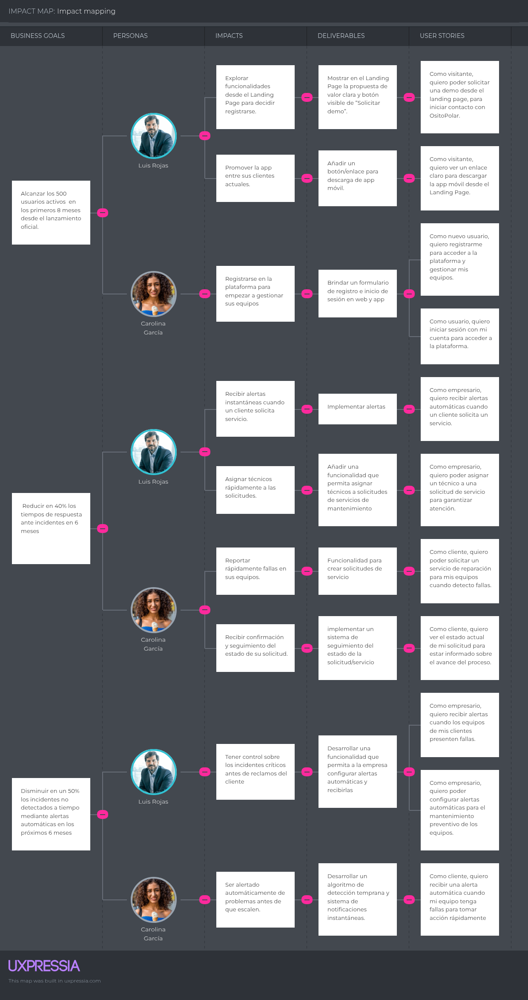
  <figcaption style="font-size: 0.9em; color: #555;">
    <strong>Figura 1:</strong> Impact Mapping.
  </figcaption>
</figure>

### 3.4. Product Backlog.

A continuación, presentaremos el Product Backlog, el cual contiene todas las funcionalidades y características necesarias para el desarrollo de la plataforma. Este listado incluye tanto las historias de usuario como las tareas técnicas que facilitarán el progreso del proyecto. Para priorizar las tareas, se ha utilizado la escala Fibonacci (1, 2, 3, 5, 8, 13, 21), la cual ayuda a estimar el esfuerzo relativo requerido para completar cada tarea. Además, hemos asignado cada item a un sprint, de acuerdo con su relevancia y dependencias.

Escala de Story Points (Fibonacci):

1: Tareas pequeñas que se pueden completar rápidamente.

2: Tareas de tamaño moderado.

3: Tareas que requieren más tiempo y esfuerzo.

5: Tareas complejas o con dependencia de otras tareas.

8: Tareas muy complejas o que afectan a múltiples áreas.

<figure style="page-break-inside: avoid; text-align: center;">
  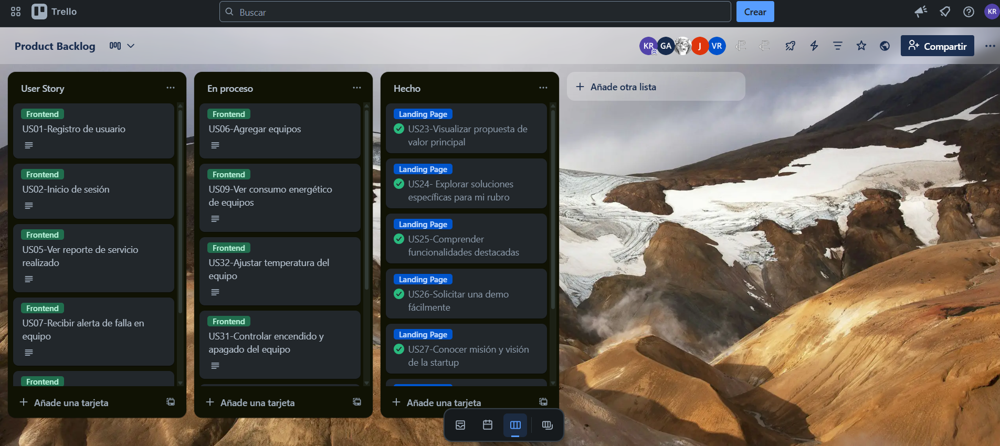
  <figcaption style="font-size: 0.9em; color: #555;">
    <strong>Figura 1:</strong> Product Backlog.
  </figcaption>
</figure>

| Orden | User Story ID | Titulo                                         | Descripcion                                                                                                                                                                | Story Points |
|-------|---------------|------------------------------------------------|----------------------------------------------------------------------------------------------------------------------------------------------------------------------------|--------------|
| 1     | US-01         | Registro de usuario                            | Como nuevo usuario, quiero registrarme para acceder a la plataforma y empezar a gestionar mis equipos de refrigeración.                                                    | 5            |
| 2     | US-02         | Inicio de sesión                               | Como usuario, quiero iniciar sesión con mi cuenta para acceder a la plataforma.                                                                                            | 3            |
| 3     | US-03         | Solicitar servicio de reparación               | Como cliente, quiero poder solicitar un servicio de reparación para mis equipos de refrigeración cuando detecto fallas.                                                    | 5            |
| 4     | US-04         | Ver estado del servicio solicitado             | Como cliente, quiero ver el estado actual de mi solicitud de servicio para estar informado sobre el avance del proceso.                                                    | 3            |
| 5     | US-05         | Ver reporte de servicio realizado              | Como cliente, quiero ver el reporte de servicio detallado para saber qué reparaciones se hicieron en mi equipo.                                                            | 3            |
| 6     | US-06         | Agregar equipos                                | Como cliente, quiero poder agregar mis equipos de refrigeración en la plataforma para llevar un control.                                                                   | 5            |
| 7     | US-07         | Recibir alerta de falla en equipo              | Como cliente, quiero recibir una alerta automática cuando mi equipo de refrigeración presente una falla para tomar acción rápidamente.                                     | 8            |
| 8     | US-08         | Solicitar mantenimiento preventivo             | Como cliente, quiero poder solicitar mantenimiento preventivo para evitar fallas futuras en mis equipos de refrigeración.                                                  | 5            |
| 9     | US-09         | Ver consumo energético de equipos              | Como cliente, quiero ver un informe del consumo energético de mis equipos para poder analizar su eficiencia.                                                               | 5            |
| 10    | US-09         | Recepción de alertas automáticas para servicio | Como empresario, quiero recibir alertas automáticas cuando un cliente solicite un servicio de reparación o mantenimiento.                                                  | 8            |
| 11    | US-10         | Asignar técnico a solicitud de servicio        | Como empresario, quiero poder asignar un técnico a una solicitud de servicio para garantizar que se realice el trabajo adecuado.                                           | 5            |
| 12    | US-11         | Ver historial de servicios realizados          | Como empresario, quiero ver el historial de servicios realizados para cada cliente y equipo, para llevar un control adecuado.                                              | 5            |
| 13    | US-12         | Realizar seguimiento a solicitudes de servicio | Como empresario, quiero realizar un seguimiento detallado a las solicitudes de servicio de mis técnicos, para saber cómo van.                                              | 8            |
| 14    | US-13         | Generar reporte de desempeño de técnicos       | Como empresario, quiero generar reportes sobre el desempeño de mis técnicos para evaluar su eficiencia y productividad.                                                    | 5            |
| 15    | US-14         | Configurar alertas de mantenimiento            | Como empresario, quiero poder configurar alertas automáticas para el mantenimiento preventivo de los equipos.                                                              | 8            |
| 16    | US-15         | Visualizar clientes y servicios asociados      | Como empresario, quiero ver todos los clientes que han solicitado servicio para organizar el trabajo de los técnicos.                                                      | 5            |
| 17    | US-16         | Visualizar equipos entregados a clientes       | Como empresario, quiero ver todos los equipos que fueron entregados a clientes para realizar su seguimiento.                                                               | 5            |
| 18    | US-17         | Recibir notificaciones de eventos importantes  | Como cliente, quiero recibir notificaciones sobre eventos importantes como el progreso del servicio, etc.                                                                  | 8            |
| 19    | US-18         | Realizar evaluación de servicio                | Como cliente, quiero poder evaluar el servicio para mostrar mi conformidad.                                                                                                | 3            |
| 20    | US-19         | Registrar técnicos                             | Como empresario, quiero poder registrar técnicos en la plataforma para integrarlos a mi red de soporte técnico.                                                            | 5            |
| 21    | US-21         | Visualizar perfil del técnico                  | Como empresario, quiero visualizar el perfil de cada técnico, incluyendo sus datos personales y métricas de desempeño, para evaluar su rendimiento.                        | 5            |
| 22    | US-22         | Visualizar propuesta de valor principal        | Como empresario, quiero recibir alertas cuando alguno de los equipos de mis clientes presenta fallas, para notificar al cliente y organizar la atención técnica.           | 8            |
| 23    | US-23         | Explorar soluciones específicas para mi rubro  | Como visitante, quiero ver claramente la propuesta de valor en la landing page, para saber si OsitoPolar puede ayudarme.                                                   | 3            |
| 24    | US-24         | Comprender funcionalidades destacadas          | Como visitante, quiero encontrar una sección con soluciones específicas para negocios como el mío, para saber si OsitoPolar se ajusta a mis necesidades.                   | 5            |
| 25    | US-25         | Solicitar una demo fácilmente                  | Como visitante, quiero ver funcionalidades clave presentadas de forma clara, para evaluar si la plataforma se adapta a mi operación.                                       | 5            |
| 26    | US-26         | Conocer misión y visión de la startup          | Como visitante, quiero poder solicitar una demo desde el landing page, para iniciar contacto con OsitoPolar.                                                               | 3            |
| 27    | US-27         | Conocer misión y visión de la startup          | Como visitante, quiero ver la misión y visión de OsitoPolar, para entender su enfoque y confianza en su propuesta.                                                         | 2            |
| 28    | US-28         | Contactar fácilmente con ventas                | Como visitante empresario, quiero un botón claro para contactar con ventas, para iniciar una posible relación comercial.                                                   | 3            |
| 29    | US-29         | Acceder fácilmente al inicio de sesión         | Como visitante, quiero encontrar un botón de “Iniciar sesión” visible en el Landing Page, para acceder rápidamente a mi cuenta sin perder tiempo.                          | 3            |
| 30    | US-30         | Descargar la app móvil desde la web            | Como visitante interesado en usar OsitoPolar desde el celular, quiero ver un enlace claro para descargar la app móvil desde el Landing Page, para instalarla fácilmente.   | 5            |
| 31    | US-31         | Registrar nuevo equipo                         | Como desarrollador, quiero permitir que los usuarios registren nuevos equipos de refrigeración mediante una API para facilitar el control y monitoreo desde la plataforma. | 5            |
| 32    | US-32         | Eliminar técnico asignado                      | Como desarrollador, quiero poder eliminar un técnico del sistema desde el API para gestionar la asignación de servicios y roles técnicos.                                  | 5            |
| 33    | US-33         | Notificación automática por alerta crítica     | Como desarrollador, quiero implementar un sistema de notificaciones automáticas que se activen cuando se detecten fallas críticas en los equipos.                          | 8            |
| 34    | US-34         | Crear solicitud de mantenimiento               | Como desarrollador, quiero implementar una API que permita crear solicitudes de mantenimiento para que los negocios reporten necesidades de soporte técnico.               | 5            | 
| 35    | US-35         | Crear registro de intervención técnica         | Como desarrollador, quiero permitir registrar intervenciones técnicas realizadas a través de la API, para llevar seguimiento del mantenimiento.                            | 5            |
| 36    | US-36         | Registrar evento de alerta manual              | Como desarrollador, quiero permitir registrar una alerta manual vía API para que los técnicos puedan ingresar incidentes detectados en campo.                              | 3            |
| 37    | US-37         | Evaluar servicio                               | Como desarrollador, quiero implementar un endpoint RESTful que permita a los clientes registrar y actualizar una evaluación de servicio, para reflejar su experiencia.     | 8            |

## Capítulo IV: Solution Software Design
### 4.1. Strategic-Level Domain-Driven Design.

#### 4.1.1. Design-Level EventStorming.

##### 4.1.1.1 Candidate Context Discovery.

##### 4.1.1.2 Domain Message Flows Modeling.

##### 4.1.1.3 Bounded Context Canvases.

#### 4.1.2. Context Mapping.

#### 4.1.3. Software Architecture.

##### 4.1.3.1. Software Architecture System Landscape Diagram.

##### 4.1.3.2. Software Architecture Context Level Diagrams.

##### 4.1.3.2. Software Architecture Container Level Diagrams.

##### 4.1.3.3. Software Architecture Deployment Diagrams.

### 4.2. Tactical-Level Domain-Driven Design

#### 4.2.1. Bounded Context: IAM (Identity and Access Management)

##### 4.2.1.1. Domain Layer

El Domain Layer del bounded context **IAM** encapsula toda la lógica de autenticación y autorización de usuarios en la plataforma. Su responsabilidad principal es gestionar el ciclo de vida de los usuarios, incluyendo el registro (`SignUp`) y el inicio de sesión (`SignIn`), asegurando que las credenciales sean manejadas de forma segura mediante hashing de contraseñas.

**Aggregate Root:**

- `User` — Entidad raíz que representa a un usuario del sistema. Contiene `Id`, `Username`, `PasswordHash` y `SubscriptionId`(referencia al plan de suscripción). Expone métodos como `UpdateUsername`, `UpdatePasswordHash` y `UpdateSubscription`.

**Commands:**

- `SignUpCommand(Username, Password, Role)` — Registra un nuevo usuario.
- `SignInCommand(Username, Password)` — Autentica un usuario existente.

**Queries:**

- `GetAllUsersQuery` — Retorna todos los usuarios registrados.
- `GetUserByIdQuery(int Id)` — Retorna un usuario por su identificador.
- `GetUserByUsernameQuery(string Username)` — Retorna un usuario por su nombre de usuario.

**Repositories:**

- `IUserRepository` — Contrato de persistencia con operaciones de búsqueda por username.

**Domain Services:**

- `IUserCommandService` — Interfaz para manejar comandos de usuario (SignUp, SignIn).
- `IUserQueryService` — Interfaz para manejar consultas de usuario.

**Outbound Services (Application):**

- `IHashingService` — Abstracción para hashing de contraseñas (implementado con BCrypt).
- `ITokenService` — Abstracción para generación y validación de JWT tokens.

---

##### 4.2.1.2. Interface Layer

La capa de interfaz expone los endpoints REST de autenticación y gestión de usuarios, además de publicar una fachada ACL para que otros bounded contexts puedan consultar información de usuarios sin acoplarse directamente.

**Controllers REST:**

- `AuthenticationController` (`/api/v1/authentication`)
    - `POST /sign-up` — Registra un nuevo usuario.
    - `POST /sign-in` — Inicia sesión y retorna un JWT token.
- `UsersController` (`/api/v1/users`)
    - `GET /` — Lista todos los usuarios.
    - `GET /{id}` — Retorna un usuario por ID.

**Resources:**

- `SignUpResource(Username, Password, Role)`
- `SignInResource(Username, Password)`
- `AuthenticatedUserResource(Id, Username, Token)`
- `UserResource(Id, Username)`

**Assemblers (Transform):**

- `SignUpCommandFromResourceAssembler`
- `SignInCommandFromResourceAssembler`
- `AuthenticatedUserResourceFromEntityAssembler`
- `UserResourceFromEntityAssembler`

**ACL (Anti-Corruption Layer):**

- `IIamContextFacade` — Interfaz publicada para otros contextos.
- `IamContextFacade` — Implementación que permite crear usuarios y consultar IDs por username desde otros bounded contexts.

---

##### 4.2.1.3. Application Layer

La capa de aplicación orquesta los casos de uso del bounded context IAM, coordinando el repositorio de usuarios con los servicios de hashing y token para ejecutar los flujos de autenticación.

**Command Services:**

- `UserCommandService` — Implementa `IUserCommandService`.
    - `Handle(SignUpCommand)`: Verifica que el username no exista, hashea la contraseña con `IHashingService` y persiste el nuevo usuario.
    - `Handle(SignInCommand)`: Verifica credenciales con BCrypt, genera y retorna un JWT mediante `ITokenService`.

**Query Services:**

- `UserQueryService` — Implementa `IUserQueryService`.
    - `Handle(GetAllUsersQuery)`: Retorna todos los usuarios.
    - `Handle(GetUserByIdQuery)`: Retorna usuario por ID.
    - `Handle(GetUserByUsernameQuery)`: Retorna usuario por username.

**Outbound Services:**

- `IHashingService` / `ITokenService` — Interfaces de servicios externos definidas en Application para ser implementadas en Infrastructure.

---

##### 4.2.1.4. Infrastructure Layer

La capa de infraestructura provee las implementaciones concretas de los contratos definidos en el dominio y la aplicación: persistencia con Entity Framework Core, hashing con BCrypt, tokens JWT y middleware de autorización.

**Persistence (EFC):**

- `UserRepository` — Implementa `IUserRepository` usando `AppDbContext`. Permite búsqueda por username.
- `ModelBuilderExtensions.ApplyIamConfiguration()` — Configura la tabla `users` con columnas `id`, `username`, `password_hash`, `subscription_id`, `created_at`, `updated_at`.

**Hashing:**

- `HashingService` — Implementa `IHashingService` usando la librería BCrypt.Net para hashear y verificar contraseñas.

**Tokens JWT:**

- `TokenService` — Implementa `ITokenService`. Genera tokens JWT firmados con clave secreta, incluyendo claims de `id` y `username`.
- `TokenSettings` — Configuración del secreto JWT leído desde `appsettings.json`.

**Middleware Pipeline:**

- `RequestAuthorizationMiddleware` — Middleware que valida el JWT en cada request y adjunta el usuario autenticado al contexto HTTP.
- `AuthorizeAttribute` / `AllowAnonymousAttribute` — Atributos para marcar endpoints que requieren o no autenticación.
- `RequestAuthorizationMiddlewareExtensions` — Método de extensión para registrar el middleware en el pipeline de ASP.NET Core.

---

##### 4.2.1.5. Bounded Context Software Architecture Component Level Diagrams

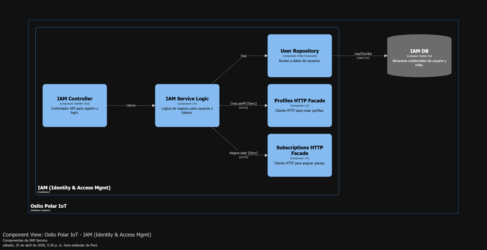

**Leyenda:**

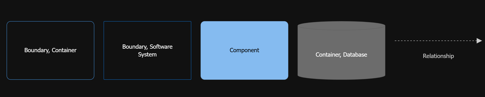

---

##### 4.2.1.6. Bounded Context Software Architecture Code Level Diagrams

###### 4.2.1.6.1. Bounded Context Domain Layer Class Diagrams

###### 4.2.1.6.2. Bounded Context Database Design Diagram

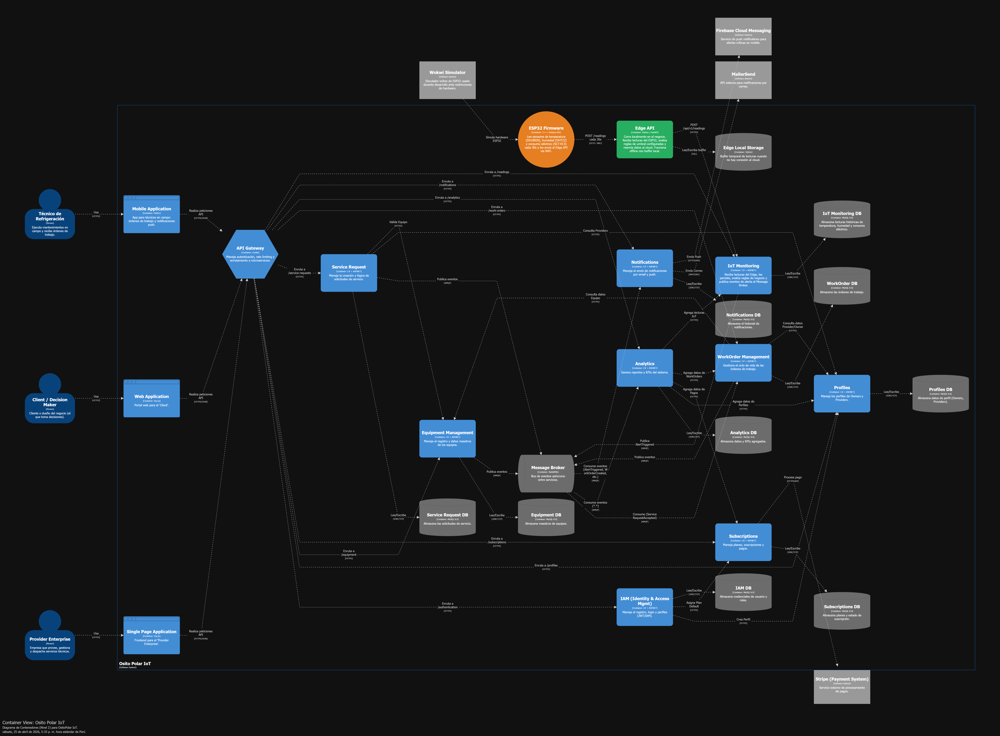

---

#### 4.2.2. Bounded Context: Profiles

##### 4.2.2.1. Domain Layer

El Domain Layer del bounded context **Profiles** gestiona la información personal de los usuarios registrados en la plataforma (clientes y técnicos). Se encarga de representar los datos de perfil de manera estructurada mediante Value Objects, garantizando la validación de cada dato de dominio.

**Aggregate Root:**

- `Profile` — Entidad raíz que representa el perfil de un usuario. Contiene `Id`, `Name` (PersonName), `Email` (EmailAddress) y `Address` (StreetAddress). Expone propiedades computadas como `FullName`, `EmailAddress` y `StreetAddress`.

**Value Objects:**

- `PersonName(FirstName, LastName)` — Encapsula el nombre completo. Expone `FullName`.
- `EmailAddress(Address)` — Encapsula y valida el correo electrónico.
- `StreetAddress(Street, Number, City, PostalCode, Country)` — Encapsula la dirección física. Expone `FullAddress`.

**Commands:**

- `CreateProfileCommand(FirstName, LastName, Email, Street, Number, City, PostalCode, Country)` — Crea un nuevo perfil de usuario.

**Queries:**

- `GetAllProfilesQuery` — Retorna todos los perfiles.
- `GetProfileByIdQuery(int Id)` — Retorna un perfil por su ID.
- `GetProfileByEmailQuery(string Email)` — Retorna un perfil por su email.

**Repositories:**

- `IProfileRepository` — Contrato de persistencia con búsqueda por email.

**Domain Services:**

- `IProfileCommandService` — Interfaz para ejecutar comandos de perfil.
- `IProfileQueryService` — Interfaz para ejecutar consultas de perfil.

---

##### 4.2.2.2. Interface Layer

La capa de interfaz expone los endpoints REST para crear y consultar perfiles. Además, publica una fachada ACL que permite que el bounded context IAM cree perfiles automáticamente al registrar un usuario.

**Controllers REST:**

- `ProfilesController` (`/api/v1/profiles`)
    - `POST /` — Crea un nuevo perfil.
    - `GET /` — Lista todos los perfiles.
    - `GET /{profileId}` — Retorna un perfil por ID.

**Resources:**

- `CreateProfileResource(FirstName, LastName, Email, Street, Number, City, PostalCode, Country)`
- `ProfileResource(Id, FullName, Email, StreetAddress)`

**Assemblers (Transform):**

- `CreateProfileCommandFromResourceAssembler`
- `ProfileResourceFromEntityAssembler`

**ACL (Anti-Corruption Layer):**

- `IProfilesContextFacade` — Interfaz publicada para otros contextos.
- `ProfilesContextFacade` — Implementación que permite crear perfiles y obtener IDs por email desde otros bounded contexts (principalmente IAM).

---

##### 4.2.2.3. Application Layer

La capa de aplicación orquesta los casos de uso del bounded context Profiles, coordinando la creación y consulta de perfiles mediante el repositorio y la unidad de trabajo.

**Command Services:**

- `ProfileCommandService` — Implementa `IProfileCommandService`.
    - `Handle(CreateProfileCommand)`: Verifica que no exista un perfil con el mismo email, crea el perfil y lo persiste.

**Query Services:**

- `ProfileQueryService` — Implementa `IProfileQueryService`.
    - `Handle(GetAllProfilesQuery)`: Retorna todos los perfiles.
    - `Handle(GetProfileByIdQuery)`: Retorna perfil por ID.
    - `Handle(GetProfileByEmailQuery)`: Retorna perfil por email.

**ACL (Application):**

- `ProfilesContextFacade` — Implementación de la fachada que expone operaciones simplificadas para otros BCs.

---

##### 4.2.2.4. Infrastructure Layer

La capa de infraestructura provee la implementación concreta de persistencia mediante Entity Framework Core.

**Persistence (EFC):**

- `ProfileRepository` — Implementa `IProfileRepository` usando `AppDbContext`. Permite búsqueda por email.
- `ModelBuilderExtensions.ApplyProfilesConfiguration()` — Configura la tabla `profiles` con value objects mapeados como owned entities: `PersonName` → columnas `first_name`, `last_name`; `EmailAddress` → columna `email_address`; `StreetAddress` → columnas `street`, `number`, `city`, `postal_code`, `country`.

---

##### 4.2.2.5. Bounded Context Software Architecture Component Level Diagrams

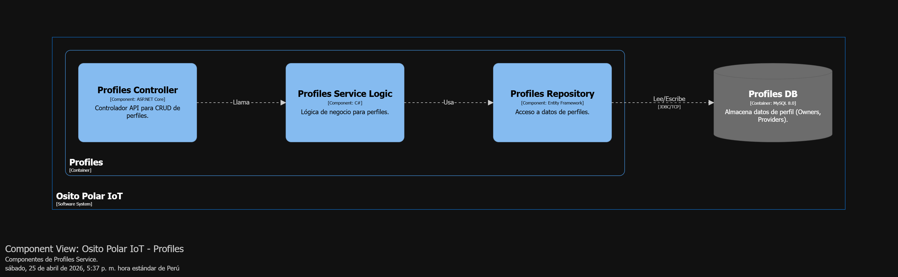

**Leyenda:**

---

##### 4.2.2.6. Bounded Context Software Architecture Code Level Diagrams

###### 4.2.2.6.1. Bounded Context Domain Layer Class Diagrams

###### 4.2.2.6.2. Bounded Context Database Design Diagram

---

#### 4.2.3. Bounded Context: Equipment Management

##### 4.2.3.1. Domain Layer

El Domain Layer del bounded context **Equipment Management** gestiona el ciclo de vida completo de los equipos de refrigeración y climatización que la plataforma monitorea. Permite crear, actualizar y consultar equipos, así como gestionar su estado operativo, ubicación y consumo energético.

**Aggregate Root:**

- `Equipment` — Entidad raíz que representa un equipo físico. Contiene `Id`, `EquipmentIdentifier` (VO), `OwnerId`, `OwnershipType`, `Status`, `Type`, `Location`, `RentalInfo` y `EnergyConsumption`. Expone métodos como `UpdateLocation`, `UpdatePowerState` y `UpdateTemperature`.

**Entities:**

- `Location(Coordinates, Address)` — Representa la ubicación física del equipo.
- `RentalInfo` — Información de alquiler del equipo (si aplica).
- `EnergyConsumption` — Registro de consumo energético del equipo.

**Value Objects:**

- `EquipmentIdentifier(SerialNumber, Model, Brand)` — Identificador único de negocio del equipo.
- `Coordinates(Latitude, Longitude)` — Coordenadas geográficas.
- `EEquipmentStatus` — Enum: `Active`, `Inactive`, `UnderMaintenance`, `Retired`.
- `EEquipmentType` — Enum: `Refrigerator`, `Freezer`, `AirConditioner`, etc.
- `EOwnershipType` — Enum: `Owned`, `Rented`.

**Commands:**

- `CreateEquipmentCommand`
- `UpdateEquipmentLocationCommand`
- `UpdateEquipmentPowerStateCommand`
- `UpdateEquipmentTemperatureCommand`
- `DeleteEquipmentCommand`

**Queries:**

- `GetAllEquipmentsQuery`
- `GetEquipmentByIdQuery(int Id)`
- `GetEquipmentsByOwnerIdQuery(int OwnerId)`
- `GetEquipmentsByStatusQuery(EEquipmentStatus Status)`
- `GetEquipmentsByTypeQuery(EEquipmentType Type)`

**Repositories:**

- `IEquipmentRepository` — Contrato de persistencia con búsquedas por OwnerId, Status y Type.

**Domain Services:**

- `IEquipmentCommandService`
- `IEquipmentQueryService`

---

##### 4.2.3.2. Interface Layer

**Controllers REST:**

- `EquipmentsController` (`/api/v1/equipments`)
    - `POST /` — Crea un nuevo equipo.
    - `GET /` — Lista todos los equipos.
    - `GET /{id}` — Retorna equipo por ID.
    - `PUT /{id}/location` — Actualiza ubicación.
    - `PUT /{id}/power-state` — Actualiza estado de encendido.
    - `PUT /{id}/temperature` — Actualiza temperatura configurada.
    - `DELETE /{id}` — Elimina un equipo.

**Resources:**

- `CreateEquipmentResource`, `EquipmentResource`, `UpdateEquipmentLocationResource`, `UpdateEquipmentPowerStateResource`, `UpdateEquipmentTemperatureResource`, `EquipmentOperationParametersResource`

**Assemblers:**

- `CreateEquipmentCommandFromResourceAssembler`
- `EquipmentResourceFromEntityAssembler`

---

##### 4.2.3.3. Application Layer

**Command Services:**

- `EquipmentCommandService` — Implementa `IEquipmentCommandService`.
    - `Handle(CreateEquipmentCommand)`: Crea y persiste un nuevo equipo.
    - `Handle(UpdateEquipmentLocationCommand)`: Actualiza la ubicación del equipo.
    - `Handle(UpdateEquipmentPowerStateCommand)`: Cambia el estado de energía.
    - `Handle(UpdateEquipmentTemperatureCommand)`: Actualiza la temperatura configurada.
    - `Handle(DeleteEquipmentCommand)`: Elimina el equipo del sistema.

**Query Services:**

- `EquipmentQueryService` — Implementa `IEquipmentQueryService`.
    - Maneja todas las queries de búsqueda de equipos.

---

##### 4.2.3.4. Infrastructure Layer

**Persistence (EFC):**

- `EquipmentRepository` — Implementa `IEquipmentRepository` con EF Core.
- `ModelBuilderExtensions.ApplyEquipmentConfiguration()` — Configura las tablas:
    - `equipments` — Tabla principal con columnas de identificador, tipo, estado, propietario.
    - Value Objects `EquipmentIdentifier`, `Coordinates` mapeados como owned entities.
    - Relaciones con `energy_consumptions`, `locations`, `rental_infos`.

---

##### 4.2.3.5. Bounded Context Software Architecture Component Level Diagrams

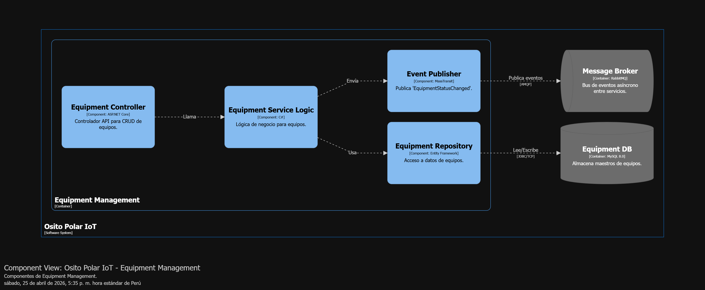

**Leyenda:**

---

##### 4.2.3.6. Bounded Context Software Architecture Code Level Diagrams

###### 4.2.3.6.1. Bounded Context Domain Layer Class Diagrams

###### 4.2.3.6.2. Bounded Context Database Design Diagram

---

#### 4.2.4. Bounded Context: Service Requests

##### 4.2.4.1. Domain Layer

El Domain Layer del bounded context **Service Requests** gestiona las solicitudes de servicio técnico que los clientes realizan para sus equipos. Modela el flujo completo desde la creación de la solicitud hasta su resolución, incluyendo asignación de técnico, cambios de estado y retroalimentación del cliente.

**Aggregate Root:**

- `ServiceRequest` — Entidad raíz con `Id`, `OrderNumber`, `Title`, `Description`, `IssueDetails`, `Status`, `Priority`, `Urgency`, `IsEmergency`, `ServiceType`, `ClientId`, `CompanyId`, `EquipmentId`, `AssignedTechnicianId`, fechas de programación, detalles de resolución y `CustomerFeedbackRating`.

**Value Objects (Enums):**

- `EServiceRequestStatus` — `Pending`, `Accepted`, `InProgress`, `Resolved`, `Cancelled`, `Rejected`.
- `EPriority` — `Low`, `Medium`, `High`, `Critical`.
- `EUrgency` — `Normal`, `Urgent`, `Emergency`.
- `EServiceType` — `Diagnostic`, `Repair`, `Maintenance`, `Installation`.

**Commands:**

- `CreateServiceRequestCommand`
- `UpdateServiceRequestCommand`
- `UpdateServiceRequestStatusCommand`
- `AssignTechnicianToServiceRequestCommand`
- `CancelServiceRequestCommand`
- `RejectServiceRequestCommand`
- `AddCustomerFeedbackToServiceRequestCommand`

**Queries:**

- `GetAllServiceRequestsQuery`
- `GetServiceRequestByIdQuery(int Id)`
- `GetServiceRequestsByStatusQuery(EServiceRequestStatus Status)`
- `GetServiceRequestsByEquipmentIdQuery(int EquipmentId)`

**Domain Methods (comportamiento en el agregado):**

- `AssignTechnician(technicianId)` — Asigna técnico y cambia estado a `Accepted`.
- `UpdateStatus(newStatus)` — Cambia el estado con reglas de negocio.
- `Reject()` — Solo desde estado `Pending`.
- `Cancel()` — No permitido desde `Resolved`, `Cancelled` o `Rejected`.
- `AddResolutionDetails(...)` — Agrega resolución y cambia a `Resolved`.
- `AddCustomerFeedback(rating)` — Solo desde `Resolved`, rating 1-5.

---

##### 4.2.4.2. Interface Layer

**Controllers REST:**

- `ServiceRequestsController` (`/api/v1/service-requests`)
    - `POST /` — Crea una nueva solicitud.
    - `GET /` — Lista todas las solicitudes.
    - `GET /{id}` — Retorna solicitud por ID.
    - `PUT /{id}/status` — Actualiza el estado.
    - `PUT /{id}/assign-technician` — Asigna técnico.
    - `PUT /{id}/customer-feedback` — Agrega retroalimentación.
    - `PUT /{id}/cancel` — Cancela la solicitud.
    - `PUT /{id}/reject` — Rechaza la solicitud.

**Resources:**

- `CreateServiceRequestResource`, `ServiceRequestResource`, `UpdateServiceRequestResource`, `UpdateServiceRequestStatusResource`, `AssignTechnicianToServiceRequestResource`, `AddCustomerFeedbackToServiceRequestResource`

**Assemblers:**

- `CreateServiceRequestCommandFromResourceAssembler`
- `ServiceRequestResourceFromEntityAssembler`
- `AssignTechnicianToServiceRequestCommandFromResourceAssembler`
- `AddCustomerFeedbackToServiceRequestCommandFromResourceAssembler`
- `UpdateServiceRequestCommandFromResourceAssembler`

---

##### 4.2.4.3. Application Layer

**Command Services:**

- `ServiceRequestCommandService` — Implementa `IServiceRequestCommandService`.
    - Maneja todos los comandos: crear, actualizar, asignar técnico, cancelar, rechazar, agregar feedback.

**Query Services:**

- `ServiceRequestQueryService` — Implementa `IServiceRequestQueryService`.
    - Maneja todas las queries de búsqueda y filtrado de solicitudes.

---

##### 4.2.4.4. Infrastructure Layer

**Persistence (EFC):**

- `ServiceRequestRepository` — Implementa `IServiceRequestRepository`.
- `ModelBuilderExtensions.ApplyServiceRequestsConfiguration()` — Configura la tabla `service_requests` con todas las columnas, enums como strings y relaciones con `equipments`.

---

##### 4.2.4.5. Bounded Context Software Architecture Component Level Diagrams

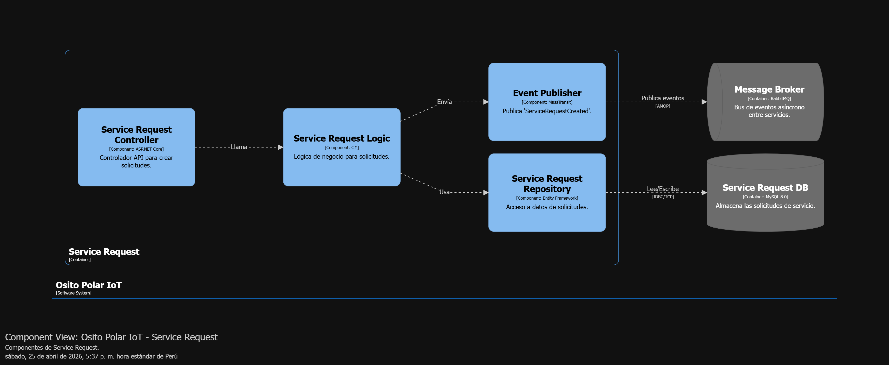

**Leyenda:**

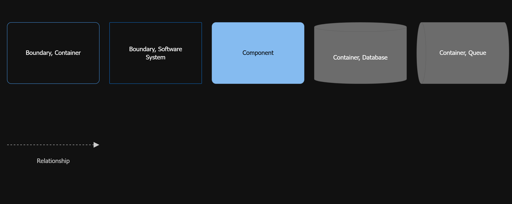

---

##### 4.2.4.6. Bounded Context Software Architecture Code Level Diagrams

###### 4.2.4.6.1. Bounded Context Domain Layer Class Diagrams

###### 4.2.4.6.2. Bounded Context Database Design Diagram

---

#### 4.2.5. Bounded Context: Work Orders

##### 4.2.5.1. Domain Layer

El Domain Layer del bounded context **Work Orders** gestiona las órdenes de trabajo que se generan para atender las solicitudes de servicio. Una `WorkOrder` representa el trabajo técnico concreto que un técnico debe ejecutar sobre un equipo, incluyendo programación, asignación, resolución y retroalimentación.

**Aggregate Root:**

- `WorkOrder` — Entidad raíz con `Id`, `WorkOrderNumber` (generado automáticamente como `WO-YYYYMMDD-XXXXXXXX`), `ServiceRequestId` (opcional), `Title`, `Description`, `IssueDetails`, `Status`, `Priority`, `AssignedTechnicianId`, `ScheduledDate`, `TimeSlot`, `ServiceAddress`, `ResolutionDetails`, `TechnicianNotes`, `Cost`, `CustomerFeedbackRating` y `EquipmentId`.

**Value Objects (Enums):**

- `EWorkOrderStatus` — `Created`, `Assigned`, `InProgress`, `Completed`, `Resolved`, `Cancelled`.
- (Comparte `EPriority` y `EServiceType` del namespace de ServiceRequests).

**Commands:**

- `CreateWorkOrderCommand`
- `UpdateWorkOrderStatusCommand`
- `AssignTechnicianToWorkOrderCommand`
- `AddWorkOrderResolutionDetailsCommand`
- `AddWorkOrderCustomerFeedbackCommand`

**Queries:**

- `GetAllWorkOrdersQuery`
- `GetWorkOrderByIdQuery(int Id)`
- `GetWorkOrderByWorkOrderNumberQuery(string Number)`
- `GetWorkOrderByServiceRequestIdQuery(int ServiceRequestId)`
- `GetWorkOrdersByEquipmentIdQuery(int EquipmentId)`
- `GetWorkOrdersByStatusQuery(EWorkOrderStatus Status)`
- `GetWorkOrdersByTechnicianIdQuery(int TechnicianId)`

**Domain Methods:**

- `AssignTechnician(technicianId)` — Asigna técnico y cambia a estado `Assigned`.
- `UpdateStatus(newStatus)` — Cambia el estado, registra `ActualCompletionDate` si es `Completed`/`Resolved`.
- `AddResolutionDetails(resolution, notes, cost)` — Agrega resolución y marca como `Resolved`.
- `SetCustomerFeedbackRating(rating)` — Rating 1-5 con validación.

---

##### 4.2.5.2. Interface Layer

**Controllers REST:**

- `WorkOrdersController` (`/api/v1/work-orders`)
    - `POST /` — Crea una nueva orden de trabajo.
    - `GET /` — Lista todas las órdenes.
    - `GET /{id}` — Retorna orden por ID.
    - `PUT /{id}/status` — Actualiza el estado.
    - `PUT /{id}/assign-technician` — Asigna técnico.
    - `PUT /{id}/resolution` — Agrega detalles de resolución.
    - `PUT /{id}/customer-feedback` — Agrega retroalimentación del cliente.

**Resources:**

- `CreateWorkOrderResource`, `WorkOrderResource`, `UpdateWorkOrderStatusResource`, `AssignTechnicianResource`, `AddCustomerFeedbackResource`

**Assemblers:**

- `CreateWorkOrderCommandFromResourceAssembler`
- `WorkOrderResourceFromEntityAssembler`
- `UpdateWorkOrderStatusCommandFromResourceAssembler`
- `AddWorkOrderCustomerFeedbackCommandFromResourceAssembler`

---

##### 4.2.5.3. Application Layer

**Command Services:**

- `WorkOrderCommandService` — Implementa `IWorkOrderCommandService`.
    - Maneja todos los comandos: crear, actualizar estado, asignar técnico, agregar resolución y feedback.

**Query Services:**

- `WorkOrderQueryService` — Implementa `IWorkOrderQueryService`.
    - Maneja todas las queries de búsqueda por ID, número, técnico, equipo y estado.

---

##### 4.2.5.4. Infrastructure Layer

**Persistence (EFC):**

- `WorkOrderRepository` — Implementa `IWorkOrderRepository`.
- `ModelBuilderExtensions.ApplyWorkOrdersConfiguration()` — Configura la tabla `work_orders` con todas las columnas, enums como strings y FK a `equipments`.

---

##### 4.2.5.5. Bounded Context Software Architecture Component Level Diagrams

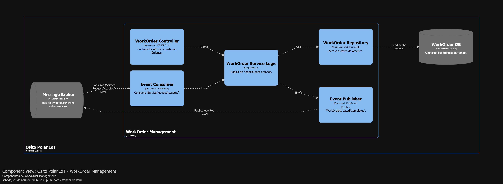

**Leyenda:**

---

##### 4.2.5.6. Bounded Context Software Architecture Code Level Diagrams

###### 4.2.5.6.1. Bounded Context Domain Layer Class Diagrams

###### 4.2.5.6.2. Bounded Context Database Design Diagram

---

#### 4.2.6. Bounded Context: Analytics

##### 4.2.6.1. Domain Layer

El Domain Layer del bounded context **Analytics** gestiona la recopilación y análisis de datos operativos de los equipos de refrigeración: lecturas de temperatura, consumo energético y promedios diarios de temperatura.

**Aggregate Root:**

- `EquipmentAnalytics` — Entidad raíz asociada a un equipo (`EquipmentId`). Agrupa colecciones de `TemperatureReadings` y `EnergyReadings`. Expone métodos como `RecordTemperature`, `RecordEnergyConsumption`, `GetTemperatureStatus` y `GetEnergyStatus`.

**Entities:**

- `TemperatureReading(Id, EquipmentId, Temperature, Timestamp, Status)` — Lectura de temperatura puntual.
- `EnergyReading(Id, EquipmentId, Consumption, Unit, Timestamp, Status)` — Lectura de consumo energético.
- `DailyTemperatureAverage(Id, EquipmentId, Date, AverageTemperature, MinTemperature, MaxTemperature)` — Promedio diario de temperatura calculado.

**Value Objects:**

- `TemperatureRange(Min, Max)` — Rango válido de temperatura con métodos `IsWithinRange` y `IsValid`.
- `AnalyticsTimeframe(Hours)` — Ventana temporal para consultas analíticas. Máximo 8760h (1 año).
- `EReadingStatus` — Enum: `Normal`, `Warning`, `Critical`.

**Commands:**

- `RecordTemperatureReadingCommand(EquipmentId, Temperature, Timestamp?)`
- `RecordEnergyReadingCommand(EquipmentId, Consumption, Unit)`

**Queries:**

- `GetEquipmentAnalyticsQuery(int EquipmentId)`
- `GetTemperatureReadingsQuery(int EquipmentId, int Hours = 24)`
- `GetEnergyReadingsQuery(int EquipmentId, int Hours = 24)`
- `GetDailyTemperatureAveragesQuery(int EquipmentId, int Days = 7)`

**Repositories:**

- `IAnalyticsRepository` — Contrato con operaciones para temperatura, energía y promedios diarios.

---

##### 4.2.6.2. Interface Layer

**Controllers REST:**

- `AnalyticsController` (`/api/v1/analytics/equipments`)
    - `GET /{equipmentId}/readings?type=all|temperature|energy&hours=24` — Lecturas unificadas.
    - `GET /{equipmentId}/summaries?type=daily-averages&days=7` — Resúmenes analíticos.
    - `GET /overview?ids=1,2,3` — Vista general de múltiples equipos.

**Resources:**

- `UnifiedReadingResource(Id, EquipmentId, Type, Value, Unit, Timestamp, Status)`
- `AnalyticsSummaryResource(Id, EquipmentId, Date, Type, AverageTemperature, Min, Max)`
- `CreateTemperatureReadingResource`, `CreateEnergyReadingResource`

**Assemblers:**

- `CreateTemperatureReadingCommandFromResourceAssembler`
- `CreateEnergyReadingCommandFromResourceAssembler`
- `TemperatureReadingResourceFromEntityAssembler`
- `EnergyReadingResourceFromEntityAssembler`
- `DailyTemperatureAverageResourceFromEntityAssembler`

---

##### 4.2.6.3. Application Layer

**Command Services:**

- `AnalyticsCommandService` — Implementa `IAnalyticsCommandService`.
    - `Handle(RecordTemperatureReadingCommand)`: Valida rango -50°C a 100°C, persiste la lectura.
    - `Handle(RecordEnergyReadingCommand)`: Valida que el consumo no sea negativo, persiste la lectura.

**Query Services:**

- `AnalyticsQueryService` — Implementa `IAnalyticsQueryService`.
    - `Handle(GetTemperatureReadingsQuery)`: Lecturas de temperatura por equipo en ventana de horas.
    - `Handle(GetDailyTemperatureAveragesQuery)`: Promedios diarios por equipo.
    - `Handle(GetEnergyReadingsQuery)`: Lecturas de energía por equipo.

---

##### 4.2.6.4. Infrastructure Layer

**Persistence (EFC):**

- `AnalyticsRepository` — Implementa `IAnalyticsRepository`.
- `ModelBuilderExtensions.ApplyAnalyticsConfiguration()` — Configura las tablas:
    - `temperature_readings` — con índice compuesto `(equipment_id, timestamp)`. FK a `equipments`.
    - `energy_readings` — con índice compuesto `(equipment_id, timestamp)`. FK a `equipments`.
    - `daily_temperature_averages` — con índice único `(equipment_id, date)`. FK a `equipments`.
    - `equipment_analytics` — con índice único por `equipment_id`. FK a `equipments`.

---

##### 4.2.6.5. Bounded Context Software Architecture Component Level Diagrams

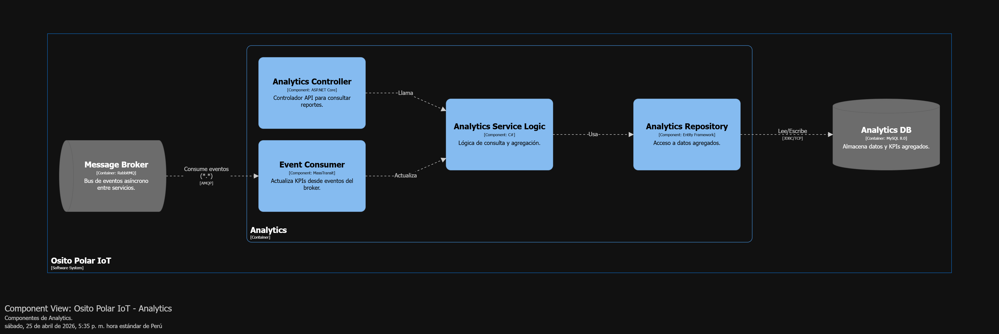

**Leyenda:**

---

##### 4.2.6.6. Bounded Context Software Architecture Code Level Diagrams

###### 4.2.6.6.1. Bounded Context Domain Layer Class Diagrams

###### 4.2.6.6.2. Bounded Context Database Design Diagram

---

#### 4.2.7. Bounded Context: Subscriptions and Payments

##### 4.2.7.1. Domain Layer

El Domain Layer del bounded context **Subscriptions and Payments** gestiona los planes de suscripción y el procesamiento de pagos de los usuarios de la plataforma, integrándose con Stripe como pasarela de pago externa.

**Aggregates:**

- `Subscription` — Entidad raíz con `Id`, `UserId`, `PlanName`, `BillingCycle`, `Features`, `StartDate`, `EndDate`, `Status`. Permite gestionar el ciclo de vida de la suscripción.
- `Payment` — Entidad raíz con `Id`, `UserId`, `SubscriptionId`, `StripeSession`, `Amount`, `Status`. Representa una transacción de pago.

**Value Objects:**

- `BillingCycle` — Representa el ciclo de facturación (mensual, anual).
- `Feature` — Representa una característica incluida en un plan.
- `Price(Amount, Currency)` — Precio del plan.
- `PaymentStatus` — Estado del pago (Pending, Completed, Failed, Refunded).
- `StripeSession(SessionId, SessionUrl)` — Datos de la sesión de pago en Stripe.

**Commands:**

- `CreateSubscriptionCommand`
- `DeleteSubscriptionCommand`
- `UpgradePlanCommand`
- `CreatePaymentSessionCommand`
- `ProcessPaymentWebhookCommand`

**Queries:**

- `GetSubscriptionByIdQuery(int Id)`
- `GetPlansQuery`

**Domain Services:**

- `ISubscriptionCommandService`, `ISubscriptionQueryService`
- `IPaymentCommandService`
- `IStripeService` — Abstracción de la integración con Stripe.

---

##### 4.2.7.2. Interface Layer

**Controllers REST:**

- `SubscriptionsController` (`/api/v1/subscriptions`)
    - `POST /` — Crea una nueva suscripción con sesión de pago Stripe.
    - `GET /{id}` — Retorna suscripción por ID.
    - `PUT /{id}/upgrade` — Actualiza el plan.
    - `DELETE /{id}` — Cancela la suscripción.

**Resources:**

- `CreateSubscriptionResource(UserId, PlanName, BillingCycle)`
- `SubscriptionResource(Id, UserId, PlanName, Status, StartDate, EndDate)`

**Assemblers:**

- `CreateSubscriptionCommandFromResourceAssembler`
- `SubscriptionResourceFromEntityAssembler`
- `UpgradeSubscriptionCommandFromResourceAssembler`

---

##### 4.2.7.3. Application Layer

**Command Services:**

- `SubscriptionsCommandServices` — Implementa `ISubscriptionCommandService`.
    - `Handle(CreateSubscriptionCommand)`: Crea la suscripción y genera la sesión de pago en Stripe.
    - `Handle(UpgradePlanCommand)`: Actualiza el plan del usuario.
    - `Handle(DeleteSubscriptionCommand)`: Cancela la suscripción.
- `PaymentCommandService` — Implementa `IPaymentCommandService`.
    - `Handle(CreatePaymentSessionCommand)`: Crea sesión de Stripe Checkout.
    - `Handle(ProcessPaymentWebhookCommand)`: Procesa webhooks de Stripe para confirmar pagos.

**Query Services:**

- `SubscriptionQueryService` — Retorna suscripciones por ID y lista planes disponibles.

---

##### 4.2.7.4. Infrastructure Layer

**Persistence (EFC):**

- `SubscriptionRepository` — Implementa `ISubscriptionRepository`.
- `PaymentRepository` — Implementa `IPaymentRepository`.
- `ModelBuilderExtensions.ApplySubscriptionsConfiguration()` — Configura tablas `subscriptions` y `payments`, con value objects `BillingCycle`, `Price`, `StripeSession` mapeados como columnas.

**External Integration:**

- `StripeSettings` — Configuración del API key de Stripe leída desde `appsettings.json`.
- Implementación de `IStripeService` usando el SDK oficial de Stripe para crear sesiones de Checkout y procesar webhooks.

---

##### 4.2.7.5. Bounded Context Software Architecture Component Level Diagrams

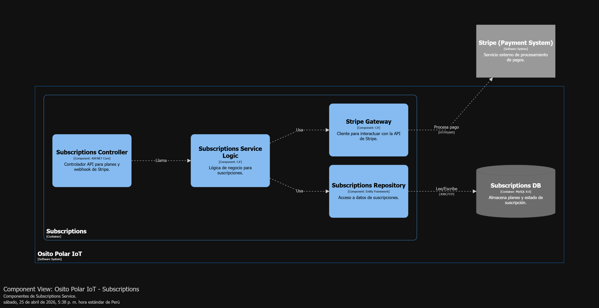

**Leyenda:**

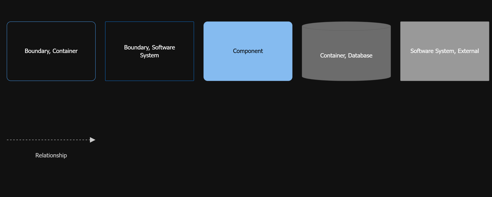

---

##### 4.2.7.6. Bounded Context Software Architecture Code Level Diagrams

###### 4.2.7.6.1. Bounded Context Domain Layer Class Diagrams

###### 4.2.7.6.2. Bounded Context Database Design Diagram

---

#### 4.2.8. Bounded Context: Technicians

##### 4.2.8.1. Domain Layer

El Domain Layer del bounded context **Technicians** gestiona la información de los técnicos de servicio disponibles en la plataforma. Permite registrar técnicos, consultarlos y calcular métricas de rendimiento como el promedio de calificaciones recibidas.

**Entity Principal:**

- `Technician` — Entidad principal con `Id`, `FirstName`, `LastName`, `Email`, `Phone`, `Specialization`, `IsAvailable` y `AverageRating`. Representa a un técnico de mantenimiento de equipos de refrigeración.

**Domain Events:**

- `TechnicianCreatedEvent` — Evento publicado al crear un nuevo técnico.

**Commands:**

- `CreateTechnicianCommand(FirstName, LastName, Email, Phone, Specialization)`

**Queries:**

- `GetAllTechniciansQuery` — Retorna todos los técnicos.
- `GetTechnicianByIdQuery(int Id)` — Retorna técnico por ID.
- `GetTechnicianAverageRatingQuery(int TechnicianId)` — Calcula el promedio de calificaciones del técnico.

**Repositories:**

- `ITechnicianRepository` — Contrato de persistencia con búsqueda por ID y listado.

**Domain Services:**

- `ITechnicianCommandService`
- `ITechnicianQueryService`

---

##### 4.2.8.2. Interface Layer

**Controllers REST:**

- `TechniciansController` (`/api/v1/technicians`)
    - `POST /` — Registra un nuevo técnico.
    - `GET /` — Lista todos los técnicos.
    - `GET /{id}` — Retorna técnico por ID.

**Resources:**

- `CreateTechnicianResource(FirstName, LastName, Email, Phone, Specialization)`
- `TechnicianResource(Id, FirstName, LastName, Email, Phone, Specialization, IsAvailable, AverageRating)`

**Assemblers:**

- `CreateTechnicianCommandFromResourceAssembler`
- `TechnicianResourceFromEntityAssembler`

---

##### 4.2.8.3. Application Layer

**Command Services:**

- `TechnicianCommandService` — Implementa `ITechnicianCommandService`.
    - `Handle(CreateTechnicianCommand)`: Valida y persiste el nuevo técnico. Publica `TechnicianCreatedEvent`.

**Query Services:**

- `TechnicianQueryService` — Implementa `ITechnicianQueryService`.
    - `Handle(GetAllTechniciansQuery)`: Retorna lista de todos los técnicos.
    - `Handle(GetTechnicianByIdQuery)`: Retorna técnico por ID.
    - `Handle(GetTechnicianAverageRatingQuery)`: Calcula y retorna el promedio de calificaciones.

---

##### 4.2.8.4. Infrastructure Layer

**Persistence (EFC):**

- `TechnicianRepository` — Implementa `ITechnicianRepository` usando EF Core.
- `ModelBuilderExtensions.ApplyTechniciansConfiguration()` — Configura la tabla `technicians` con columnas de datos personales, especialización, disponibilidad y calificación promedio.

---

##### 4.2.8.5. Bounded Context Software Architecture Component Level Diagrams

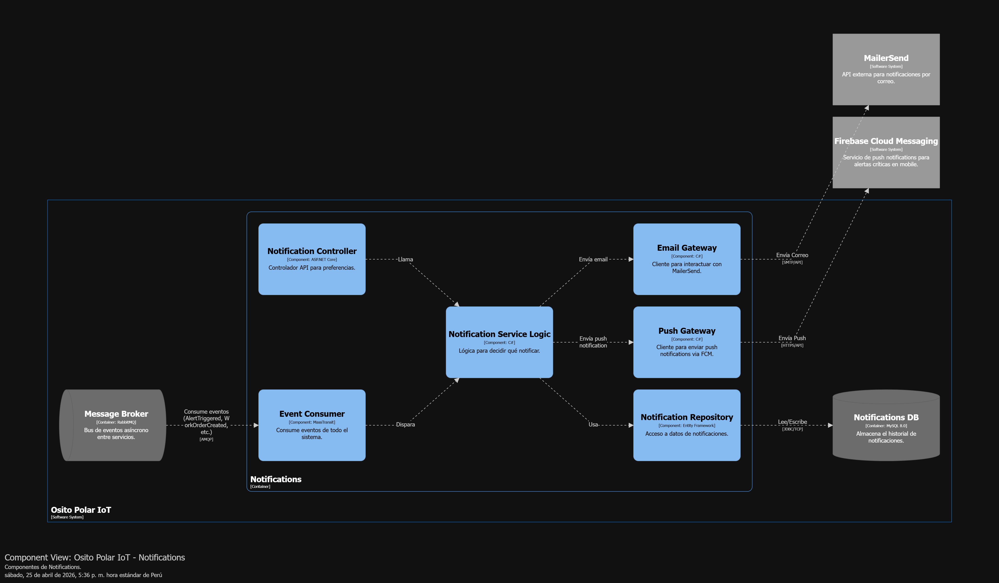

**Leyenda:**

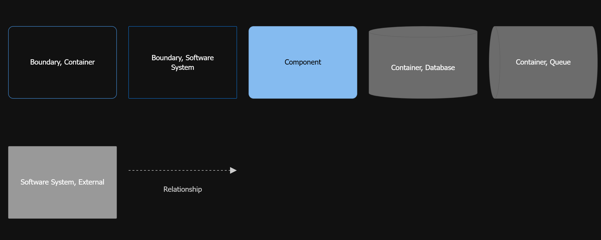

---

##### 4.2.8.6. Bounded Context Software Architecture Code Level Diagrams

###### 4.2.8.6.1. Bounded Context Domain Layer Class Diagrams

###### 4.2.8.6.2. Bounded Context Database Design Diagram

## Capítulo IV: Product Design 

### 4.1. Style Guidelines
#### 4.1.1. General Style Guidelines

Se busca que el tono sea equilibrado, entre lo profesional y lo accesible, con un lenguaje claro, empático y respetuoso para atraer usuarios potenciales y mantener a nuestros usuarios.
Se eligió una paleta de colores fría pero amigable, y una tipografía moderna que combine profesionalismo y accesibilidad.

**Branding**

La identidad visual de OsitoPolar busca transmitir seguridad, innovación y cercanía.

**Logo:** Representa un oso polar con un ícono de refrigeración, combinando lo técnico con lo amigable. Disponible en versiones para fondos claros y oscuros, monocromático, horizontal y vertical.

**Typography**

Para mantener la formalidad y accesibilidad de la interfaz de usuario de OsitoPolar se establecerá las tipografías Helvetica y Open Sans por sus características funcionales, estéticas y por su alta compatibilidad en interfaces digitales, siendo Helvetica la primaria.

<figure style="page-break-inside: avoid; text-align: center;">
  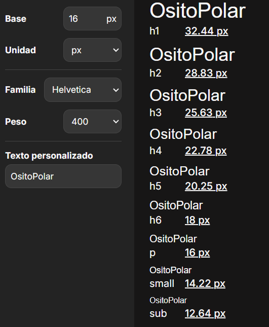
  <figcaption style="font-size: 0.9em; color: #555;">
    <strong>Figura 1:</strong> Tipografía Helvetica.
  </figcaption>
</figure>

<figure style="page-break-inside: avoid; text-align: center;">
  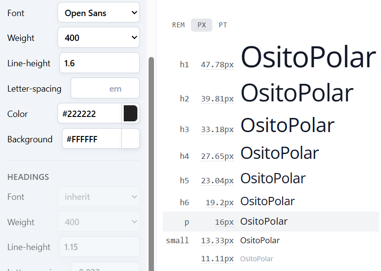
  <figcaption style="font-size: 0.9em; color: #555;">
    <strong>Figura 2:</strong> Tipografía Open Sans.
  </figcaption>
</figure>

**Colors**

La paleta fue diseñada para representar ambientes fríos y tecnológicos, transmitiendo confianza y limpieza visual.

El color principal elegido es el celeste, pues es el que más se acopla a las características que describimos. Se optó por los colores negro, blanco y gris como neutros, los cuales serán utilizados para fondos o textos.
Se eligieron variantes de color verde, rojo, azul y amarillo para ciertos fondos y estados (alertas, servicio, calificaciones).

<figure style="page-break-inside: avoid; text-align: center;">
  
  <figcaption style="font-size: 0.9em; color: #555;">
    <strong>Figura 3:</strong> Guías Generales de Estilo - Colores.
  </figcaption>
</figure>

**Spacing**

Se establecerá un espaciado de 8 px y un margen mínimo de 16 px. Para el diseño modular, se implementarán grids flexibles que se adaptarán tanto a web como a dispositivos móviles, utilizando configuraciones de 12 y 4 columnas respectivamente.

#### 4.1.2. Web Style Guidelines

En esta sección definimos los estándares visuales y de interacción para la versión web de OsitoPolar, asegurando una experiencia de usuario coherente, profesional y accesible en todos los dispositivos.
Es necesario que las interfaces web sean responsivas porque nos trae muchas ventajas tanto para el usuario como para el equipo desarrollador, entre las cuales tenemos: usabilidad en cualquier dispositivo, mejor eficiencia de costos y tiempo en el desarrollo y satisfacción del usuario.

Adoptando un enfoque mobile-first, usamos un sistema de grid de 12 columnas para que la interfaz se adapte a cualquier dispositivo.

**Tipografía**
Tomando en cuenta la guía de estilos, se usará la tipografía Helvetica en la mayoría de los textos de la aplicación, pues esta proyecta profesionalismo y claridad. Para que la visualización de los textos sea óptima, el tamaño de la fuente debe ajustarse automáticamente y adaptarse al dispositivo que se esté usando.

**Colores**
De acuerdo al rubro al que está orientado OsitoPolar, los colores deben reflejar tecnología, frescura y confianza. La elección de colores es la siguiente:

- Celeste (#0884C4): Se usará para el header y algunos botones.
- Blanco (#FFFFFF): Se usará para fondos neutros.
- Negro (#000000): Se usará en algunos botones y bordes.
- Gris claro (#808080): Se usará para líneas, bordes, separadores y botones deshabilitados.
- Blanco azul mar (#F4FCFC): Se usará para algunos fondos.
- Verde medio primavera (#00CC66): Se usará para notificaciones y estados positivos.
- Rojo claro (#FF4B4B): Se usará para alertas, errores y fallas críticas.
- Amarillo mandarina (#FFCC00): Se usará para ciertos agregados (notificaciones, calificaciones).

Sin embargo, la variación de botones y fondos que tendrá la plataforma hace que no siempre se elija la misma tonalidad, por lo que optamos por una paleta de celeste.

<figure style="page-break-inside: avoid; text-align: center;">
  
  <figcaption style="font-size: 0.9em; color: #555;">
    <strong>Figura 1:</strong> Guías de Estilo Web - Color Sky Blue.
  </figcaption>
</figure>

De la misma forma se opta por una paleta de rojo claro para diferenciar ventanas, fondos o íconos que muestren algún tipo de error en el sistema, alertas o estados.

<figure style="page-break-inside: avoid; text-align: center;">
  
  <figcaption style="font-size: 0.9em; color: #555;">
    <strong>Figura 22:</strong> Guías de Estilo Web - Color Rojo.
  </figcaption>
</figure>

### 4.2. Information Architecture

#### 4.2.1. Organization Systems

En esta sección, hemos implementado diferentes sistemas de organización basados en los grupos de información relevantes. La disposición visual del contenido se ha realizado de las siguientes maneras:

- **Jerárquica (visual hierarchy)**: Para resaltar los elementos más importantes, facilitando que los usuarios accedan de manera intuitiva a la información clave.

- **Organización secuencial (step-by-step)**: Utilizada en procesos que requieren una guía detallada, como la compra de maquinas, asegurando un flujo lógico y fácil de seguir.

- **Organización matricial**: Aplicada en áreas donde es necesario comparar o analizar datos relacionados, proporcionando al usuario una visión clara y estructurada de las opciones disponibles.

#### 4.2.2. Labeling Systems

En nuestra empresa, aplicamos estos sistemas de organización visual de la siguiente manera:

Jerarquía Visual: Destacamos información clave como el estado de los equipos y alertas críticas para facilitar su rápida identificación.

Organización Secuencial: El proceso de agendar mantenimiento o visitas técnicas se organiza paso a paso para guiar al usuario.

Organización Matricial: Usamos tablas comparativas para mostrar claramente las diferencias entre planes de suscripción y servicios, facilitando la elección del usuario.

#### 4.2.3. SEO Tags and Meta Tags

**Landing Page**
-Title: OsitoPolar - Monitorea y Gestiona tus Equipos de Congelación en Tiempo Real
-Meta Description: OsitoPolar te permite monitorear y gestionar el estado de tus equipos de congelación, optimizando su rendimiento y evitando fallas. Mantén tu inventario seguro con alertas y mantenimiento predictivo.
-Meta Keywords: monitoreo de congeladoras, gestión de equipos de frío, mantenimiento preventivo, OsitoPolar, alerta de fallas, eficiencia energética
-Meta Author: OsitoPolar

**Aplicación Web**
-Title: OsitoPolar - Plataforma de Gestión de Equipos de Congelación
-Meta Description: OsitoPolar facilita el monitoreo, mantenimiento y eficiencia de tus equipos de congelación. Gestiona en tiempo real el estado y rendimiento de tus equipos con facilidad.
-Meta Keywords: gestión de equipos de frío, monitoreo en tiempo real, mantenimiento predictivo, OsitoPolar, alerta de fallas, reporte de eficiencia
-Meta Author: OsitoPolar

#### 4.2.4. Searching Systems

Estas decisiones están orientadas a facilitar la navegación eficiente, evitando que los usuarios se sientan abrumados por grandes volúmenes de datos y asegurando que encuentren rápidamente lo que necesitan.

**Opciones de Búsqueda**  
**Barra de Búsqueda**  
La barra de búsqueda permite a los usuarios ingresar términos específicos, como el nombre de un equipo, tipo de servicio o estado del equipo, para encontrar rápidamente información relevante. Los resultados se muestran instantáneamente a medida que se escriben los términos.

**Categorías**  
Los usuarios pueden seleccionar entre diferentes categorías de servicios y equipos, como "Congeladoras", "Refrigeradores", "Mantenimiento Preventivo", "Alertas de Fallas" y "Historial de Consumo", para limitar los resultados a un grupo específico.

**Etiquetas Populares**  
Las etiquetas populares, como "Mantenimiento Programado" o "Alertas Críticas", permiten a los usuarios buscar servicios o equipos relacionados con términos comunes, facilitando la localización de opciones populares o especializadas.

**Filtros Disponibles**  
**Filtros por Tipo de Equipo**
- Congeladoras
- Refrigeradores
- Equipos de Frío Industrial

**Filtros por Estado del Equipo**
- En Funcionamiento
- En Reparación
- Necesita Mantenimiento

**Filtro por Fecha de Última Revisión**  
Los usuarios pueden ajustar el filtro para ver los equipos que han sido revisados en un periodo específico, como "Últimos 7 días", "Últimos 30 días", etc.

**Filtro por Consumo Energético**  
Los usuarios pueden ajustar el rango de consumo energético para encontrar equipos dentro de un rango de eficiencia energética deseado.

**Apariencia de los Datos Después de la Búsqueda**  
**Listados de Resultados**  
Los resultados de búsqueda se muestran en una lista ordenada con información clave, como el nombre del equipo, estado actual, próximas fechas de mantenimiento y consumo energético. Además, se incluyen opciones para ver más detalles o agendar visitas de mantenimiento.

**Resumen y Descripción**  
Cada resultado incluye un resumen que resalta la información más relevante, como el historial de mantenimiento o las alertas generadas, permitiendo a los usuarios realizar una evaluación rápida.

**Opciones de Ordenación y Filtros Aplicados**  
Los resultados pueden ordenarse por criterios como relevancia, estado del equipo o consumo energético. Los filtros aplicados se muestran claramente para que los usuarios puedan ajustar su búsqueda según sea necesario.

**Revisiones y Comentarios**  
Los usuarios pueden ver un resumen de las revisiones y comentarios de los técnicos o clientes anteriores sobre el equipo o servicio, lo que les ayuda a evaluar la calidad del servicio y tomar decisiones informadas.

#### 4.2.5. Navigation Systems

La estructura de navegación y las opciones disponibles en **OsitoPolar** están diseñadas para ofrecer una experiencia de usuario fluida y eficiente. A continuación, se resumen las secciones y elementos clave:

1. **Páginas Principales**
    - **Inicio**: Página principal del sitio web.
    - **Funcionalidades**: Detalles sobre las herramientas y servicios que ofrece OsitoPolar.
    - **Beneficios**: Información sobre las ventajas para empresas y proveedores.
    - **Nosotros**: Información sobre la empresa y su misión.
    - **Contacto**: Información de contacto y formulario.

2. **Opciones de Usuario**
    - **Login**: Acceso a cuentas de usuario.
    - **Sign-up**: Registro de nuevos usuarios.
    - **Iniciar sesión / Registrarse**: Alternativa para acceso o creación de cuenta.

3. **Búsqueda y Navegación**
    - **Búsqueda**: Barra de búsqueda para encontrar equipos, servicios o reportes.
    - **Categorías**: Filtros por tipo de equipo (Congeladoras, Refrigeradores, etc.).
    - **Explorar**: Opciones para navegar por diferentes secciones de la plataforma.

4. **Branding y Identidad**
    - **OsitoPolar**: Logo y nombre de la marca, repetidos en varias secciones para mantener la identidad visual de la plataforma.

### 4.3. Landing Page UI Design
#### 4.3.1. Landing Page Wireframe

El wireframe de la página de inicio de OsitoPolar organiza los elementos clave para ofrecer una navegación intuitiva. Incluye un encabezado con el logo y un menú de navegación, seguido de una propuesta de valor clara con botones de acción destacados como "Solicitar Demo" y "¿Cómo Funciona?". La página cuenta con secciones para describir a los usuarios objetivo, las funcionalidades clave del sistema, y los beneficios que ofrece OsitoPolar. Al final, se encuentra un formulario de contacto para que los usuarios soliciten una demo, junto con enlaces legales en el pie de página.

<figure style="page-break-inside: avoid; text-align: center;">
  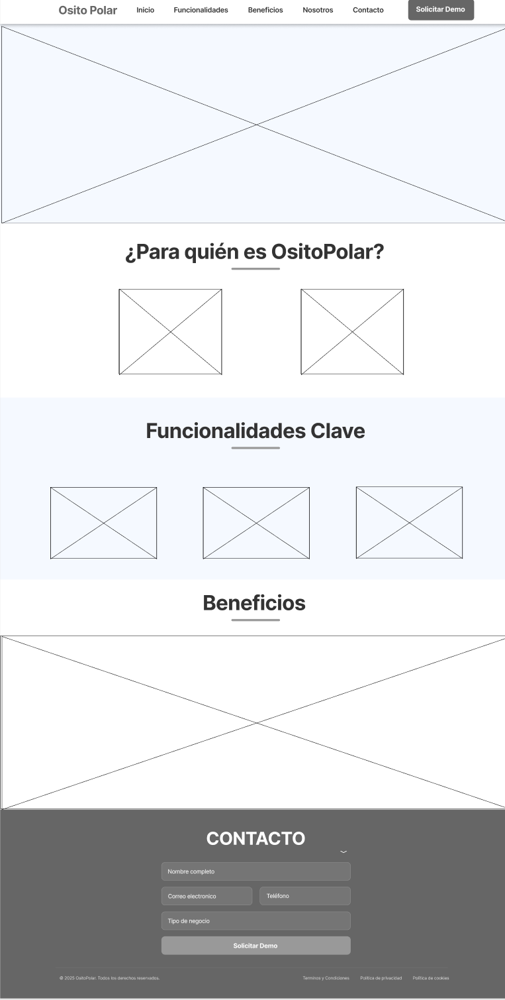
  <figcaption style="font-size: 0.9em; color: #555;">
    <strong>Figura 1:</strong> Wireframe de la Landing Page.
  </figcaption>
</figure>

#### 4.3.2. Landing Page Mockup

El Landing Page Mock-up de OsitoPolar muestra un diseño limpio y organizado, con una estructura intuitiva que guía a los usuarios a través de la plataforma. Incluye una propuesta de valor destacada en la parte superior, seguida de secciones clave como las funcionalidades del sistema, los beneficios para empresas y proveedores, y una explicación clara de cómo funciona el servicio. También cuenta con testimonios de clientes, detalles sobre la empresa y un formulario para solicitar una demo, todo con un enfoque en facilitar la conversión de visitantes a usuarios activos.

- Esta es la primera sección, llamada "Inicio". En esta se puede ver la propuesta de valor que ofrece nuestra plataforma junto con un "Call to Action" que se agregará a futuro.

<figure style="page-break-inside: avoid; text-align: center;">
  
  <figcaption style="font-size: 0.9em; color: #555;">
    <strong>Figura 1:</strong> Mockup 1 - Inicio - Landing Page.
  </figcaption>
</figure>

- Esta segunda sección hace una breve descripción de a quiénes está dirigido la plataforma.

<figure style="page-break-inside: avoid; text-align: center;">
  
  <figcaption style="font-size: 0.9em; color: #555;">
    <strong>Figura 2:</strong> Mockup 2  - ¿Para quién es? - Landing Page.
  </figcaption>
</figure>

- En "Funcionalidades Clave" se presentan las principales funcionalidades que ofrece la plataforma.

<figure style="page-break-inside: avoid; text-align: center;">
  
  <figcaption style="font-size: 0.9em; color: #555;">
    <strong>Figura 3:</strong> Mockup 3 - Funcionalidades - Landing Page.
  </figcaption>
</figure>

- En "Beneficios" se presentan los beneficios que ofrece la plataforma para empresas y proveedores.

<figure style="page-break-inside: avoid; text-align: center;">
  
  <figcaption style="font-size: 0.9em; color: #555;">
    <strong>Figura 4:</strong> Mockup 4 - Beneficios para negocios - Landing Page.
  </figcaption>
</figure>

- En "Beneficios" se presentan los beneficios que ofrece la plataforma para proveedores.

<figure style="page-break-inside: avoid; text-align: center;">
  
  <figcaption style="font-size: 0.9em; color: #555;">
    <strong>Figura 5:</strong> Mockup 5 - Beneficios para proveedores - Landing Page.
  </figcaption>
</figure>

- En "Como funciona" se describe el flujo del funcionamiento de la plataforma.
<figure style="page-break-inside: avoid; text-align: center;">
  
  <figcaption style="font-size: 0.9em; color: #555;">
    <strong>Figura 6:</strong> Mockup 6 - ¿Como funciona? - Landing Page.
  </figcaption>
</figure>

- En "Sobre Nosotros" se presenta nuestra Misión y Visión como startup. 

<figure style="page-break-inside: avoid; text-align: center;">
  
  <figcaption style="font-size: 0.9em; color: #555;">
    <strong>Figura 7:</strong> Mockup 7 - Sobre Nosotros - Landing Page.
  </figcaption>
</figure>

- En "Lo que dicen nuestros clientes" se visualizan las reseñas de los usuarios que usaron nuestra plataforma.

<figure style="page-break-inside: avoid; text-align: center;">
  
  <figcaption style="font-size: 0.9em; color: #555;">
    <strong>Figura 8:</strong> Mockup 8 - Lo que dicen nuestros clientes - Landing Page.
  </figcaption>
</figure>

<figure style="page-break-inside: avoid; text-align: center;">
  
  <figcaption style="font-size: 0.9em; color: #555;">
    <strong>Figura 9:</strong> Mockup 9 - Lo que dicen nuestros clientes - Landing Page.
  </figcaption>
</figure>

<figure style="page-break-inside: avoid; text-align: center;">
  
  <figcaption style="font-size: 0.9em; color: #555;">
    <strong>Figura 10:</strong> Mockup 10 - Lo que dicen nuestros clientes - Landing Page.
  </figcaption>
</figure>

- En "Contacto" se presenta un formulario de contacto para que los usuarios puedan solicitar una demo.

<figure style="page-break-inside: avoid; text-align: center;">
  
  <figcaption style="font-size: 0.9em; color: #555;">
    <strong>Figura 11:</strong> Mockup 11 - Contacto - Landing Page.
  </figcaption>
</figure>

## 4.4. Web Applications UX/UI Design

#### 4.4.1. Web Applications Wireframes

Los wireframes de las aplicaciones web de OsitoPolar delinean la estructura y organización de las pantallas principales, especificando la ubicación de los elementos de la interfaz de usuario y la navegación. Estos esquemas visuales sirven como una guía precisa para el diseño final, asegurando una experiencia de usuario fluida e intuitiva. Los wireframes están enfocados en la funcionalidad y facilidad de uso, permitiendo que diseñadores y desarrolladores visualicen cómo los usuarios interactúan con la aplicación, optimizando la disposición de los elementos para crear una experiencia eficiente y atractiva.

<figure style="page-break-inside: avoid; text-align: center;">
  
  <figcaption style="font-size: 0.9em; color: #555;">
    <strong>Figura 1:</strong> Wireframe - Alquilar Equipos (Clientes).
  </figcaption>
</figure>

<figure style="page-break-inside: avoid; text-align: center;">
  
  <figcaption style="font-size: 0.9em; color: #555;">
    <strong>Figura 2:</strong> Wireframe - Contacto (Clientes).
  </figcaption>
</figure>

<figure style="page-break-inside: avoid; text-align: center;">
  
  <figcaption style="font-size: 0.9em; color: #555;">
    <strong>Figura 3:</strong> Wireframe - Contacto (Empresa).
  </figcaption>
</figure>

<figure style="page-break-inside: avoid; text-align: center;">
  
  <figcaption style="font-size: 0.9em; color: #555;">
    <strong>Figura 4:</strong> Wireframe - Control (Clientes).
  </figcaption>
</figure>

<figure style="page-break-inside: avoid; text-align: center;">
  
  <figcaption style="font-size: 0.9em; color: #555;">
    <strong>Figura 5:</strong> Wireframe - Estado de Cuenta (Clientes).
  </figcaption>
</figure>

<figure style="page-break-inside: avoid; text-align: center;">
  
  <figcaption style="font-size: 0.9em; color: #555;">
    <strong>Figura 6:</strong> Wireframe - Estado de Cuenta (Empresa).
  </figcaption>
</figure>

<figure style="page-break-inside: avoid; text-align: center;">
  
  <figcaption style="font-size: 0.9em; color: #555;">
    <strong>Figura 7:</strong> Wireframe - Analíticas Completas (Clientes).
  </figcaption>
</figure>

<figure style="page-break-inside: avoid; text-align: center;">
  
  <figcaption style="font-size: 0.9em; color: #555;">
    <strong>Figura 8:</strong> Wireframe - Inicio (Clientes).
  </figcaption>
</figure>

<figure style="page-break-inside: avoid; text-align: center;">
  
  <figcaption style="font-size: 0.9em; color: #555;">
    <strong>Figura 9:</strong> Wireframe - Inicio (Empresa).
  </figcaption>
</figure>

<figure style="page-break-inside: avoid; text-align: center;">
  
  <figcaption style="font-size: 0.9em; color: #555;">
    <strong>Figura 10:</strong> Wireframe - Inicio de la Aplicación.
  </figcaption>
</figure>

<figure style="page-break-inside: avoid; text-align: center;">
  
  <figcaption style="font-size: 0.9em; color: #555;">
    <strong>Figura 11:</strong> Wireframe - Inicio de Sesión (Clientes).
  </figcaption>
</figure>

<figure style="page-break-inside: avoid; text-align: center;">
  
  <figcaption style="font-size: 0.9em; color: #555;">
    <strong>Figura 12:</strong> Wireframe - Inicio de Sesión (Empresa).
  </figcaption>
</figure>

<figure style="page-break-inside: avoid; text-align: center;">
  
  <figcaption style="font-size: 0.9em; color: #555;">
    <strong>Figura 13:</strong> Wireframe - Mi Cuenta (Clientes).
  </figcaption>
</figure>

<figure style="page-break-inside: avoid; text-align: center;">
  
  <figcaption style="font-size: 0.9em; color: #555;">
    <strong>Figura 14:</strong> Wireframe - Mi Cuenta (Empresa).
  </figcaption>
</figure>

<figure style="page-break-inside: avoid; text-align: center;">
  
  <figcaption style="font-size: 0.9em; color: #555;">
    <strong>Figura 15:</strong> Wireframe - Mis Clientes y Técnicos (Empresa).
  </figcaption>
</figure>

<figure style="page-break-inside: avoid; text-align: center;">
  
  <figcaption style="font-size: 0.9em; color: #555;">
    <strong>Figura 16:</strong> Wireframe - Mis Equipos (Clientes).
  </figcaption>
</figure>

<figure style="page-break-inside: avoid; text-align: center;">
  
  <figcaption style="font-size: 0.9em; color: #555;">
    <strong>Figura 17:</strong> Wireframe - Mis Equipos (Clientes, Detalle 1).
  </figcaption>
</figure>

<figure style="page-break-inside: avoid; text-align: center;">
  
  <figcaption style="font-size: 0.9em; color: #555;">
    <strong>Figura 18:</strong> Wireframe - Mis Equipos (Clientes, Detalle 2).
  </figcaption>
</figure>

<figure style="page-break-inside: avoid; text-align: center;">
  
  <figcaption style="font-size: 0.9em; color: #555;">
    <strong>Figura 19:</strong> Wireframe - Mis Equipos (Empresa).
  </figcaption>
</figure>

<figure style="page-break-inside: avoid; text-align: center;">
  
  <figcaption style="font-size: 0.9em; color: #555;">
    <strong>Figura 20:</strong> Wireframe - Notificaciones (Clientes).
  </figcaption>
</figure>

<figure style="page-break-inside: avoid; text-align: center;">
  
  <figcaption style="font-size: 0.9em; color: #555;">
    <strong>Figura 21:</strong> Wireframe - Notificaciones (Empresa).
  </figcaption>
</figure>

<figure style="page-break-inside: avoid; text-align: center;">
  
  <figcaption style="font-size: 0.9em; color: #555;">
    <strong>Figura 22:</strong> Wireframe - Registro (Clientes).
  </figcaption>
</figure>

<figure style="page-break-inside: avoid; text-align: center;">
  
  <figcaption style="font-size: 0.9em; color: #555;">
    <strong>Figura 23:</strong> Wireframe - Registro (Empresa).
  </figcaption>
</figure>

<figure style="page-break-inside: avoid; text-align: center;">
  
  <figcaption style="font-size: 0.9em; color: #555;">
    <strong>Figura 24:</strong> Wireframe - Solicitudes (Empresa).
  </figcaption>
</figure>

<figure style="page-break-inside: avoid; text-align: center;">
  
  <figcaption style="font-size: 0.9em; color: #555;">
    <strong>Figura 25:</strong> Wireframe - Órdenes de Trabajo (Empresa).
  </figcaption>
</figure>

#### 4.4.2. Web Applications Wireflow Diagrams
En esta sección se presentan los Wireflows para cada objetivo del usuario, teniendo en cuenta los User Personas relevantes. Cada diagrama ilustra el flujo de interacción del usuario y cómo las acciones realizadas afectan las pantallas dentro de la aplicación.

### **User Goal 1**: 
Como dueño de un negocio que utiliza equipos de refrigeración quiero estar pendiente del estado de cada equipo registrado.

**Task Flow**
<figure style="page-break-inside: avoid; text-align: center;">
  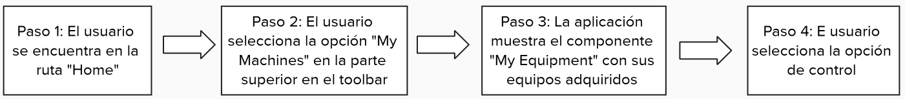
  <figcaption style="font-size: 0.9em; color: #555;">
    <strong>Figura 1:</strong> Taskflow 1.
  </figcaption>
</figure>

**Wireflow**
<figure style="page-break-inside: avoid; text-align: center;">
  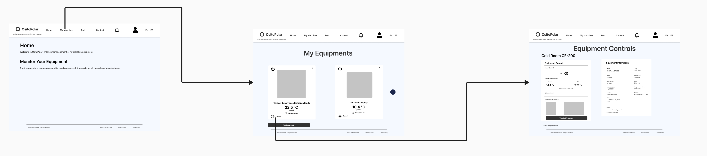
  <figcaption style="font-size: 0.9em; color: #555;">
    <strong>Figura 2:</strong> Wireflow 1.
  </figcaption>
</figure>

### **User Goal 2**:
Como dueño de un negocio que utiliza equipos de refrigeración quiero lograr administrar los nuevos equipos que registre.

**Task Flow**
<figure style="page-break-inside: avoid; text-align: center;">
  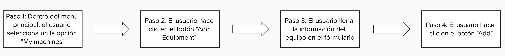
  <figcaption style="font-size: 0.9em; color: #555;">
    <strong>Figura 3:</strong> Taskflow 2.
  </figcaption>
</figure>

**Wireflow**
<figure style="page-break-inside: avoid; text-align: center;">
  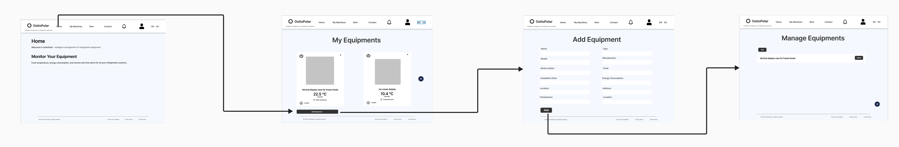
  <figcaption style="font-size: 0.9em; color: #555;">
    <strong>Figura 4:</strong> Wireflow 2.
  </figcaption>
</figure>

### **User Goal 3**:
Como dueño de un negocio que utiliza equipos de refrigeración quiero revisar las estadísticas completas de mis equipos.

**Task Flow**
<figure style="page-break-inside: avoid; text-align: center;">
  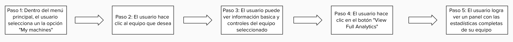
  <figcaption style="font-size: 0.9em; color: #555;">
    <strong>Figura 5:</strong> Taskflow 3.
  </figcaption>
</figure>

**Wireflow**
<figure style="page-break-inside: avoid; text-align: center;">
  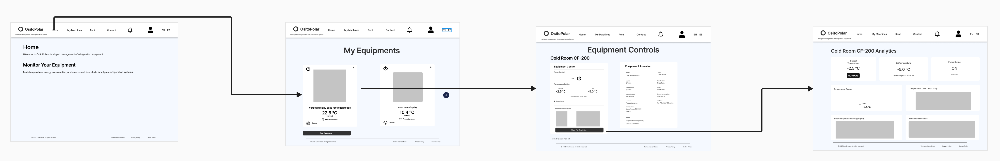
  <figcaption style="font-size: 0.9em; color: #555;">
    <strong>Figura 6:</strong> Wireflow 3.
  </figcaption>
</figure>

### **User Goal 4**:
Como dueño de un negocio que utiliza equipos de refrigeración quiero pedir nuevos equipos a un proveedor de manera sencilla.

**Task Flow**
<figure style="page-break-inside: avoid; text-align: center;">
  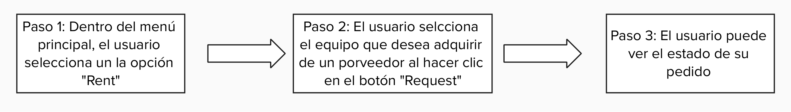
  <figcaption style="font-size: 0.9em; color: #555;">
    <strong>Figura 7:</strong> Taskflow 4.
  </figcaption>
</figure>

**Wireflow**
<figure style="page-break-inside: avoid; text-align: center;">
  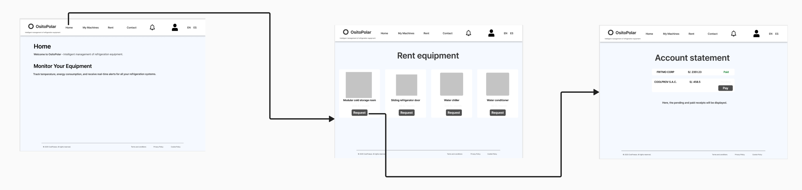
  <figcaption style="font-size: 0.9em; color: #555;">
    <strong>Figura 8:</strong> Wireflow 4.
  </figcaption>
</figure>

### **User Goal 5**:
Como proveedor de equipos de refrigeración quiero estar pendiente de los ordenes de pedios de mis clientes.

**Task Flow**
<figure style="page-break-inside: avoid; text-align: center;">
  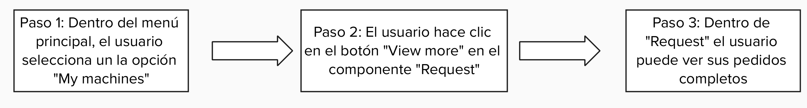
  <figcaption style="font-size: 0.9em; color: #555;">
    <strong>Figura 9:</strong> Taskflow 5.
  </figcaption>
</figure>

**Wireflow**
<figure style="page-break-inside: avoid; text-align: center;">
  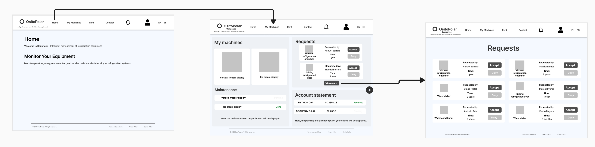
  <figcaption style="font-size: 0.9em; color: #555;">
    <strong>Figura 10:</strong> Wireflow 5.
  </figcaption>
</figure>

#### 4.4.3. Web Applications Mock-ups
En esta sección se presentan y detallan los mock-ups de las aplicaciones de OsitoPolar. Se resalta la aplicación de los principios de diseño, la arquitectura de la información, el diseño inclusivo y el Design System implementado en los productos digitales. Cada mock-up muestra cómo estos conceptos se integran en la interfaz de usuario. A continuación, se mostrarán las maquetas de la aplicación web, que representan visualmente cómo se verá y funcionará la plataforma OsitoPolar. Estas maquetas son fundamentales para comunicar el diseño a los desarrolladores y clientes, asegurando que la experiencia del usuario se alinee con la visión del proyecto.

<figure style="page-break-inside: avoid; text-align: center;">
  
  <figcaption style="font-size: 0.9em; color: #555;">
    <strong>Figura 1:</strong> Mockup - Inicio General de la App.
  </figcaption>
</figure>

<figure style="page-break-inside: avoid; text-align: center;">
  
  <figcaption style="font-size: 0.9em; color: #555;">
    <strong>Figura 2:</strong> Mockup - Registro (Clientes).
  </figcaption>
</figure>

<figure style="page-break-inside: avoid; text-align: center;">
  
  <figcaption style="font-size: 0.9em; color: #555;">
    <strong>Figura 3:</strong> Mockup - Inicio de Sesión (Clientes).
  </figcaption>
</figure>

<figure style="page-break-inside: avoid; text-align: center;">
  
  <figcaption style="font-size: 0.9em; color: #555;">
    <strong>Figura 4:</strong> Mockup - Inicio (Clientes).
  </figcaption>
</figure>

<figure style="page-break-inside: avoid; text-align: center;">
  
  <figcaption style="font-size: 0.9em; color: #555;">
    <strong>Figura 5:</strong> Mockup - Mis Equipos (Clientes).
  </figcaption>
</figure>

<figure style="page-break-inside: avoid; text-align: center;">
  
  <figcaption style="font-size: 0.9em; color: #555;">
    <strong>Figura 6:</strong> Mockup - Mis Equipos (Clientes, Detalle 1).
  </figcaption>
</figure>

<figure style="page-break-inside: avoid; text-align: center;">
  
  <figcaption style="font-size: 0.9em; color: #555;">
    <strong>Figura 7:</strong> Mockup - Mis Equipos (Clientes, Detalle 2).
  </figcaption>
</figure>

<figure style="page-break-inside: avoid; text-align: center;">
  
  <figcaption style="font-size: 0.9em; color: #555;">
    <strong>Figura 8:</strong> Mockup - Alquilar Equipos (Clientes).
  </figcaption>
</figure>

<figure style="page-break-inside: avoid; text-align: center;">
  
  <figcaption style="font-size: 0.9em; color: #555;">
    <strong>Figura 9:</strong> Mockup - Contacto (Clientes).
  </figcaption>
</figure>

<figure style="page-break-inside: avoid; text-align: center;">
  
  <figcaption style="font-size: 0.9em; color: #555;">
    <strong>Figura 10:</strong> Mockup - Notificaciones (Clientes).
  </figcaption>
</figure>

<figure style="page-break-inside: avoid; text-align: center;">
  
  <figcaption style="font-size: 0.9em; color: #555;">
    <strong>Figura 11:</strong> Mockup - Control (Clientes).
  </figcaption>
</figure>

<figure style="page-break-inside: avoid; text-align: center;">
  
  <figcaption style="font-size: 0.9em; color: #555;">
    <strong>Figura 12:</strong> Mockup - Estado de Cuenta (Clientes).
  </figcaption>
</figure>

<figure style="page-break-inside: avoid; text-align: center;">
  
  <figcaption style="font-size: 0.9em; color: #555;">
    <strong>Figura 13:</strong> Mockup - Mi Cuenta (Clientes).
  </figcaption>
</figure>

<figure style="page-break-inside: avoid; text-align: center;">
  
  <figcaption style="font-size: 0.9em; color: #555;">
    <strong>Figura 14:</strong> Mockup - Analíticas Completas (Clientes).
  </figcaption>
</figure>

- **Mockups Empresa:**

<figure style="page-break-inside: avoid; text-align: center;">
  
  <figcaption style="font-size: 0.9em; color: #555;">
    <strong>Figura 15:</strong> Mockup - Inicio de Sesión (Empresa).
  </figcaption>
</figure>

<figure style="page-break-inside: avoid; text-align: center;">
  
  <figcaption style="font-size: 0.9em; color: #555;">
    <strong>Figura 16:</strong> Mockup - Registro (Empresa).
  </figcaption>
</figure>

<figure style="page-break-inside: avoid; text-align: center;">
  
  <figcaption style="font-size: 0.9em; color: #555;">
    <strong>Figura 17:</strong> Mockup - Inicio (Empresa).
  </figcaption>
</figure>

<figure style="page-break-inside: avoid; text-align: center;">
  
  <figcaption style="font-size: 0.9em; color: #555;">
    <strong>Figura 18:</strong> Mockup - Contacto (Empresa).
  </figcaption>
</figure>

<figure style="page-break-inside: avoid; text-align: center;">
  
  <figcaption style="font-size: 0.9em; color: #555;">
    <strong>Figura 19:</strong> Mockup - Estado de Cuenta (Empresa).
  </figcaption>
</figure>

<figure style="page-break-inside: avoid; text-align: center;">
  
  <figcaption style="font-size: 0.9em; color: #555;">
    <strong>Figura 20:</strong> Mockup - Mi Cuenta (Empresa).
  </figcaption>
</figure>

<figure style="page-break-inside: avoid; text-align: center;">
  
  <figcaption style="font-size: 0.9em; color: #555;">
    <strong>Figura 21:</strong> Mockup - Mis Clientes y Técnicos (Empresa).
  </figcaption>
</figure>

<figure style="page-break-inside: avoid; text-align: center;">
  
  <figcaption style="font-size: 0.9em; color: #555;">
    <strong>Figura 22:</strong> Mockup - Mis Equipos (Empresa).
  </figcaption>
</figure>

<figure style="page-break-inside: avoid; text-align: center;">
  
  <figcaption style="font-size: 0.9em; color: #555;">
    <strong>Figura 23:</strong> Mockup - Notificaciones (Empresa).
  </figcaption>
</figure>

<figure style="page-break-inside: avoid; text-align: center;">
  
  <figcaption style="font-size: 0.9em; color: #555;">
    <strong>Figura 24:</strong> Mockup - Solicitudes (Empresa).
  </figcaption>
</figure>

<figure style="page-break-inside: avoid; text-align: center;">
  
  <figcaption style="font-size: 0.9em; color: #555;">
    <strong>Figura 25:</strong> Mockup - Órdenes de Trabajo (Empresa).
  </figcaption>
</figure>

Link de los mockups: https://shorturl.at/jMDBY

#### 4.4.4. Web Applications User Flow Diagrams
### User Goal 1: 
- Como dueño de un negocio que utiliza equipos de refrigeración quiero estar pendiente del estado de cada equipo registrado.
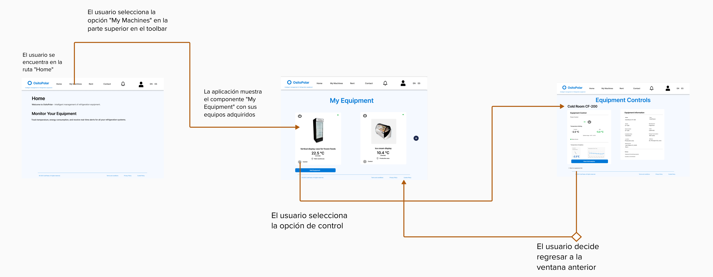

### User Goal 2:
- Como dueño de un negocio que utiliza equipos de refrigeración quiero revisar las estadisticas completas de mis equipos.
  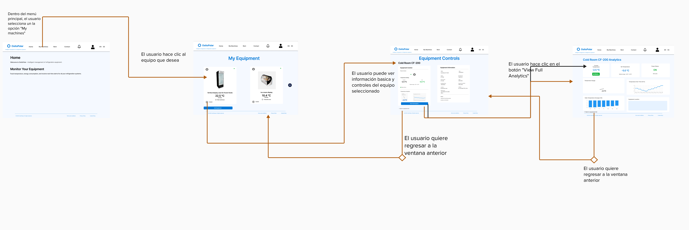

### User Goal 3:
- Como dueño de un negocio que utiliza equipos de refrigeración quiero lograr administrar los nuevos equipos que registre.
  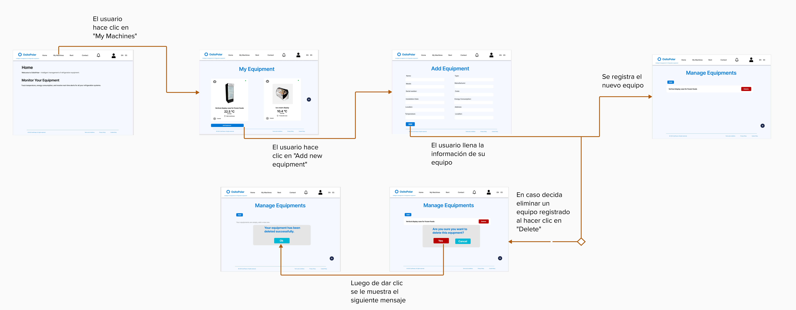

### 4.5. Web Applications Prototyping
A continuación se presenta el prototipo de la aplicación web de OsitoPolar, el cual permite a los usuarios interactuar con la interfaz y explorar las diversas secciones de la plataforma. Este prototipo incluye las funcionalidades clave y características de la aplicación, proporcionando una vista preliminar de la experiencia del usuario. Además, facilita la evaluación y prueba de la interfaz antes de su implementación final, asegurando que el diseño sea intuitivo y eficiente.
Link del prototipo: https://shorturl.at/oIUJN

### 4.6 Domain Driven Software Architecture
En esta sección se presenta la arquitectura de software basada en el dominio para OsitoPolar. Se detallan los diferentes diagramas que ilustran la estructura y organización del sistema, así como los componentes clave que lo integran, mostrando cómo se interconectan para proporcionar una solución eficiente y escalable.

#### 4.6.1. Software Architecture Context Diagram
Este diagrama muestra cómo interactúan los usuarios (Clientes y Empresas Proveedoras) con OsitoPolar. Los usuarios usan la plataforma para gestionar y monitorear equipos de refrigeración. Además, OsitoPolar se conecta con los servicios de correo para enviar notificaciones y con el servicio de pago para procesar transacciones.

*Leyenda:*

#### 4.6.2. Software Architecture Container Diagrams
Este diagrama ilustra los diferentes contenedores dentro de OsitoPolar y cómo interactúan entre sí. Los contenedores representan las diferentes capas y servicios que componen la plataforma, como la interfaz de usuario (webapp), la API y la base de datos.

*Leyenda:*
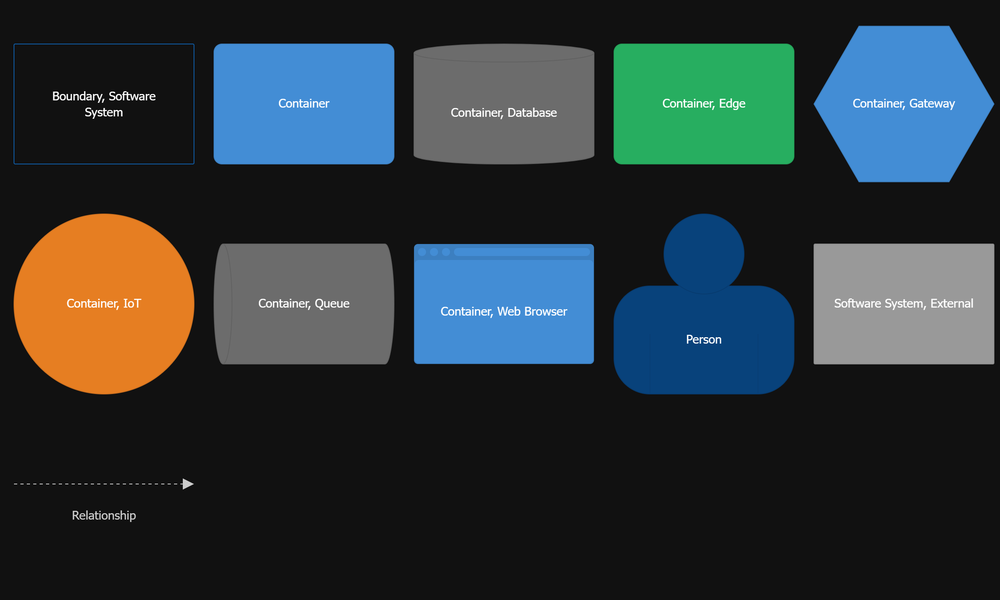

#### 4.6.3. Software Architecture Components Diagrams

**IAM Bounded Context**

Este diagrama representa los componentes encargados de la gestión de identidad y acceso, incluyendo autenticación, autorización y administración de usuarios.

*Leyenda:*

**Profiles Bounded Context**

Este diagrama describe los componentes que gestionan los perfiles de usuarios y empresas dentro de la plataforma OsitoPolar.

*Leyenda:*

**Equipment Management Bounded Context**

Este diagrama representa los componentes encargados de la gestión de equipos de refrigeración. Los usuarios pueden registrar equipos, monitorearlos en tiempo real y consultar su estado.

*Leyenda:*

**IoT Monitoring Bounded Context**

Este diagrama describe los componentes responsables del monitoreo IoT de los equipos, incluyendo la recopilación y procesamiento de datos de sensores en tiempo real.


*Leyenda:*


**Edge API Bounded Context**

Este diagrama ilustra los componentes del API perimetral que actúa como punto de entrada para los dispositivos IoT y la comunicación con los servicios de la plataforma.


*Leyenda:*


**Service Request Bounded Context**

Este diagrama describe los componentes encargados de gestionar las solicitudes de servicio técnico, desde su creación hasta su resolución.

*Leyenda:*

**Work Order Bounded Context**

Este diagrama se centra en la gestión de órdenes de trabajo, mostrando los componentes involucrados en el ciclo de vida completo de una orden de trabajo técnico.

*Leyenda:*

**Subscriptions Bounded Context**

Este diagrama representa los componentes que gestionan los planes de suscripción, facturación y acceso diferenciado a funcionalidades según el plan contratado.

*Leyenda:*

**Notifications Bounded Context**

Este diagrama describe los componentes que gestionan el envío de notificaciones, alertas y comunicaciones hacia los usuarios sobre el estado de equipos y eventos relevantes.

*Leyenda:*

**Analytics Bounded Context**

Este diagrama ilustra los componentes encargados del procesamiento y visualización de datos analíticos, métricas de rendimiento y reportes de los equipos monitoreados.

*Leyenda:*

### 4.7. Software Object-Oriented Design
En esta sección se presenta el diseño de software orientado a objetos para OsitoPolar. Se incluyen diagramas de clases y un diccionario de clases que detallan la estructura y los atributos de las principales entidades del sistema, ofreciendo una visión clara de cómo se organizan y gestionan los componentes clave dentro de la plataforma.

#### 4.7.1. Class Diagrams

El diagrama de clases proporciona una representación visual de las clases del sistema, sus atributos y las relaciones entre ellas.


#### 4.7.2. Class Dictionary

## Clase: Solicitud
| Nº | Nombre de atributo | Descripción                                              | Tipo de dato      |
|----|--------------------|----------------------------------------------------------|-------------------|
| 1  | name_equipo        | Almacena el nombre del equipo solicitado.                | Equipo            |
| 2  | name_usuario       | Almacena el nombre del usuario que realiza la solicitud. | Usuario           |
| 3  | orden              | Almacena el número de orden de la solicitud.             | unsigned long int |
| 4  | description        | Almacena la descripción de la solicitud.                 | varchar           |
| 5  | time               | Almacena el tiempo estimado o requerido.                 | float             |
| 6  | status             | Almacena el estado de la solicitud.                      | char              |

## Clase: Equipo
| Nº | Nombre de atributo | Descripción                             | Tipo de dato      |
|----|--------------------|-----------------------------------------|-------------------|
| 1  | name               | Almacena el nombre del equipo.          | string            |
| 2  | cost               | Almacena el costo del equipo.           | float             |
| 3  | details_tecnicos   | Almacena detalles técnicos del equipo.  | varchar           |
| 4  | serie              | Almacena el número de serie del equipo. | unsigned long int |
| 5  | code               | Almacena el código del equipo.          | unsigned long int |
| 6  | status             | Almacena el estado del equipo.          | char              |
| 7  | notes              | Almacena notas adicionales del equipo.  | varchar           |

## Clase: Cliente
| Nº | Nombre de atributo | Descripción                                | Tipo de dato |
|----|--------------------|--------------------------------------------|--------------|
| 1  | name               | Almacena el nombre del cliente.            | string       |
| 2  | email              | Almacena el correo del cliente.            | string       |
| 3  | password           | Almacena la contraseña del cliente.        | string       |
| 4  | username           | Almacena el nombre de usuario del cliente. | string       |
| 5  | phone              | Almacena el teléfono del cliente.          | string       |
| 6  | user_type          | Almacena el tipo de usuario.               | char         |

## Clase: Company
| Nº | Nombre de atributo | Descripción                                     | Tipo de dato |
|----|--------------------|-------------------------------------------------|--------------|
| 1  | name               | Almacena el nombre de la empresa.               | string       |
| 2  | email              | Almacena el correo electrónico de la empresa.   | string       |
| 3  | password           | Almacena la contraseña de la empresa.           | string       |
| 4  | username           | Almacena el nombre de usuario de la empresa.    | string       |
| 5  | plan               | Almacena el tipo de plan que posee la empresa.  | char         |
| 6  | phone              | Almacena el teléfono de contacto de la empresa. | string       |
| 7  | business_type      | Almacena el tipo de negocio de la empresa.      | char         |
| 8  | location           | Almacena la ubicación física de la empresa.     | string       |

##  Clase: Cuenta
| Nº | Nombre de atributo | Descripción                                         | Tipo de dato |
|----|--------------------|-----------------------------------------------------|--------------|
| 1  | name (company)     | Almacena el nombre de la empresa asociada.          | Company      |
| 2  | name (usuario)     | Almacena el nombre del usuario asociado.            | Usuario      |
| 3  | cost               | Almacena el costo del equipo vinculado a la cuenta. | Equipo       |
| 4  | status             | Almacena el estado de la cuenta.                    | char         |

##  Clase: Mantenimiento
| Nº | Nombre de atributo | Descripción                                     | Tipo de dato |
|----|--------------------|-------------------------------------------------|--------------|
| 1  | name               | Almacena el nombre del equipo en mantenimiento. | Equipo       |
| 2  | status             | Almacena el estado del mantenimiento.           | char         |

##  Clase: Notificación
| Nº | Nombre de atributo | Descripción                                                  | Tipo de dato |
|----|--------------------|--------------------------------------------------------------|--------------|
| 1  | name               | Almacena el nombre de la notificación.                       | varchar      |
| 2  | description        | Almacena la descripción de la notificación.                  | varchar      |
| 3  | name_company       | Almacena el nombre de la empresa asociada a la notificación. | Company      |
| 4  | name_cliente       | Almacena el nombre del cliente destinatario.                 | Cliente      |
| 5  | status             | Indica si la notificación ha sido leída o procesada.         | bool         |

### 4.8. Database Design

Esta sección presenta la estructura lógica del sistema desde el punto de vista de almacenamiento y organización de los datos. Se describen las entidades principales del sistema, sus atributos, tipos de datos y relaciones entre ellas. El modelo de base de datos ha sido diseñado para garantizar integridad, consistencia y eficiencia en el acceso a la información.

#### 4.8.1. Database Diagram

El diagrama de base de datos ilustra gráficamente cómo se relacionan las tablas dentro del sistema, incluyendo sus claves primarias, claves foráneas y los tipos de relaciones existentes (uno a uno, uno a muchos o muchos a muchos).


## Capítulo V: Product Implementation, Validation & Deployment 

### 5.1. Software Configuration Management
#### 5.1.1. Software Development Environment Configuration

### Project Management

Para la administración del proyecto se recurrió al uso de herramientas de comunicación y control de versiones. Se creó una organización en GitHub para centralizar la gestión del código fuente y su versionado. En cuanto a la comunicación interna y las reuniones del equipo, se utilizó Discord.

**Organización del trabajo:** Github

**Reuniones:** Discord

**Comunicación:** Whatsapp

**Planificación y asignación de tareas:** Trello

**Enlaces**

- Github: https://github.com/
- Discord: https://discord.com/
- Trello: https://trello.com/

### Requirement Management

Para esta fase, se implementaron soluciones personalizadas que facilitaron la recolección, organización y priorización de los requisitos del proyecto.
Se utilizó Trello como una herramienta visual para gestionar tareas mediante tableros personalizados.
Se utilizó UXPressia para poder desarrollar los user personas, empathy maps, journey maps y lean UX canvas.
Se utilizó Miro para el desarrollo de los As-Is y To-Be Scenarios.

**Enlaces**

- Trello: https://trello.com/
- UXPressia: https://uxpressia.com/
- Miro: https://miro.com/es/

### Product UX/UI Design
En el diseño de la experiencia e interfaz de usuario, el equipo utilizó Figma para la creación de wireframes, mockups y prototipos interactivos, lo que permitió validar la propuesta de diseño antes de la implementación.

**Enlaces**
- Figma: https://www.figma.com/

### Software Development
Para el desarrollo de la Landing Page se usaron los lenguajes HTML, CSS y JavaScript en Visual Studio Code. La elaboración del informe se realizó en archivos .md en IDEs como IntelliJ IDEA y Rider (cada miembro del equipo trabajó en alguna de estas herramientas).
Para descargar, instalar y actualizar fácilmente estas IDEs utilizamos la aplicación de gestión JetBrains ToolBox.

**Enlaces**
- JetBrains ToolBox: https://www.jetbrains.com/toolbox-app/
- Visual Studio Code: https://code.visualstudio.com/

### Software Documentation
Para el control de versiones y la colaboración en el desarrollo del informe, se utilizó GitHub siguiendo la estrategia de trabajo GitHub Flow. Esta metodología permitió una gestión eficiente y ordenada del proyecto mediante el uso de ramas específicas para cada funcionalidad o corrección, lo que facilitó el trabajo colaborativo. Todo el contenido del proyecto fue centralizado y almacenado en un repositorio dentro de una organización creada en GitHub.
Para la documentación técnica del proyecto se optó por el uso de archivos en formato Markdown, debido a su simplicidad, legibilidad y excelente compatibilidad con GitHub.

**Enlaces**
- GitHub: https://github.com/

### Software Deployment
Para el despliegue de la Landing Page se utilizó GitHub Pages, una herramienta perfecta para publicar sitios web estáticos.

**Enlaces**
- GithubPages: https://pages.github.com/

#### 5.1.2. Source Code Management

Modelo de ramas Git Flow: main: rama principal donde siempre está el código estable y listo para producción. develop: rama de desarrollo donde se integran todas las nuevas funcionalidades antes de pasar a producción. feature/: ramas para trabajar nuevas funcionalidades. release/: ramas temporales para preparar una nueva versión estable. hotfix/: ramas para corregir errores en producción.

Versionado semántico (Semantic Versioning): Se aplicará el versionado semántico (Semantic Versioning 2.0.0), siguiendo el esquema: MAJOR.MINOR.PATCH.
1.0.0 → versión estable inicial

1.1.0 → agregaste nuevas funcionalidades

1.1.1 → arreglos de bugs

Convención de mensajes de commits El equipo seguirá la convención de mensajes de commits definida en “Conventional Commits”.
Ejemplos de mensajes:

- feat: agregar nuevo sistema de login
- fix: corregir validación en formulario de registro
- docs: actualizar README con instrucciones de despliegue

Nomenclatura de numeración de las versiones: Major changes: Cuando el código o versión nueva del proyecto a implementar presenta cambios significativos con la versión anterior, estos cambios llegan a ser incompatibles con la versión anterior. Minor changes: Cuando el código o versión nueva del proyecto a implementar presenta cambios con respecto a alguna característica Patch: Cuando se solucionan bugs menores.

**Repositorio de Github:**
- Enlace para acceder a la [organización en Github](https://github.com/Inteligencia-Artesanal-Aplicaciones-Web)
- Enlace para acceder al repositorio de la [Landing Page](https://github.com/Inteligencia-Artesanal-Aplicaciones-Web/Landing-Page)
- Enlace para acceder al repositorio del [Informe](https://github.com/Inteligencia-Artesanal-Aplicaciones-Web/upc-AppWeb-Inteligencia-Artesanal-Report)

**Flujo de trabajo de GitFlow**
El flujo de trabajo se basará en un modelo de ramas Git Flow, el cuál se basa en la creación de ramas específicas para cada funcionalidad o corrección de errores. El modelo de "A succesful Git branching model"

--Insertar imagen

**Estructura de branches (Ramas):**

1. **Master branch (Rama principal):** Es la rama principal del proyecto, donde se almacena el código estable y listo para producción. Solo se integrarán cambios que hayan sido probados y validados previamente en las ramas de desarrollo y funcionalidad.

2. **Develop Branch (Rama de Desarrollo):** Esta rama actúa como un espacio de integración para el trabajo en equipo, permitiendo pruebas y ajustes de las nuevas funcionalidades antes de fusionarlas con la rama principal. Garantiza que el código sea funcional y estable.

3. **Feature branch (Ramas de funcionalidad):** Cada nueva funcionalidad o tarea específica se desarrollará en su propia rama. Una vez completada y probada, se integrará en la rama de desarrollo. Las ramas de funcionalidad seguirán un esquema de nombres descriptivos, como por ejemplo: `feature/chapter-01`.

#### 5.1.3. Source Code Style Guide & Conventions

El equipo adoptará nomenclatura en inglés para todas las variables, funciones, clases y archivos del proyecto, con el objetivo de mantener flexibilidad, escalabilidad y coherencia en el desarrollo. HTML / CSS Se sigue el Google HTML/CSS Style Guide.

Las clases CSS estarán en kebab-case (.main-header, .card-title).

Se utilizarán etiquetas semánticas

- &lt;header&gt;
- &lt;section&gt;
- &lt;article&gt;

Identificadores claros y descriptivos para accesibilidad y mantenimiento.

Se usó diferentes etiquetas para conformar la estructura del Landing Page del producto:

- header: Define todo el contenido introductorio de la página web.

- nav: Define las secciones de la página que estarán dedicadas a la navegación en la página.

- div: Esta etiqueta permite la separación de diferentes objetos dentro de nuestra página, esto nos permitió poder aplicar hojas de estilo específicas para cada parte de los objetos.

- img: Esta etiqueta permite la inserción de imágenes en la página web, se usó en diversas ocasiones dentro de la página.

- ul: Esta etiqueta sirve para definir una lista desordenada, mayormente se usó para la elaboración del menú interactivo de la página.

- li: Sirve para definir los elementos de las listas que se implementaron en la página, más especifico en la barra de búsqueda y el blog.

- a: Se usó para definir hipervínculos para mover a los usuarios a través de las diferentes secciones de la página.

- p: Definen los párrafos de texto, separándolos del resto de contenido.

- button: Declaran un botón interactivo modificable que permite a los usuarios realizar una acción en específico.

- h1 - h4: Definen los diferentes títulos y subtítulos de la página siendo h1 el mayor nivel y h4 el más bajo.

#### 5.1.4. Software Deployment Configuration

### Landing page deployment:
Para desplegar la landing page, es necesario cumplir con ciertos requisitos previos, como contar con una cuenta personal, una organización y un repositorio donde se alojarán los archivos. Una vez cumplidos estos requisitos, se pueden seguir los pasos detallados a continuación para realizar el despliegue:

1. Verificar que los archivos principales se encuentren en la raíz (root) del repositorio.
2. Asegurarse de que los archivos sigan las siguientes convenciones de nombres: "index.html" para la página principal, "styles.css" para los estilos, "script.js" para los scripts principales, "languages.js" para gestionar los textos en diferentes idiomas (español e inglés), y una carpeta llamada "assets/images" para las imágenes.
3. Subir los archivos al repositorio mediante un commit.
4. Acceder a la sección Settings > Pages y seleccionar el branch correspondiente, en este caso, "main".
5. Configurar la carpeta raíz (root) como la fuente de la página.
6. Esperar a que GitHub realice las verificaciones necesarias. Una vez finalizado el proceso, se generará un enlace que permitirá acceder a la landing page desplegada.

Adicionalmente, se implementó un archivo "languages.js" que contiene los textos en español e inglés. Este archivo es consumido por el script "main.js", el cual permite realizar el cambio de idioma dinámicamente en la landing page.ations Implementation

### Github Pages:


La URL que nos entrega Github Pages para acceder a la landing page es la siguiente: https://inteligencia-artesanal-aplicaciones-web.github.io/Landing-Page/

### 5.2. Landing Page, Services & Applications Implementation.


En el siguiente enlace se estará mostrando la landing page de la startup:
[Video demostrativo de la landing page](https://upcedupe-my.sharepoint.com/:v:/g/personal/u202223286_upc_edu_pe/EWpS23aHI95KiF5rJXhOyHgBoHAL62jYwnz8m4zMqxkGwA?nav=eyJyZWZlcnJhbEluZm8iOnsicmVmZXJyYWxBcHAiOiJPbmVEcml2ZUZvckJ1c2luZXNzIiwicmVmZXJyYWxBcHBQbGF0Zm9ybSI6IldlYiIsInJlZmVycmFsTW9kZSI6InZpZXciLCJyZWZlcnJhbFZpZXciOiJNeUZpbGVzTGlua0NvcHkifX0&e=bwYjby)

En la sección siguiente se detallará el proceso de implementación, documentación y despliegue del Landing.

#### 5.2.1. Sprint 1
##### 5.2.1.1. Sprint Planning 1
<table>
<tr>
    <th colspan="5">Sprint 1</th>
    <th colspan="9">Sprint 1</th>
  </tr>
      <tr>
    <td colspan="13">Sprint Planning Background</td>
  </tr>
  <tr>
    <td colspan="5">Date</td>
    <td colspan="8">2025-04-22</td>
</tr>
  <tr>
    <td colspan="5">Time</td>
    <td colspan="8">9:45 PM</td>
  </tr>
  <tr>
    <td colspan="5">Location</td>
    <td colspan="8">Via Discord</td>
<tr>
    <td colspan="5">Prepared By</td>
    <td colspan="8">Kenyi Ramirez</td>
</tr>
<tr>
    <td colspan="5">Attendees (to planning meeting)</td>
    <td colspan="8">Joseph Rodriguez, Wilder Aliaga, Victor Rojas, Italo Verona</td>
</tr>
<tr>
    <td colspan="5">Sprint  1 Review Summary</td>
    <td colspan="8">Esta sección se dedicó a mejorar el codigo de la Landing page para poder usarse mejor y tener una estructura clara.</td>
</tr>
<tr>
    <td colspan="5">Sprint 1 Retrospective Summary</td>
    <td colspan="8">En esta sección tuvimos varios aciertos ya que hubieron ideas para integrar lo de los idiomas bastante convicentes pero nos quedamos con una en especifica, poniendo a prueba nuestra resolución de problemas.</td>
</tr>
<tr>
    <td colspan="13">Sprint Goal & User Stories</td>
</tr>
<tr>
    <td colspan="5">Sprint 1 Goal</td>
       <td colspan="8">Nuestro enfoque está en implementar la landing page de OsitoPolar, asegurando su adaptabilidad a diferentes dispositivos, coherencia visual y funcionalidad multilingüe. Creemos que esto ofrece una experiencia de navegación más clara, atractiva y accesible a los usuarios potenciales de nuestra solución. Esto se confirmará cuando los usuarios puedan cambiar el idioma fácilmente desde la interfaz, navegar la página sin errores visuales desde cualquier dispositivo, y se valide que imágenes y textos estén correctamente integrados y espaciados. </td>

</tr>
<tr>
    <td colspan="5">Sprint 1 Velocity</td>
    <td colspan="8">15</td>
<tr>
    <td colspan="5">Sum of Story Points</td>
    <td colspan="8">14</td>
</tr>
</table>

##### 5.2.1.2. Aspect Leaders and Collaborators

Durante este primer Sprint, el equipo se enfocó principalmente en el desarrollo, la mejora estructural y visual de la Landing Page de OsitoPolar, asegurando su visualización en distintos dispositivos (diseño responsive), la integración armoniosa de imágenes y textos, y la implementación de un cambio de idioma dinámico mediante un botón.
Con el fin de organizar de manera más eficiente el trabajo colaborativo, se ha elaborado la matriz de Liderazgo y Colaboración (LACX). Esta matriz asigna responsabilidades específicas a cada miembro del equipo en relación con los aspectos clave del Sprint.
<table>
  <tr>
    <td colspan="2"><strong>Team Member (Last Name, First Name)</strong></td>
    <td><strong>GitHub Username</strong></td>
    <td><strong>Diseño visual y maquetación web (Landing Page) Leader (L) / Collaborator (C)</strong></td>
    <td><strong>Implementación técnica del cambio de idioma (Multilenguaje funcional) Leader (L) / Collaborator (C)</strong></td>
    <td><strong>Responsividad y pruebas en distintos dispositivos Leader (L) / Collaborator (C)</strong></td>
  </tr>
  <tr>
    <td colspan="2">Ramírez Cabrera, Kenyi Efrain</td>
    <td>Kenyi15upc</td>
    <td>L</td>
    <td>C</td>
    <td>C</td>
  </tr>
  <tr>
    <td colspan="2">Rodriguez Parco Joseph Pablo </td>
    <td>eJosR-Coding</td>
    <td>C</td>
    <td>L</td>
    <td>L</td>
  </tr>
  <tr>
    <td colspan="2"> Aliaga Urbina Wilder Gonzalo </td>
    <td>Gonzalo1905</td>
    <td>C</td>
    <td>C</td>
    <td>C</td>
  </tr>
  <tr>
    <td colspan="2">Verona Flores Italo Sebastián
</td>
    <td>atomdragon1318</td>
    <td>C</td>
    <td>C</td>
    <td>C</td>
  </tr>
  <tr>
    <td colspan="2">Rojas Reategui Victor Manuel </td>
    <td>VRojas1603</td>
    <td>C</td>
    <td>C</td>
    <td>C</td>
  </tr>
</table>

##### 5.2.1.3. Sprint Backlog 1

El objetivo principal de este Sprint es elaborar la Landing Page de nuestra plataforma OsitoPolar. Para ello, dividimos el desarrollo de esta según las User Stories pertenecientes a la Epic enfocada en Landing Page. La plataforma elegida para ser la herramienta de control de tareas fue Trello, el cuál se presenta una captura de pantalla de nuestro tablero y su enlace público.


Enlace: https://trello.com/b/xAOjqyPz/inteligenciaartesanal-ositopolar

<table>
<tr>
    <th colspan="3">Sprint #</th>
    <th colspan="10">Sprint 1</th>
</tr>
<tr>
    <td colspan="3">User Story</td>
    <td colspan="10">Work-Item/Task</td>
</tr>
<tr>
    <td colspan="1">Id</td>
    <td colspan="2">Title</td>
    <td colspan="1">Id</td>
    <td colspan="2">Title</td>
    <td colspan="3">Description</td>
    <td colspan="1">Estimation (Hours)</td>
    <td colspan="2">Assigned To</td>
    <td colspan="1">Status (To do/ In-Process/ To-Review/ Done)</td>
</tr>
<tr>
    <td colspan="1">US-23</td>
    <td colspan="2">Visualizar propuesta de valor principal</td>
    <td colspan="1">UT-01</td>
    <td colspan="2">Crear la sección 'Hero'</td>
    <td colspan="3">Añadir la sección donde se muestra nuestra propuesta de valor principal y las entidades que confían en nosotros</td>
    <td colspan="1">0.5</td>
    <td colspan="2">Victor Rojas</td>
    <td colspan="1">Done</td>
</tr>
<tr>
    <td colspan="1">US-23</td>
    <td colspan="2">Visualizar propuesta de valor principal</td>
    <td colspan="1">UT-02</td>
    <td colspan="2">Añadir estilos CSS</td>
    <td colspan="3">Aplicar estilos según el diseño aprobado</td>
    <td colspan="1">0.5</td>
    <td colspan="2">Wilder Gonzalo Aliaga</td>
    <td colspan="1">Done</td>
</tr>
<tr>
    <td colspan="1">US-23</td>
    <td colspan="2">Visualizar propuesta de valor principal</td>
    <td colspan="1">UT-03</td>
    <td colspan="2">Añadir interacciones con JS</td>
    <td colspan="3">Agregar efectos y validaciones según el diseño</td>
    <td colspan="1">0.5</td>
    <td colspan="2">Victor Rojas</td>
    <td colspan="1">Done</td>
</tr>
<tr>
    <td colspan="1">US-24</td>
    <td colspan="2">Explorar soluciones específicas para mi rubro</td>
    <td colspan="1">UT-04</td>
    <td colspan="2">Crear la sección 'Beneficios'</td>
    <td colspan="3">Añadir la sección donde se visualizan las soluciones específicas a cada segmento (beneficios) </td>
    <td colspan="1">0.5</td>
    <td colspan="2">Kenyi Ramírez</td>
    <td colspan="1">Done</td>
</tr>
<tr>
    <td colspan="1">US-24</td>
    <td colspan="2">Explorar soluciones específicas para mi rubro</td>
    <td colspan="1">UT-05</td>
    <td colspan="2">Añadir estilos CSS</td>
    <td colspan="3">Aplicar estilos según el diseño aprobado de 'Beneficios'</td>
    <td colspan="1">0.5</td>
    <td colspan="2">Wilder Gonzalo Aliaga</td>
    <td colspan="1">Done</td>
</tr>
<tr>
    <td colspan="1">US-24</td>
    <td colspan="2">Explorar soluciones específicas para mi rubro</td>
    <td colspan="1">UT-06</td>
    <td colspan="2">Añadir interacciones con JS</td>
    <td colspan="3">Agregar efectos y validaciones según el diseño de 'Beneficios'</td>
    <td colspan="1">0.5</td>
    <td colspan="2">Victor Rojas</td>
    <td colspan="1">Done</td>
</tr>
<tr>
    <td colspan="1">US-25</td>
    <td colspan="2">Comprender funcionalidades destacadas</td>
    <td colspan="1">UT-07</td>
    <td colspan="2">Crear la sección 'Funcionalidades'</td>
    <td colspan="3">Añadir la sección donde se visualizan las funciones principales de la plataforma</td>
    <td colspan="1">1</td>
    <td colspan="2">Italo Verona</td>
    <td colspan="1">Done</td>
</tr>
<tr>
    <td colspan="1">US-25</td>
    <td colspan="2">Comprender funcionalidades destacadas</td>
    <td colspan="1">UT-08</td>
    <td colspan="2">Añadir estilos CSS</td>
    <td colspan="3">Aplicar estilos según el diseño aprobado de 'Funcionalidades'</td>
    <td colspan="1">0.5</td>
    <td colspan="2">Wilder Gonzalo Aliaga</td>
    <td colspan="1">Done</td>
</tr>
<tr>
    <td colspan="1">US-25</td>
    <td colspan="2">Comprender funcionalidades destacadas</td>
    <td colspan="1">UT-09</td>
    <td colspan="2">Añadir interacciones con JS</td>
    <td colspan="3">Agregar efectos y validaciones según el diseño de 'Funcionalidades'</td>
    <td colspan="1">0.5</td>
    <td colspan="2">Victor Rojas</td>
    <td colspan="1">Done</td>
</tr>
<tr>
    <td colspan="1">US-26</td>
    <td colspan="2">Solicitar una demo fácilmente</td>
    <td colspan="1">UT-10</td>
    <td colspan="2">Crear la sección 'Solicitar Demo'</td>
    <td colspan="3">Añadir la sección donde se puede solicitar una demo de nuestra plataforma</td>
    <td colspan="1">1</td>
    <td colspan="2">Kenyi Ramírez</td>
    <td colspan="1">Done</td>
</tr>
<tr>
    <td colspan="1">US-26</td>
    <td colspan="2">Solicitar una demo fácilmente</td>
    <td colspan="1">UT-11</td>
    <td colspan="2">Añadir estilos CSS</td>
    <td colspan="3">Aplicar estilos según el diseño aprobado de 'Solicitar demo'</td>
    <td colspan="1">0.5</td>
    <td colspan="2">Wilder Gonzalo Aliaga</td>
    <td colspan="1">Done</td>
</tr>
<tr>
    <td colspan="1">US-26</td>
    <td colspan="2">Solicitar una demo fácilmente</td>
    <td colspan="1">UT-12</td>
    <td colspan="2">Añadir interacciones con JS</td>
    <td colspan="3">Agregar efectos y validaciones según el diseño de 'Solicitar demo'</td>
    <td colspan="1">0.5</td>
    <td colspan="2">Victor Rojas</td>
    <td colspan="1">Done</td>
</tr>
<tr>
    <td colspan="1">US-27</td>
    <td colspan="2">Conocer misión y visión de la startup</td>
    <td colspan="1">UT-13</td>
    <td colspan="2">Crear la sección 'Nosotros'</td>
    <td colspan="3">Añadir la sección donde se visualiza la misión y visión de nuestra startup</td>
    <td colspan="1">0.5</td>
    <td colspan="2">Italo Verona</td>
    <td colspan="1">Done</td>
</tr>
<tr>
    <td colspan="1">US-27</td>
    <td colspan="2">Conocer misión y visión de la startup</td>
    <td colspan="1">UT-14</td>
    <td colspan="2">Añadir estilos CSS</td>
    <td colspan="3">Aplicar estilos según el diseño aprobado de 'Nosotros'</td>
    <td colspan="1">0.5</td>
    <td colspan="2">Wilder Gonzalo Aliaga</td>
    <td colspan="1">Done</td>
</tr>
<tr>
    <td colspan="1">US-27</td>
    <td colspan="2">Conocer misión y visión de la startup</td>
    <td colspan="1">UT-15</td>
    <td colspan="2">Añadir interacciones con JS</td>
    <td colspan="3">Agregar efectos y validaciones según el diseño de 'Nosotros'</td>
    <td colspan="1">0.5</td>
    <td colspan="2">Victor Rojas</td>
    <td colspan="1">Done</td>
</tr>
<tr>
    <td colspan="1">US-00</td>
    <td colspan="2">-</td>
    <td colspan="1">NT-16</td>
    <td colspan="2">Implementar cambio de idioma</td>
    <td colspan="3">Implementar la funcionalidad de cambio de idioma en la landing page</td>
    <td colspan="1">2</td>
    <td colspan="2">Joseph Rodríguez</td>
    <td colspan="1">Done</td>
</tr>
<tr>
    <td colspan="1">US-00</td>
    <td colspan="2">-</td>
    <td colspan="1">NT-17</td>
    <td colspan="2">Añadir imágenes complementarias</td>
    <td colspan="3">Agregar imágenes complementarias en las diferentes secciones del landing page</td>
    <td colspan="1">0.5</td>
    <td colspan="2">Joseph Rodríguez</td>
    <td colspan="1">Done</td>
</tr>

</table>

##### 5.2.1.4. Development Evidence for Sprint Review

En este primer Sprint hemos realizado la implementación de nuestra Landing Page, donde todo el equipo ha aportado en varias tareas. En la siguiente tabla se muestran los commits realizados.

<table>
    <tr>
        <th colspan="2">Repository</th>
        <th colspan="2">Branch</th>
        <th colspan="2">Commit Id</th>
        <th colspan="2">Commit Message</th>
        <th colspan="2">Commit Message Body</th>
        <th colspan="2">Commited on (Date)</th>
    </tr>
        <tr>
        <td colspan="2">Inteligencia-Artesanal-Aplicaciones-Web/Landing-Page</td>
        <td colspan="2">main</td>
        <td colspan="2">9caef73</td>
        <td colspan="2">chore: added html file</td>
        <td colspan="2">added html file</td>
        <td colspan="2">25/04/2025</td>
    </tr>
        <tr>
        <td colspan="2">Inteligencia-Artesanal-Aplicaciones-Web/Landing-Page</td>
        <td colspan="2">main</td>
        <td colspan="2">ae1fd12</td>
        <td colspan="2">feat: added header and footer section</td>
        <td colspan="2">added header and footer section</td>
        <td colspan="2">25/04/2025</td>
    </tr>
     <tr>
        <td colspan="2">Inteligencia-Artesanal-Aplicaciones-Web/Landing-Page</td>
        <td colspan="2">main</td>
        <td colspan="2">10093f4</td>
        <td colspan="2">style: Add styles</td>
        <td colspan="2">Add styles</td>
        <td colspan="2">25/04/2025</td>
    </tr>
    <tr>
        <td colspan="2">Inteligencia-Artesanal-Aplicaciones-Web/Landing-Page</td>
        <td colspan="2">main</td>
        <td colspan="2">5a4332d</td>
        <td colspan="2">feat: added script.js</td>
        <td colspan="2">added script.js</td>
        <td colspan="2">25/04/2025</td>
    </tr>
    <tr>
        <td colspan="2">Inteligencia-Artesanal-Aplicaciones-Web/Landing-Page</td>
        <td colspan="2">main</td>
        <td colspan="2">72f4157</td>
        <td colspan="2">feat: added hero section.</td>
        <td colspan="2">added hero section.</td>
        <td colspan="2">25/04/2025</td>
    </tr>
   <tr>
        <td colspan="2">Inteligencia-Artesanal-Aplicaciones-Web/Landing-Page</td>
        <td colspan="2">main</td>
        <td colspan="2">e875205</td>
        <td colspan="2">fix: fixed header section.</td>
        <td colspan="2">fixed header section.</td>
        <td colspan="2">25/04/2025</td>
    </tr>
   <tr>
        <td colspan="2">Inteligencia-Artesanal-Aplicaciones-Web/Landing-Page</td>
        <td colspan="2">main</td>
        <td colspan="2">9624ec5</td>
        <td colspan="2">feat: update hero section images and testimonials</td>
        <td colspan="2">update hero section images and testimonials</td>
        <td colspan="2">25/04/2025</td>
    </tr>
   <tr>
        <td colspan="2">Inteligencia-Artesanal-Aplicaciones-Web/Landing-Page</td>
        <td colspan="2">main</td>
        <td colspan="2">9bc4018</td>
        <td colspan="2">feat: Funcionalidades Section</td>
        <td colspan="2">Funcionalidades Section</td>
        <td colspan="2">25/04/2025</td>
    </tr>
   <tr>
        <td colspan="2">Inteligencia-Artesanal-Aplicaciones-Web/Landing-Page</td>
        <td colspan="2">main</td>
        <td colspan="2">9e6c718</td>
        <td colspan="2">feat: add language toggle button and translation functionality (WIP)</td>
        <td colspan="2">add language toggle button and translation functionality (WIP)</td>
        <td colspan="2">25/04/2025</td>
    </tr>
   <tr>
        <td colspan="2">Inteligencia-Artesanal-Aplicaciones-Web/Landing-Page</td>
        <td colspan="2">main</td>
        <td colspan="2">a99916d</td>
        <td colspan="2">feat: nosotros section</td>
        <td colspan="2">nosotros section</td>
        <td colspan="2">25/04/2025</td>
    </tr>
   <tr>
        <td colspan="2">Inteligencia-Artesanal-Aplicaciones-Web/Landing-Page</td>
        <td colspan="2">main</td>
        <td colspan="2">022b681</td>
        <td colspan="2">feat: add multilingual support for functionalities and company sections</td>
        <td colspan="2">add multilingual support for functionalities and company sections</td>
        <td colspan="2">25/04/2025</td>
    </tr>
   <tr>
        <td colspan="2">Inteligencia-Artesanal-Aplicaciones-Web/Landing-Page</td>
        <td colspan="2">main</td>
        <td colspan="2">3ddec9f</td>
        <td colspan="2">feat: update about section image to enhance visual content</td>
        <td colspan="2">update about section image to enhance visual content</td>
        <td colspan="2">26/04/2025</td>
    </tr>

</table>

##### 5.2.1.5. Execution Evidence for Sprint Review

Como equipo, lo que logramos en este primer Sprint fue la exitosa implementación de nuestra Landing Page y su posterior despliegue gracias a la herramienta GitHub Pages. A continuación, presentaremos lo logrado a través de imágenes mostrando las principales vistas.

- Esta es la sección inicial, donde está el header y nuestra propuesta de valor.
  

- Aquí se puede observar la sección donde se presenta a los usuarios a los que está orientado nuestra plataforma.
  

- Esta sección describe las funcionalidades claves principales de nuestra plataforma OsitoPolar.
  

- Tenemos en esta sección la visualización de los beneficios que obtendrá cada uno de nuestros usuarios de cada segmento.
  
  

- También se encuentra la sección de nuestra misión y visión.
  

- Por último, está la sección donde podemos solicitar una demo.
  

- Para más detalles, visualizar el video: [Video demostrativo de la landing page](https://upcedupe-my.sharepoint.com/:v:/g/personal/u202223286_upc_edu_pe/EWpS23aHI95KiF5rJXhOyHgBoHAL62jYwnz8m4zMqxkGwA?nav=eyJyZWZlcnJhbEluZm8iOnsicmVmZXJyYWxBcHAiOiJPbmVEcml2ZUZvckJ1c2luZXNzIiwicmVmZXJyYWxBcHBQbGF0Zm9ybSI6IldlYiIsInJlZmVycmFsTW9kZSI6InZpZXciLCJyZWZlcnJhbFZpZXciOiJNeUZpbGVzTGlua0NvcHkifX0&e=bwYjby)

##### 5.2.1.6. Services Documentation Evidence for Sprint Review

Durante este Sprint solo se realizó la Landing Page, no se han documentado nuevos Endpoints relacionados con el alcance definido, por lo tanto, no se dispone de documentación generada en OpenAPI para esta entrega.

##### 5.2.1.7. Software Deployment Evidence for Sprint Review

Durante el presente Sprint, se llevó a cabo el despliegue de la Landing Page del proyecto utilizando GitHub Pages como proveedor de hosting. Esta actividad forma parte del proceso de Deployment, siendo un primer paso en la publicación de productos desarrollados en este Sprint.

**Pasos realizados**

1. Iniciamos sesión en GitHub. En caso de no tener cuenta o querer trabajar con una nueva, nos registramos.
   

2. Luego de iniciar sesión o registrarnos, seleccionamos a nuestro perfil de usuario y luego elegimos "Your organizations".
   
   

3. En la nueva pestaña seleccionamos "New organization", luego seleccionamos el plan gratuito y finalmente rellenamos los datos para crear la organización
   

4. Dentro de la organización seleccionamos "People" para invitar a los miembros del equipo.
   
   

5. Luego de tener al equipo completo en la organización, creamos un nuevo repositorio. En nuestro caso tenemos solo dos repositorios por el momento, uno para el informe y el otro para el Landing Page. Nos dirigimos a este último.
   
   

6. Al estar en el repositorio "Landing Page", nos dirigimos a settings y seleccionamos "pages" (1). Luego seleccionamos la rama y ruta en la que está el código que deseamos desplegar (2). Guardamos (3) y finalmente tendremos que esperar unos minutos para que el enlace esté disponible (4).
   
   

7. Podemos visualizar el resultado.
   

##### 5.2.1.8. Team Collaboration Insights during Sprint

Durante este Sprint, el equipo ha colaborado activamente en el desarrollo de la Landing Page. Las actividades fueron gestionadas a través de GitHub, permitiendo una trazabilidad clara de los aportes de cada miembro del equipo. Se realizaron tareas de codificación, revisión, organización del repositorio y mejoras visuales y funcionales del producto.
Cada miembro del equipo tuvo participación activa, realizando commits, revisando código, y apoyando en la estructura y documentación del proyecto.


Contributors:


#### 5.2.2. Sprint 2
##### 5.2.2.1. Sprint Planning 2
<table>
<tr>
    <th colspan="5">Sprint 2</th>
    <th colspan="9">Sprint 2</th>
  </tr>
      <tr>
    <td colspan="13">Sprint Planning Background</td>
  </tr>
  <tr>
    <td colspan="5">Date</td>
    <td colspan="8">2025-05-10</td>
</tr>
  <tr>
    <td colspan="5">Time</td>
    <td colspan="8">10:30 PM</td>
  </tr>
  <tr>
    <td colspan="5">Location</td>
    <td colspan="8">Via Discord</td>
<tr>
    <td colspan="5">Prepared By</td>
    <td colspan="8">Kenyi Ramirez</td>
</tr>
<tr>
    <td colspan="5">Attendees (to planning meeting)</td>
    <td colspan="8">Joseph Rodriguez, Wilder Aliaga, Victor Rojas, Italo Verona</td>
</tr>
<tr>
    <td colspan="5">Sprint 1 Review Summary</td>
    <td colspan="8">Durante el primer Sprint nos enfocamos en desarrollar la Landing page y logramos desplegarla con éxito; no obstante, cometimos un error al configurarla con el idioma español por defecto, cuando en realidad debió estar orientada al inglés.</td>
</tr>
<tr>
    <td colspan="5">Sprint 1 Retrospective Summary</td>
    <td colspan="8">Durante el primer Sprint trabajamos de forma colaborativa y completamos varias tareas con éxito. Sin embargo, se presentaron más errores de los esperados. Identificamos como oportunidades de mejora la falta de revisión cruzada entre equipos y la necesidad de documentarnos mejor sobre cada sección desarrollada. </td>
</tr>
<tr>
    <td colspan="13">Sprint Goal & User Stories</td>
</tr>
<tr>
    <td colspan="5">Sprint 2 Goal</td>
       <td colspan="8">Nuestro enfoque está en entregar una aplicación web de una sola página (SPA) completamente funcional y visualmente mejorada, incluyendo la corrección de la experiencia en la landing page.
Creemos que esto proporcionará mayor claridad y usabilidad a los clientes potenciales y primeros usuarios que están evaluando nuestra plataforma.
Esto se confirmará cuando la landing page refleje los ajustes de diseño, la navegación sea fluida dentro de la SPA y la aplicación esté desplegada y accesible públicamente.</td>

</tr>
<tr>
    <td colspan="5">Sprint 2 Velocity</td>
    <td colspan="8">32</td>
<tr>
    <td colspan="5">Sum of Story Points</td>
    <td colspan="8">30</td>
</tr>
</table>

##### 5.2.2.2. Aspect Leaders and Collaborators

Durante este segundo Sprint, el equipo se enfocó en la corrección de la Landing Page y en el desarrollo del Single Page Aplication (Frontend) de OsitoPolar.
Con el fin de organizar de manera más eficiente el trabajo colaborativo, se ha elaborado la matriz de Liderazgo y Colaboración (LACX). Esta matriz asigna responsabilidades específicas a cada miembro del equipo en relación con los aspectos clave del Sprint.
<table>
  <tr>
    <td colspan="2"><strong>Team Member (Last Name, First Name)</strong></td>
    <td><strong>GitHub Username</strong></td>
    <td><strong>Correcciones generales de la Landing Page Leader (L) / Collaborator (C)</strong></td>
    <td><strong>Implementación de la gestión de equipos de refrigeración Leader (L) / Collaborator (C)</strong></td>
    <td><strong>Implementación de gráficos analíticos Leader (L) / Collaborator (C)</strong></td>
    <td><strong>Despliegue de la aplicación web Leader (L) / Collaborator (C)</strong></td>
  </tr>
  <tr>
    <td colspan="2">Ramírez Cabrera, Kenyi Efrain</td>
    <td>Kenyi15upc</td>
    <td>C</td>
    <td>C</td>
    <td>C</td>
    <td>C</td>
  </tr>
  <tr>
    <td colspan="2">Rodriguez Parco Joseph Pablo </td>
    <td>eJosR-Coding</td>
    <td>L</td>
    <td>L</td>
    <td>L</td>
    <td>C</td>
  </tr>
  <tr>
    <td colspan="2"> Aliaga Urbina Wilder Gonzalo </td>
    <td>Gonzalo1905</td>
    <td>C</td>
    <td>C</td>
    <td>C</td>
    <td>C</td>
  </tr>
  <tr>
    <td colspan="2">Verona Flores Italo Sebastián
</td>
    <td>atomdragon1318</td>
    <td>C</td>
    <td>C</td>
    <td>C</td>
    <td>C</td>
  </tr>
  <tr>
    <td colspan="2">Rojas Reategui Victor Manuel </td>
    <td>VRojas1603</td>
    <td>C</td>
    <td>C</td>
    <td>C</td>
    <td>L</td>
  </tr>
</table>

##### 5.2.2.3. Sprint Backlog 2

El objetivo principal de este Sprint es elaborar la Single Page Aplication (frontend) de nuestra plataforma OsitoPolar. Para ello, dividimos el desarrollo de esta según las User Stories pertenecientes a la Epic y prioridad enfocada a los usuarios. La plataforma elegida para ser la herramienta de control de tareas fue Trello.

<table>
<tr>
    <th colspan="3">Sprint #</th>
    <th colspan="10">Sprint 2</th>
</tr>
<tr>
    <td colspan="3">User Story</td>
    <td colspan="10">Work-Item/Task</td>
</tr>
<tr>
    <td colspan="1">Id</td>
    <td colspan="2">Title</td>
    <td colspan="1">Id</td>
    <td colspan="2">Title</td>
    <td colspan="3">Description</td>
    <td colspan="1">Estimation (Hours)</td>
    <td colspan="2">Assigned To</td>
    <td colspan="1">Status (To do/ In-Process/ To-Review/ Done)</td>
</tr>
<tr>
    <td colspan="1">US-06</td>
    <td colspan="2">Agregar equipos</td>
    <td colspan="1">UT-01</td>
    <td colspan="2">Implementar estructura</td>
    <td colspan="3">Crear los componentes, entidades y servicios de los equipos</td>
    <td colspan="1">2</td>
    <td colspan="2">Joseph Rodríguez</td>
    <td colspan="1">Done</td>
</tr>
<tr>
    <td colspan="1">US-06</td>
    <td colspan="2">Agregar equipos</td>
    <td colspan="1">UT-02</td>
    <td colspan="2">Implementar operaciones CRUD</td>
    <td colspan="3">Implementar las operaciones CREATE, READ, UPDATE AND DELETE de los equipos y cada uno de sus atributos </td>
    <td colspan="1">3</td>
    <td colspan="2">Joseph Rodríguez</td>
    <td colspan="1">Done</td>
</tr>
<tr>
    <td colspan="1">US-09</td>
    <td colspan="2">Ver consumo energético de equipos</td>
    <td colspan="1">UT-03</td>
    <td colspan="2">Añadir datos de consumo energético</td>
    <td colspan="3">Crear un component y service diseñado para este atributo</td>
    <td colspan="1">3</td>
    <td colspan="2">Victor Rojas</td>
    <td colspan="1">To Do</td>
</tr>
<tr>
    <td colspan="1">US-31</td>
    <td colspan="2">Controlar encendido y apagado del equipo</td>
    <td colspan="1">UT-04</td>
    <td colspan="2">Funcionalidad para apagar y encender el equipo</td>
    <td colspan="3">Añadir estados de apagado y encendido a la entidad Equipment </td>
    <td colspan="1">2</td>
    <td colspan="2">Joseph Rodríguez</td>
    <td colspan="1">Done</td>
</tr>
<tr>
    <td colspan="1">US-31</td>
    <td colspan="2">Controlar encendido y apagado del equipo</td>
    <td colspan="1">UT-05</td>
    <td colspan="2">Agregar y diseñar botón para cambiar entre estados</td>
    <td colspan="3">Aplicar un button para activar la funcionalidad</td>
    <td colspan="1">1</td>
    <td colspan="2">Jospeh Rodríguez</td>
    <td colspan="1">Done</td>
</tr>
<tr>
    <td colspan="1">US-32</td>
    <td colspan="2">Ajustar temperatura del equipo</td>
    <td colspan="1">UT-06</td>
    <td colspan="2">Controlar el ajuste de temperatura de un equipo en concreto</td>
    <td colspan="3">Aplicar la lógica para implementar el cambio del atributo temperatura de la entidad Equipment</td>
    <td colspan="1">3</td>
    <td colspan="2">Jospeh Rodríguez</td>
    <td colspan="1">Done</td>
</tr>
<tr>
    <td colspan="1">US-32</td>
    <td colspan="2">Ajustar temperatura del equipo</td>
    <td colspan="1">UT-07</td>
    <td colspan="2">Agregar gráficos analíticos sobre el cambio de temperatura</td>
    <td colspan="3">Implementar gráficos que muestren el cambio de temperatura</td>
    <td colspan="1">4</td>
    <td colspan="2">Joseph Rodríguez</td>
    <td colspan="1">Done</td>
</tr>
<tr>
    <td colspan="1">US-07</td>
    <td colspan="2">Recibir alerta de falla en equipo</td>
    <td colspan="1">UT-08</td>
    <td colspan="2">Implementar notificaciones</td>
    <td colspan="3">Crear components, models y services de notificaciones</td>
    <td colspan="1">3</td>
    <td colspan="2">Joseph Rodríguez</td>
    <td colspan="1">Done</td>
</tr>
<tr>
    <td colspan="1">US-07</td>
    <td colspan="2">Recibir alerta de falla en equipo</td>
    <td colspan="1">UT-09</td>
    <td colspan="2">Agregar funcionalidad para que la notificación alerte cuando se presenta una falla </td>
    <td colspan="3">Crear la lógica para que la alerta funcione cuando haya una anomalía en la temperatura del equipo</td>
    <td colspan="1">2</td>
    <td colspan="2">Jospeh Rodríguez</td>
    <td colspan="1">Done</td>
</tr>
<tr>
    <td colspan="1">US-08</td>
    <td colspan="2">Solicitar mantenimiento preventivo</td>
    <td colspan="1">UT-10</td>
    <td colspan="2">Implementar el registro de solicitud de mantenimiento</td>
    <td colspan="3">Crear components, services y models para la solicitud de mantenimiento</td>
    <td colspan="1">2</td>
    <td colspan="2">Kenyi Ramírez</td>
    <td colspan="1">To Do</td>
</tr>
<tr>
    <td colspan="1">US-08</td>
    <td colspan="2">Solicitar mantenimiento preventivo</td>
    <td colspan="1">UT-11</td>
    <td colspan="2">Implementar CRUD para los servicios de mantenimiento preventivo</td>
    <td colspan="3">Crear las operaciones que permitan crear, ver y eliminar</td>
    <td colspan="1">2</td>
    <td colspan="2">Kenyi Ramirez</td>
    <td colspan="1">To Do</td>
</tr>

</table>


Link Trello Sprint Backlog #2: https://shorturl.at/VgV08

##### 5.2.2.4. Development Evidence for Sprint Review

En este segundo Sprint hemos realizado la implementación de nuestra Single Page Aplication. En la siguiente tabla se muestran los commits realizados.

##### 5.2.2.5. Execution Evidence for Sprint Review

En este segundo Sprint realizamos mejoras y correcciones de idioma en la Landing Page y la implementación de nuestro Frontend.

**Landing Page**

- Esta es la sección inicial, donde está el header y nuestra propuesta de valor.


- Aquí se puede observar la sección donde se presenta a los usuarios a los que está orientado nuestra plataforma.


- Esta sección describe las funcionalidades claves principales de nuestra plataforma OsitoPolar.


- Tenemos en esta sección la visualización de los beneficios que obtendrá cada uno de nuestros usuarios de cada segmento.


- También se encuentra la sección de nuestra misión y visión.


- La sección donde podemos solicitar una demo.


**Frontend**

- Esta es la sección inicial llamada "Home", es lo primero que verá el usuario al ingresar a la aplicación.


- En esta se pueden observar las máquinas que están siendo monitoreadas y donde también se pueden registrar, editar y eliminar.


- En estas secciones se pueden visualizan los atributos, configuraciones y análisis de temperatura de los equipos de refrigeración.


- Tenemos la sección donde se visualizan las notificaciones.


- Por último, la sección por defecto que muestra el mensaje que nos indica que la página no ha sido encontrada.


##### 5.2.2.6. Services Documentation Evidence for Sprint Review

No se emplearon servicios adicionales, ya que este segundo sprint se centró exclusivamente en la implementación de la primera versión del web application.

##### 5.2.2.7. Software Deployment Evidence for Sprint Review

Durante este Sprint hemos desplegado el frontend.

- Usaremos Beeceptor es una herramienta en línea para probar y depurar APIs.


- Usaremos Firebase, el cuál es una plataforma de desarrollo de Google que ofrece servicios backend listos para usar, como autenticación, bases de datos en tiempo real, notificaciones y, en este caso, hosting web estático.


- Finalmente se puede visualizar nuestro proyecto desplegado.


##### 5.2.2.8. Team Collaboration Insights during Sprint

Durante este Sprint, el equipo ha colaborado en el desarrollo del frontend y correcciones de diseño e idioma. Los miembros del equipo revisaban y señalaban ciertos errores a quién se encargaba de los commits. Por falta de tiempo y experiencia en el equipo no se pudo realizar una colaboración perfecta. Las actividades fueron gestionadas a través de GitHub, permitiendo una trazabilidad clara de los aportes de cada miembro del equipo. Se realizaron tareas de codificación, revisión, organización del repositorio y mejoras visuales y funcionales del producto.

**LandingPage**


**Frontend**


### 5.2.3. Sprint 3

En esta sección se presenta el reporte del sprint 3, el cual se enfocó en el desarrollo del Backend, la implementación de nuevas funcionalidades y mejoras en la experiencia de usuario de la web application.

### 5.2.3.1. Sprint Planning 3

<table>
<tr>
    <th colspan="5">Sprint 3</th>
    <th colspan="9">Sprint 3</th>
  </tr>
      <tr>
    <td colspan="13">Sprint Planning Background</td>
  </tr>
  <tr>
    <td colspan="5">Date</td>
    <td colspan="8">2025-06-05</td>
</tr>
  <tr>
    <td colspan="5">Time</td>
    <td colspan="8">10:30 PM</td>
  </tr>
  <tr>
    <td colspan="5">Location</td>
    <td colspan="8">Via Discord</td>
<tr>
    <td colspan="5">Prepared By</td>
    <td colspan="8">Kenyi Ramirez</td>
</tr>
<tr>
    <td colspan="5">Attendees (to planning meeting)</td>
    <td colspan="8">Joseph Rodriguez, Wilder Aliaga, Victor Rojas, Italo Verona</td>
</tr>
<tr>
    <td colspan="5">Sprint 2 Review Summary</td>
    <td colspan="8">Se realizó el primer despliegue de la web application, implementando funcionalidades básicas como la creación de servicios y visualización de datos.</td>
</tr>
<tr>
    <td colspan="5">Sprint 2 Retrospective Summary</td>
    <td colspan="8">Hubo un incremento considerable en la productividad y compromiso del equipo hacia el trabajo. Ademá se plantearon las bases para una organización efectiva.</td>
</tr>
<tr>
    <td colspan="13">Sprint Goal & User Stories</td>
</tr>
<tr>
    <td colspan="5">Sprint 3 Goal</td>
       <td colspan="8">Nuestro enfoque para este sprint es establecer la base central integrada de la plataforma OsitoPolar, conectando nuestra página de aterrizaje pública con una aplicación frontend funcional y un backend fundamental. Creemos que esta integración proporcionará un punto de entrada fluido para los usuarios a nuestra aplicación y permitirá la gestión esencial de datos, mejorando significativamente la experiencia inicial del usuario y capacitando a nuestro equipo para construir sobre una base sólida. Esto se confirmará cuando los usuarios puedan acceder y navegar la aplicación web principal de forma directa y fluida desde la página de aterrizaje; el backend soporte exitosamente operaciones para entidades clave, incluyendo equipos, solicitudes de servicio, técnicos, órdenes de trabajo y suscripciones; y el frontend pueda interactuar exitosamente con el backend para mostrar y gestionar estas entidades principales, demostrando una conexión funcional entre las capas.</td>

</tr>
<tr>
    <td colspan="5">Sprint 3 Velocity</td>
    <td colspan="8">144</td>
<tr>
    <td colspan="5">Sum of Story Points</td>
    <td colspan="8">130</td>
</tr>
</table>

##### 5.2.3.2. Aspect Leaders and Collaborators

Durante este tercer Sprint, el equipo se enfocó principalmente en el desarrollo, la mejora estructural y visual del frontend y en más del 50% de los endpoints asociados al alcance de nuestro proyecto en el backend asegurando la integración entre ellas.
Con el fin de organizar de manera más eficiente el trabajo colaborativo, se ha elaborado la matriz de Liderazgo y Colaboración (LACX). Esta matriz asigna responsabilidades específicas a cada miembro del equipo en relación con los aspectos clave del Sprint.
<table>
  <tr>
    <td colspan="2"><strong>Team Member (Last Name, First Name)</strong></td>
    <td><strong>GitHub Username</strong></td>
    <td><strong>Service Request Management Leader (L) / Collaborator (C)</strong></td>
    <td><strong>Assets and Equipment Management Leader (L) / Collaborator (C)</strong></td>
    <td><strong>Field Operations Leader (L) / Collaborator (C)</strong></td>
    <td><strong>Subscriptions and Payments Leader (L) / Collaborator (C)</strong></td>
    <td><strong>Dashboard and Analytics Leader (L) / Collaborator (C)</strong></td>
  </tr>
  <tr>
    <td colspan="2">Ramírez Cabrera, Kenyi Efrain</td>
    <td>Kenyi15upc</td>
    <td>L</td>
    <td>-</td>
    <td>L</td>
    <td>-</td>
    <td>C</td>
  </tr>
  <tr>
    <td colspan="2">Rodriguez Parco Joseph Pablo </td>
    <td>eJosR-Coding</td>
    <td>C</td>
    <td>L</td>
    <td>-</td>
    <td>C</td>
    <td>L</td>
  </tr>
  <tr>
    <td colspan="2"> Aliaga Urbina Wilder Gonzalo </td>
    <td>Gonzalo1905</td>
    <td>C</td>
    <td>-</td>
    <td>C</td>
    <td>-</td>
    <td>-</td>
  </tr>
  <tr>
    <td colspan="2">Verona Flores Italo Sebastián
</td>
    <td>atomdragon1318</td>
    <td>-</td>
    <td>-</td>
    <td>-</td>
    <td>-</td>
    <td>-</td>
  </tr>
  <tr>
    <td colspan="2">Rojas Reategui Victor Manuel </td>
    <td>VRojas1603</td>
    <td>-</td>
    <td>C</td>
    <td>-</td>
    <td>L</td>
    <td>-</td>
  </tr>
</table>

##### 5.2.3.3. Sprint Backlog 3.
Nuestro enfoque principal para este Sprint ha sido el desarrollo del frontend y backend de la plataforma OsitoPolar. Hemos estructurado nuestras tareas siguiendo las User Stories y Technical Stories que hemos detallado, asegurando un progreso claro y alineado con los objetivos de negocio y la arquitectura técnica.

Para la gestión y el control de estas tareas, estamos utilizando Trello.


Enlace: https://trello.com/b/mGIGAFIk/sprint-backlog-3

<table>
<tr>
    <th colspan="3">Sprint #</th>
    <th colspan="10">Sprint 3</th>
</tr>
<tr>
    <td colspan="3">User Story</td>
    <td colspan="10">Work-Item/Task</td>
</tr>
<tr>
    <td colspan="1">Id</td>
    <td colspan="2">Title</td>
    <td colspan="1">Id</td>
    <td colspan="2">Title</td>
    <td colspan="3">Description</td>
    <td colspan="1">Estimation (Hours)</td>
    <td colspan="2">Assigned To</td>
    <td colspan="1">Status (To do/ In-Process/ To-Review/ Done)</td>
</tr>
<tr>
    <td colspan="1">US-08</td>
    <td colspan="2">Ver la ubicación de cada equipo</td>
    <td colspan="1">UT-01</td>
    <td colspan="2">Integrar mapa con ubicaciones</td>
    <td colspan="3">Implementar componente de mapa para visualizar equipos.</td>
    <td colspan="1">5</td>
    <td colspan="2">Joseph Rodríguez</td>
    <td colspan="1">Done</td>
</tr>
<tr>
    <td colspan="1">US-08</td>
    <td colspan="2">Ver la ubicación de cada equipo</td>
    <td colspan="1">UT-02</td>
    <td colspan="2">Mostrar detalles en mapa</td>
    <td colspan="3">Asegurar que la información del equipo se muestre al seleccionar en el mapa.</td>
    <td colspan="1">4</td>
    <td colspan="2">Joseph Rodríguez</td>
    <td colspan="1">Done</td>
</tr>
<tr>
    <td colspan="1">US-17</td>
    <td colspan="2">Visualizar equipos entregados a clientes</td>
    <td colspan="1">UT-01</td>
    <td colspan="2">Crear vista de listado de equipos</td>
    <td colspan="3">Desarrollar la interfaz para listar equipos por cliente.</td>
    <td colspan="1">3</td>
    <td colspan="2">Joseph Rodríguez</td>
    <td colspan="1">To Review</td>
</tr>
<tr>
    <td colspan="1">US-03</td>
    <td colspan="2">Solicitar y programar un tipo de servicio para mis equipos</td>
    <td colspan="1">UT-01</td>
    <td colspan="2">Diseñar formulario de solicitud</td>
    <td colspan="3">Crear la interfaz para que el cliente solicite un servicio.</td>
    <td colspan="1">4</td>
    <td colspan="2">Kenyi Ramírez</td>
    <td colspan="1">Done</td>
</tr>
<tr>
    <td colspan="1">US-03</td>
    <td colspan="2">Solicitar y programar un tipo de servicio para mis equipos</td>
    <td colspan="1">UT-02</td>
    <td colspan="2">Implementar selección tipo y fecha</td>
    <td colspan="3">Integrar validaciones a cada captura de datos relevantes dentro del formulario.</td>
    <td colspan="1">4</td>
    <td colspan="2">Kenyi Ramírez</td>
    <td colspan="1">Done</td>
</tr>
<tr>
    <td colspan="1">US-04</td>
    <td colspan="2">Ver estado del servicio solicitado</td>
    <td colspan="1">UT-01</td>
    <td colspan="2">Crear vista estado solicitud</td>
    <td colspan="3">Desarrollar una sección donde se pueda visualizar los estado en las solicitudes de servicio realizadas.</td>
    <td colspan="1">4</td>
    <td colspan="2">Kenyi Ramírez</td>
    <td colspan="1">Done</td>
</tr>
<tr>
    <td colspan="1">US-04</td>
    <td colspan="2">Ver estado del servicio solicitado</td>
    <td colspan="1">UT-02</td>
    <td colspan="2">Mostrar progreso del servicio</td>
    <td colspan="3">Definir e implementar la visualización los estados ("pending", "in_progress", "resolved", "rejected") de la solicitud.</td>
    <td colspan="1">4</td>
    <td colspan="2">Kenyi Ramírez</td>
    <td colspan="1">Done</td>
</tr>
<tr>
    <td colspan="1">US-11</td>
    <td colspan="2">Asignar técnico a solicitud de servicio</td>
    <td colspan="1">UT-01</td>
    <td colspan="2">Crear interfaz asignación</td>
    <td colspan="3">Diseñar la sección para asignar técnicos a solicitudes/órdenes.</td>
    <td colspan="1">4</td>
    <td colspan="2">Kenyi Ramírez</td>
    <td colspan="1">Done</td>
</tr>
<tr>
    <td colspan="1">US-11</td>
    <td colspan="2">Asignar técnico a solicitud de servicio</td>
    <td colspan="1">UT-02</td>
    <td colspan="2">Implementar lógica asignación</td>
    <td colspan="3">Desarrollar la funcionalidad para vincular técnicos a servicios.</td>
    <td colspan="1">4</td>
    <td colspan="2">Kenyi Ramírez</td>
    <td colspan="1">Done</td>
</tr>
<tr>
    <td colspan="1">US-13</td>
    <td colspan="2">Realizar seguimiento a solicitudes de servicio</td>
    <td colspan="1">UT-01</td>
    <td colspan="2">Desarrollar panel de seguimiento</td>
    <td colspan="3">Construir la sección para el seguimiento de solicitudes de servicio.</td>
    <td colspan="1">4</td>
    <td colspan="2">Kenyi Ramírez</td>
    <td colspan="1">Done</td>
</tr>
<tr>
    <td colspan="1">US-13</td>
    <td colspan="2">Realizar seguimiento a solicitudes de servicio</td>
    <td colspan="1">UT-02</td>
    <td colspan="2">Mostrar estado órdenes por técnico</td>
    <td colspan="3">Implementar filtros y visualización de órdenes por técnico.</td>
    <td colspan="1">4</td>
    <td colspan="2">Kenyi Ramírez</td>
    <td colspan="1">To Do</td>
</tr>
<tr>
    <td colspan="1">US-19</td>
    <td colspan="2">Realizar evaluación de servicio</td>
    <td colspan="1">UT-01</td>
    <td colspan="2">Diseñar interfaz evaluación</td>
    <td colspan="3">Crear el formulario o rating para la evaluación del servicio.</td>
    <td colspan="1">4</td>
    <td colspan="2">Kenyi Ramírez</td>
    <td colspan="1">Done</td>
</tr>
<tr>
    <td colspan="1">US-19</td>
    <td colspan="2">Realizar evaluación de servicio</td>
    <td colspan="1">UT-02</td>
    <td colspan="2">Implementar envío evaluación</td>
    <td colspan="3">Desarrollar la funcionalidad para guardar la puntuación</td>
    <td colspan="1">5</td>
    <td colspan="2">Kenyi Ramírez</td>
    <td colspan="1">Done</td>
</tr>
<tr>
    <td colspan="1">US-20</td>
    <td colspan="2">Registrar técnicos</td>
    <td colspan="1">UT-01</td>
    <td colspan="2">Diseñar formulario registro técnico</td>
    <td colspan="3">Crear la interfaz para que el empresario registre nuevos técnicos.</td>
    <td colspan="1">4</td>
    <td colspan="2">Gonzalo Aliaga</td>
    <td colspan="1">To Do</td>
</tr>
<tr>
    <td colspan="1">US-20</td>
    <td colspan="2">Registrar técnicos</td>
    <td colspan="1">UT-02</td>
    <td colspan="2">Implementar guardado datos técnico</td>
    <td colspan="3">Desarrollar la funcionalidad para almacenar la información del técnico.</td>
    <td colspan="1">4</td>
    <td colspan="2">Gonzalo Aliaga</td>
    <td colspan="1">To Do</td>
</tr>
<tr>
    <td colspan="1">US-21</td>
    <td colspan="2">Visualizar perfil del técnico</td>
    <td colspan="1">UT-01</td>
    <td colspan="2">Crear vista perfil técnico</td>
    <td colspan="3">Desarrollar la interfaz para mostrar el perfil completo del técnico.</td>
    <td colspan="1">4</td>
    <td colspan="2">Kenyi Ramírez</td>
    <td colspan="1">Done</td>
</tr>
<tr>
    <td colspan="1">US-21</td>
    <td colspan="2">Visualizar perfil del técnico</td>
    <td colspan="1">UT-02</td>
    <td colspan="2">Mostrar métricas e historial</td>
    <td colspan="3">Implementar la visualización de desempeño y servicios del técnico.</td>
    <td colspan="1">4</td>
    <td colspan="2">Gonzalo Aliaga</td>
    <td colspan="1">To Review</td>
</tr>
<tr>
    <td colspan="1">US-33</td>
    <td colspan="2">Gestionar mi suscripción</td>
    <td colspan="1">UT-01</td>
    <td colspan="2">Crear vista detalles suscripción</td>
    <td colspan="3">Desarrollar la interfaz para mostrar el plan y estado de la suscripción.</td>
    <td colspan="1">4</td>
    <td colspan="2">Victor Rojas</td>
    <td colspan="1">Done</td>
</tr>
<tr>
    <td colspan="1">US-33</td>
    <td colspan="2">Gestionar mi suscripción</td>
    <td colspan="1">UT-02</td>
    <td colspan="2">Implementar opción "Actualizar Plan"</td>
    <td colspan="3">Desarrollar la funcionalidad para iniciar el proceso de cambio de plan.</td>
    <td colspan="1">4</td>
    <td colspan="2">Victor Rojas</td>
    <td colspan="1">Done</td>
</tr>
<tr>
    <td colspan="1">US-34</td>
    <td colspan="2">Realizar y validar pagos de mi suscripción</td>
    <td colspan="1">UT-01</td>
    <td colspan="2">Integrar pasarela de pagos</td>
    <td colspan="3">Conectar el sistema con el proveedor de pagos (ej. Stripe, PayPal).</td>
    <td colspan="1">7</td>
    <td colspan="2">Victor Rojas</td>
    <td colspan="1">Done</td>
</tr>
<tr>
    <td colspan="1">US-34</td>
    <td colspan="2">Realizar y validar pagos de mi suscripción</td>
    <td colspan="1">UT-02</td>
    <td colspan="2">Implementar confirmación/gestión fallos</td>
    <td colspan="3">Desarrollar lógica para procesar confirmaciones y errores de pago.</td>
    <td colspan="1">5</td>
    <td colspan="2">Victor Rojas</td>
    <td colspan="1">To Review</td>
</tr>
<tr>
    <td colspan="1">TS-08</td>
    <td colspan="2">Registrar nuevo equipo a través de API RESTful</td>
    <td colspan="1">TT-01</td>
    <td colspan="2">Definir esquema datos equipo</td>
    <td colspan="3">Diseñar la estructura de la base de datos para equipos.</td>
    <td colspan="1">3</td>
    <td colspan="2">Joseph Rodríguez</td>
    <td colspan="1">Done</td>
</tr>
<tr>
    <td colspan="1">TS-08</td>
    <td colspan="2">Registrar nuevo equipo a través de API RESTful</td>
    <td colspan="1">TT-02</td>
    <td colspan="2">Implementar endpoint POST /equipment</td>
    <td colspan="3">Codificar la API para crear nuevos registros de equipos.</td>
    <td colspan="1">4</td>
    <td colspan="2">Joseph Rodríguez</td>
    <td colspan="1">Done</td>
</tr>
<tr>
    <td colspan="1">TS-11</td>
    <td colspan="2">Actualizar parámetros de operación de equipo unificados vía API RESTful</td>
    <td colspan="1">TT-01</td>
    <td colspan="2">Diseñar API PATCH /equipments/{id}/operations</td>
    <td colspan="3">Definir la estructura de la API para actualizar parámetros operativos.</td>
    <td colspan="1">4</td>
    <td colspan="2">Joseph Rodríguez</td>
    <td colspan="1">Done</td>
</tr>
<tr>
    <td colspan="1">TS-11</td>
    <td colspan="2">Actualizar parámetros de operación de equipo unificados vía API RESTful</td>
    <td colspan="1">TT-02</td>
    <td colspan="2">Validar y aplicar nuevos parámetros</td>
    <td colspan="3">Codificar la lógica para validar y actualizar los datos en DB.</td>
    <td colspan="1">5</td>
    <td colspan="2">Joseph Rodríguez</td>
    <td colspan="1">Done</td>
</tr>
<tr>
    <td colspan="1">TS-09</td>
    <td colspan="2">Actualizar información de equipo a través de API RESTful</td>
    <td colspan="1">TT-01</td>
    <td colspan="2">Implementar endpoint PUT/PATCH /equipments/{id}</td>
    <td colspan="3">Codificar la API para actualizar información general de equipos.</td>
    <td colspan="1">4</td>
    <td colspan="2">Joseph Rodríguez</td>
    <td colspan="1">Done</td>
</tr>
<tr>
    <td colspan="1">TS-09</td>
    <td colspan="2">Actualizar información de equipo a través de API RESTful</td>
    <td colspan="1">TT-02</td>
    <td colspan="2">Validar datos de entrada</td>
    <td colspan="3">Implementar validaciones para la información de actualización.</td>
    <td colspan="1">4</td>
    <td colspan="2">Joseph Rodríguez</td>
    <td colspan="1">Done</td>
</tr>
<tr>
    <td colspan="1">TS-10</td>
    <td colspan="2">Consultar equipos por propietario a través de API RESTful</td>
    <td colspan="1">TT-01</td>
    <td colspan="2">Implementar endpoint GET /equipments/owners/{ownerId}</td>
    <td colspan="3">Codificar la API para listar equipos por propietario.</td>
    <td colspan="1">4</td>
    <td colspan="2">Joseph Rodríguez</td>
    <td colspan="1">Done</td>
</tr>
<tr>
    <td colspan="1">TS-10</td>
    <td colspan="2">Consultar equipos por propietario a través de API RESTful</td>
    <td colspan="1">TT-02</td>
    <td colspan="2">Filtrar equipos por ownerId</td>
    <td colspan="3">Asegurar que la consulta filtre correctamente por el ID del propietario.</td>
    <td colspan="1">4</td>
    <td colspan="2">Joseph Rodríguez</td>
    <td colspan="1">Done</td>
</tr>
<tr>
    <td colspan="1">TS-13</td>
    <td colspan="2">Crear Solicitud de Servicio a través de API RESTful</td>
    <td colspan="1">TT-01</td>
    <td colspan="2">Diseñar esquema solicitud servicio</td>
    <td colspan="3">Definir la estructura de datos para las solicitudes de servicio.</td>
    <td colspan="1">4</td>
    <td colspan="2">Kenyi Ramírez</td>
    <td colspan="1">Done</td>
</tr>
<tr>
    <td colspan="1">TS-13</td>
    <td colspan="2">Crear Solicitud de Servicio a través de API RESTful</td>
    <td colspan="1">TT-02</td>
    <td colspan="2">Implementar endpoint POST /service-requests</td>
    <td colspan="3">Codificar la API para crear nuevas solicitudes de servicio.</td>
    <td colspan="1">5</td>
    <td colspan="2">Kenyi Ramírez</td>
    <td colspan="1">Done</td>
</tr>
<tr>
    <td colspan="1">TS-14</td>
    <td colspan="2">Consultar estado de Solicitud de Servicio por API</td>
    <td colspan="1">TT-01</td>
    <td colspan="2">Implementar endpoint GET /service-requests/{id}</td>
    <td colspan="3">Codificar la API para consultar el estado de una solicitud específica.</td>
    <td colspan="1">4</td>
    <td colspan="2">Kenyi Ramírez</td>
    <td colspan="1">Done</td>
</tr>
<tr>
    <td colspan="1">TS-15</td>
    <td colspan="2">Crear orden de trabajo a partir de Solicitud de Servicio por API</td>
    <td colspan="1">TT-01</td>
    <td colspan="2">Diseñar endpoint POST /work-orders (desde solicitud)</td>
    <td colspan="3">Definir la API para crear una orden de trabajo basada en una solicitud.</td>
    <td colspan="1">4</td>
    <td colspan="2">Kenyi Ramírez</td>
    <td colspan="1">Done</td>
</tr>
<tr>
    <td colspan="1">TS-16</td>
    <td colspan="2">Crear orden de trabajo a través de API RESTful</td>
    <td colspan="1">TT-01</td>
    <td colspan="2">Diseñar esquema Orden de Trabajo</td>
    <td colspan="3">Definir la estructura de datos para las órdenes de trabajo.</td>
    <td colspan="1">4</td>
    <td colspan="2">Kenyi Ramírez</td>
    <td colspan="1">Done</td>
</tr>
<tr>
    <td colspan="1">TS-16</td>
    <td colspan="2">Crear orden de trabajo a través de API RESTful</td>
    <td colspan="1">TT-02</td>
    <td colspan="2">Implementar endpoint POST /work-orders</td>
    <td colspan="3">Codificar la API para crear nuevas órdenes de trabajo directamente.</td>
    <td colspan="1">5</td>
    <td colspan="2">Kenyi Ramírez</td>
    <td colspan="1">Done</td>
</tr>
<tr>
    <td colspan="1">TS-29</td>
    <td colspan="2">Asignar técnico a Orden de Trabajo por API</td>
    <td colspan="1">TT-01</td>
    <td colspan="2">Implementar endpoint PUT /work-orders/{id}/technicians</td>
    <td colspan="3">Codificar la API para asignar o reasignar un técnico a una orden.</td>
    <td colspan="1">4</td>
    <td colspan="2">Kenyi Ramírez</td>
    <td colspan="1">Done</td>
</tr>
<tr>
    <td colspan="1">TS-17</td>
    <td colspan="2">Consultar órdenes de Trabajo por API</td>
    <td colspan="1">TT-01</td>
    <td colspan="2">Implementar endpoint GET /work-orders</td>
    <td colspan="3">Codificar la API para listar todas las órdenes de trabajo.</td>
    <td colspan="1">4</td>
    <td colspan="2">Kenyi Ramírez</td>
    <td colspan="1">Done</td>
</tr>
<tr>
    <td colspan="1">TS-18</td>
    <td colspan="2">Actualizar estado de Orden de Trabajo por API</td>
    <td colspan="1">TT-01</td>
    <td colspan="2">Implementar endpoint PUT/PATCH /work-orders/{id}/status</td>
    <td colspan="3">Codificar la API para actualizar el estado de una orden de trabajo.</td>
    <td colspan="1">4</td>
    <td colspan="2">Kenyi Ramírez</td>
    <td colspan="1">Done</td>
</tr>
<tr>
    <td colspan="1">TS-27</td>
    <td colspan="2">Evaluar servicio a través de API RESTful</td>
    <td colspan="1">TT-01</td>
    <td colspan="2">Implementar endpoint POST /reviews</td>
    <td colspan="3">Codificar la API para crear nuevas evaluaciones de servicio.</td>
    <td colspan="1">4</td>
    <td colspan="2">Kenyi Ramírez</td>
    <td colspan="1">Done</td>
</tr>
<tr>
    <td colspan="1">TS-27</td>
    <td colspan="2">Evaluar servicio a través de API RESTful</td>
    <td colspan="1">TT-02</td>
    <td colspan="2">Implementar PUT /reviews/{id}</td>
    <td colspan="3">Codificar la API para actualizar evaluaciones existentes.</td>
    <td colspan="1">4</td>
    <td colspan="2">Kenyi Ramírez</td>
    <td colspan="1">Done</td>
</tr>
<tr>
    <td colspan="1">TS-28</td>
    <td colspan="2">Consultar evaluaciones de servicio a través de API RESTful</td>
    <td colspan="1">TT-01</td>
    <td colspan="2">Implementar endpoint GET /reviews</td>
    <td colspan="3">Codificar la API para listar todas las evaluaciones de servicio.</td>
    <td colspan="1">4</td>
    <td colspan="2">Kenyi Ramírez</td>
    <td colspan="1">Done</td>
</tr>
<tr>
    <td colspan="1">TS-28</td>
    <td colspan="2">Consultar evaluaciones de servicio a través de API RESTful</td>
    <td colspan="1">TT-02</td>
    <td colspan="2">Permitir filtros por servicio/cliente/técnico</td>
    <td colspan="3">Implementar filtros avanzados en la API de evaluaciones.</td>
    <td colspan="1">4</td>
    <td colspan="2">Kenyi Ramírez</td>
    <td colspan="1">To Do</td>
</tr>
<tr>
    <td colspan="1">TS-30</td>
    <td colspan="2">Añadir feedback de cliente a Orden de Trabajo por API</td>
    <td colspan="1">TT-01</td>
    <td colspan="2">Implementar endpoint PUT /work-orders/{id}/feedback</td>
    <td colspan="3">Codificar la API para añadir feedback de cliente a una orden.</td>
    <td colspan="1">5</td>
    <td colspan="2">Kenyi Ramírez</td>
    <td colspan="1">Done</td>
</tr>
<tr>
    <td colspan="1">TS-07</td>
    <td colspan="2">Consultar perfil del técnico con métricas por API</td>
    <td colspan="1">TT-01</td>
    <td colspan="2">Implementar endpoint GET /technicians/{id}</td>
    <td colspan="3">Codificar la API para obtener el perfil detallado de un técnico.</td>
    <td colspan="1">4</td>
    <td colspan="2">Gonzalo Aliaga</td>
    <td colspan="1">Done</td>
</tr>
<tr>
    <td colspan="1">TS-38</td>
    <td colspan="2">Obtener Calificación Promedio del Técnico</td>
    <td colspan="1">TT-02</td>
    <td colspan="2">Implementar lógica de cálculo promedio</td>
    <td colspan="3">Codificar la funcionalidad para calcular el promedio de las calificaciones del técnico.</td>
    <td colspan="1">5</td>
    <td colspan="2">Kenyi Ramirez</td>
    <td colspan="1">Done</td>
</tr>
<tr>
    <td colspan="1">TS-38</td>
    <td colspan="2">Obtener Calificación Promedio del Técnico</td>
    <td colspan="1">TT-03</td>
    <td colspan="2">Integrar con datos de evaluaciones</td>
    <td colspan="3">Conectar la lógica de cálculo con la base de datos de evaluaciones de servicio del técnico.</td>
    <td colspan="1">4</td>
    <td colspan="2">Kenyi Ramirez</td>
    <td colspan="1">Done</td>
</tr>
<tr>
    <td colspan="1">TS-05</td>
    <td colspan="2">Registrar nuevo técnico a través de API RESTful</td>
    <td colspan="1">TT-01</td>
    <td colspan="2">Implementar endpoint POST /technicians</td>
    <td colspan="3">Codificar la API para registrar nuevos técnicos.</td>
    <td colspan="1">4</td>
    <td colspan="2">Gonzalo Aliaga</td>
    <td colspan="1">Done</td>
</tr>
<tr>
    <td colspan="1">TS-12</td>
    <td colspan="2">Crear y Consultar lecturas de Equipo vía API RESTful</td>
    <td colspan="1">TT-01</td>
    <td colspan="2">Implementar POST /equipments/{id}/readings</td>
    <td colspan="3">Codificar la API para registrar nuevas lecturas de equipo.</td>
    <td colspan="1">5</td>
    <td colspan="2">Joseph Rodríguez</td>
    <td colspan="1">Done</td>
</tr>
<tr>
    <td colspan="1">TS-12</td>
    <td colspan="2">Crear y Consultar lecturas de Equipo vía API RESTful</td>
    <td colspan="1">TT-02</td>
    <td colspan="2">Implementar GET /equipments/{id}/readings</td>
    <td colspan="3">Codificar la API para consultar el historial de lecturas.</td>
    <td colspan="1">4</td>
    <td colspan="2">Joseph Rodríguez</td>
    <td colspan="1">Done</td>
</tr>
<tr>
    <td colspan="1">TS-32</td>
    <td colspan="2">Obtener lecturas y resúmenes analíticos de equipos por API</td>
    <td colspan="1">TT-01</td>
    <td colspan="2">Implementar GET /analytics/equipments/{id}/readings</td>
    <td colspan="3">Codificar la API para obtener lecturas de telemetría con filtros.</td>
    <td colspan="1">6</td>
    <td colspan="2">Joseph Rodríguez</td>
    <td colspan="1">Done</td>
</tr>
<tr>
    <td colspan="1">TS-32</td>
    <td colspan="2">Obtener lecturas y resúmenes analíticos de equipos por API</td>
    <td colspan="1">TT-02</td>
    <td colspan="2">Implementar GET /analytics/equipments/{id}/summaries</td>
    <td colspan="3">Codificar la API para obtener resúmenes analíticos de equipo.</td>
    <td colspan="1">7</td>
    <td colspan="2">Joseph Rodríguez</td>
    <td colspan="1">Done</td>
</tr>
<tr>
    <td colspan="1">TS-37</td>
    <td colspan="2">Obtener vista general de analíticas de múltiples equipos por API</td>
    <td colspan="1">TT-01</td>
    <td colspan="2">Implementar endpoint GET /analytics/equipments/overview</td>
    <td colspan="3">Codificar la API para la vista general analítica de múltiples equipos.</td>
    <td colspan="1">8</td>
    <td colspan="2">Joseph Rodríguez</td>
    <td colspan="1">Done</td>
</tr>
<tr>
    <td colspan="1">TS-33</td>
    <td colspan="2">Obtener Suscripciones a través de API RESTful</td>
    <td colspan="1">TT-01</td>
    <td colspan="2">Implementar GET /subscriptions</td>
    <td colspan="3">Codificar la API para recuperar todas las suscripciones.</td>
    <td colspan="1">4</td>
    <td colspan="2">Victor Rojas</td>
    <td colspan="1">Done</td>
</tr>
<tr>
    <td colspan="1">TS-33</td>
    <td colspan="2">Obtener Suscripciones a través de API RESTful</td>
    <td colspan="1">TT-02</td>
    <td colspan="2">Implementar GET /subscriptions/{id}</td>
    <td colspan="3">Codificar la API para recuperar una suscripción específica por ID.</td>
    <td colspan="1">4</td>
    <td colspan="2">Victor Rojas</td>
    <td colspan="1">Done</td>
</tr>
<tr>
    <td colspan="1">TS-34</td>
    <td colspan="2">Actualizar Suscripción a un Nuevo Plan a través de API RESTful</td>
    <td colspan="1">TT-01</td>
    <td colspan="2">Implementar POST /subscriptions/upgrade</td>
    <td colspan="3">Codificar la API para procesar la actualización de un plan.</td>
    <td colspan="1">4</td>
    <td colspan="2">Victor Rojas</td>
    <td colspan="1">Done</td>
</tr>
<tr>
    <td colspan="1">TS-34</td>
    <td colspan="2">Actualizar Suscripción a un Nuevo Plan a través de API RESTful</td>
    <td colspan="1">TT-02</td>
    <td colspan="2">Validar plan y suscripción</td>
    <td colspan="3">Implementar lógica de validación para la transición de planes.</td>
    <td colspan="1">4</td>
    <td colspan="2">Victor Rojas</td>
    <td colspan="1">To Review</td>
</tr>
</table>

##### 5.2.3.4. Development Evidence for Sprint Review.

En esta sección se presentan los commits realizados en el repositorio de backend y frontend durante el sprint 3.

*Commits realizados en el repositorio de frontend durante el sprint 3:*
A continuación se presenta un registro de los cambios realizados en la interfaz de usuario de nuestra aplicación. Cada commit detalla las modificaciones efectuadas en el diseño, la estructura y la interacción de los elementos visuales durante este Sprint.

<table border="1">
  <tr>
    <th>Repository</th>
    <th>Branch</th>
    <th>Commit Id</th>
    <th>Commit Message</th>
    <th>Commit Message Body</th>
    <th>Committed on (Date)</th>
  </tr>
  <tr>
    <td>https://github.com/Inteligencia-Artesanal-Aplicaciones-Web/OsitoPolar-Frontend</td>
    <td>main</td>
    <td>394b441</td>
    <td>Merge pull request #20 from Inteligencia-Artesanal-Aplicaciones-Web/dev</td>
    <td>Merge pull request #20 from Inteligencia-Artesanal-Aplicaciones-Web/dev</td>
    <td>19/06/2025</td>
  </tr>
  <tr>
    <td>https://github.com/Inteligencia-Artesanal-Aplicaciones-Web/OsitoPolar-Frontend</td>
    <td>main</td>
    <td>15b12ba</td>
    <td>Merge pull request #19 from Inteligencia-Artesanal-Aplicaciones-Web/feat/service-management</td>
    <td>Merge pull request #19 from Inteligencia-Artesanal-Aplicaciones-Web/feat/service-management</td>
    <td>19/06/2025</td>
  </tr>
  <tr>
    <td>https://github.com/Inteligencia-Artesanal-Aplicaciones-Web/OsitoPolar-Frontend</td>
    <td>main</td>
    <td>43b8e4f</td>
    <td>Merge pull request #18 from Inteligencia-Artesanal-Aplicaciones-Web/dev</td>
    <td>Merge pull request #18 from Inteligencia-Artesanal-Aplicaciones-Web/dev</td>
    <td>19/06/2025</td>
  </tr>
  <tr>
    <td>https://github.com/Inteligencia-Artesanal-Aplicaciones-Web/OsitoPolar-Frontend</td>
    <td>main</td>
    <td>f129d79</td>
    <td>Merge pull request #17 from Inteligencia-Artesanal-Aplicaciones-Web/dev</td>
    <td>Merge pull request #17 from Inteligencia-Artesanal-Aplicaciones-Web/dev</td>
    <td>19/06/2025</td>
  </tr>
  <tr>
    <td>https://github.com/Inteligencia-Artesanal-Aplicaciones-Web/OsitoPolar-Frontend</td>
    <td>main</td>
    <td>852e8be</td>
    <td>Merge pull request #16 from Inteligencia-Artesanal-Aplicaciones-Web/feat/field-operations</td>
    <td>Merge pull request #16 from Inteligencia-Artesanal-Aplicaciones-Web/feat/field-operations</td>
    <td>19/06/2025</td>
  </tr>
  <tr>
    <td>https://github.com/Inteligencia-Artesanal-Aplicaciones-Web/OsitoPolar-Frontend</td>
    <td>feat/field-operations</td>
    <td>49ad111</td>
    <td>feat(router): add work-order list, new work-orders and technician list routes</td>
    <td>feat(router): add work-order list, new work-orders and technician list routes</td>
    <td>19/06/2025</td>
  </tr>
  <tr>
    <td>https://github.com/Inteligencia-Artesanal-Aplicaciones-Web/OsitoPolar-Frontend</td>
    <td>feat/field-operations</td>
    <td>f135d53</td>
    <td>feat(i18n): add work-order and technician</td>
    <td>feat(i18n): add work-order and technician</td>
    <td>19/06/2025</td>
  </tr>
  <tr>
    <td>https://github.com/Inteligencia-Artesanal-Aplicaciones-Web/OsitoPolar-Frontend</td>
    <td>feat/field-operations</td>
    <td>cb42721</td>
    <td>feat(field-operations): add new work-order component</td>
    <td>feat(field-operations): add new work-order component</td>
    <td>19/06/2025</td>
  </tr>
  <tr>
    <td>https://github.com/Inteligencia-Artesanal-Aplicaciones-Web/OsitoPolar-Frontend</td>
    <td>feat/field-operations</td>
    <td>16aba8f</td>
    <td>feat(field-operations): add work-order list component</td>
    <td>feat(field-operations): add work-order list component</td>
    <td>19/06/2025</td>
  </tr>
  <tr>
    <td>https://github.com/Inteligencia-Artesanal-Aplicaciones-Web/OsitoPolar-Frontend</td>
    <td>feat/field-operations</td>
    <td>906e24d</td>
    <td>feat(field-operations): add work-order detail modal styles</td>
    <td>feat(field-operations): add work-order detail modal styles</td>
    <td>18/06/2025</td>
  </tr>
  <tr>
    <td>https://github.com/Inteligencia-Artesanal-Aplicaciones-Web/OsitoPolar-Frontend</td>
    <td>feat/field-operations</td>
    <td>494055f</td>
    <td>feat(field-operations): add work-order detail modal</td>
    <td>feat(field-operations): add work-order detail modal</td>
    <td>18/06/2025</td>
  </tr>
  <tr>
    <td>https://github.com/Inteligencia-Artesanal-Aplicaciones-Web/OsitoPolar-Frontend</td>
    <td>feat/field-operations</td>
    <td>f786497</td>
    <td>feat(field-operations): add technician list component</td>
    <td>feat(field-operations): add technician list component</td>
    <td>18/06/2025</td>
  </tr>
  <tr>
    <td>https://github.com/Inteligencia-Artesanal-Aplicaciones-Web/OsitoPolar-Frontend</td>
    <td>feat/field-operations</td>
    <td>a60fdaa</td>
    <td>feat(field-operations): move Technician dialog styles to styles.css</td>
    <td>feat(field-operations): move Technician dialog styles to styles.css</td>
    <td>18/06/2025</td>
  </tr>
  <tr>
    <td>https://github.com/Inteligencia-Artesanal-Aplicaciones-Web/OsitoPolar-Frontend</td>
    <td>feat/field-operations</td>
    <td>2c72c67</td>
    <td>feat(field-operations): add technician detail modal component</td>
    <td>feat(field-operations): add technician detail modal component</td>
    <td>18/06/2025</td>
  </tr>
  <tr>
    <td>https://github.com/Inteligencia-Artesanal-Aplicaciones-Web/OsitoPolar-Frontend</td>
    <td>feat/field-operations</td>
    <td>1251bf8</td>
    <td>feat(field-operations): add entity and service for WorkOrder and Technician</td>
    <td>feat(field-operations): add entity and service for WorkOrder and Technician</td>
    <td>18/06/2025</td>
  </tr>
</table>

**Commits realizados en el repositorio de backend durante el sprint 3:**

A continuación se presenta un registro detallado de los commits realizados en el repositorio, enfocados a la parte de backend. Cada entrada incluye el identificador único del commit (ID), descripciones realizados durante la elaboracion de esta.

<table>
  <tr>
    <td colspan="1">Repository</td>
    <td colspan="1">Branch</td>
    <td colspan="1">Commit Id</td>
    <td colspan="1">Commit Message</td>
    <td colspan="1">Commit Message Body</td>
    <td colspan="1">Commited on (Date)</td>
  </tr>
  <tr>
    <td>https://github.com/Inteligencia-Artesanal-Aplicaciones-Web/OsitoPolar-Platform</td>
    <td>develop</td>
    <td>f31a9c2</td>
    <td>feat(Subscriptions): update Program.cs with Repository, CommandService, and QueryService.</td>
    <td>feat(Subscriptions): update Program.cs with Repository, CommandService, and QueryService.</td>
    <td>19/06/2025</td>
  </tr>
  <tr>
    <td>https://github.com/Inteligencia-Artesanal-Aplicaciones-Web/OsitoPolar-Platform</td>
    <td>develop</td>
    <td>c7b84e9</td>
    <td>feat(Subscriptions): add ApplySubscriptionsConfiguration method to AppDbContext.cs for subscriptions setup.</td>
    <td>feat(Subscriptions): add ApplySubscriptionsConfiguration method to AppDbContext.cs for subscriptions setup.</td>
    <td>19/06/2025</td>
  </tr>
  <tr>
    <td>https://github.com/Inteligencia-Artesanal-Aplicaciones-Web/OsitoPolar-Platform</td>
    <td>develop</td>
    <td>e12cba1</td>
    <td>feat(Subscriptions): add SubscriptionsController.cs.</td>
    <td>feat(Subscriptions): add SubscriptionsController.cs.</td>
    <td>19/06/2025</td>
  </tr>
  <tr>
    <td>https://github.com/Inteligencia-Artesanal-Aplicaciones-Web/OsitoPolar-Platform</td>
    <td>develop</td>
    <td>bd8a674</td>
    <td>feat(Subscriptions): add SubscriptionResourceFromEntityAssembler.cs.</td>
    <td>feat(Subscriptions): add SubscriptionResourceFromEntityAssembler.cs.</td>
    <td>19/06/2025</td>
  </tr>
  <tr>
    <td>https://github.com/Inteligencia-Artesanal-Aplicaciones-Web/OsitoPolar-Platform</td>
    <td>develop</td>
    <td>ae99f21</td>
    <td>feat(Subscriptions): add UpgradeSubscriptionCommandFromResourceAssembler.cs.</td>
    <td>feat(Subscriptions): add UpgradeSubscriptionCommandFromResourceAssembler.cs.</td>
    <td>19/06/2025</td>
  </tr>
  <tr>
    <td>https://github.com/Inteligencia-Artesanal-Aplicaciones-Web/OsitoPolar-Platform</td>
    <td>develop</td>
    <td>67d42cb</td>
    <td>feat(Subscriptions): add SubscriptionResource.cs.</td>
    <td>feat(Subscriptions): add SubscriptionResource.cs.</td>
    <td>19/06/2025</td>
  </tr>
  <tr>
    <td>https://github.com/Inteligencia-Artesanal-Aplicaciones-Web/OsitoPolar-Platform</td>
    <td>develop</td>
    <td>a1248f5</td>
    <td>feat(Subscriptions): add SubscriptionRepository.cs.</td>
    <td>feat(Subscriptions): add SubscriptionRepository.cs.</td>
    <td>19/06/2025</td>
  </tr>
  <tr>
    <td>https://github.com/Inteligencia-Artesanal-Aplicaciones-Web/OsitoPolar-Platform</td>
    <td>develop</td>
    <td>ba1c970</td>
    <td>feat(Subscriptions): add ISubscriptionCommandService.cs.</td>
    <td>feat(Subscriptions): add ISubscriptionCommandService.cs.</td>
    <td>19/06/2025</td>
  </tr>
  <tr>
    <td>https://github.com/Inteligencia-Artesanal-Aplicaciones-Web/OsitoPolar-Platform</td>
    <td>develop</td>
    <td>c4d7e03</td>
    <td>feat(Subscriptions): add SubscriptionQueryService.cs.</td>
    <td>feat(Subscriptions): add SubscriptionQueryService.cs.</td>
    <td>19/06/2025</td>
  </tr>
  <tr>
    <td>https://github.com/Inteligencia-Artesanal-Aplicaciones-Web/OsitoPolar-Platform</td>
    <td>develop</td>
    <td>ecaf42a</td>
    <td>feat(Subscriptions): add SubscriptionsCommandServices.cs.</td>
    <td>feat(Subscriptions): add SubscriptionsCommandServices.cs.</td>
    <td>19/06/2025</td>
  </tr>
  <tr>
    <td>https://github.com/Inteligencia-Artesanal-Aplicaciones-Web/OsitoPolar-Platform</td>
    <td>develop</td>
    <td>d13c7d1</td>
    <td>feat(Subscriptions): add ISubscriptionRepository.cs.</td>
    <td>feat(Subscriptions): add ISubscriptionRepository.cs.</td>
    <td>19/06/2025</td>
  </tr>
</table>

##### 5.2.3.5. Execution Evidence for Sprint Review.

En esta sección se presentan las evidencias de la ejecución de la aplicación para el sprint 3.
En esta sección, presentamos una recopilación visual y detallada de los avances logrados durante el sprint.


##### 5.2.3.6. Services Documentation Evidence for Sprint Review.

Durante este sprint se logró documentar un total de 25 endpoints correspondientes a 6 controladores principales de la API. La documentación fue realizada utilizando Swagger, una herramienta que facilita la exploración, prueba y validación de servicios REST. Esta interfaz está disponible accediendo a la siguiente URL configurada en el servidor (https://ositopolar-platform.onrender.com/index.html).

A continuación, se detallan los controladores y sus respectivos endpoints documentados:

<h4>WorkOrderController</h4>

Se encarga de la gestión de órdenes de trabajo. Incluye endpoints para creación, obtención, actualización de estado y resolución.

<table>
  <thead>
    <tr>
      <th>Verbo HTTP</th>
      <th>Endpoint</th>
      <th>Descripción</th>
    </tr>
  </thead>
  <tbody>
    <tr><td>POST</td><td>/api/v1/work-orders</td><td>Crear nueva orden de trabajo</td></tr>
    <tr><td>GET</td><td>/api/v1/work-orders</td><td>Obtener todas las órdenes</td></tr>
    <tr><td>GET</td><td>/api/v1/work-orders/{workOrderId}</td><td>Obtener orden por ID</td></tr>
    <tr><td>PUT</td><td>/api/v1/work-orders/{workOrderId}/status</td><td>Actualizar estado de la orden</td></tr>
    <tr><td>PUT</td><td>/api/v1/work-orders/{workOrderId}/resolution</td><td>Agregar resolución a la orden</td></tr>
  </tbody>
</table>


<h4>PaymentsController</h4>

Gestiona los pagos realizados por los usuarios.

<table>
  <thead>
    <tr>
      <th>Verbo HTTP</th>
      <th>Endpoint</th>
      <th>Descripción</th>
    </tr>
  </thead>
  <tbody>
    <tr><td>POST</td><td>/api/v1/payments/create-checkout-session</td><td>Crea una orden de pago.</td></tr>
    <tr><td>POST</td><td>/api/v1/payments/webhook</td><td>Stripe Webhook</td></tr>
  </tbody>
</table>


<h4>SubscriptionController</h4>

Permite gestionar suscripciones de los usuarios.

<table>
  <thead>
    <tr>
      <th>Verbo HTTP</th>
      <th>Endpoint</th>
      <th>Descripción</th>
    </tr>
  </thead>
  <tbody>
    <tr><td>GET</td><td>/api/v1/subscriptions/{subscriptionId}</td><td>Obtener suscripción por ID</td></tr>
    <tr><td>GET</td><td>/api/v1/subscriptions</td><td>Listar todas las suscripciones</td></tr>
    <tr><td>POST</td><td>/api/v1/subscriptions/upgrade</td><td>Actualizar plan de suscripción</td></tr>
  </tbody>
</table>


<h4>ServiceRequestController</h4>

Encargado de manejar solicitudes de servicio por parte de los usuarios.

<table>
  <thead>
    <tr>
      <th>Verbo HTTP</th>
      <th>Endpoint</th>
      <th>Descripción</th>
    </tr>
  </thead>
  <tbody>
    <tr><td>POST</td><td>/api/v1/service-requests</td><td>Crear solicitud de servicio</td></tr>
    <tr><td>GET</td><td>/api/v1/service-requests</td><td>Obtener todas las solicitudes</td></tr>
    <tr><td>PUT</td><td>/api/v1/service-requests/{serviceRequestId}</td><td>Actualizar solicitud existente</td></tr>
    <tr><td>GET</td><td>/api/v1/service-requests/{serviceRequestId}</td><td>Obtener solicitud por ID</td></tr>
    <tr><td>PUT</td><td>/api/v1/service-requests/{serviceRequestId}/assign-technician</td><td>Asignar técnico</td></tr>
    <tr><td>PUT</td><td>/api/v1/service-requests/{serviceRequestId}/feedback</td><td>Añadir feedback de cliente</td></tr>
    <tr><td>PUT</td><td>/api/v1/service-requests/{serviceRequestId}/reject</td><td>Rechazar solicitud</td></tr>
    <tr><td>PUT</td><td>/api/v1/service-requests/{serviceRequestId}/cancel</td><td>Cancelar solicitud</td></tr>
  </tbody>
</table>


<h4>EquipmentController</h4>

Gestiona el inventario de equipos y sus lecturas operacionales.

<table>
  <thead>
    <tr>
      <th>Verbo HTTP</th>
      <th>Endpoint</th>
      <th>Descripción</th>
    </tr>
  </thead>
  <tbody>
    <tr><td>GET</td><td>/api/v1/equipments</td><td>Obtener todos los equipos</td></tr>
    <tr><td>POST</td><td>/api/v1/equipments</td><td>Crear nuevo equipo</td></tr>
    <tr><td>GET</td><td>/api/v1/equipments/{equipmentId}</td><td>Obtener equipo por ID</td></tr>
    <tr><td>PUT</td><td>/api/v1/equipments/{equipmentId}</td><td>Actualizar equipo completo</td></tr>
    <tr><td>DELETE</td><td>/api/v1/equipments/{equipmentId}</td><td>Eliminar equipo</td></tr>
    <tr><td>GET</td><td>/api/v1/equipments/owners/{ownerId}</td><td>Obtener equipos por dueño</td></tr>
    <tr><td>PATCH</td><td>/api/v1/equipments/{equipmentId}/operations</td><td>Actualizar parámetros operativos</td></tr>
    <tr><td>POST</td><td>/api/v1/equipments/{equipmentId}/readings</td><td>Crear lectura de equipo</td></tr>
    <tr><td>GET</td><td>/api/v1/equipments/{equipmentId}/readings</td><td>Obtener lecturas del equipo</td></tr>
  </tbody>
</table>


<h4>TechnicianController</h4>

Gestión de técnicos del sistema.

<table>
  <thead>
    <tr>
      <th>Verbo HTTP</th>
      <th>Endpoint</th>
      <th>Descripción</th>
    </tr>
  </thead>
  <tbody>
    <tr><td>POST</td><td>/api/v1/technicians</td><td>Crear nuevo técnico</td></tr>
    <tr><td>GET</td><td>/api/v1/technicians</td><td>Obtener todos los técnicos</td></tr>
    <tr><td>GET</td><td>/api/v1/technicians/{technicianId}</td><td>Obtener técnico por ID</td></tr>
    <tr><td>GET</td><td>/api/v1/technicians/{technicianId}/average-rating</td><td>Obtener promedio de calificaciones</td></tr>
  </tbody>
</table>


<h4>AnalyticsController</h4>

Provee datos analíticos sobre los equipos registrados.

<table>
  <thead>
    <tr>
      <th>Verbo HTTP</th>
      <th>Endpoint</th>
      <th>Descripción</th>
    </tr>
  </thead>
  <tbody>
    <tr><td>GET</td><td>/api/v1/analytics/equipments/{equipmentId}/readings</td><td>Obtener lecturas del equipo</td></tr>
    <tr><td>GET</td><td>/api/v1/analytics/equipments/{equipmentId}/summaries</td><td>Obtener resumen analítico</td></tr>
    <tr><td>GET</td><td>/api/v1/analytics/equipments/overview</td><td>Vista general de equipos</td></tr>
  </tbody>
</table>


##### 5.2.3.7. Software Deployment Evidence for Sprint Review.
Despliegue de la base de datos en FreeSqlDatabase


Despligue de Backend en Render:


##### 5.2.3.8. Team Collaboration Insights during Sprint.

**Frontend**

**Backend**

### 5.2.4. Sprint 4

En esta sección se presenta el reporte del sprint 4, el cual se enfocó en la culminación del desarrollo de la plataforma, implementando nuevas funcionalidades y mejoras en la experiencia de usuario.

### 5.2.4.1. Sprint Planning 4
**(POR TERMINAR)**
<table>
<tr>
    <th colspan="5">Sprint 4</th>
    <th colspan="9">Sprint 4</th>
  </tr>
      <tr>
    <td colspan="13">Sprint Planning Background</td>
  </tr>
  <tr>
    <td colspan="5">Date</td>
    <td colspan="8">2025-07-03</td>
</tr>
  <tr>
    <td colspan="5">Time</td>
    <td colspan="8">10:30 PM</td>
  </tr>
  <tr>
    <td colspan="5">Location</td>
    <td colspan="8">Via Discord</td>
<tr>
    <td colspan="5">Prepared By</td>
    <td colspan="8">Kenyi Ramirez</td>
</tr>
<tr>
    <td colspan="5">Attendees (to planning meeting)</td>
    <td colspan="8">Joseph Rodriguez, Wilder Aliaga, Victor Rojas, Anyelo  Alejos</td>
</tr>
<tr>
    <td colspan="5">Sprint 3 Review Summary</td>
    <td colspan="8">Se implementaron funcionalidades críticas en el frontend, avanzando en la integración del sistema.</td>
</tr>
<tr>
    <td colspan="5">Sprint 3 Retrospective Summary</td>
    <td colspan="8">El equipo mostró un alto nivel de colaboración, con mejoras sustanciales en la organización y planificación.</td>
</tr>
<tr>
    <td colspan="13">Sprint Goal & User Stories</td>
</tr>
<tr>
    <td colspan="5">Sprint 4 Goal</td>
       <td colspan="8"></td>

</tr>
<tr>
    <td colspan="5">Sprint 4 Velocity</td>
    <td colspan="8"></td>
<tr>
    <td colspan="5">Sum of Story Points</td>
    <td colspan="8"></td>
</tr>
</table>

##### 5.2.4.2. Aspect Leaders and Collaborators

Durante este cuarto Sprint, el equipo se enfocó ...
Con el fin de organizar de manera más eficiente el trabajo colaborativo, se ha elaborado la matriz de Liderazgo y Colaboración (LACX). Esta matriz asigna responsabilidades específicas a cada miembro del equipo en relación con los aspectos clave del Sprint.
<table>
  <tr>
    <td colspan="2"><strong>Team Member (Last Name, First Name)</strong></td>
    <td><strong>GitHub Username</strong></td>
    <td><strong>Service Request Management Leader (L) / Collaborator (C)</strong></td>
    <td><strong>Assets and Equipment Management Leader (L) / Collaborator (C)</strong></td>
    <td><strong>Field Operations Leader (L) / Collaborator (C)</strong></td>
    <td><strong>Subscriptions and Payments Leader (L) / Collaborator (C)</strong></td>
    <td><strong>Dashboard and Analytics Leader (L) / Collaborator (C)</strong></td>
  </tr>
  <tr>
    <td colspan="2">Ramírez Cabrera, Kenyi Efrain</td>
    <td>Kenyi15upc</td>
    <td>L</td>
    <td>-</td>
    <td>L</td>
    <td>-</td>
    <td>C</td>
  </tr>
  <tr>
    <td colspan="2">Rodriguez Parco Joseph Pablo </td>
    <td>eJosR-Coding</td>
    <td>C</td>
    <td>L</td>
    <td>-</td>
    <td>C</td>
    <td>L</td>
  </tr>
  <tr>
    <td colspan="2"> Aliaga Urbina Wilder Gonzalo </td>
    <td>Gonzalo1905</td>
    <td>C</td>
    <td>-</td>
    <td>C</td>
    <td>-</td>
    <td>-</td>
  </tr>
  <tr>
    <td colspan="2">Verona Flores Italo Sebastián
</td>
    <td>atomdragon1318</td>
    <td>-</td>
    <td>-</td>
    <td>-</td>
    <td>-</td>
    <td>-</td>
  </tr>
  <tr>
    <td colspan="2">Rojas Reategui Victor Manuel </td>
    <td>VRojas1603</td>
    <td>-</td>
    <td>C</td>
    <td>-</td>
    <td>L</td>
    <td>-</td>
  </tr>
</table>

##### 5.2.4.3. Sprint Backlog 4.
Nuestro enfoque principal para este Sprint ha sido el desarrollo del frontend y backend de la plataforma OsitoPolar. Hemos estructurado nuestras tareas siguiendo las User Stories y Technical Stories que hemos detallado, asegurando un progreso claro y alineado con los objetivos de negocio y la arquitectura técnica.

Para la gestión y el control de estas tareas, estamos utilizando Trello.

Enlace: 
**(POR TERMINAR)**

##### 5.2.4.4. Development Evidence for Sprint Review.

En esta sección se presentan los commits realizados en el repositorio de backend y frontend durante el sprint 4.

**Commits realizados en el repositorio de frontend durante el sprint 4:**

A continuación se presenta un registro de los cambios realizados en la interfaz de usuario de nuestra aplicación. Cada commit detalla las modificaciones efectuadas en el diseño, la estructura y la interacción de los elementos visuales durante este Sprint.

| Repository          | Branch | Commit Id | Commit Message                                                                                         | Commit Message Body                                                                                      | Committed on (Date) |
|---------------------|--------|-----------|--------------------------------------------------------------------------------------------------------|-----------------------------------------------------------------------------------------------------------|---------------------|
| OsitoPolar-Frontend | main   | 3f5aa82   | feat(service-management): add styles to company-service-request-cards                                 | feat(service-management): add styles to company-service-request-cards                                   | ~3 weeks ago        |
| OsitoPolar-Frontend | main   | 755c72d   | feat(service-management): add rating attribute and integrate technician assignment and service request handling | feat(service-management): add rating attribute and integrate technician assignment and service request handling | ~3 weeks ago        |
| OsitoPolar-Frontend | main   | 9d70416   | Merge pull request #17 from Inteligencia-Artesanal-Aplicaciones-Web/dev                               | Merge pull request #17 from Inteligencia-Artesanal-Aplicaciones-Web/dev                                 | ~3 weeks ago        |
| OsitoPolar-Frontend | main   | ee48102   | Merge pull request #16 from Inteligencia-Artesanal-Aplicaciones-Web/feat/field-operations             | Merge pull request #16 from Inteligencia-Artesanal-Aplicaciones-Web/feat/field-operations               | ~3 weeks ago        |
| OsitoPolar-Frontend | main   | a52a80b   | feat(router): add work-order list, new work-orders and technician list routes                         | feat(router): add work-order list, new work-orders and technician list routes                           | ~3 weeks ago        |
| OsitoPolar-Frontend | main   | 4135053   | feat(i18n): add work-order and technician                                                              | feat(i18n): add work-order and technician                                                                | ~3 weeks ago        |
| OsitoPolar-Frontend | main   | 4a0e49e   | feat(field-operations): add new work-order component                                                   | feat(field-operations): add new work-order component                                                     | ~3 weeks ago        |
| OsitoPolar-Frontend | main   | 1ec3102   | feat(field-operations): add work-order list component                                                  | feat(field-operations): add work-order list component                                                    | ~3 weeks ago        |
| OsitoPolar-Frontend | main   | 906e244   | feat(field-operations): add work-order detail modal styles                                             | feat(field-operations): add work-order detail modal styles                                               | Jun 18, 2025        |
| OsitoPolar-Frontend | main   | 186c9ae   | feat(field-operations): add work-order detail modal                                                    | feat(field-operations): add work-order detail modal                                                      | Jun 18, 2025        |
| OsitoPolar-Frontend | main   | 56ffb1c   | feat(field-operations): add technician list component                                                  | feat(field-operations): add technician list component                                                    | Jun 18, 2025        |
| OsitoPolar-Frontend | main   | f9f68e6   | feat(field-operations): move Technician dialog styles to styles.css                                   | feat(field-operations): move Technician dialog styles to styles.css                                     | Jun 18, 2025        |
| OsitoPolar-Frontend | main   | a43ed02   | feat(i18n): add translation key for “plans” option.                                                    | feat(i18n): add translation key for “plans” option.                                                      | Jun 15, 2025        |
| OsitoPolar-Frontend | main   | 1ef80bb   | feat(router): add new route for plans.                                                                 | feat(router): add new route for plans.                                                                   | Jun 15, 2025        |
| OsitoPolar-Frontend | main   | 635d9ba   | fix(subscription): update plan entity.                                                                 | fix(subscription): update plan entity.                                                                   | Jun 15, 2025        |
| OsitoPolar-Frontend | main   | ed11792   | feat(subscription): add plan-card and plans components.                                                | feat(subscription): add plan-card and plans components.                                                  | Jun 15, 2025        |
| OsitoPolar-Frontend | main   | 362ec9e   | fix(subscription): fix internalization labels.                                                         | fix(subscription): fix internalization labels.                                                           | Jun 15, 2025        |
| OsitoPolar-Frontend | main   | 1b99dcd   | update(db): add plans for providers and clients.                                                       | update(db): add plans for providers and clients.                                                         | Jun 15, 2025        |
| OsitoPolar-Frontend | main   | a0c3a56   | feat(subscription): implement plans-tab component.                                                     | feat(subscription): implement plans-tab component.                                                       | Jun 15, 2025        |
| OsitoPolar-Frontend | main   | f32c2fa   | fix(subscription): change class to const.                                                              | fix(subscription): change class to const.                                                                | Jun 15, 2025        |
| OsitoPolar-Frontend | main   | 89e8f92   | fix(index): add rental and contact const missing in feat/plans branch.                                 | fix(index): add rental and contact const missing in feat/plans branch.                                   | Jun 15, 2025        |
| OsitoPolar-Frontend | main   | b5d717a   | Merge branch ‘dev’ into feat/plans                                                                     | Merge branch ‘dev’ into feat/plans                                                                       | Jun 15, 2025        |
| OsitoPolar-Frontend | main   | d3478f1   | feat(subscription): add subscription service.js                                                        | feat(subscription): add subscription service.js                                                          | Jun 15, 2025        |
| OsitoPolar-Frontend | main   | 82350e2   | Merge pull request #15 from Inteligencia-Artesanal-Aplicaciones-Web/dev                               | Merge pull request #15 from Inteligencia-Artesanal-Aplicaciones-Web/dev                                 | Jun 14, 2025        |
| OsitoPolar-Frontend | main   | 4de5867   | Updated contact and added translation (#14)                                                            | Updated contact and added translation (#14)                                                              | Jun 14, 2025        |
| OsitoPolar-Frontend | dev    | 35cfb92   | Merge branch ‘dev’                                                                                     | Merge branch ‘dev’                                                                                       | Jun 14, 2025        |
| OsitoPolar-Frontend | dev    | b1b88f2   | Merge branch ‘feat/rent-management' into dev                                                           | Merge branch ‘feat/rent-management' into dev                                                             | Jun 14, 2025        |
| OsitoPolar-Frontend | main   | 0776e57   | Created rent-managment (#13)                                                                           | Created rent-managment (#13)                                                                             | Jun 14, 2025        |
| OsitoPolar-Frontend | main   | 9f6b9cb   | feat(rental): add localization to rental hero section, payment modal, and pricing summary components   | feat(rental): add localization to rental hero section, payment modal, and pricing summary components     | Jun 14, 2025        |
| OsitoPolar-Frontend | main   | 0b3016e   | feat(rental): add localization for rental equipment grid, summary, and filter components               | feat(rental): add localization for rental equipment grid, summary, and filter components                 | Jun 14, 2025        |
| OsitoPolar-Frontend | main   | 2f2eaa3   | feat(rental): add localization for rental configuration and equipment components                       | feat(rental): add localization for rental configuration and equipment components                         | Jun 14, 2025        |
| OsitoPolar-Frontend | main   | b9e0d3a   | feat(rental): add localization for rental components in English and Spanish                            | feat(rental): add localization for rental components in English and Spanish                              | Jun 14, 2025        |
| OsitoPolar-Frontend | main   | e1a70fb   | chore(plans): add plan.entity.js                                                                       | chore(plans): add plan.entity.js                                                                         | Jun 14, 2025        |
| OsitoPolar-Frontend | main   | 3f03bda   | chore(db): add “plans” and “providerPlans” structure                                                   | chore(db): add “plans” and “providerPlans” structure                                                     | Jun 14, 2025        |
| OsitoPolar-Frontend | main   | 4dc4821   | chore(plans): add plan.entity.js                                                                       | chore(plans): add plan.entity.js                                                                         | last month          |
| OsitoPolar-Frontend | main   | 49e16cf   | chore(db): add “plans” and “providerPlans” structure                                                   | chore(db): add “plans” and “providerPlans” structure                                                     | last month          |
| OsitoPolar-Frontend | main   | e5d7299   | feat(navbar): add ‘Plans’ link to main navigation                                                      | feat(navbar): add ‘Plans’ link to main navigation                                                        | last month          |
| OsitoPolar-Frontend | main   | 28bd08f   | fix(index): refactor routes array                                                                      | fix(index): refactor routes array                                                                        | last month          |
| OsitoPolar-Frontend | main   | 3749fd0   | feat(i18n): add translation key for “plans” option                                                     | feat(i18n): add translation key for “plans” option                                                       | last month          |
| OsitoPolar-Frontend | main   | 5fc5701   | feat(rental): add rental page header component with back navigation                                    | feat(rental): add rental page header component with back navigation                                      | last month          |
| OsitoPolar-Frontend | main   | a0e8055   | feat(rental): add loading state component for rental processes                                         | feat(rental): add loading state component for rental processes                                           | last month          |
| OsitoPolar-Frontend | main   | 76d1fa5   | feat(rental): add rental configuration form and equipment summary components                           | feat(rental): add rental configuration form and equipment summary components                             | last month          |
| OsitoPolar-Frontend | main   | bde70a6   | feat(rental): refactor rental checkout page with new components and improved loading/error handling    | feat(rental): refactor rental checkout page with new components and improved loading/error handling      | last month          |
| OsitoPolar-Frontend | main   | c9b4e65   | feat(rental): add rental equipment card and grid components for displaying equipment                   | feat(rental): add rental equipment card and grid components for displaying equipment                     | Jun 13, 2025        |

**Commits realizados en el repositorio de backend durante el sprint 4:**

A continuación se presenta un registro detallado de los commits realizados en el repositorio, enfocados a la parte de backend. Cada entrada incluye el identificador único del commit (ID), descripciones realizados durante la elaboracion de esta.

| Repository         | Branch   | Commit Id | Commit Message                                                                                  | Commit Message Body                                                                           | Committed on (Date) |
|--------------------|----------|-----------|-------------------------------------------------------------------------------------------------|-----------------------------------------------------------------------------------------------|----------------|
| OsitoPolar-Backend | develop  | 6b5f228   | Merge branch ‘develop’                                                                          | Merge branch ‘develop’                                                                      | Jul 10, 2025   |
| OsitoPolar-Backend | develop  | 3c5a953   | fix: update project files.                                                                      | fix: update project files.                                                                  | Jul 10, 2025   |
| OsitoPolar-Backend | develop  | c99bdda   | Merge branch ‘feat/iam2' into develop                                                           | Merge branch ‘feat/iam2' into develop                                                       | Jul 10, 2025   |
| OsitoPolar-Backend | develop  | 6b033de   | feat(middleware): enhance request authorization with detailed logging and error handling       | feat(middleware): enhance request authorization with detailed logging and error handling     | Jul 9, 2025    |
| OsitoPolar-Backend | develop  | 78ad87f   | Merge branch ‘develop’                                                                          | Merge branch ‘develop’                                                                      | Jul 9, 2025    |
| OsitoPolar-Backend | develop  | 721d852   | fix(technicians): minor error in data type.                                                     | fix(technicians): minor error in data type.                                                 | Jul 9, 2025    |
| OsitoPolar-Backend | develop  | 4a83fc0   | Merge branch ‘fix/deploy’ into develop                                                          | Merge branch ‘fix/deploy’ into develop                                                      | Jul 9, 2025    |
| OsitoPolar-Backend | develop  | dc0b7d1   | feat(Program): clean up comments and improve logging output                                     | feat(Program): clean up comments and improve logging output                                 | Jul 9, 2025    |
| OsitoPolar-Backend | develop  | ff2a5b9   | feat(config): update database connection string and add token settings                         | feat(config): update database connection string and add token settings                      | Jul 9, 2025    |
| OsitoPolar-Backend | develop  | c0fd7ad   | fix(Equipments): update GetAllEquipments to filter by owner and improve error handling         | fix(Equipments): update GetAllEquipments to filter by owner and improve error handling      | Jul 8, 2025    |
| OsitoPolar-Backend | develop  | b2f92a9   | fix(Payments): update endpoint paths for checkout session and webhook                          | fix(Payments): update endpoint paths for checkout session and webhook                       | Jul 8, 2025    |
| OsitoPolar-Backend | develop  | 15cddd2   | fix(ServiceRequests): update service request status endpoint to handle reject and cancel actions | fix(ServiceRequests): update service request status endpoint to handle reject and cancel actions | Jul 8, 2025    |
| OsitoPolar-Backend | develop  | d9fcde5   | feat(Program.cs): add service request and technician API                             | feat(Program.cs): add service request and technician API                             | Jul 5, 2025    |
| OsitoPolar-Backend | develop  | 11d9724   | fix(Technician): fix rating atribute                                                 | fix(Technician): fix rating atribute                                                 | Jul 5, 2025    |
| OsitoPolar-Backend | develop  | 8331740   | Merge branch ‘develop’                                                               | Merge branch ‘develop’                                                               | Jul 4, 2025    |
| OsitoPolar-Backend | develop  | 767e260   | chore: modify origins in cors.                                                       | chore: modify origins in cors.                                                       | Jul 4, 2025    |
| OsitoPolar-Backend | develop  | 75fdaeb   | Merge branch ‘develop’                                                               | Merge branch ‘develop’                                                               | Jul 4, 2025    |
| OsitoPolar-Backend | develop  | f35e23a   | fix: refactor comments.                                                              | fix: refactor comments.                                                              | Jul 4, 2025    |
| OsitoPolar-Backend | develop  | 9735e3b   | fix(Technicians): fix                                                                 | fix(Technicians): fix                                                                | Jul 4, 2025    |
| OsitoPolar-Backend | develop  | af644af   | fix(Technicians): fix rating atribute                                                 | fix(Technicians): fix rating atribute                                                | Jul 4, 2025    |
| OsitoPolar-Backend | develop  | 6a2c94b   | chore: update hosting credentials.                                                   | chore: update hosting credentials.                                                   | Jul 4, 2025    |
| OsitoPolar-Backend | develop  | 563f911   | fix: fix Program.cs                                                                  | fix: fix Program.cs                                                                  | Jul 4, 2025    |
| OsitoPolar-Backend | develop  | 563f911   | fix: fix Program.cs                                                  | fix: fix Program.cs                                                    | Jul 3, 2025 |
| OsitoPolar-Backend | develop  | 438ac5    | feat(iam): fix bounded context                                       | feat(iam): fix bounded context                                         | Jul 3, 2025|
| OsitoPolar-Backend | develop  | 99116e8   | feat(profiles): add dependency injection rules                       | feat(profiles): add dependency injection rules                         | Jul 3, 2025|
| OsitoPolar-Backend | develop  | 22ba1aa   | feat(iam): add bounded context                                       | feat(iam): add bounded context                                         | Jul 3, 2025|
| OsitoPolar-Backend | develop  | 22732fa   | feat(profiles): add bounded context                                  | feat(profiles): add bounded context                                    | Jul 3, 2025|
| OsitoPolar-Backend | develop  | 095ec21   | feat(appsettings): add appsettings for freeSqlDatabase.             | feat(appsettings): add appsettings for freeSqlDatabase.               | Jun 21, 2025   |
| OsitoPolar-Backend | develop  | aceb970   | feat(Settings): add user-specific settings for code inspection exclusions | feat(Settings): add user-specific settings for code inspection exclusions | Jun 21, 2025   |
| OsitoPolar-Backend | develop  | 68473d0   | feat(Payment): add CreatePaymentSessionCommand record for payment session creation | feat(Payment): add CreatePaymentSessionCommand record for payment session creation | Jun 21, 2025   |
| OsitoPolar-Backend | develop  | 15b412b   | feat(Stripe): add Stripe configuration to appsettings for development, production, and general use | feat(Stripe): add Stripe configuration to appsettings for development, production, and general use | Jun 21, 2025   |
| OsitoPolar-Backend | develop  | 439f9ee   | fix(dependencies): update package versions for EntityFrameworkCore and add Stripe.net | fix(dependencies): update package versions for EntityFrameworkCore and add Stripe.net | Jun 21, 2025        |
| OsitoPolar-Backend | develop  | 43d27bf   | feat(Payment): add Payment class for managing payment details and status updates | feat(Payment): add Payment class for managing payment details and status updates | Jun 21, 2025        |
| OsitoPolar-Backend | develop  | e2830d9   | feat(Payment): add PaymentAudit class for tracking created and updated dates   | feat(Payment): add PaymentAudit class for tracking created and updated dates     | Jun 21, 2025        |
| OsitoPolar-Backend | develop  | 088cf19   | feat(Payment): implement PaymentCommandService for handling payment sessions and webhooks | feat(Payment): implement PaymentCommandService for handling payment sessions and webhooks | Jun 21, 2025        |
| OsitoPolar-Backend | develop  | a6b2ec4   | feat(Payment): implement PaymentRepository and PaymentsController for Stripe integration | feat(Payment): implement PaymentRepository and PaymentsController for Stripe integration | Jun 21, 2025        |
| OsitoPolar-Backend | develop  | cac2d23   | feat(Payment): add PaymentStatus enum to represent various payment states       | feat(Payment): add PaymentStatus enum to represent various payment states        | Jun 21, 2025        |
| OsitoPolar-Backend | develop  | 7944b88   | feat(Payment): add command for processing payment webhook with Stripe session ID and event type | feat(Payment): add command for processing payment webhook with Stripe session ID and event type | Jun 21, 2025        |
| OsitoPolar-Backend | develop  | bc3a866   | fix(Deployment): update development port and add Stripe configuration and services | fix(Deployment): update development port and add Stripe configuration and services | Jun 21, 2025        |
| OsitoPolar-Backend | develop  | 819594e   | feat(Subscription): store features as JSON and add computed property for serialization | feat(Subscription): store features as JSON and add computed property for serialization | Jun 21, 2025        |
| OsitoPolar-Backend | develop  | 98de59d   | fix(SubscriptionRepository): implement temporary solution to return null for users without active subscriptions | fix(SubscriptionRepository): implement temporary solution to return null for users without active subscriptions | Jun 21, 2025        |
| OsitoPolar-Backend | develop  | 7ccadc2   | feat(Subscriptions): refactor upgrade plan logic to process upgrades without existing subscription | feat(Subscriptions): refactor upgrade plan logic to process upgrades without existing subscription | Jun 21, 2025        |
| OsitoPolar-Backend | develop  | bc65113   | feat(Stripe): implement Stripe service for checkout sessions and webhook validation | feat(Stripe): implement Stripe service for checkout sessions and webhook validation | Jun 21, 2025        |
| OsitoPolar-Backend | develop  | 873f4a6   | feat(Deployment): update development configuration with connection strings and logging levels | feat(Deployment): update development configuration with connection strings and logging levels | Jun 21, 2025        |
| OsitoPolar-Backend | develop  | 4fdf788   | feat(Deployment): enhance production configuration and kebab-case routing       | feat(Deployment): enhance production configuration and kebab-case routing       | Jun 21, 2025        |
| OsitoPolar-Backend | feat/deployment-test1 | dc94c7b   | Merge branch ‘develop’ into feat/deployment-test1                               | Merge branch ‘develop’ into feat/deployment-test1                               | Jun 20, 2025        |
| OsitoPolar-Backend | develop  | d4e2ba2   | Merge pull request #12 from Inteligencia-Artesanal-Aplicaciones-Web/feat/analytics | Merge pull request #12 from Inteligencia-Artesanal-Aplicaciones-Web/feat/analytics | Jun 20, 2025        |
| OsitoPolar-Backend | develop  | 67b9947   | fix(deployment): update Program.cs.                                             | fix(deployment): update Program.cs.                                             | Jun 20, 2025        |
| OsitoPolar-Backend | develop  | 8e78919   | fix(deployment): update Program.cs.                                             | fix(deployment): update Program.cs.                                             | Jun 20, 2025        |
| OsitoPolar-Backend | develop  | 950bdf8   | feat(deployment): add docker image.                                             | feat(deployment): add docker image.                                             | Jun 20, 2025        |
| OsitoPolar-Backend | develop  | e979a6f   | feat(deployment): add appsettings.Production.json.                              | feat(deployment): add appsettings.Production.json.                              | Jun 20, 2025        |
| OsitoPolar-Backend | develop  | f082050   | feat(Analytics): add unified resource for equipment readings                    | feat(Analytics): add unified resource for equipment readings                    | Jun 20, 2025        |
| OsitoPolar-Backend | develop  | 1ba50e0   | feat(Equipment): move equipment reading creation to Equipment Management        | feat(Equipment): move equipment reading creation to Equipment Management        | Jun 20, 2025        |
| OsitoPolar-Backend | develop  | e252e9c   | feat(Equipment): add resource for creating equipment readings                   | feat(Equipment): add resource for creating equipment readings                   | Jun 20, 2025        |
| OsitoPolar-Backend | develop  | cef30fb   | feat(Analytics): add unified resource for analytics summaries                   | feat(Analytics): add unified resource for analytics summaries                   | Jun 20, 2025        |
| OsitoPolar-Backend | develop  | fa82332   | feat(Analytics): unify equipment readings and analytics endpoints               | feat(Analytics): unify equipment readings and analytics endpoints               | Jun 20, 2025        |
| OsitoPolar-Backend | develop  | 9287401   | feat(Equipment): add EquipmentOperationParametersResource                                            | feat(Equipment): add EquipmentOperationParametersResource                                              | Jun 20, 2025        |
| OsitoPolar-Backend | develop  | 167759c   | feat(Equipment): implement Handle method                                                             | feat(Equipment): implement Handle method                                                               | Jun 20, 2025        |
| OsitoPolar-Backend | develop  | 0f0cfbc   | feat(Equipment): add DeleteEquipmentCommand for equipment deletion functionality related to analytics | feat(Equipment): add DeleteEquipmentCommand for equipment deletion functionality related to analytics | Jun 20, 2025        |
| OsitoPolar-Backend | develop  | dfd06ae   | feat(Equipment): add Handle method for DeleteEquipmentCommand in IEquipmentCommandService related to analytics | feat(Equipment): add Handle method for DeleteEquipmentCommand in IEquipmentCommandService related to analytics | Jun 20, 2025        |
| OsitoPolar-Backend | develop  | b159352   | feat(Equipment): add UpdateEquipmentResource for updating equipment details                          | feat(Equipment): add UpdateEquipmentResource for updating equipment details                            | Jun 20, 2025        |
| OsitoPolar-Backend | develop  | a25b5db   | Merge branch ‘develop’                                                                              | Merge branch ‘develop’                                                                                 | Jun 19, 2025        |
| OsitoPolar-Backend | develop  | 464b81b   | feat(Subscriptions): update Program.cs with Repository, CommandService, and QueryService.           | feat(Subscriptions): update Program.cs with Repository, CommandService, and QueryService.             | Jun 19, 2025        |
| OsitoPolar-Backend | develop  | 0ccda81   | feat(Subscriptions): add ApplySubscriptionsConfiguration method to AppDbContext.cs for subscriptions setup. | feat(Subscriptions): add ApplySubscriptionsConfiguration method to AppDbContext.cs for subscriptions setup. | Jun 19, 2025        |
| OsitoPolar-Backend | develop  | de6ec23   | feat(Subscriptions): add SubscriptionsController.cs.                                                 | feat(Subscriptions): add SubscriptionsController.cs.                                                   | Jun 19, 2025        |
| OsitoPolar-Backend | develop  | 71df9de   | feat(Subscriptions): add ModelBuilderExtensions.cs.                            | feat(Subscriptions): add ModelBuilderExtensions.cs.                                  | Jun 19, 2025        |
| OsitoPolar-Backend | develop  | 2638d6c   | feat(Subscriptions): add SubscriptionResourceFromEntityAssembler.cs.           | feat(Subscriptions): add SubscriptionResourceFromEntityAssembler.cs.                 | Jun 19, 2025        |
| OsitoPolar-Backend | develop  | 911ae50   | feat(Subscriptions): add UpgradeSubscriptionCommandFromResourceAssembler.cs.   | feat(Subscriptions): add UpgradeSubscriptionCommandFromResourceAssembler.cs.         | Jun 19, 2025        |
| OsitoPolar-Backend | develop  | d6e5130   | feat(Subscriptions): add SubscriptionResource.cs.                              | feat(Subscriptions): add SubscriptionResource.cs.                                    | Jun 19, 2025        |
| OsitoPolar-Backend | develop  | c60fba7   | feat(Subscriptions): add SubscriptionRepository.cs.                            | feat(Subscriptions): add SubscriptionRepository.cs.                                  | Jun 19, 2025        |
| OsitoPolar-Backend | develop  | 514830c   | feat(Subscriptions): add ISubscriptionCommandService.cs.                       | feat(Subscriptions): add ISubscriptionCommandService.cs.                             | Jun 19, 2025        |
| OsitoPolar-Backend | develop  | eb50f8b   | feat(Subscriptions): add ISubscriptionCommandService.cs.                       | feat(Subscriptions): add ISubscriptionCommandService.cs.                             | Jun 19, 2025        |
| OsitoPolar-Backend | develop  | b4dfa15   | feat(Subscriptions): add SubscriptionQueryService.cs.                          | feat(Subscriptions): add SubscriptionQueryService.cs.                                | Jun 19, 2025        |
| OsitoPolar-Backend | develop  | 3f5279f   | feat(Subscriptions): add SubscriptionsCommandServices.cs.                      | feat(Subscriptions): add SubscriptionsCommandServices.cs.                            | Jun 19, 2025        |
| OsitoPolar-Backend | develop  | 9a38037   | feat(Subscriptions): add ISubscriptionRepository.cs.                            | feat(Subscriptions): add ISubscriptionRepository.cs.                                 | Jun 19, 2025        |
| OsitoPolar-Backend | develop  | 7d259ed   | feat(Subscriptions): add queries to Subscriptions.                             | feat(Subscriptions): add queries to Subscriptions.                                   | Jun 19, 2025        |
| OsitoPolar-Backend | develop  | 84d5d76   | feat(Subscriptions): add UpgradePlanCommand.cs.                                | feat(Subscriptions): add UpgradePlanCommand.cs.                                      | Jun 19, 2025        |
| OsitoPolar-Backend | develop  | 52eb592   | feat(Subscriptions): add Aggregates.                                           | feat(Subscriptions): add Aggregates.                                                 | Jun 19, 2025        |
| OsitoPolar-Backend | develop  | dacd508   | Merge pull request #11 from Inteligencia-Artesanal-Aplicaciones-Web/feat/service-requests            | Merge pull request #11 from Inteligencia-Artesanal-Aplicaciones-Web/feat/service-requests             | Jun 18, 2025        |
| OsitoPolar-Backend | develop  | 20ed869   | fix(ServiceRequests): fix IServiceRequestCommandService and ModelBuilderExtensions                   | fix(ServiceRequests): fix IServiceRequestCommandService and ModelBuilderExtensions                    | Jun 18, 2025        |
| OsitoPolar-Backend | develop  | 86cbc95   | Merge pull request #10 from Inteligencia-Artesanal-Aplicaciones-Web/feat/work-orders                 | Merge pull request #10 from Inteligencia-Artesanal-Aplicaciones-Web/feat/work-orders                  | Jun 18, 2025        |
| OsitoPolar-Backend | develop  | d765ac7   | feat(WorkOrders): add foreign key relations for WorkOrder with ServiceRequest, Technician, and Equipment | feat(WorkOrders): add foreign key relations for WorkOrder with ServiceRequest, Technician, and Equipment | Jun 18, 2025        |
| OsitoPolar-Backend | develop  | 698001e   | feat(WorkOrders): update WorkOrdersController                                                        | feat(WorkOrders): update WorkOrdersController                                                         | Jun 18, 2025        |
| OsitoPolar-Backend | develop  | 0767c70   | feat(WorkOrders): add UpdateWorkOrderStatusCommandFromResourceAssembler                              | feat(WorkOrders): add UpdateWorkOrderStatusCommandFromResourceAssembler                               | Jun 18, 2025        |
| OsitoPolar-Backend | develop  | df842d6   | fix(WorkOrders): update WorkOrderCommandService and WorOrderCommandService                           | fix(WorkOrders): update WorkOrderCommandService and WorOrderCommandService                            | Jun 18, 2025        |
| OsitoPolar-Backend | develop  | 7fa1d13   | fix(WorkOrders): Refactor WorkOrder constructor to accept nullable ServiceRequestId and rename feedback method | fix(WorkOrders): Refactor WorkOrder constructor to accept nullable ServiceRequestId and rename feedback method | Jun 18, 2025        |
| OsitoPolar-Backend | develop  | b159990   | Merge pull request #8 from Inteligencia-Artesanal-Aplicaciones-Web/feat/service-requests            | Merge pull request #8 from Inteligencia-Artesanal-Aplicaciones-Web/feat/service-requests             | Jun 18, 2025        |
| OsitoPolar-Backend | develop  | dc33795   | feat(ServiceRequests): Add Equipment and Technician relationships to ServiceRequest EF configuration with appropriate foreign key constraints | feat(ServiceRequests): Add Equipment and Technician relationships to ServiceRequest EF configuration with appropriate foreign key constraints | Jun 18, 2025        |
| OsitoPolar-Backend | develop  | 4f09949   | feat(ServiceRequests): added Reject and Cancel endpoints                                              | feat(ServiceRequests): added Reject and Cancel endpoints                                               | Jun 18, 2025        |
| OsitoPolar-Backend | develop  | a2dcfc0   | feat(Analytics): add RecordTemperatureReadingCommand for capturing temperature readings       | feat(Analytics): add RecordTemperatureReadingCommand for capturing temperature readings         | Jun 18, 2025        |
| OsitoPolar-Backend | develop  | a16d8b7   | feat(Analytics): add TemperatureRange value object for temperature range representation       | feat(Analytics): add TemperatureRange value object for temperature range representation         | Jun 18, 2025        |
| OsitoPolar-Backend | develop  | 8f69635   | feat(Analytics): add TemperatureReading entity for equipment temperature data                 | feat(Analytics): add TemperatureReading entity for equipment temperature data                   | Jun 18, 2025        |
| OsitoPolar-Backend | develop  | 6c8f2b1   | feat(Analytics): add TemperatureReadingAudit for tracking created and updated dates           | feat(Analytics): add TemperatureReadingAudit for tracking created and updated dates             | Jun 18, 2025        |
| OsitoPolar-Backend | develop  | 02ded63   | feat(Analytics): add TemperatureReadingResource for API response representation               | feat(Analytics): add TemperatureReadingResource for API response representation                 | Jun 18, 2025        |
| OsitoPolar-Backend | develop  | 84e8c51   | feat(Analytics): add TemperatureReadingResourceFromEntityAssembler for transforming TemperatureReading entities to resources | feat(Analytics): add TemperatureReadingResourceFromEntityAssembler for transforming TemperatureReading entities to resources | Jun 18, 2025        |
| OsitoPolar-Backend | develop  | 4d5cb8b   | Merge pull request #5 from Inteligencia-Artesanal-Aplicaciones-Web/develop                    | Merge pull request #5 from Inteligencia-Artesanal-Aplicaciones-Web/develop                      | Jun 18, 2025        |
| OsitoPolar-Backend | develop  | 21c7b45   | Merge pull request #4 from Inteligencia-Artesanal-Aplicaciones-Web/feat/equipment-management  | Merge pull request #4 from Inteligencia-Artesanal-Aplicaciones-Web/feat/equipment-management    | Jun 18, 2025        |
| OsitoPolar-Backend | develop  | 1b14a67   | fix(EquipmentManagement): update Equipment class to use Entities for EnergyConsumption and Rentalinfo to avoid future errors | fix(EquipmentManagement): update Equipment class to use Entities for EnergyConsumption and Rentalinfo to avoid future errors | Jun 18, 2025        |
| OsitoPolar-Backend | develop  | 42bc758   | feat(EquipmentManagement): add ModelBuilderExtensions for Equipment context configuration     | feat(EquipmentManagement): add ModelBuilderExtensions for Equipment context configuration       | Jun 18, 2025        |
| OsitoPolar-Backend | develop  | c50e588   | feat(EquipmentManagement): add IEquipmentCommandService and IEquipmentRepository for command and data access operations | feat(EquipmentManagement): add IEquipmentCommandService and IEquipmentRepository for command and data access operations | Jun 18, 2025        |
| OsitoPolar-Backend | develop  | b37c3ca   | feat(EquipmentManagement): add IEquipmentQueryService and Location entity for equipment management | feat(EquipmentManagement): add IEquipmentQueryService and Location entity for equipment management | Jun 18, 2025        |

##### 5.2.4.5. Execution Evidence for Sprint Review.

En esta sección se presentan las evidencias de la ejecución de la aplicación para el sprint 4.
En esta sección, presentamos una recopilación visual y detallada de los avances logrados durante el sprint.

##### 5.2.4.6. Services Documentation Evidence for Sprint Review.

Durante este sprint se logró documentar un total de 25 endpoints correspondientes a 6 controladores principales de la API. La documentación fue realizada utilizando Swagger, una herramienta que facilita la exploración, prueba y validación de servicios REST. Esta interfaz está disponible accediendo a la siguiente URL configurada en el servidor (https://ositopolar-platform.onrender.com).

A continuación, se detallan los controladores y sus respectivos endpoints documentados:

**(MODIFICAR)**
<h4>WorkOrderController</h4>

Se encarga de la gestión de órdenes de trabajo. Incluye endpoints para creación, obtención, actualización de estado y resolución.

<table>
  <thead>
    <tr>
      <th>Verbo HTTP</th>
      <th>Endpoint</th>
      <th>Descripción</th>
    </tr>
  </thead>
  <tbody>
    <tr><td>POST</td><td>/api/v1/work-orders</td><td>Crear nueva orden de trabajo</td></tr>
    <tr><td>GET</td><td>/api/v1/work-orders</td><td>Obtener todas las órdenes</td></tr>
    <tr><td>GET</td><td>/api/v1/work-orders/{workOrderId}</td><td>Obtener orden por ID</td></tr>
    <tr><td>PUT</td><td>/api/v1/work-orders/{workOrderId}/status</td><td>Actualizar estado de la orden</td></tr>
    <tr><td>PUT</td><td>/api/v1/work-orders/{workOrderId}/resolution</td><td>Agregar resolución a la orden</td></tr>
  </tbody>
</table>

<h4>SubscriptionController</h4>

Permite gestionar suscripciones de los usuarios.

<table>
  <thead>
    <tr>
      <th>Verbo HTTP</th>
      <th>Endpoint</th>
      <th>Descripción</th>
    </tr>
  </thead>
  <tbody>
    <tr><td>GET</td><td>/api/v1/subscriptions/{subscriptionId}</td><td>Obtener suscripción por ID</td></tr>
    <tr><td>GET</td><td>/api/v1/subscriptions</td><td>Listar todas las suscripciones</td></tr>
    <tr><td>POST</td><td>/api/v1/subscriptions/upgrade</td><td>Actualizar plan de suscripción</td></tr>
  </tbody>
</table>

<h4>ServiceRequestController</h4>

Encargado de manejar solicitudes de servicio por parte de los usuarios.

<table>
  <thead>
    <tr>
      <th>Verbo HTTP</th>
      <th>Endpoint</th>
      <th>Descripción</th>
    </tr>
  </thead>
  <tbody>
    <tr><td>POST</td><td>/api/v1/service-requests</td><td>Crear solicitud de servicio</td></tr>
    <tr><td>GET</td><td>/api/v1/service-requests</td><td>Obtener todas las solicitudes</td></tr>
    <tr><td>PUT</td><td>/api/v1/service-requests/{serviceRequestId}</td><td>Actualizar solicitud existente</td></tr>
    <tr><td>GET</td><td>/api/v1/service-requests/{serviceRequestId}</td><td>Obtener solicitud por ID</td></tr>
    <tr><td>PUT</td><td>/api/v1/service-requests/{serviceRequestId}/assign-technician</td><td>Asignar técnico</td></tr>
    <tr><td>PUT</td><td>/api/v1/service-requests/{serviceRequestId}/feedback</td><td>Añadir feedback de cliente</td></tr>
    <tr><td>PUT</td><td>/api/v1/service-requests/{serviceRequestId}/reject</td><td>Rechazar solicitud</td></tr>
    <tr><td>PUT</td><td>/api/v1/service-requests/{serviceRequestId}/cancel</td><td>Cancelar solicitud</td></tr>
  </tbody>
</table>

<h4>EquipmentController</h4>

Gestiona el inventario de equipos y sus lecturas operacionales.

<table>
  <thead>
    <tr>
      <th>Verbo HTTP</th>
      <th>Endpoint</th>
      <th>Descripción</th>
    </tr>
  </thead>
  <tbody>
    <tr><td>GET</td><td>/api/v1/equipments</td><td>Obtener todos los equipos</td></tr>
    <tr><td>POST</td><td>/api/v1/equipments</td><td>Crear nuevo equipo</td></tr>
    <tr><td>GET</td><td>/api/v1/equipments/{equipmentId}</td><td>Obtener equipo por ID</td></tr>
    <tr><td>PUT</td><td>/api/v1/equipments/{equipmentId}</td><td>Actualizar equipo completo</td></tr>
    <tr><td>DELETE</td><td>/api/v1/equipments/{equipmentId}</td><td>Eliminar equipo</td></tr>
    <tr><td>GET</td><td>/api/v1/equipments/owners/{ownerId}</td><td>Obtener equipos por dueño</td></tr>
    <tr><td>PATCH</td><td>/api/v1/equipments/{equipmentId}/operations</td><td>Actualizar parámetros operativos</td></tr>
    <tr><td>POST</td><td>/api/v1/equipments/{equipmentId}/readings</td><td>Crear lectura de equipo</td></tr>
    <tr><td>GET</td><td>/api/v1/equipments/{equipmentId}/readings</td><td>Obtener lecturas del equipo</td></tr>
  </tbody>
</table>

<h4>TechnicianController</h4>

Gestión de técnicos del sistema.

<table>
  <thead>
    <tr>
      <th>Verbo HTTP</th>
      <th>Endpoint</th>
      <th>Descripción</th>
    </tr>
  </thead>
  <tbody>
    <tr><td>POST</td><td>/api/v1/technicians</td><td>Crear nuevo técnico</td></tr>
    <tr><td>GET</td><td>/api/v1/technicians</td><td>Obtener todos los técnicos</td></tr>
    <tr><td>GET</td><td>/api/v1/technicians/{technicianId}</td><td>Obtener técnico por ID</td></tr>
    <tr><td>GET</td><td>/api/v1/technicians/{technicianId}/average-rating</td><td>Obtener promedio de calificaciones</td></tr>
  </tbody>
</table>

<h4>AnalyticsController</h4>

Provee datos analíticos sobre los equipos registrados.

<table>
  <thead>
    <tr>
      <th>Verbo HTTP</th>
      <th>Endpoint</th>
      <th>Descripción</th>
    </tr>
  </thead>
  <tbody>
    <tr><td>GET</td><td>/api/v1/analytics/equipments/{equipmentId}/readings</td><td>Obtener lecturas del equipo</td></tr>
    <tr><td>GET</td><td>/api/v1/analytics/equipments/{equipmentId}/summaries</td><td>Obtener resumen analítico</td></tr>
    <tr><td>GET</td><td>/api/v1/analytics/equipments/overview</td><td>Vista general de equipos</td></tr>
  </tbody>
</table>

##### 5.2.4.7. Software Deployment Evidence for Sprint Review.
(Por hacer)

##### 5.2.4.8. Team Collaboration Insights during Sprint.

**Landing Page**


**Frontend**

**Backend**

## 5.3. Validation Interviews.
En esta sección se presentan los detalles de las entrevistas de validación realizadas.

### 5.3.1. Diseño de Entrevistas.

<h4>Objetivo de la Entrevista</h4>

Validar la usabilidad, efectividad y propuesta de valor de la plataforma OsitoPolar para los segmentos clave. Se evaluará si las funcionalidades cubren las necesidades operativas reales y si los flujos son intuitivos para usuarios con distintos perfiles técnicos.

<h4>Elementos de Validación</h4>
<ul>
  <li><strong>Landing Page:</strong> Claridad en la propuesta de valor, acceso a funcionalidades clave, llamados a la acción.</li>
  <li><strong>Aplicación Web/Móvil:</strong> Flujos críticos como registro de equipos, solicitud de servicios, visualización de reportes, asignación de técnicos y generación de alertas.</li>
</ul>

<h4>User Flows a Validar</h4>

<h5>Para el Segmento: Negocios con Equipos de Refrigeración</h5>
<ol>
  <li>Registro y configuración inicial</li>
  <li>Monitoreo y alertas</li>
  <li>Solicitud de servicios</li>
  <li>Visualización de reportes</li>
  <li>Evaluación del servicio</li>
</ol>

<h5>Para el Segmento: Empresas Proveedoras de Servicios</h5>
<ol>
  <li>Recepción de solicitudes</li>
  <li>Gestión de técnicos</li>
  <li>Historial técnico</li>
  <li>Generación de reportes</li>
  <li>Gestión de cartera de clientes</li>
</ol>

<h4>Formato de Registro de Entrevista</h4>
<ul>
  <li>Nombre completo</li>
  <li>Edad</li>
  <li>Distrito de residencia</li>
  <li>Rol en su empresa</li>
  <li>Dispositivo utilizado para la prueba</li>
</ul>

<h3>Preguntas para el Segmento 1: Negocios que utilizan Equipos de Refrigeración</h3>
<ul>
  <li>¿De que manera te pareció útil la información del Landing Page?</li>
</ul>
<h4>Registro y Gestión de Equipos</h4>
<ul>
  <li>¿Qué tan fácil fue registrar tus equipos de refrigeración?</li>
  <li>¿La información solicitada fue clara y necesaria?</li>
  <li>¿Hubo algún paso que te generó dudas?</li>
</ul>

<h4>Monitoreo y Alertas</h4>
<ul>
  <li>¿Cómo sentiste el proceso para acceder al estado de tus equipos?</li>
  <li>¿De que manera te sirvió la sección de alertas de los equipos?</li>
  <li>¿Cómo afectaría tu toma de decisiones estas alertas?</li>
</ul>

<h4>Solicitudes de Servicio</h4>
<ul>
  <li>¿Cómo fue tu experiencia solicitando un servicio?</li>
  <li>¿La opción para programar mantenimiento estaba visible y disponible?¿Qué te pareció su implementación?</li>
  <li>¿Cómo fue tu proceso al solicitar un tipo de servicio?</li>
</ul>

<h4>Visualización de Reportes</h4>
<ul>
  <li>¿De que manera te ayudo los reportes de los equipos a conocer el estado en el que se ?</li>
  <li>¿Cómo es que los reportes de consumo energético te sirvieron para detectar posibles problemas?</li>
  <li>¿Qué agregarías o mejorarías en estos reportes?</li>
</ul>

<h4>Evaluación del Servicio</h4>
<ul>
  <li>¿Fue sencillo dejar una evaluación después del servicio?¿Cómo fue tu experiencia al usar esta funcionalidad?</li>
  <li>¿De qué manera consideras útil poder modificar tu evaluación si hubo cambios posteriores?</li>
</ul>

<h3>Preguntas para el Segmento 2: Empresas Proveedoras de Servicios</h3>

<h4>Recepción y Gestión de Solicitudes</h4>
<ul>
  <li>¿Puedes describir cómo es el proceso de recibir una nueva solicitud de servicio en la plataforma y qué aspectos destacarías, tanto positivos como áreas de mejora? </li>
  <li>¿Cómo describirías tu experiencia al asignar un técnico a una solicitud de servicio en la plataforma, y qué elementos del procedimiento te resultaron más útiles o desafiantes?</li>
  <li>¿Cómo ha sido tu experiencia al realizar el seguimiento del estado de los servicios en tiempo real, y qué características de esta funcionalidad consideras más valiosas o cuáles mejorarías? </li>
</ul>

<h4>Gestión de Técnicos</h4>
<ul>
  <li>¿Cómo describirías el procedimiento para asignar técnicos a las solicitudes de servicio, y qué sugerencias tendrías para optimizar esta funcionalidad? </li>
  <li>¿Qué información sobre el desempeño de los técnicos encuentras en la plataforma, y cómo te ayuda o qué aspectos adicionales te gustaría ver?</li>
  <li> ¿De qué manera el sistema de métricas de desempeño de la plataforma ha impactado en la gestión de tus técnicos, y qué mejoras sugerirías para hacerlo más útil? </li>
</ul>

<h4>Historial y Reportes Técnicos</h4>
<ul>
  <li>¿Cómo ha sido tu experiencia al acceder al historial técnico de los equipos atendidos, y qué aspectos del procedimiento te parecen efectivos o cuáles cambiarías? </li>
  <li>¿Cómo describirías la utilidad y claridad de los reportes generados por la plataforma para tus clientes, y qué elementos crees que podrían mejorarse?</li>
  <li>¿Puedes contarme cómo es el proceso de generación automática de reportes en la plataforma y qué aspectos consideras que funcionan bien o podrían optimizarse?</li>
</ul>

<h4>Gestión de Cartera de Clientes</h4>
<ul>
  <li>¿Cómo describirías tu experiencia al visualizar y gestionar la lista de clientes y sus servicios en la plataforma, y qué funcionalidades destacarías o mejorarías? </li>
  <li>¿Qué tan sencillo o complejo ha sido para ti filtrar información por estado del servicio o tipo de equipo, y qué sugerencias tendrías para mejorar esta funcionalidad?</li>
</ul>

### 5.3.2. Registro de Entrevistas.
En esta sección tenemos el análisis de las entrevistas por segmentos objetivos.

| Entrevista 1: Negocio que utiliza maquinas de refrigeración                            |                                                                                                                                                                  |
|-----------------------------------------------------|------------------------------------------------------------------------------------------------------------------------------------------------------------------|
| Nombre Entrevistado                                 | Angelica Apaza Bocanegra                                                                                                                                                   |
| Edad                                                | 25                                                                                                                                                              |
| Profesión                                           | Venta productos coreanos                                                                                                                                               |
| Departamento                                        | Lima                                                                                                                                                             |
| Dispositivo utilizado                               | Móvil, PC                                                                                                                                                        |
|                            | https://upcedupe-my.sharepoint.com/:v:/g/personal/u20231d149_upc_edu_pe/EfkUteJ1oStNiGwDX151iwYB12vkNL4fBVUwo8OrxsEb7A?nav=eyJyZWZlcnJhbEluZm8iOnsicmVmZXJyYWxBcHAiOiJPbmVEcml2ZUZvckJ1c2luZXNzIiwicmVmZXJyYWxBcHBQbGF0Zm9ybSI6IldlYiIsInJlZmVycmFsTW9kZSI6InZpZXciLCJyZWZlcnJhbFZpZXciOiJNeUZpbGVzTGlua0NvcHkifX0&e=TuAXCY                                                                                                                                                         |
| Duración de la Entrevista                           | 0:00 - 7:08                                                                                                                                                             |
| Análisis de la Entrevista                       |                                                                                                                                                                  |
| Registro y Gestión de Equipos                      | Consideró el proceso muy sencillo y rápido. Registró sus vitrinas refrigeradas fácilmente desde el celular, resaltando que los campos solicitados eran claros y adecuados para negocios pequeños como el suyo.                                                                                                                           |
| Monitoreo y Alertas                              | Valoró mucho esta funcionalidad. En una ocasión recibió una alerta que le permitió evitar la pérdida de productos por una puerta mal cerrada. Destacó que ahora puede tomar decisiones rápidas frente a cualquier problema técnico sin esperar que los equipos fallen. |
| Solicitudes de Servicio                           | Tuvo una experiencia positiva al agendar servicio técnico. Comentó que la opción estaba bien ubicada en la plataforma y que pudo seleccionar técnicos cercanos con buenas referencias, todo desde la misma interfaz.                                        |
| Visualización de Reportes | Gracias a los reportes, identificó un consumo elevado en horarios sin actividad comercial. Esto le permitió ajustar el uso de sus equipos y prevenir problemas técnicos, destacando lo útil que sería recibir sugerencias automáticas según los datos.                                  |
| Evaluación del Servicio                  | Pudo calificar al técnico inmediatamente después del servicio, lo que le pareció práctico. Además, comentó que le fue útil poder actualizar su evaluación cuando el técnico regresó para ajustar un detalle pendiente.    |

  

| Entrevista 2: Negocio que utiliza maquinas de refrigeración                            |                                                                                                                                                                  |
|-----------------------------------------------------|------------------------------------------------------------------------------------------------------------------------------------------------------------------|
| Nombre Entrevistado                                 | Cotrina Aguilar                                                                                                                                              |
| Edad                                                | 25                                                                                                                                                               |
| Profesión                                           | Negocio familiar de restaurante                                                                                                                                              |
| Departamento                                        | Lima                                                                                                                                                             |
| Dispositivo utilizado                               | Móvil, PC                                                                                                                                                        |
|                                                                             | https://upcedupe-my.sharepoint.com/:v:/g/personal/u20231d149_upc_edu_pe/ER0nJN6-JHJMp3hRgrRyfaEBMxWxoLptRtd2x9RVnaMrDQ?nav=eyJyZWZlcnJhbEluZm8iOnsicmVmZXJyYWxBcHAiOiJPbmVEcml2ZUZvckJ1c2luZXNzIiwicmVmZXJyYWxBcHBQbGF0Zm9ybSI6IldlYiIsInJlZmVycmFsTW9kZSI6InZpZXciLCJyZWZlcnJhbFZpZXciOiJNeUZpbGVzTGlua0NvcHkifX0&e=b4aVrH                                                                                                                                                             |
| Duración de la Entrevista                           | 0:00 - 5:07                                                                                                                                                            |
| Análisis de la Entrevista                       |                                                                                                                                                                  |
| Registro y Gestión de Equipos                      | Resaltó que el registro fue rápido y sin complicaciones. Mencionó que tenía varias congeladoras, y que pudo organizarlas por ubicación sin necesidad de capacitación. Sintió que los datos solicitados eran los adecuados para tener trazabilidad de sus equipos.                                                                                                                           |
| Monitoreo y Alertas                              | Consideró esta sección como “clave”. Comentó que una de sus congeladoras mostró aumento de consumo, lo que permitió detectar acumulación de escarcha a tiempo. Valoró que puede consultar el estado del equipo sin estar físicamente frente a él. |
| Solicitudes de Servicio                           | Tuvo una experiencia positiva al pedir servicio técnico. Dijo que la plataforma le mostró técnicos cercanos con calificaciones visibles, y que pudo programar mantenimiento directamente sin tener que llamar por teléfono.                                        |
| Visualización de Reportes | Los reportes le permitieron detectar anomalías en el horario de uso. Por ejemplo, notó que un equipo funcionaba más tiempo del esperado en horas sin movimiento. Destacó que el panel le permitió ahorrar energía y evitar fallos mayores.                                   |
| Evaluación del Servicio                  | Pudo calificar al técnico tras el servicio sin salir de la plataforma. Lo consideró práctico y mencionó que luego pudo modificar su evaluación al recibir una visita de seguimiento. Para él, esto aporta transparencia y mejora la relación con los técnicos.    |

 

| Entrevista 3: Negocio que utiliza maquinas de refrigeración                            |                                                                                                                                                                  |
|-----------------------------------------------------|------------------------------------------------------------------------------------------------------------------------------------------------------------------|
| Nombre Entrevistado                                 | Piero Tenorio                                                                                                                                                   |
| Edad                                                | 27                                                                                                                                                               |
| Profesión                                           | Propietaria de una cafeteria                                                                                                                                                |
| Departamento                                        | Lima                                                                                                                                                             |
| Dispositivo utilizado                               | Móvil, PC                                                                                                                                                        |
|                            | https://upcedupe-my.sharepoint.com/:v:/g/personal/u20231d149_upc_edu_pe/EWk9jd_YyTRPutJtyAXZGHwBTMYIvwxY8ZgvW7y9S8tjMQ?nav=eyJyZWZlcnJhbEluZm8iOnsicmVmZXJyYWxBcHAiOiJPbmVEcml2ZUZvckJ1c2luZXNzIiwicmVmZXJyYWxBcHBQbGF0Zm9ybSI6IldlYiIsInJlZmVycmFsTW9kZSI6InZpZXciLCJyZWZlcnJhbFZpZXciOiJNeUZpbGVzTGlua0NvcHkifX0&e=iWsGGQ                                                                                                                                                            |
| Duración de la Entrevista                           | 0:00 - 7:00                                                                                                                                                            |
| Análisis de la Entrevista                       |                                                                                                                                                             |
| Registro y Gestión de Equipos                      | Describió el proceso de registro como sencillo y rápido. Registró sus dos equipos (una refrigeradora para insumos y otra para postres) usando su celular. Resaltó que los campos solicitados estaban bien definidos y que no necesitó asistencia adicional.                                                                                                                           |
| Monitoreo y Alertas                              | Valoró mucho el monitoreo en tiempo real y las alertas por cambios de temperatura. Mencionó una experiencia en la que la puerta mal cerrada de su equipo fue detectada a tiempo gracias a la alerta, lo que evitó la pérdida de productos. Destacó que ahora toma decisiones técnicas de forma más rápida y segura. |
| Solicitudes de Servicio                           | La opción de agendar servicio técnico directamente desde la plataforma le pareció clara y útil. Comentó que pudo seleccionar el equipo y elegir entre técnicos con evaluaciones visibles, todo desde un mismo panel sin necesidad de llamadas externas.                                      |
| Visualización de Reportes | Los reportes la ayudaron a detectar que una refrigeradora consumía más energía en momentos de bajo movimiento. Gracias a eso pudo ajustar su uso para mejorar la eficiencia. También identificó un problema en el motor de otra unidad que funcionaba en exceso durante la madrugada.                                 |
| Evaluación del Servicio                  | Pudo calificar al técnico de forma inmediata y desde la misma plataforma. Consideró muy útil la opción para modificar su evaluación tras una visita de seguimiento. Esta funcionalidad le dio confianza en la continuidad del servicio.  |

 

| Entrevista 1: Proveedores de equipos de refrigeración                            |                                                                                                                                                                  |
|-----------------------------------------------------|------------------------------------------------------------------------------------------------------------------------------------------------------------------|
| Nombre Entrevistado                                 | Piero Medina                                                                                                                                                   |
| Edad                                                | 29                                                                                                                                                               |
| Profesión                                           | Proveedor de equipos de refrigeración                                                                                                                                                |
| Departamento                                        | Lima                                                                                                                                                             |
| Dispositivo utilizado                               | Móvil, PC                                                                                                                                                        |
|                            |   https://upcedupe-my.sharepoint.com/:v:/g/personal/u20231d149_upc_edu_pe/Ebz1VsZ9GplEhq0A98QWRdoBXmoA5A0WsHwa2PR_beyv_Q?e=FYGbPF&nav=eyJyZWZlcnJhbEluZm8iOnsicmVmZXJyYWxBcHAiOiJTdHJlYW1XZWJBcHAiLCJyZWZlcnJhbFZpZXciOiJTaGFyZURpYWxvZy1MaW5rIiwicmVmZXJyYWxBcHBQbGF0Zm9ybSI6IldlYiIsInJlZmVycmFsTW9kZSI6InZpZXcifX0%3D                                                                                                                                                          |
| Duración de la Entrevista                           | 0:00 - 7:00                                                                                                                                                         |
| Análisis de la Entrevista                       |                                                                                                                                                                  |
| Recepción y Gestión de Solicitudes                     |  El entrevistado valora la claridad de la sección de equipos, donde puede ver tipo de equipo, cliente y duración estimada. Le parece positivo poder aceptar solicitudes desde la misma pantalla. Como área de mejora, destaca la falta de detalle técnico en algunas solicitudes, lo que lo obliga a contactar al cliente directamente.                                                                                                                           |
| Gestión de Técnicos                             | Considera que el proceso de asignación de técnicos es intuitivo y funcional, pudiendo ver especialidades y ubicaciones. Sugiere mejorar la agrupación por rutas y que se incluya un ranking interno de desempeño. También valora las métricas disponibles, aunque propone añadir gráficos mensuales por técnico. |
| Historial y Reportes Técnicos                        | El entrevistado accede sin dificultad al historial de visitas, técnicos y servicios. Resalta la estructura organizada, pero propone permitir exportar en PDF o Excel. En cuanto a reportes para clientes, los considera claros, aunque recomienda agregar gráficos de consumo o temperatura. Valora la automatización del sistema de reportes y sugiere campos personalizables.                                        |
| Gestión de Cartera de Clientes | Indica que la visualización por cliente está bien organizada, incluyendo estado, facturación y servicios activos. Considera útil implementar alertas automáticas para mantenimientos periódicos. El sistema de filtros por tipo o estado de servicio funciona bien, pero con alta carga recomienda etiquetas personalizadas o carpetas por cliente.                                |
 

| Entrevista 2: Proveedores de equipos de refrigeración                            |                                                                                                                                                                  |
|-----------------------------------------------------|------------------------------------------------------------------------------------------------------------------------------------------------------------------|
| Nombre Entrevistado                                 | Javier                                                                                                                                                  |
| Edad                                                | 22                                                                                                                                                              |
| Profesión                                           | Proveedor de equipos de refrigeración                                                                                                                                                |
| Departamento                                        | Lima                                                                                                                                                             |
| Dispositivo utilizado                               | Móvil, PC                                                                                                                                                        |
|                            | https://upcedupe-my.sharepoint.com/:v:/g/personal/u20231d149_upc_edu_pe/EZbdlZxG4rNAjQkQ2V72wsUBEq3uZSySRgM0noWzbBZ4Ew?nav=eyJyZWZlcnJhbEluZm8iOnsicmVmZXJyYWxBcHAiOiJPbmVEcml2ZUZvckJ1c2luZXNzIiwicmVmZXJyYWxBcHBQbGF0Zm9ybSI6IldlYiIsInJlZmVycmFsTW9kZSI6InZpZXciLCJyZWZlcnJhbFZpZXciOiJNeUZpbGVzTGlua0NvcHkifX0&e=zlDqC0                                                                                                                                                          |
| Duración de la Entrevista                           | 0:00 - 5:59                                                                                                                                                          |
| Análisis de la Entrevista                       |                                                                                                                                                                  |
| Recepción y Gestión de Solicitudes                     | El entrevistado destaca que el panel de equipos permite una recepción rápida y clara de las solicitudes, incluyendo cliente, tipo de equipo y duración sugerida. El proceso le resulta visual y eficiente. Como área de mejora, sugiere que el formulario de solicitud obligue a incluir más detalles técnicos para evitar llamadas adicionales.                                                                                                                         |
| Gestión de Técnicos                             | Considera que el procedimiento de asignación es sencillo, especialmente por la visibilidad de especialidades dentro del módulo de técnicos. Propone como mejora la posibilidad de asignar varias visitas simultáneas por zonas geográficas. También aprecia las métricas disponibles y su impacto motivacional entre técnicos, sugiriendo agregar rankings y gráficos comparativos por mes y por tipo de equipo.|
| Historial y Reportes Técnicos                        | Utiliza con frecuencia el historial técnico de cada equipo registrado, lo cual le ha permitido evitar errores y mejorar la continuidad del servicio. Sugiere habilitar la opción de exportación en PDF. En cuanto a los reportes, los considera prácticos y bien recibidos por los clientes, aunque recomienda enriquecerlos con gráficos más visuales de consumo energético o temperatura. También sugiere personalizar los campos según cliente o servicio.                                       |
| Gestión de Cartera de Clientes | Afirma que la cartera de clientes está bien organizada dentro del panel, facilitando la consulta de facturación, servicios y tareas pendientes. Para mejorar, propone que el sistema incluya alertas automáticas para mantenimientos programados. En cuanto al filtrado de información, aunque lo considera funcional, sugiere implementar carpetas o etiquetas personalizadas para clientes con mayor volumen de órdenes activas.                                   |
 

| Entrevista 3: Proveedores de equipos de refrigeración                            |                                                                                                                                                                  |
|-----------------------------------------------------|------------------------------------------------------------------------------------------------------------------------------------------------------------------|
| Nombre Entrevistado                                 | David Meneces                                                                                                                                         |
| Edad                                                | 24                                                                                                                                                             |
| Profesión                                           | Proveedor de equipos de refrigeración                                                                                                                                              |
| Departamento                                        | Lima                                                                                                                                                             |
| Dispositivo utilizado                               | Móvil, PC                                                                                                                                                        |
|                            | https://upcedupe-my.sharepoint.com/:v:/g/personal/u20231d149_upc_edu_pe/EX8DLH7XRRlLvDGBlGgUye0BI3cZEC9CsqqwPdiVli4sbg?nav=eyJyZWZlcnJhbEluZm8iOnsicmVmZXJyYWxBcHAiOiJPbmVEcml2ZUZvckJ1c2luZXNzIiwicmVmZXJyYWxBcHBQbGF0Zm9ybSI6IldlYiIsInJlZmVycmFsTW9kZSI6InZpZXciLCJyZWZlcnJhbFZpZXciOiJNeUZpbGVzTGlua0NvcHkifX0&e=iRzKnF                                                                                                                                                            |
| Duración de la Entrevista                           | 0:00 - 16:27                                                                                                                                                         |
| Análisis de la Entrevista                       |                                                                                                                                                                  |
| Recepción y Gestión de Solicitudes                     | El entrevistado destaca que el panel de equipos permite una recepción rápida y clara de las solicitudes, incluyendo cliente, tipo de equipo y duración sugerida. El proceso le resulta visual y eficiente. Como área de mejora, sugiere que el formulario de solicitud obligue a incluir más detalles técnicos para evitar llamadas adicionales.                                                                                                                           |
| Gestión de Técnicos                             | Considera que el procedimiento de asignación es sencillo, especialmente por la visibilidad de especialidades dentro del módulo de técnicos. Propone como mejora la posibilidad de asignar varias visitas simultáneas por zonas geográficas. También aprecia las métricas disponibles y su impacto motivacional entre técnicos, sugiriendo agregar rankings y gráficos comparativos por mes y por tipo de equipo. |
| Historial y Reportes Técnicos                        | Utiliza con frecuencia el historial técnico de cada equipo registrado, lo cual le ha permitido evitar errores y mejorar la continuidad del servicio. Sugiere habilitar la opción de exportación en PDF. En cuanto a los reportes, los considera prácticos y bien recibidos por los clientes, aunque recomienda enriquecerlos con gráficos más visuales de consumo energético o temperatura. También sugiere personalizar los campos según cliente o servicio.                                       |
| Gestión de Cartera de Clientes | Afirma que la cartera de clientes está bien organizada dentro del panel, facilitando la consulta de facturación, servicios y tareas pendientes. Para mejorar, propone que el sistema incluya alertas automáticas para mantenimientos programados. En cuanto al filtrado de información, aunque lo considera funcional, sugiere implementar carpetas o etiquetas personalizadas para clientes con mayor volumen de órdenes activas.                                 |

#### 5.3.3. Evaluaciones según heurísticas

**UX Heuristics & Principles Evaluation**  
**Usability – Inclusive Design – Information Architecture**

**Información del Proyecto**
- **Carrera:** Ingeniería de Software
- **Curso:** Aplicaciones Web
- **Auditor:** Inteligencia Artesanal
- **Cliente:** Inteligencia Artesanal
- **Site o App a Evaluar:** OsitoPolar

---

### Tareas a Evaluar

**Para el Segmento Negocios que utilizan equipos de refrigeración:**
1. Registro y gestión de equipos
2. Monitoreo y alertas
3. Solicitudes de servicio técnico

**Para el Segmento Empresas proveedoras de servicios y equipos de refrigeración:**
1. Recepción y gestión de solicitudes
2. Asignación y gestión de técnicos
3. Visualización de historial y reportes técnicos
4. Gestión de cartera de clientes

---

### Escala de Severidad

| Nivel | Descripción |
|-------|-------------|
| 1     | Problema superficial: puede ser fácilmente superado por el usuario o ocurre con muy poca frecuencia. No necesita ser arreglado a no ser que exista disponibilidad de tiempo. |
| 2     | Problema menor: puede ocurrir con más frecuencia o es más difícil de superar para el usuario. Debería tener una prioridad baja para resolverse en la próxima versión. |
| 3     | Problema mayor: ocurre frecuentemente o los usuarios no son capaces de resolverlo. Debería tener alta prioridad para corregirse. |
| 4     | Problema muy grave: error que impide al usuario continuar utilizando la herramienta. Debe corregirse antes del lanzamiento. |

---

### Tabla Resumen

| #  | Problema                                                                                 | Escala de severidad | Heurística/Principio violado                  | Tarea evaluada                          |
|----|------------------------------------------------------------------------------------------|----------------------|----------------------------------------------|-----------------------------------------|
| 1  | El formulario de solicitud de servicio no exige detalles técnicos suficientes           | 2                    | Prevención de errores / Flexibilidad         | Recepción y gestión de solicitudes      |
| 2  | No hay exportación de reportes en PDF o Excel                                            | 2                    | Control del usuario / Flexibilidad           | Historial y reportes técnicos           |
| 3  | No se pueden modificar fácilmente rutas de técnicos asignados                            | 2                    | Flexibilidad y eficiencia de uso             | Gestión de técnicos                     |
| 4  | No hay rankings ni gráficos comparativos de desempeño técnico                            | 2                    | Visibilidad del estado del sistema           | Gestión de técnicos                     |
| 5  | No hay sugerencias automáticas en base a los reportes de consumo                         | 3                    | Ayuda y documentación / Personalización      | Visualización de reportes               |
| 6  | No existen alertas automáticas para mantenimientos programados                           | 3                    | Prevención de errores / Eficiencia           | Gestión de cartera de clientes          |
| 7  | No se pueden crear carpetas ni etiquetas personalizadas para clientes con alta carga     | 2                    | Flexibilidad y eficiencia de uso             | Gestión de cartera de clientes          |

---

### Descripción de Problemas

**Problema #1:**
- **Tarea Evaluada:** Recepción y gestión de solicitudes
- **Recomendación:** Incorporar campos obligatorios que detallen la falla o contexto del equipo para evitar llamadas adicionales y agilizar el servicio.

**Problema #2:**
- **Tarea Evaluada:** Historial y reportes técnicos
- **Recomendación:** Añadir opción de exportación en formatos estándares para facilitar el análisis offline o la presentación a terceros.

**Problema #3:**
- **Tarea Evaluada:** Gestión de técnicos
- **Recomendación:** Permitir modificar rutas y agrupar visitas por zonas geográficas.

**Problema #4:**
- **Tarea Evaluada:** Gestión de técnicos
- **Recomendación:** Incluir dashboard comparativo por técnico que muestre desempeño mensual y por tipo de equipo.

**Problema #5:**
- **Tarea Evaluada:** Visualización de reportes
- **Recomendación:** Implementar recomendaciones basadas en datos históricos y patrones detectados, para asistir en la toma de decisiones técnicas o de ahorro energético.

**Problema #6:**
- **Tarea Evaluada:** Gestión de cartera de clientes
- **Recomendación:** Activar alertas en base a ciclos de mantenimiento definidos por el proveedor o sistema.

**Problema #7:**
- **Tarea Evaluada:** Gestión de cartera de clientes
- **Recomendación:** Permitir organización avanzada con carpetas o tags personalizados según volumen o tipo de cliente.

---

### User Flows a Validar

**Para el Segmento Negocios que utilizan equipos de refrigeración:**
1. Registro de vitrinas o congeladoras
2. Gestión y visualización de alertas por temperatura
3. Solicitud y evaluación de técnicos desde la misma interfaz

**Para el Segmento Empresas proveedoras de servicios y equipos de refrigeración:**
1. Recepción detallada de solicitudes técnicas
2. Asignación eficiente de técnicos por especialidad o zona
3. Revisión de historial técnico y descarga de reportes
4. Gestión avanzada por cliente con alertas y etiquetas

## 5.4. Video About-the-Product.
En esta sección se muestra una captura del video about the product que se encuentra incrustado en el landing page, además del link en los anexos.

Video about the product: [Video about the product](https://upcedupe-my.sharepoint.com/:v:/g/personal/u202222001_upc_edu_pe/EX7h3-WbRbpNqTqMmM-NKdwBEXUEHMmcoY4pT1Q0epIOkQ?nav=eyJyZWZlcnJhbEluZm8iOnsicmVmZXJyYWxBcHAiOiJPbmVEcml2ZUZvckJ1c2luZXNzIiwicmVmZXJyYWxBcHBQbGF0Zm9ybSI6IldlYiIsInJlZmVycmFsTW9kZSI6InZpZXciLCJyZWZlcnJhbFZpZXciOiJNeUZpbGVzTGlua0NvcHkifX0&e=Dwh3nQ)


## Conclusiones

A lo largo del desarrollo del modelo de negocio digital OsitoPolar, hemos logrado validar la necesidad real y urgente de soluciones tecnológicas en el sector de refrigeración, tanto en los negocios que dependen de estos equipos como en las empresas proveedoras de servicios técnicos.
El proceso de investigación, entrevistas y análisis ha revelado importantes hallazgos que refuerzan la relevancia de nuestra propuesta de valor.

Desde el análisis de entrevistas, logramos comprobar:
- Existe una falta generalizada de control y monitoreo sobre los equipos de refrigeración, lo cual genera pérdidas económicas importantes.
- La mayoría de los negocios revisa de manera manual el estado de sus equipos, mientras que los técnicos/empresarios trabajan con herramientas desorganizadas (WhatsApp, Excel, llamadas).
- Todos los entrevistados manifestaron interés por una solución digital que centralice la información, agilice la atención y brinde trazabilidad técnica.

Las hipótesis planteadas durante el proceso Lean UX fueron validadas:
- Los usuarios consideran útil una herramienta con alertas automáticas, historial técnico y reportes.
- Existe disposición a pagar por el servicio, siempre que el valor sea percibido claramente en ahorro de pérdidas o tiempo.
- La diferencia competitiva de OsitoPolar —automatización, trazabilidad y facilidad de uso— fue bien recibida y genera ventaja frente a competidores más rígidos o complejos.

Se logró validar las necesidades de nuestros usuarios objetivos y diseñar un producto más alineado a ellos gracias a múltiples herramientas como el User Persona, User Task Matrix, As-Is y To-Be Scenarios.
A partir de esto hemos desarrollado historias de usuario que nos servirán para tener en cuenta las funcionalidades que implementaremos en las siguientes tareas. Hemos diseñado también nuestra Landing Page y Web Aplication en herramientas de diseño colaborativas.

Algunas recomendaciones que tomamos en cuenta que podrían impulsar el desarrollo y crecimiento en el mercado de OsitoPolar son:
- Desarrollar un MVP centrado en funciones clave: alertas, historial técnico, gestión de citas y reportes.
- Realizar pruebas piloto en campo con usuarios reales antes del lanzamiento masivo.
- Consolidar alianzas con proveedores locales, para lograr una adopción más rápida y posicionar la plataforma como un estándar del sector.

Este trabajo ha demostrado que OsitoPolar no solo resuelve un problema real, sino que tiene el potencial de transformar la forma en que se gestiona la refrigeración comercial y técnica en el Perú. Los próximos pasos deberán enfocarse en escalar esta solución de manera sostenible y centrada en el usuario.

## Bibliografía

- Axios. (s.f.). *Axios: Promise based HTTP client for the browser and node.js*. Recuperado el 10 de julio de 2025, de https://axios-http.com/docs/intro

- Cohn, M. (s.f.). *User stories articles*. Mountain Goat Software. Recuperado el 10 de julio de 2025, de https://www.mountaingoatsoftware.com/blog/tag/user-stories

- Conventional Commits. (s.f.). *Conventional commits*. Recuperado el 10 de julio de 2025, de https://www.conventionalcommits.org/

- Google. (s.f.). *Firebase Hosting*. Recuperado el 10 de julio de 2025, de https://firebase.google.com/docs/hosting?hl=es-419

- Google. (s.f.). *Google HTML/CSS style guide*. Recuperado el 10 de julio de 2025, de https://google.github.io/styleguide/htmlcssguide.html

- Nielsen Norman Group. (s.f.). *Front-end style-guides: Definition, requirements, component checklist*. Recuperado el 10 de julio de 2025, de https://www.nngroup.com/articles/front-end-style-guides/

- Nielsen Norman Group. (s.f.). *The four dimensions of tone of voice*. Recuperado el 10 de julio de 2025, de https://www.nngroup.com/articles/tone-of-voice-dimensions/

- Nvie. (s.f.). *A successful Git branching model*. Recuperado el 10 de julio de 2025, de https://nvie.com/posts/a-successful-git-branching-model/

- Preston-Werner, T. (s.f.). *Semantic versioning 2.0.0*. Recuperado el 10 de julio de 2025, de https://semver.org/

- PrimeVue. (s.f.). *PrimeVue: The most complete UI component library for Vue.js*. Recuperado el 10 de julio de 2025, de https://primevue.org

- Render. (s.f.). *Deployments*. Recuperado el 10 de julio de 2025, de https://render.com/docs/deploys

- REST API Tutorial. (s.f.). *What is REST?*. Recuperado el 10 de julio de 2025, de https://www.restapitutorial.com/introduction/whatisrest

- RESTfulAPI.net. (s.f.). *REST API tutorial*. Recuperado el 10 de julio de 2025, de https://restfulapi.net

- Stripe. (s.f.). *Payments overview*. Recuperado el 10 de julio de 2025, de https://docs.stripe.com/payments?payments=popular

- UXPressia. (s.f.). *User vs. buyer persona: Differences and free template*. Recuperado el 10 de julio de 2025, de https://uxpressia.com/blog/user-persona-vs-buyer-persona-difference

- W3Schools. (s.f.). *HTML style guide and coding conventions*. Recuperado el 10 de julio de 2025, de https://www.w3schools.com/html/html5_syntax.asp

## Anexos

- Organización GitHub: https://github.com/Inteligencia-Artesanal-Aplicaciones-Web
- Repositorio de la Landing Page: https://github.com/Inteligencia-Artesanal-Aplicaciones-Web/Landing-Page
- Repositorio Frontend: https://github.com/Inteligencia-Artesanal-Aplicaciones-Web/OsitoPolar-Frontend
- Repositorio Backend: https://github.com/Inteligencia-Artesanal-Aplicaciones-Web/OsitoPolar-Platform
- Video de demostración de la Landing Page: [Video demostrativo de la landing page](https://upcedupe-my.sharepoint.com/:v:/g/personal/u202223286_upc_edu_pe/EWpS23aHI95KiF5rJXhOyHgBoHAL62jYwnz8m4zMqxkGwA?nav=eyJyZWZlcnJhbEluZm8iOnsicmVmZXJyYWxBcHAiOiJPbmVEcml2ZUZvckJ1c2luZXNzIiwicmVmZXJyYWxBcHBQbGF0Zm9ybSI6IldlYiIsInJlZmVycmFsTW9kZSI6InZpZXciLCJyZWZlcnJhbFZpZXciOiJNeUZpbGVzTGlua0NvcHkifX0&e=bwYjby)
- Video de exposicion TB1: [Video de exposicion TB1](https://upcedupe-my.sharepoint.com/:v:/g/personal/u202222001_upc_edu_pe/ESOPHU5GHEZGgBnK1e7uFVcBotVap94eOrrzWJIRhrJREQ?nav=eyJyZWZlcnJhbEluZm8iOnsicmVmZXJyYWxBcHAiOiJPbmVEcml2ZUZvckJ1c2luZXNzIiwicmVmZXJyYWxBcHBQbGF0Zm9ybSI6IldlYiIsInJlZmVycmFsTW9kZSI6InZpZXciLCJyZWZlcnJhbFZpZXciOiJNeUZpbGVzTGlua0NvcHkifX0&e=irIdp1)
- Video de exposicion TP: [Video de exposicion TP](https://upcedupe-my.sharepoint.com/:v:/g/personal/u202222001_upc_edu_pe/EUSP6C-FnFZFhqELTWnDrfgBBnB-QgeehRsw6agebPFu-A?nav=eyJyZWZlcnJhbEluZm8iOnsicmVmZXJyYWxBcHAiOiJPbmVEcml2ZUZvckJ1c2luZXNzIiwicmVmZXJyYWxBcHBQbGF0Zm9ybSI6IldlYiIsInJlZmVycmFsTW9kZSI6InZpZXciLCJyZWZlcnJhbFZpZXciOiJNeUZpbGVzTGlua0NvcHkifX0&e=G9ZqQ4)
- Video de exposicion TB2: [Video de exposicion TB2](https://upcedupe-my.sharepoint.com/:v:/g/personal/u202222001_upc_edu_pe/EbXmWKN2jitDrR5rM7lc3VoBA6YsEcvhG_dhuVWPwLl2ZQ?nav=eyJyZWZlcnJhbEluZm8iOnsicmVmZXJyYWxBcHAiOiJPbmVEcml2ZUZvckJ1c2luZXNzIiwicmVmZXJyYWxBcHBQbGF0Zm9ybSI6IldlYiIsInJlZmVycmFsTW9kZSI6InZpZXciLCJyZWZlcnJhbFZpZXciOiJNeUZpbGVzTGlua0NvcHkifX0&e=ULdQc8)
- Video de exposicion TF: [Video de exposicion TF]()
- Video about the product: [Video about the product](https://upcedupe-my.sharepoint.com/:v:/g/personal/u202222001_upc_edu_pe/EX7h3-WbRbpNqTqMmM-NKdwBEXUEHMmcoY4pT1Q0epIOkQ?nav=eyJyZWZlcnJhbEluZm8iOnsicmVmZXJyYWxBcHAiOiJPbmVEcml2ZUZvckJ1c2luZXNzIiwicmVmZXJyYWxBcHBQbGF0Zm9ybSI6IldlYiIsInJlZmVycmFsTW9kZSI6InZpZXciLCJyZWZlcnJhbFZpZXciOiJNeUZpbGVzTGlua0NvcHkifX0&e=Dwh3nQ)
